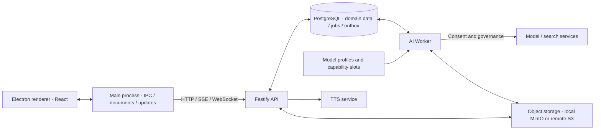

<div align="center">


# Astella · 拾星笔记

A desktop study room for personal learning. Turn material into notes, understand and recall it beside the original passage, and make cards for long-term review when needed. A Live2D companion can discuss what you are reading, find sources, create notes and edit the body at your request.

[](https://github.com/asklins223/Astella/releases/latest)
[](https://www.electronjs.org/)
[](https://react.dev/)
[](https://fastify.dev/)
[](https://www.postgresql.org/)
[](LICENSE)

[中文](README.md) · [English](README.en.md) · [User and developer guide](docs/guide/README.md)

Repository version: `v1.1.0` (shared by the server and desktop client)

</div>


> Development and experience validation continue. Repository versions, release workflows and feature acceptance describe different states; downloadable assets are listed in [GitHub Releases](https://github.com/asklins223/Astella/releases). Product boundaries are in [PRODUCT.md](PRODUCT.md), and visual and interaction direction is in [DESIGN.md](DESIGN.md).

## Learn from a note

A typical path is **capture material → write a note → use overview, recall or expansion → optionally make cards and review**. You can also discuss a topic with the companion and explicitly ask to save the discussion as a note.

| Capability | What it does |
| --- | --- |
| Source library | Capture text, Markdown, code and URLs; inspect parsing state and source content |
| Notes | Reading, editing and source views; autosaved working drafts and explicit saved versions; full-screen reading and editing, formulas, tables, Mermaid and links to library notes |
| Study beside the text | Independent overview, recall, expansion and records; annotate a selection, request an explanation or send it to the companion; accept expansion drafts individually |
| Companion authoring | Explicitly create an editable note with verified links to accessible library notes; insert, replace or delete text at the current cursor, selection or blocks |
| Cards and practice | Generate candidates grounded in source evidence, review and accept them; understanding practice, results, due reviews and dispute correction |
| Search and star map | Full-text lookup, source tracing, note relations and understanding state; return to related notes |
| Dialogue and web citations | Short chat, on-device recognition and server-side speech; opt into account-level web search, then inspect and open sources through citation markers |
| Continuing companionship | Conversation journal, diary, memory, persona, discovery bookmarks, reminders and cooperation methods; persona follows the account, concrete material and experiences stay scoped to the workspace |
| Workspaces and settings | Personal and collaborative spaces, members, invitations, themes, motion, AI consent, export, updates and maintenance |

Study records retain the note version and passage used at the time. Generated results expose evidence or coverage. Recall self-ratings, formal answers and system assessment remain separate: practice alone does not prove mastery. Cards are optional, and note study entries have no fixed order.

Before editing, the companion synchronizes the local working draft and checks the version and original text. Affected paragraphs show progress and are temporarily locked; other paragraphs remain editable. Ordinary conversation and passage explanations do not automatically create notes or modify the body. Web search is off by default and still requires AI consent and egress permission. Exhausted search quota leaves the answer available with an honest indication that online verification failed.

Screenshots show actual development windows with environment-specific titles and content; they do not establish acceptance of every state. See [Desktop client](docs/guide/en/desktop-client.md) and [Companion experience](docs/guide/en/companion-experience.md).

## Quick start: local development

Install Docker with Compose v2, Make and Node.js 22. Backend dependencies run in containers, while Electron runs on the host. Each package has its own npm lockfile.

### 1. Configure

```bash
git clone https://github.com/asklins223/Astella.git
cd Astella
cp .env.example .env
```

Fill these four values in `.env`. The API and desktop main process read the same local configuration:

| Variable | Value |
| --- | --- |
| `EDGE_TTS_AUTH_TOKEN` | A random token shared by the API and edge-tts |
| `ASTELLA_DESKTOP_PAIRING_KEY_ID` | A local identifier, such as `local-dev` |
| `ASTELLA_DESKTOP_PAIRING_SECRET` | A random base64url key containing at least 32 decoded bytes |
| `ASTELLA_DOMAIN_SCHEMA_REVISION` | A matching nonempty revision on both sides, such as `local-dev-v1` for local development |

Generate a pairing key and put the output in the matching variable:

```bash
node -e "console.log(require('node:crypto').randomBytes(32).toString('base64url'))"
```

For external AI, supply credentials according to the capability mappings in [config/ai-platforms.json](config/ai-platforms.json), then sign AI consent inside the app. Both dialogue slots currently point to DeepSeek through OpenCode Go; search reuses the BigModel credential, while speech and embeddings have separate configuration. See [Development](docs/guide/en/development.md) and [Model pipeline](docs/guide/en/ai-and-companion.md).

### 2. Start the backend and development account

```bash
make config
make up
make seed-demo
```

`make up` builds hot-reload images, enables local MinIO and waits for role bootstrap, migrations, grants and storage initialization to exit. It does not inspect the container exit code printed by `docker wait`, so check readiness and initialization logs as well:

```bash
curl -fsS http://127.0.0.1:4000/health
curl -fsS http://127.0.0.1:4000/ready
docker compose -p astella-dev -f docker-compose.dev.yml logs role-bootstrap migrate role-grants
```

`make seed-demo` creates **`owner@astella.local` / `astella_owner`** for local development. This target does not pass `.env` values for `OWNER_EMAIL` or `OWNER_PASSWORD` into the seed container; an existing account is neither re-seeded nor given a new password. Production uses an explicit `seed-owner` step.

### 3. Start Electron

```bash
make desktop-client-install
make desktop-client-dev
```

The default API origin is `http://127.0.0.1:4000`; development opens CDP on port `9222`. Backend host ports bind to loopback by default: API `4000`, PostgreSQL `5432`, MinIO `9000/9001`, Worker metrics `9100`, edge-tts `8088`.

Packaged HTTPS connections, tag deployments and remote object storage are documented in [Server deployment](docs/guide/en/deployment.md). Their connection and storage modes differ from local development.

## Architecture and data boundaries



- **Desktop boundary:** one application window, no Node access in the renderer, and API credentials in the main process. Business calls use IPC; remote object transfers use signed URLs in the main process.
- **Workspace isolation:** restricted API and Worker database roles, verified actor/workspace transaction context and database RLS. A separate container applies migrations.
- **Account-level AI consent:** an Owner cannot sign for another member; switching workspace does not require another signature. Models are server-configured; there is no personal key or provider settings UI.
- **Background execution:** the Worker consumes dialogue and generation jobs. The API also handles speech synthesis and learning-run outbox processing. Execution deadlines and crash-recovery leases are separate; running long jobs renew their lease.

The shared Agent turn kernel lives in `packages/agent-core`, its persistence and governance host in `packages/agent-host`, and shared capability declarations are projected onto conversation and goal surfaces. Buttons submit capabilities directly; the companion can compose them to pursue a goal. Saved receipts determine whether results are complete. See [Agent runtime](docs/guide/en/agent-runtime.md) for permissions and recovery limits.

Short chat handles dialogue; the task bubble tracks ongoing work. The conversation journal gathers history and pending decisions, and Companion Center lets you inspect conversations, diary, memory and persona. Its conversation tab has no send entry. Six learning actions still require proposal confirmation in full permission mode; read-only mode blocks writes.

## Guide and repository

| Topic | Document |
| --- | --- |
| Features, learning paths and permissions | [Overview](docs/guide/en/overview.md) |
| First run and development commands | [Development](docs/guide/en/development.md) |
| Window, notes, full-screen mode and settings | [Desktop client](docs/guide/en/desktop-client.md) |
| Execution, permissions and context | [Agent runtime](docs/guide/en/agent-runtime.md) |
| Dialogue, voice, memory and cooperation | [Companion experience](docs/guide/en/companion-experience.md) |
| Processes and packages | [Architecture](docs/guide/en/architecture.md) |
| Routes, authentication, migrations and data | [API and data](docs/guide/en/api-and-data.md) |
| Models, search, budgets and queues | [AI and Worker](docs/guide/en/ai-and-companion.md) |
| Tests, guards and CI | [Testing and quality](docs/guide/en/testing-and-quality.md) |
| Releases, backups and deployment | [Operations](docs/guide/en/operations.md) · [Server deployment](docs/guide/en/deployment.md) |
| Troubleshooting | [FAQ](docs/guide/en/faq-and-troubleshooting.md) |

The [guide index](docs/guide/README.md) also links Chinese pages. Current plans and acceptance evidence are indexed in [docs/plans/learning-companion/README.md](docs/plans/learning-companion/README.md).

```text
apps/api/                  API, domain modules and database migrations
apps/desktop-client/       Electron main / preload / renderer
workers/ai-worker/         Dialogue, generation, parsing and background jobs
packages/shared/           Contracts, capability catalog and database schema
packages/agent-core/       Turns, context, budgets and compaction policies
packages/agent-host/       Database host, governance and persistence
packages/card-generation/  Card-generation domain services
packages/ai-quality/       Offline quality evaluation
config/                    Models and capability-slot configuration
infra/                     Database roles, deployment, monitoring and backups
release/                   Unified version and release notes
```

## Commands and validation

| Command | Purpose |
| --- | --- |
| `make up` / `make down` / `make logs` | Start development, stop while retaining the database, inspect logs |
| `make rebuild` | Rebuild images without cache; follow with `make up` |
| `make desktop-client-dev` / `make desktop-client-dist` | Development window / verify and package the host platform |
| `make verify` | Version and repository contracts, configuration/schema guards, backup-script tests, typechecks and tests across seven packages |
| `make disposable-db DISPOSABLE_DB=astella_it` | Recreate a disposable database; deletes an existing test database with that name |
| `make test-postgres COMPANION_HOME_TEST_DB=astella_it` | Run real PostgreSQL integration suites explicitly |
| `make coverage-gate` / `make skip-todo-gate` | Separate coverage and skip/todo gates |
| `make release-check` | Release inputs, verify, coverage and release-manifest checks; excludes the skip/todo gate |

Development PostgreSQL uses the external volume `astella-dev_dev_postgres_data`. `make down` and Compose `down -v` retain it; `make reset-db CONFIRM_RESET_DB=DELETE_DEV_DB` permanently deletes it and restarts the stack. This protection does not cover the MinIO volume. Back up the database and long-lived objects separately.

For a first verification, install package dependencies and build the desktop output:

```bash
for dir in packages/shared packages/card-generation packages/agent-core packages/agent-host packages/ai-quality apps/api workers/ai-worker apps/desktop-client; do
  (cd "$dir" && npm ci) || break
done
make desktop-client-build
make verify
```

Ordinary `npm test` does not discover `*.integration.ts`; real-model and S3 probes are separate. Use the desktop package's `npm run typecheck`, since the references-only root configuration is insufficient. See [Testing and quality](docs/guide/en/testing-and-quality.md) for CI, releases and window checks.

## Versions, releases and licensing

[release/version.json](release/version.json) is the only manually maintained source of product version and release notes. Edit `version` and `notes`, run `npm ci` at the root once, then `npm run release:prepare` to synchronize four product packages, lockfiles and the Chinese README version marker and preview release notes. Maintain the English README version text alongside it. An annotated `v<version>` tag triggers server CI/deployment and desktop releases.

Desktop updates go directly to GitHub Releases. Packaging supports macOS, Windows and Linux; the current automated installer release covers macOS and Windows, while Linux can be packaged separately. macOS builds without an Apple certificate use ad-hoc signing and may need first-launch authorization. See [Server deployment](docs/guide/en/deployment.md) for credentials, migration rollback and object transfers.

Source code is licensed under [MIT](LICENSE). The bundled Live2D SDK, models and other assets have separate licenses and redistribution restrictions in [THIRD_PARTY_NOTICES.md](THIRD_PARTY_NOTICES.md); brand assets are described in [assets/brand/README.md](assets/brand/README.md).

Ongoing validation includes long-dialogue naturalness and waiting stability, context continuity after compaction, cross-day memory and the long-term effects of cooperation methods, real microphone use and packaged updates. Implemented code, passing tests and long-term effectiveness require different evidence; current limits are kept with the relevant plans and validation records.
