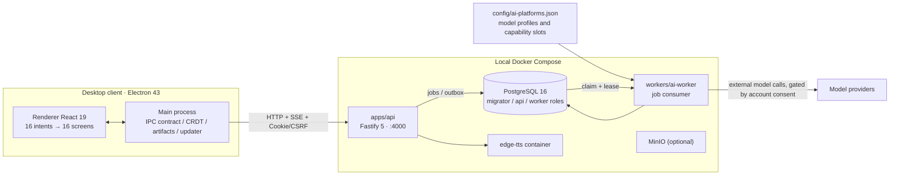
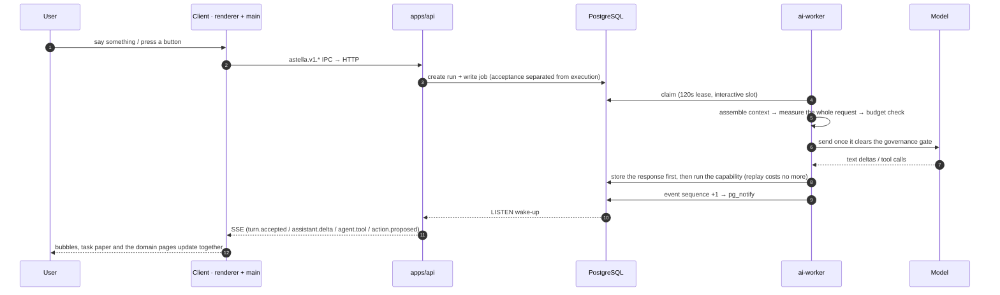
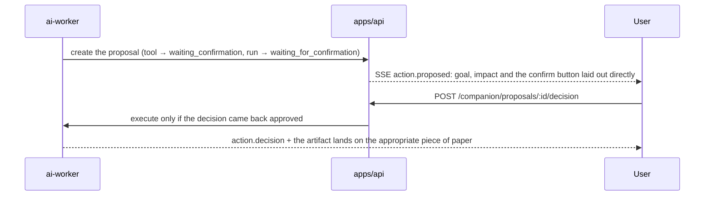
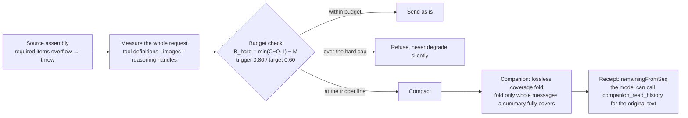

<div align="center">


# Astella · 拾星笔记

An AI-native knowledge system for self-directed learning. Start from material you actually want to understand, turn it into notes, understand and recall on demand inside the same note, and opt into learning cards and long-term review when it's worth it. Sources, practice evidence and the next step stay traceable. The desktop app is a paper study room with a Live2D companion sitting beside you.

[](release/version.json)
[](release/version.json)
[](https://www.electronjs.org/)
[](https://react.dev/)
[](https://fastify.dev/)
[](https://www.postgresql.org/)
[](#quick-start)
[](LICENSE)

[中文](README.md) · [English](README.en.md) · [Guide docs/guide/en](docs/guide/en/overview.md)

</div>


> Not released yet; APIs and screens still move with each plan. Current state, confirmed capabilities and the things this project deliberately leaves out are in [PRODUCT.md](PRODUCT.md); visual and motion direction in [DESIGN.md](DESIGN.md).

## Table of contents

- [What problem it solves](#what-problem-it-solves)
- [What you will see](#what-you-will-see)
- [How it is put together](#how-it-is-put-together)
- [Agent and the companion](#agent-and-the-companion)
- [Quick start](#quick-start)
- [Guide](#guide)
- [Repository layout](#repository-layout)
- [Everyday commands](#everyday-commands)
- [Tests and CI](#tests-and-ci)
- [Models, consent and data boundaries](#models-consent-and-data-boundaries)
- [Versions and releases](#versions-and-releases)
- [FAQ](#faq)
- [Licensing and third-party material](#licensing-and-third-party-material)
- [Where the project stands](#where-the-project-stands)

## What problem it solves

The hard part of studying alone is **not knowing whether you actually understood it**. A file store keeps knowledge but never tells you how much of it is still trustworthy. Astella spreads that chain out onto paper you can operate:

- **Grounded**: explanations, cards and annotations anchor back to the exact passage; sources stay read-only, notes are yours.
- **Verifiable**: understanding practice (理解练习) tests comprehension by answering rather than by self-assessment, and every hint and every reveal along the way is kept.
- **Resumable**: study records are kept per note version and against the original text, so a new version does not relocate old records, and the next step is visible.
- **Optional long-term review**: learning cards and the due queue are a capability you choose, not a prerequisite for studying a note.

The main line: **source → note → on demand in that same note — quick look (速看·读懂重点), recall (回想·想起一点), going further (往外学·发现关联), study records (学习记录) — and a selected sentence can be annotated (写批注), read back line by line (原句解读) or handed to the companion (发给伴星) → cards or long-term review when you decide**. These four bookmarks are independent; they are not forced into one round.

## What you will see

| Screen | What it carries |
| --- | --- |
| Home study room | Fixed-camera room; desk, bookshelf, star window and rest corner hold real entries, companion seated alongside |
| Source library | Capture and parsing state for text, Markdown, code and URL material |
| Note pages | Three body modes — read (阅读) / edit (编辑) / source (源码); four bookmarks — quick look (速看), recall (回想), going further (往外学), study records (学习记录); results land back beside the passage you selected |
| Learning cards and candidate review | Cards generated from a note with evidence seals, decided one by one: keep this one (保留这张), drop it (不保留), undo a decision (撤销决定), view the answer with its evidence (查看答案与证据); saving the kept batch (保存已保留的 N 张) puts them into the deck (卡组), and regenerate (重新生成学习卡) starts a fresh run |
| Understanding practice and review queue | Understanding practice (理解练习), the practice result page (练习结果), due review and dispute correction |
| Understanding star map | One roamable night sky holding real knowledge relations, read back per constellation and note |
| Companion Center and conversation journal | Recent, conversations, diary, memory, discovery book, activity, persona; everyday talk goes through the short chat beside her |
| Settings book | Account and spaces, members and invites, theme and motion, companion, AI data consent, data and maintenance |


Directory rail, room-control island and global shortcuts (`Esc` home, `⌘/Ctrl+Enter` next step, `⌘K` search, `R` review, `G` star map) are documented in [Desktop client](docs/guide/en/desktop-client.md).

## How it is put together

The desktop app is a single window. The renderer has no Node access and no router library; everything goes through the main process to the local API. AI calls never happen on a request thread: the API only writes jobs, the worker claims them from PostgreSQL, and results and events come back onto the paper.



Three invariants worth knowing up front: **tenant isolation is held by `set_config` with read-back verification inside the transaction plus row-level security**; **every external model call passes the account-level consent gate**; **migrations run in one-shot containers — the API process never creates tables itself**. Details in [Architecture](docs/guide/en/architecture.md) and [API and data](docs/guide/en/api-and-data.md).

## Agent and the companion

This is the centre of gravity of the whole project, and the point where it diverges from "a note app with a chat box bolted on": **there is exactly one Agent execution mechanism, and the companion is the face that mechanism shows the user**. A capability started by a page button and a capability the companion chains together on its own share one turn kernel, one capability catalog, one governance regime and one kind of receipt.

### One kernel, two entry points

| Entry point | Who decides what to do | How it runs | What triggers it today |
| --- | --- | --- | --- |
| **Declarative request** | The button the user pressed has already picked the capability | No planning model is started; the capability is accepted and its receipt written in the same transaction | The four domain services: quick look, interactive explanation, going further, card generation |
| **Goal advancement** | The companion, or a long-term goal, combines capabilities step by step | Kernel loop: assemble context → measure → send → execute tools → reduce receipts | "Hand it to the companion" in the bubble chat, the long-term goals page, the methods page |



The important trade-offs are written into the code instead of left to convention: `executeAgentStep` **saves the model response to the database before it runs any capability**, so a process that dies mid-step cannot pay twice on replay; every step commit takes the run row `FOR UPDATE` inside its transaction and checks the lease fence, so an expired worker gets a plain 409 and a stale result can never overwrite a newer one.

### There is only one capability catalog

`packages/shared/src/agent-capability-catalog.ts` is the single index: **56 capability declarations** (41 companion tools plus 15 goal / note / card / method / basic / external / delivery declarations), projected to 48 tools on the conversation surface and 10 on the goal surface, and a duplicate name throws on the spot; the JSON Schema each tool exposes to the model is derived from its zod schema, so "the shape the model sees" and "the shape the runtime validates" cannot drift apart.

| Permission tier (visible in Settings) | Read | Reversible low-impact writes | Everything else | The 6 tools that must propose |
| --- | --- | --- | --- | --- |
| Read-only | allowed | blocked | blocked | propose, wait for confirmation |
| Guided (default) | allowed | done directly | confirm first | propose, wait for confirmation |
| Full | allowed | done directly | done directly | **still** propose, wait for confirmation |



### Context is a ledger, not an unlimited bag



Compaction does not cause amnesia: the folded range and every stretch it leaves uncovered are stored as receipts, and cooldowns and attempt counts persist per `(session, source hash, provider, model)`. **What is measured is the entire request about to be sent**; images count at a 1500-token floor, and kinds that cannot be measured go into `unmeasured` rather than being pretended to be 0.

### State vocabulary, and failure is not disguised

`run`: `queued → running → waiting | paused → completed | failed | cancelled`; `operation` has `outcome_unknown`, **which only an authoritative event may rewrite**. The product side keeps the same rule: when Live2D fails to load, the model is hidden and a dismissible note is left in its place — no placeholder blob stands in for her; a TTS failure never swallows the text; the bubble says "this one did not get done" instead of spinning; the guided walkthrough marks itself a teaching example and creates no real note, task or study record.

### The companion as a product

She appears in four places with non-overlapping duties — **this is the step where readers of this product most easily go wrong**:

| Place | What it is for | What it is not for |
| --- | --- | --- |
| **Bubble chat (气泡轻聊)** | Talking, voice, editing a recognition draft until it is right, then sending | Carrying task state |
| **What is on hand (手边的事, the task bubble)** | What a task is doing and what it still needs; change the requirement / park it / continue / stop; keep this collaboration as a method | The full record (it says "go to the journal for the full record") |
| **Our conversation journal (我们的对话手记)** | All dialogue / her reflections / what you handed her / awaiting confirmation | Typing or sending here |
| **Companion Center (伴星中心)** | Recent / conversations / diary / memory / discovery book / activity / persona: view, search, decide, correct, withdraw | Live replies and proposal decisions |

A few product calls worth stating on their own: **persona and speaking style follow the account, while concrete material and shared history stay isolated per space**; **growth shows up as "one explanation fewer, a smoother handoff", never as experience points, relationship levels or usage counts**; **memory admission is picky** (confidence ≥ 0.7, a quote from the user's own words is mandatory, volatile facts are never recorded, a source that was rejected is not reused); **proactive intervention is governed by one deterministic policy shared by two processes**, so reminders you booked and completions that are waiting for you are not rate-limited, and a "at most N per day" quota control was removed; **moment animations play only on real events**, and lip sync is driven by decoded audio amplitude and layered separately from expressions.

Written out in full here: [Unified Agent runtime (technical)](docs/guide/en/agent-runtime.md) and [The companion experience (product design)](docs/guide/en/companion-experience.md).

## Quick start

### Prerequisites

| Requirement | Notes |
| --- | --- |
| Docker + Compose v2 | Database, API, worker and edge-tts all run in containers; no local PostgreSQL needed |
| Make | Drives compose and the release flow |
| Node.js 22 | Used by the desktop client and package scripts; images are pinned to `node:22.11.0-alpine3.20`, and the repo has no `.nvmrc` or `engines` field |
| `npm ci` per package | Every package keeps its own lockfile; there is no workspace-root install |

### 1. Configure and start the backend

```bash
git clone https://github.com/asklins223/Astella.git
cd Astella
cp .env.example .env
```

The dev stack ships its own database defaults. The one value you must set is `EDGE_TTS_AUTH_TOKEN` (commented out in `.env.example`; uncomment it — it has to match on both the edge-tts and API sides). Then:

```bash
make up
```

`make up` removes last round's one-shot containers, builds the dev images (source mounted, hot reload on), creates the protected database volume, and waits for `role-bootstrap` and `migrate` (plus `minio-init` in storage mode). Migrations run on every start, not only the first.

### 2. Create a local demo account

```bash
make seed-demo
```

```text
email:    owner@astella.local
password: <set-a-private-owner-password>
```

Development only: `SEED_DEMO_DATA` fails closed under `NODE_ENV=production`, where the owner account is created by the `seed-owner` one-shot during release.

### 3. Start the desktop client

```bash
make desktop-client-install   # first run: npm ci
make desktop-client-dev       # electron-vite dev, exposes CDP port 9222
```

Sanity checks:

```bash
curl -s http://127.0.0.1:4000/health   # liveness (deliberately does not touch the DB)
curl -s http://127.0.0.1:4000/ready    # readiness (core tables + migration floor)
```

Host ports: API `4000`, PostgreSQL `5432`, MinIO `9000/9001`, worker metrics `9100`, edge-tts `8088` — all bound to loopback by default. Full walkthrough and hot-reload mechanics: [Development environment](docs/guide/en/development.md).

## Guide

Detail is split by topic under [`docs/guide/`](docs/guide/), one English page per Chinese page:

| Page | What it covers |
| --- | --- |
| [Overview](docs/guide/en/overview.md) | The problem, capabilities that exist today, runtime shape, permission model, deliberate non-goals |
| [Architecture](docs/guide/en/architecture.md) | Processes and packages, the path of a request and of an AI turn, data groups, where to change what |
| [Development](docs/guide/en/development.md) | Clean checkout to a running window, hot reload, ports, the database volume, daily commands |
| [Desktop client](docs/guide/en/desktop-client.md) | Routerless page machine, rail and room island, Live2D companion, notes and CRDT, settings, source guards |
| [Unified Agent runtime (technical)](docs/guide/en/agent-runtime.md) | The turn kernel, the capability catalog and tool surfaces, permission tiers and the proposal round trip, context governance, persistence and the state vocabulary, wired up today vs backend-only |
| [The companion experience (product design)](docs/guide/en/companion-experience.md) | Why she is here, the split across the four entry points, the capability list, presence and silence, continuing identity, memory and diary, the growth loop, honest boundaries |
| [API and data](docs/guide/en/api-and-data.md) | Modules and routes, sessions / CSRF / rate limits, RLS and the three roles, migrations and the job queue, SSE, admin panel |
| [Models and the worker pipeline](docs/guide/en/ai-and-companion.md) | Worker and job types, model profile configuration, provider protocols and reasoning tiers, measurement and compaction, evidence sealing, voice, quality layer |
| [Testing and quality](docs/guide/en/testing-and-quality.md) | How each package tests, the integration split, guards, what CI actually runs and no longer runs |
| [Operations](docs/guide/en/operations.md) | The three compose files, variable groups, two version lines, Alpha and backup/restore, monitoring reality |
| [FAQ and troubleshooting](docs/guide/en/faq-and-troubleshooting.md) | Symptom → cause → fix |

Chinese original: [docs/guide/zh/](docs/guide/zh/overview.md)

## Repository layout

```text
.
├── apps/
│   ├── api/                  # Fastify 5 API: auth, domain modules, Drizzle migrations
│   └── desktop-client/       # Electron client (main / preload / renderer)
├── workers/
│   └── ai-worker/            # AI generation, source parsing, companion and background jobs
├── packages/
│   ├── shared/               # Contracts, Zod schemas, single DB schema source, security utils
│   ├── agent-core/           # Turn execution, context assembly, budget and compaction (no DB/UI/provider imports)
│   ├── agent-host/           # Database host ports and AI governance policy for that core
│   ├── card-generation/      # Card domain service (runs, events, evidence seal)
│   └── ai-quality/           # Versioned golden set and layered gates (PR gate)
├── config/
│   └── ai-platforms.json     # The only model and capability-slot configuration
├── infra/
│   ├── postgres/             # Roles, grants and init scripts (roles.sql is the grant authority)
│   ├── prometheus/           # Scrape config and alert rules
│   ├── backup/               # Encrypted backup and restore rehearsal
│   └── minio/                # Object storage notes
├── docs/
│   ├── guide/                # This manual (zh default / en twin, assets captured from the live window)
│   ├── plans/                # Plans; the live contract index is under learning-companion/
│   └── testing/  ops/  implementation/
├── .github/workflows/        # CI and desktop packaging / release
├── docker-compose.dev.yml    # Local development (default, mounted sources + hot reload)
├── docker-compose.yml        # Production image build and runtime
├── docker-compose.alpha.yml  # Alpha overlay (monitoring, backups) — layer it on the file above
├── Makefile                  # Everyday commands
└── release/                  # Two version lines and the release manifest
```

## Everyday commands

| Command | What it does |
| --- | --- |
| `make up` | Start the dev environment (MinIO included, mounted sources, hot reload) |
| `make seed-demo` | Create the local demo account |
| `make logs` / `make down` | Follow logs / stop while keeping data |
| `make reset-db CONFIRM_RESET_DB=DELETE_DEV_DB` | Delete the dev database volume and restart, only with the explicit confirmation value |
| `make rebuild` / `make config` / `make clean-init` | Rebuild without cache / validate config / remove exited init containers |
| `make shell-api` / `make shell-worker` | Drop into a container |
| `make desktop-client-dev` / `-dist` | Develop the client / build installers (`-dist-arm64` `-dist-win` `-dist-linux` `-dist-mac`) |
| `make verify` | Full local gate: contract scripts plus typecheck and tests for seven packages |
| `make test-postgres` / `make disposable-db` | Real-database integration suites / a throwaway test database |
| `make release-check` / `make release-manifest` | Pre-release checks (coverage and skip/todo gates) / generate the release manifest |
| `make alpha-up` / `-down` / `-backup` / `-restore-verify` / `-status` / `-metrics` | Alpha environment patrol, backup and restore |

The dev database is the fixed external volume `astella-dev_dev_postgres_data` (compose project `astella-dev`): neither `make down` nor `docker compose down -v` removes it — only the confirmed command above does. On a machine where the project name was changed, the old `astella-dev_dev_postgres_data` volume is not picked up automatically: check `docker volume ls` for where the data actually is before deciding to migrate or reinitialise.

## Tests and CI

Install and test per package:

```bash
(cd packages/shared && npm ci && npm run typecheck && npm test)
(cd apps/api        && npm ci && npm run typecheck && npm test)
(cd workers/ai-worker && npm ci && npm run typecheck && npm test)
(cd apps/desktop-client && npm ci && npm run typecheck && npm test)
```

Two things that bite:

- `*.integration.ts` files are not matched by `npm test`; they need a real PostgreSQL and run through `make test-postgres` (preferably after `make disposable-db`).
- The desktop root `tsconfig.json` only holds project references, so a bare `tsc --noEmit` may check nothing; use `npm run typecheck`.

CI (`.github/workflows/main-ci.yml`) now runs the lean flow that mirrors the local baseline: a `packages` matrix (shared / agent-core / agent-host / ai-quality, the last one also running `pr-gate`), `api`, `worker`, and `desktop` (build before test). The coverage gate, skip/todo gate, full real-database migration suites, production image build and scanning, and the backup/restore drill left CI on 2026-10-06; the scripts are still in the repo and are run by `make verify` and `make release-check`. [Testing and quality](docs/guide/en/testing-and-quality.md) lists each gate and who now holds it.

## Models, consent and data boundaries

- **One place configures models**: `config/ai-platforms.json`. Platform entries describe gateway and protocol quirks; capability slots (`agent_turn`, `text_generation`, `companion_fallback`, `vision`, `embedding`, TTS) point at concrete models; API keys are `${ENV_VAR}` references whose values live only in `.env`.
- **Declaration is truth**: context window, max output, vision support and reasoning levels are **model attributes**, written on `models`. An undeclared model falls back to provider defaults with one startup warning; a slot referencing an undeclared model is a blocking error in the admin panel. Nothing is probed at runtime.
- **Consent is account-level**: external model calls are governed by the consent and data-egress policy the user signed, covering every space they can reach. The desktop client offers no per-user model or provider configuration screen.
- **All calls go through the worker and the governance layer**: auditing records metadata only (`ai_audit_log` has a single writer), and timeouts are derived lease → handler → single provider call rather than hand-tuned.
- Speech synthesis lives in the API (Qwen first, automatic degrade to edge-tts; a governance denial does not trigger degrade). On-device speech-recognition models are downloaded by the user in Settings and are not shipped inside the installer.

See [Models and the worker pipeline](docs/guide/en/ai-and-companion.md).

## Versions and releases

Server and desktop share one product version:

| Line | Current | Held in | Tag |
| --- | --- | --- | --- |
| Server stack | `1.0.0` | `release/version.json`, synced by `.github/scripts/version-contract.mjs` into api / worker / shared `package.json` | `v*` |
| Desktop client | `1.0.0` | `release/version.json` | `v*` |

`desktop-release.yml` publishes to GitHub Releases (draft first, flipped public once assets finish uploading). The client updater talks **straight to GitHub Releases, never through our own API**: macOS `dmg` + `zip`, Windows NSIS, Linux AppImage, artifact names pinned to the ASCII prefix `astella-`. No code signing or notarisation is configured yet, so macOS automatic updates are unusable until certificates exist.

## FAQ

- **Cannot log in**: run `make seed-demo` first in development. Production owners come from the `seed-owner` one-shot.
- **No companion voice**: the engine is chosen in the `tts` section of `config/ai-platforms.json`; an API running directly on the host uses `http://127.0.0.1:8088`, an in-compose API uses `http://edge-tts:8080`, and both sides need the same `EDGE_TTS_AUTH_TOKEN` — never point the host API at a Docker service name.
- **`/ready` returns 503 or migrations look unrun**: migrations are executed by a one-shot container, so read `docker compose -f docker-compose.dev.yml logs migrate role-bootstrap`.
- **Locked out after failed logins**: check `AUTH_RATE_LIMIT_*`; dev counts in memory, production counts in PostgreSQL, and a successful login resets the email counter only, never the IP one.
- **Model call fails**: protocol versus base URL (Responses and chat/completions models cannot share one platform entry), model id and quota, and whether the slot's model is declared at all.
- **Port already in use**: `API_PORT` moves the API; the dev stack also uses host `5432`, `9000/9001`, `9100` and `8088`.
- **Titles inside the screenshots**: `docs/guide/assets/` shows real content from a local development database. They are live captures, not mockups.

More in [FAQ and troubleshooting](docs/guide/en/faq-and-troubleshooting.md).

## Licensing and third-party material

This project is licensed under the **MIT license**; the full text is in [LICENSE](LICENSE).

Third-party and asset licensing for what ships in the bundle is recorded separately in [THIRD_PARTY_NOTICES.md](THIRD_PARTY_NOTICES.md): Yjs / Hocuspocus, PIXI and the Live2D Cubism SDK, redistribution limits on the companion model (handled fail-closed when the model manifest is missing, so nothing is packaged), and the on-device speech-recognition models. External reference projects and their licenses are listed in [reference-projects/learning-companion/README.md](reference-projects/learning-companion/README.md). The brand icon and the naming-layer decision are explained in [assets/brand/README.md](assets/brand/README.md).

## Where the project stands

Unreleased, and in a "runs, still being polished" state.

- **Trustworthy today**: source capture and parsing, notes with immutable versions, understanding practice and the review queue, retrieval and the understanding star map, workspaces and members, account-level consent and egress records, card generation and candidate review, and the companion's conversation / memory / diary / persona plus on-device speech recognition.
- **Still being closed**: the real-window experience of those on-demand study flows on the note paper; full visibility of context folding to the model; one complete verified execution of memory consolidation; the long-term effect of the growth loop (no same-workload p95 comparison, the adaptation sample is only 4×8 turns, and one semantic negative sample is kept on record); the companion's guided walkthrough end to end on a fresh account, and voice after consent has been signed; one leftover test card still has no delete or archive entry.
- **Deliberately not done**: per-user model and provider configuration screens, a transparent always-on-top desktop pet window, free camera and parallax roaming, self-service password reset (there is no mail channel).

The live index of design rulings and acceptance status is [docs/plans/learning-companion/README.md](docs/plans/learning-companion/README.md) — this manual records where things stand and does not hand out work. Collaboration and layering conventions live in [AGENTS.md](AGENTS.md). When documentation and code disagree, code and the real window win — then fix the docs.
