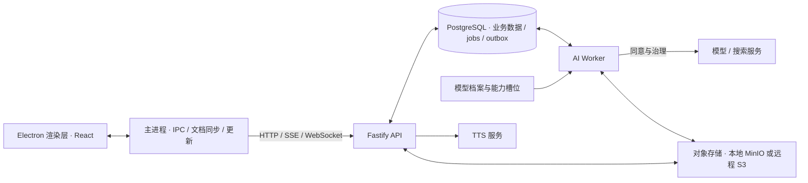

<div align="center">


# 拾星笔记 · Astella

面向个人学习的桌面书房。把材料整理成笔记，在原文旁理解、回想和追问；需要时生成学习卡，接入长期复习。Live2D 伴星陪你读，也能按你的要求查资料、整理新笔记和修改正文。

[](https://github.com/asklins223/Astella/releases/latest)
[](https://www.electronjs.org/)
[](https://react.dev/)
[](https://fastify.dev/)
[](https://www.postgresql.org/)
[](LICENSE)

[中文](README.md) · [English](README.en.md) · [使用与开发手册](docs/guide/README.md)

当前版本：`v1.5.0`（仓库版本；服务端与桌面客户端共用）

</div>


> 项目仍在持续开发和体验验证。仓库版本、发布流程与功能验收是不同的状态；可下载资产以 [GitHub Releases](https://github.com/asklins223/Astella/releases) 为准。产品边界见 [PRODUCT.md](PRODUCT.md)，视觉与交互方向见 [DESIGN.md](DESIGN.md)。

## 从笔记开始学习

常用路径是：**采集材料 → 写笔记 → 按需速看、回想或往外学 → 需要时制卡与复习**。也可以先与伴星讨论，再明确要求把讨论整理成一篇笔记。

| 能力 | 可以做什么 |
| --- | --- |
| 来源库 | 采集文本、Markdown、代码与 URL，也能拖入 PDF 与 Word（.docx）在本机解析成正文与图片，查看解析状态与原文 |
| 笔记册页 | 阅读、编辑、源码三种视图；自动保存工作稿，按「保存」留下版本；全屏阅读与编辑，公式、表格、Mermaid 和库内笔记链接 |
| 原文旁的学习 | 速看、回想、往外学、学习记录分别使用；选文写批注、原句解读或发给伴星；拓展草稿逐篇收下后成为新笔记 |
| 伴星写笔记 | 明确要求后生成一篇可编辑笔记，检索并关联实际可见的库内笔记；也能按当前光标、选区或段落补写、替换和删除正文 |
| 学习卡与练习 | 生成带原文证据的候选卡，由你审核收下；理解练习、练习结果、到期复习与争议更正 |
| 检索与星图 | 全文查找、来源追踪、笔记关系与理解状态；回到关联笔记继续阅读 |
| 对话与联网引用 | 身边轻聊、本机语音识别、服务端朗读；开启账号级联网搜索后按需查公开网页，点击引用角标查看和打开来源 |
| 长期陪伴 | 对话手记、日记、记忆、人格、发现簿、提醒与合作方法；人格随账号，具体材料与经历按空间隔离 |
| 空间与设置 | 个人／协作空间、成员与邀请、主题与动效、AI 使用同意、数据导出、更新与维护 |

学习记录保留当时的笔记版本和原文位置。生成内容会标明依据或覆盖范围；回想中的自评、正式作答和系统评估分别记录，练过不等于已经证明掌握。学习卡是可选能力，四个学习入口也没有固定先后顺序。

伴星改正文时先同步本地工作稿，再核对版本与原文；处理中相关段落显示状态并暂时锁定，其他段落仍可编辑。普通聊天和解释原句不会自动改正文或创建笔记。联网搜索默认关闭，仍需 AI 使用同意与外发权限；额度不足时保留本轮回答并说明未能联网核实。

截图来自开发库的实际窗口，标题与内容会随环境变化；截图不代表所有状态均已验收。详细操作见 [桌面客户端](docs/guide/zh/desktop-client.md) 和 [伴星体验](docs/guide/zh/companion-experience.md)。

## 快速开始：本机开发

需要 Docker + Compose v2、Make、Node.js 22。后端依赖在容器内运行，桌面客户端在宿主机启动；各包使用独立的 npm lockfile。

### 1. 配置

```bash
git clone https://github.com/asklins223/Astella.git
cd Astella
cp .env.example .env
```

在 `.env` 中填写以下四项。API 与客户端读取同一份本机配置：

| 变量 | 填写方式 |
| --- | --- |
| `EDGE_TTS_AUTH_TOKEN` | 自定义随机令牌，API 与 edge-tts 共用 |
| `ASTELLA_DESKTOP_PAIRING_KEY_ID` | 自定义标识，例如 `local-dev` |
| `ASTELLA_DESKTOP_PAIRING_SECRET` | 至少 32 字节的随机 base64url 密钥 |
| `ASTELLA_DOMAIN_SCHEMA_REVISION` | 两端一致的非空修订标识，例如本机开发用 `local-dev-v1` |

可用下面的命令生成配对密钥，并将结果填到对应变量：

```bash
node -e "console.log(require('node:crypto').randomBytes(32).toString('base64url'))"
```

使用外部 AI 时，还需按 [config/ai-platforms.json](config/ai-platforms.json) 的槽位映射填写相应供应商 Key，并在应用内签署 AI 使用同意。当前对话主／备用槽位均指向 OpenCode Go 的 DeepSeek；搜索复用智谱凭据，语音与嵌入有各自的配置。完整配置见 [开发环境](docs/guide/zh/development.md) 与 [模型链路](docs/guide/zh/ai-and-companion.md)。

### 2. 启动后端与开发账号

```bash
make config
make up
make seed-demo
```

`make up` 构建热重载镜像，默认启用本地 MinIO，并等待角色引导、迁移、授权和存储初始化容器退出。它不检查 `docker wait` 打印的容器退出码，所以还需确认就绪状态与初始化日志：

```bash
curl -fsS http://127.0.0.1:4000/health
curl -fsS http://127.0.0.1:4000/ready
docker compose -p astella-dev -f docker-compose.dev.yml logs role-bootstrap migrate role-grants
```

`make seed-demo` 的开发凭据为 **`owner@astella.local` / `astella_owner`**，仅用于本机开发。该目标没有把 `.env` 的 `OWNER_EMAIL` / `OWNER_PASSWORD` 传给种子容器；已有账号不会被重新播种或重置密码。生产账号由显式的 `seed-owner` 流程创建。

### 3. 启动桌面客户端

```bash
make desktop-client-install
make desktop-client-dev
```

客户端默认连接 `http://127.0.0.1:4000`，开发模式开放 CDP 端口 `9222`。后端宿主端口默认只绑定回环：API `4000`、PostgreSQL `5432`、MinIO `9000/9001`、Worker 指标 `9100`、edge-tts `8088`。

使用安装包连接 HTTPS 服务器的配置、Tag 部署与远程对象存储，见 [服务器部署](docs/guide/zh/deployment.md)；它与本机开发栈使用不同的连接和存储方式。

## 架构与数据边界



- **桌面边界**：一个应用窗口，渲染层无 Node 能力；API 凭据留在主进程。业务请求走 IPC，远程对象传输由主进程使用限时签名 URL。
- **工作区隔离**：API 与 Worker 使用受限数据库角色，业务事务设置并核对用户／空间上下文，数据库 RLS 控制可见行。迁移由独立容器执行。
- **账号级 AI 同意**：Owner 不能替其他成员签署；换空间不重签。模型由服务端配置，桌面端没有个人 Key 或供应商配置界面。
- **后台执行**：对话和生成类作业由 Worker 消费；API 还承担语音合成与学习运行 outbox 等处理。执行时长与失联回收租约分别管理，运行中的长任务持续续租。

统一 Agent 的回合内核在 `packages/agent-core`，持久化与治理宿主在 `packages/agent-host`，能力声明从 shared 的同一目录投影到对话和目标执行面。页面按钮可以直接提交能力，伴星也可以按目标组合能力；成果是否完成以保存回执为依据。详细流程、权限档和恢复限制见 [统一 Agent 运行时](docs/guide/zh/agent-runtime.md)。

伴星身边的轻聊负责交流，「手边的事」展示持续任务；对话手记汇总过程与待确认动作，伴星中心负责查阅历史、日记、记忆与人格。中心对话页不提供发送入口。六个学习动作在「完全」权限档仍需提案确认，只读档禁止写操作。

## 手册与仓库

| 想了解什么 | 文档 |
| --- | --- |
| 能力、学习路径与权限 | [产品总览](docs/guide/zh/overview.md) |
| 首次启动与开发命令 | [开发环境](docs/guide/zh/development.md) |
| 窗口、笔记、全屏与设置 | [桌面客户端](docs/guide/zh/desktop-client.md) |
| Agent 执行、权限与上下文 | [统一 Agent 运行时](docs/guide/zh/agent-runtime.md) |
| 对话、语音、记忆与合作 | [伴星体验](docs/guide/zh/companion-experience.md) |
| 进程与包分工 | [系统架构](docs/guide/zh/architecture.md) |
| 路由、鉴权、迁移与数据 | [API 与数据](docs/guide/zh/api-and-data.md) |
| 模型、搜索、预算与队列 | [模型与 Worker 链路](docs/guide/zh/ai-and-companion.md) |
| 测试、守卫与 CI | [测试与质量](docs/guide/zh/testing-and-quality.md) |
| 发布、备份与部署 | [运行与发布](docs/guide/zh/operations.md) · [服务器部署](docs/guide/zh/deployment.md) |
| 出问题时 | [常见问题与排障](docs/guide/zh/faq-and-troubleshooting.md) |

[手册索引](docs/guide/README.md) 同时提供英文入口。方案与验证记录用于查设计依据和验收范围，现行索引在 [docs/plans/learning-companion/README.md](docs/plans/learning-companion/README.md)。

```text
apps/api/                  API、领域模块、数据库迁移
apps/desktop-client/       Electron main / preload / renderer
workers/ai-worker/         对话、生成、解析与后台作业
packages/shared/           契约、能力目录与数据库 schema
packages/agent-core/       回合、上下文、预算与压缩判据
packages/agent-host/       数据库宿主、治理与持久化
packages/card-generation/  制卡领域服务
packages/ai-quality/       离线质量评测
config/                    模型与能力槽位配置
infra/                     数据库角色、部署、监控与备份
release/                   统一版本与发布说明
```

## 常用命令与验证

| 命令 | 用途 |
| --- | --- |
| `make up` / `make down` / `make logs` | 启动开发栈／停止并保留数据库／查看日志 |
| `make rebuild` | 无缓存重建镜像；随后 `make up` 应用新镜像 |
| `make desktop-client-dev` / `make desktop-client-dist` | 开发窗口／验证并打包当前平台 |
| `make verify` | 版本与仓库合同、配置与 schema 守卫、备份脚本自测、七个包的类型检查与测试 |
| `make disposable-db DISPOSABLE_DB=astella_it` | 重建可丢弃测试库；同名测试库会被删除 |
| `make test-postgres COMPANION_HOME_TEST_DB=astella_it` | 显式运行真实 PostgreSQL 集成测试 |
| `make coverage-gate` / `make skip-todo-gate` | 独立覆盖率／skip 与 todo 门禁 |
| `make release-check` | 发布输入、`verify`、覆盖率与发布清单检查；不包含 skip/todo 门禁 |

开发 PostgreSQL 使用 external 卷 `astella-dev_dev_postgres_data`。`make down` 与 Compose 的 `down -v` 保留它；显式的 `make reset-db CONFIRM_RESET_DB=DELETE_DEV_DB` 会永久删除它并重启。该保护不覆盖 MinIO 卷，数据库与长期对象需分别备份。

首次验证需按包安装依赖，再构建桌面产物：

```bash
npm ci
for dir in packages/shared packages/card-generation packages/agent-core packages/agent-host packages/ai-quality apps/api workers/ai-worker apps/desktop-client; do
  (cd "$dir" && npm ci) || exit 1
done
make desktop-client-build
make verify
```

`*.integration.ts` 不由普通 `npm test` 自动发现，真实模型和 S3 探针也需单独执行。桌面类型检查使用包内的 `npm run typecheck`，根 references 配置不能代替它。CI 基线、发布工作流与真实窗口检查的分工见 [测试与质量](docs/guide/zh/testing-and-quality.md)。

## 版本、发布与许可

[release/version.json](release/version.json) 是产品版本与更新内容的唯一手工来源。修改 `version` 和 `notes` 后，在仓库根运行 `npm ci`（首次）与 `npm run release:prepare`，同步四个产品包及 lockfile、中文 README 版本标记，并预览发布说明；英文 README 的版本文字需同步维护。带注释的 `v<版本>` 标签触发服务端 CI／部署和桌面发布。

桌面更新直连 GitHub Releases。打包配置支持 macOS、Windows 和 Linux；当前自动发布安装包的工作流覆盖 macOS 和 Windows，Linux 可单独打包。macOS 无 Apple 证书时使用 ad-hoc 签名，首次打开仍可能需要系统授权。部署凭据、迁移回退与对象传输见 [服务器部署](docs/guide/zh/deployment.md)。

项目自有源码和文档采用 [PolyForm Noncommercial 1.0.0](LICENSE)，允许许可规定的非商业用途；商业用途需另行取得授权。该许可属于源码可用许可，不属于 OSI 定义的开源许可。2026-10-09 起的新版本采用此许可，此前已按 MIT 发布的版本仍遵循原授权。随包分发的 Live2D SDK、模型和其他素材有各自的许可及再分发限制，见 [THIRD_PARTY_NOTICES.md](THIRD_PARTY_NOTICES.md)；品牌素材见 [assets/brand/README.md](assets/brand/README.md)。

当前仍需持续验证的部分包括长对话自然度与等待稳定性、压缩后的上下文接续、跨天记忆与合作方法的长期效果，以及真实麦克风和安装包更新体验。功能代码、测试通过和长期效果各有不同的证据，具体限制随相关方案与验证记录更新。
