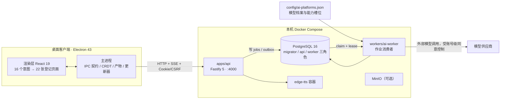
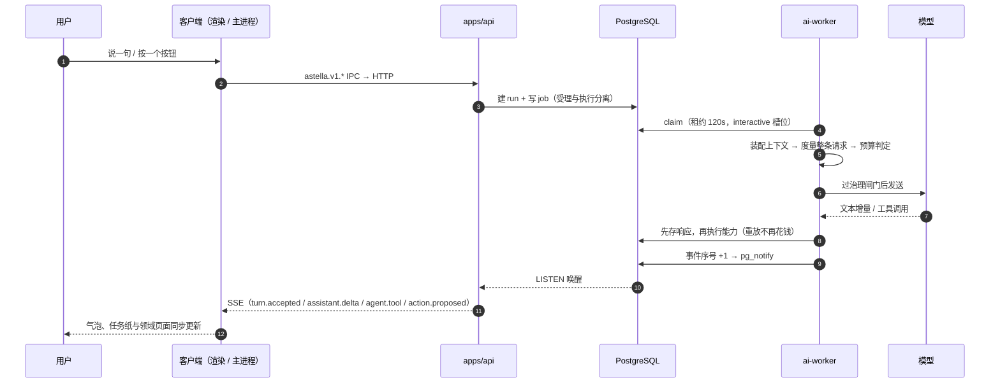
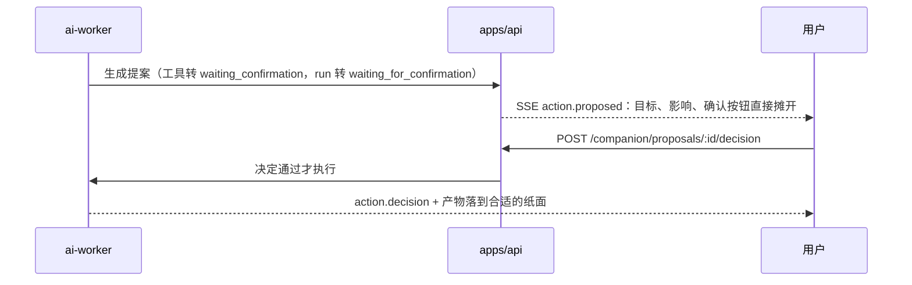
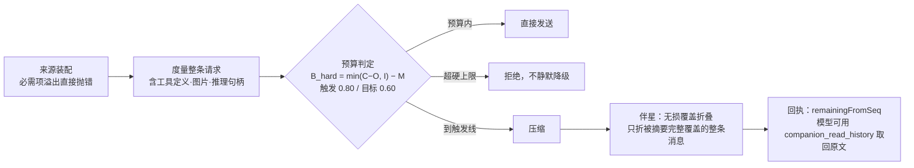

<div align="center">


# 拾星笔记 · Astella

面向个人学习的 AI 原生知识系统。从一份真正想弄懂的材料出发，把它写成笔记、在笔记里按需理解与回想、需要时制卡与长期复习；出处、练习证据与下一步始终可追溯。桌面端是一间有 Live2D 伴星坐着的纸上书房。

[](release/version.json)
[](release/version.json)
[](https://www.electronjs.org/)
[](https://react.dev/)
[](https://fastify.dev/)
[](https://www.postgresql.org/)
[](#快速开始)
[](LICENSE)

[中文](README.md) · [English](README.en.md) · [手册 docs/guide](docs/guide/)

当前版本：`v1.0.1`（服务端与桌面客户端共用）

</div>


> 项目尚未上线，接口与界面都会随方案演进。当前状态、已确认能力与刻意不做的事见 [PRODUCT.md](PRODUCT.md)；视觉与动效方向见 [DESIGN.md](DESIGN.md)。

## 目录

- [它解决什么问题](#它解决什么问题)
- [你会看到什么](#你会看到什么)
- [它是怎么组织的](#它是怎么组织的)
- [Agent 与伴星](#agent-与伴星)
- [快速开始](#快速开始)
- [手册](#手册)
- [仓库结构](#仓库结构)
- [常用命令](#常用命令)
- [测试与 CI](#测试与-ci)
- [模型、同意与数据边界](#模型同意与数据边界)
- [版本与发布](#版本与发布)
- [常见问题](#常见问题)
- [许可与第三方](#许可与第三方)
- [现状与路线](#现状与路线)

## 它解决什么问题

个人学习里最难的一件事是**不知道自己是否真的懂了**。文件系统能把知识存下来，但不会告诉你它现在还剩多少可信。拾星笔记把这条链摊开成可操作的纸面：

- **有出处**：讲解、卡片与批注都锚回原文区间；来源不可编辑，笔记由你写。
- **可验证**：理解练习用作答而不是自评检验理解，历次提示与揭示都留痕。
- **可接续**：学习记录按笔记版本与原文保留，改版不会把旧记录挪到新位置；下次从哪儿接着来看得见。
- **可选的长期复习**：学习卡与到期队列是你主动选择的能力，不是笔记学习的前置条件。

主线是：**来源 → 笔记 → 在同一篇笔记里按需「速看·读懂重点／回想·想起一点／往外学·发现关联／学习记录」，选中一句可以写批注、原句解读或发给伴星 → 需要时制卡或加入长期复习**。这几张书签各自独立，不强制串成一轮。

## 你会看到什么

| 界面 | 它承担的事 |
| --- | --- |
| 首页书房 | 固定镜头的房间，书桌／书架／星窗／休息角承载真实入口，伴星坐在旁边 |
| 来源库 | 文本、Markdown、代码、URL 四类材料的采集、解析状态与回看 |
| 笔记册页 | 正文三态 阅读／编辑／源码，四张书签 速看／回想／往外学／学习记录，结果回到当时选中的原文旁 |
| 学习卡与候选审核 | 从笔记生成带证据封缄的卡片，逐张决定保留哪张 |
| 理解练习与复习队列 | 理解练习、练习结果、到期复习与争议纠正 |
| 理解星图 | 整片可漫游的夜空承载真实的知识关系，按星座与笔记回读 |
| 伴星中心与对话手记 | 近况、对话、日记、记忆、发现簿、动态、人格；日常交流走伴星身边的轻聊 |
| 设置册 | 账户与空间、成员与邀请、主题与动效、伴星、AI 数据同意、数据与维护 |


目录栏、房间控制岛与全局快捷键（`Esc` 回首页、`⌘/Ctrl+Enter` 今日下一步、`⌘K` 查找、`R` 复习、`G` 星图）见 [桌面客户端](docs/guide/zh/desktop-client.md)。

## 它是怎么组织的

桌面端只有一个窗口，渲染进程没有 Node 能力，也不引路由库；所有数据经主进程走本地 API。AI 调用不在请求线程里发生：API 只写作业，Worker 从 PostgreSQL 队列领取，结果与事件再回到纸面。



三条不变量值得先知道：**租户边界由事务内 `set_config` 加回读校验与 RLS 共同守住**；**外部模型调用必须过账号级同意这道闸**；**迁移由一次性容器执行，API 进程自己不建表**。细节见 [系统架构](docs/guide/zh/architecture.md) 与 [API 与数据](docs/guide/zh/api-and-data.md)。

## Agent 与伴星

这是整个项目的重心，也是它和"接了个聊天框的笔记软件"分道的地方：**全项目只有一套 Agent 执行机制，伴星是这套机制面向用户的那张脸**。页面按钮直接发起的能力，与伴星自己按步骤组合的能力，共用同一个回合内核、同一份能力目录、同一套治理与同一份回执。

### 一个内核，两个入口

| 入口 | 谁决定做什么 | 怎么跑 | 今天的触发点 |
| --- | --- | --- | --- |
| **声明式请求** | 用户按下的按钮已经选好能力 | 不起规划模型，在同一事务里受理该能力并落回执 | 速看、互动讲解、往外学、制卡四个领域服务 |
| **目标推进** | 伴星或长期目标自己按步组合能力 | 内核循环：装配上下文 → 度量 → 发送 → 执行工具 → 归约回执 | 气泡轻聊里的"交给伴星"、长期目标页、方法页 |



关键取舍都写在代码里，而不是靠约定：`executeAgentStep` **先把模型响应存库再执行任何能力**，所以进程中途死掉，重放不会重复付费；每一步提交都在事务里对 run 行 `FOR UPDATE` 并核对租约围栏，过期 worker 直接吃 409，旧结果不可能覆盖新结果。

### 能力目录只有一份

`packages/shared/src/agent-capability-catalog.ts` 是唯一索引：**56 条能力声明**（41 个伴星工具 + 15 条目标／笔记／制卡／方法／计算／文档／交付声明），对话面投影 48 个、目标面投影 10 个，重名直接抛错；工具对模型暴露的 JSON Schema 由 zod 反推，"模型看到的形状"与"运行时校验的形状"不可能漂移。

| 权限档（设置里可见） | 读 | 可逆低影响写 | 其他写 | 强制提案的 6 个工具 |
| --- | --- | --- | --- | --- |
| 只读 | 允许 | 拦 | 拦 | 提案，等确认 |
| 引导（默认） | 允许 | 直接做 | 先确认 | 提案，等确认 |
| 完全 | 允许 | 直接做 | 直接做 | **仍然**提案，等确认 |



### 上下文是有账本的，不是无限袋子



压缩不造成失忆：折叠范围与未覆盖区间都落成回执入库，冷却与尝试次数按 `(会话, 来源哈希, provider, 模型)` 持久化。**度量的是将要发出去整条请求**，图片按 1500 token 下限计，量不动的种类记进 `unmeasured` 而不是假装为 0。

### 状态词表与"失败不伪装"

`run`：`queued → running → waiting | paused → completed | failed | cancelled`；`operation` 有 `outcome_unknown`，**只有权威事件能改写它**。产品侧的同一条规矩：Live2D 加载失败就隐藏形象留一条可关闭说明，没有圆球替身；TTS 失败不吞文本；气泡写"这次还没做成"而不是转圈；带路演示自标"教学示例"，不创建真实笔记、任务或学习记录。

### 伴星作为产品

她出现在四个地方，职责不重叠——**这是理解这套产品最容易走错的一步**：

| 地方 | 用来 | 不用来 |
| --- | --- | --- |
| **气泡轻聊** | 说话、语音、把识别草稿改到满意再发 | 承载任务状态 |
| **手边的事**（任务气泡） | 任务在做什么、还差什么；改要求 / 先放一放 / 继续 / 停止；把这次合作留成方法 | 完整记录（写着"去手记看完整记录"） |
| **我们的对话手记** | 全部对话 / 伴星念想 / 交给我的事 / 待确认 | 在这里输入或发送 |
| **伴星中心** | 近况 / 对话 / 日记 / 记忆 / 发现簿 / 动态 / 人格：查看、检索、决定、纠正、撤回 | 实时回复与提案决策 |

几条产品判断值得单独说：**人格与说话风格跟账号走，具体材料与经历按空间隔离**；**成长以"少解释一次、接得更顺"体现，不用经验值、关系等级或使用次数替代**；**记忆准入很挑**（置信度 ≥0.7、必须有用户原话出处、易变事实一律不记、被否决过的来源不再复用）；**主动介入由一份确定性策略同时管两个进程**，你约的提醒与等着的完成不受频率限制，"一天最多 N 条"这种配额控件被删掉了；**时刻动画只在真实事件上演**，口型由解码后的音频振幅驱动，与表情分层。

展开写在这里：[统一 Agent 运行时（技术）](docs/guide/zh/agent-runtime.md) 与 [伴星体验（产品设计）](docs/guide/zh/companion-experience.md)。

## 快速开始

### 环境要求

| 依赖 | 说明 |
| --- | --- |
| Docker + Compose v2 | 数据库、API、Worker、edge-tts 都在容器里；本机不需要单独装 PostgreSQL |
| Make | 驱动 compose 与发布流程 |
| Node.js 22 | 桌面客户端与各包脚本用；镜像固定在 `node:22.11.0-alpine3.20`，仓库里没有 `.nvmrc` 或 `engines` 约束 |
| 各包独立 `npm ci` | 每个包有自己的 lockfile，没有 workspace 根安装 |

### 1. 准备配置并启动后端

```bash
git clone https://github.com/asklins223/Astella.git
cd Astella
cp .env.example .env
```

开发栈自带数据库默认值，唯一必须自己填的是 `EDGE_TTS_AUTH_TOKEN`（`.env.example` 里注释着，取消注释给个值；edge-tts 与 API 两侧必须一致）。然后：

```bash
make up
```

`make up` 会清掉上一轮的一次性初始化容器、构建开发镜像（源码挂载 + 热重载）、创建受保护的数据库卷，并等 `role-bootstrap`、`migrate`（存储模式下还有 `minio-init`）跑完。迁移每次启动都会执行，不是只有第一次。

### 2. 建一个本机演示账号

```bash
make seed-demo
```

```text
邮箱：owner@astella.local
密码：<set-a-private-owner-password>
```

仅用于本机开发：`SEED_DEMO_DATA` 在生产模式下直接失败，生产环境的 Owner 由发布流程的 `seed-owner` 一次性容器创建。

### 3. 起桌面客户端

```bash
make desktop-client-install   # 首次：npm ci
make desktop-client-dev       # electron-vite dev，附带 CDP 调试端口 9222
```

自检：

```bash
curl -s http://127.0.0.1:4000/health   # 存活（故意不碰数据库）
curl -s http://127.0.0.1:4000/ready    # 就绪（探核心表与迁移版本）
```

宿主端口：API `4000`、PostgreSQL `5432`、MinIO `9000/9001`、Worker 指标 `9100`、edge-tts `8088`，默认全部只绑回环地址。完整流程与热重载机制见 [开发环境](docs/guide/zh/development.md)。

## 手册

细节按主题拆在 [`docs/guide/`](docs/guide/)，中英逐页对应，中文默认：

| 分册 | 讲什么 |
| --- | --- |
| [产品总览](docs/guide/zh/overview.md) | 问题、今天真实存在的能力、运行形态与权限边界、刻意不做的几件事 |
| [系统架构](docs/guide/zh/architecture.md) | 进程与包分工、一次请求与一次 AI 回合的路径、数据分组、想改哪儿先看哪里 |
| [开发环境](docs/guide/zh/development.md) | 干净检出到窗口跑起来、热重载、端口、数据库卷、日常命令 |
| [桌面客户端](docs/guide/zh/desktop-client.md) | 无路由的页面机器、目录栏与房间控制岛、Live2D 伴星、笔记与协同、设置册、源码守卫 |
| [统一 Agent 运行时（技术）](docs/guide/zh/agent-runtime.md) | 回合内核、能力目录与工具面、权限与提案往返、上下文治理、持久化与状态词表、已接通 vs 只有后端 |
| [伴星体验（产品设计）](docs/guide/zh/companion-experience.md) | 她为什么在、四处入口的分工、能力清单、在场与静音、持续身份、记忆与日记、成长闭环、诚实边界 |
| [API 与数据](docs/guide/zh/api-and-data.md) | 模块与路由、会话／CSRF／限流、RLS 与三角色、迁移与作业队列、SSE、运维面板 |
| [模型与 Worker 链路](docs/guide/zh/ai-and-companion.md) | Worker 与作业类型、模型档案配置、provider 协议与思考档位、计量与压缩、证据封缄、语音、质量层 |
| [测试与质量](docs/guide/zh/testing-and-quality.md) | 各包怎么跑测试、真库集成测试的分界、守卫、CI 实际跑什么与不跑什么 |
| [运行与发布](docs/guide/zh/operations.md) | 三份 compose 的职责、变量分组、两条版本线、Alpha 与备份恢复、监控告警口径 |
| [常见问题与排障](docs/guide/zh/faq-and-troubleshooting.md) | 现象 → 原因 → 处理 |

English: [docs/guide/en/](docs/guide/en/overview.md)

## 仓库结构

```text
.
├── apps/
│   ├── api/                  # Fastify 5 API：认证、业务模块、Drizzle 迁移
│   └── desktop-client/       # Electron 桌面客户端（main / preload / renderer）
├── workers/
│   └── ai-worker/            # AI 生成、来源解析、伴星与后台任务
├── packages/
│   ├── shared/               # 契约、Zod schema、数据库 schema 唯一来源、安全工具
│   ├── agent-core/           # 回合执行、上下文装配、预算与压缩（不依赖 DB／UI／provider）
│   ├── agent-host/           # 同一套核心的数据库宿主端口与 AI 治理策略
│   ├── card-generation/      # 制卡领域服务（运行、事件、证据封缄）
│   └── ai-quality/           # 版本化金标集与分层门禁（PR gate）
├── config/
│   └── ai-platforms.json     # 唯一的模型与能力槽位配置
├── infra/
│   ├── postgres/             # 角色、授权与初始化脚本（roles.sql 是授权权威）
│   ├── prometheus/           # 抓取配置与告警规则
│   ├── backup/               # 加密备份与恢复演练
│   └── minio/                # 对象存储说明
├── docs/
│   ├── guide/                # 这份手册（zh 默认 / en 对应，assets 为真实窗口截图）
│   ├── plans/                # 方案文档；现行合同索引在 learning-companion/
│   └── testing/  ops/  implementation/
├── .github/workflows/        # CI 与桌面端打包发布
├── docker-compose.dev.yml    # 本机开发（默认，源码挂载 + 热重载）
├── docker-compose.yml        # 生产镜像与运行配置
├── docker-compose.alpha.yml  # Alpha 叠加层（监控、备份），需与上一份一起用
├── Makefile                  # 日常命令
└── release/                  # 两条版本线与发布清单
```

## 常用命令

| 命令 | 说明 |
| --- | --- |
| `make up` | 启动开发环境（含 MinIO，源码挂载、热重载） |
| `make seed-demo` | 建本机演示账号 |
| `make logs` / `make down` | 看日志 / 停止并保留数据 |
| `make reset-db CONFIRM_RESET_DB=DELETE_DEV_DB` | 明确确认后删除开发数据库卷并重启 |
| `make rebuild` / `make config` / `make clean-init` | 无缓存重建 / 校验配置 / 清掉已退出的初始化容器 |
| `make shell-api` / `make shell-worker` | 进容器排查 |
| `make desktop-client-dev` / `-dist` | 桌面端开发 / 安装包（另有 `-dist-arm64` `-dist-win` `-dist-linux` `-dist-mac`） |
| `make verify` | 本地全量门禁：契约脚本 + 七个包的 typecheck 与测试 |
| `make test-postgres` / `make disposable-db` | 真库集成测试 / 起一个可丢弃的测试库 |
| `make release-check` / `make release-manifest` | 发布前检查（含覆盖率与 skip/todo 门禁）／生成发布清单 |
| `make alpha-up` / `-down` / `-backup` / `-restore-verify` / `-status` / `-metrics` | Alpha 环境巡检与备份恢复 |

开发数据库是固定 external 卷 `astella-dev_dev_postgres_data`（compose 项目名 `astella-dev`）：`make down` 和 `docker compose down -v` 都删不掉它，只有上面那条带确认值的命令会。项目名改过一次的机器上，旧卷 `astella-dev_dev_postgres_data` 不会被自动接手——先确认 `docker volume ls` 里哪个卷有数据，再决定是搬数据还是重新初始化。

## 测试与 CI

各包独立安装与测试：

```bash
(cd packages/shared && npm ci && npm run typecheck && npm test)
(cd apps/api        && npm ci && npm run typecheck && npm test)
(cd workers/ai-worker && npm ci && npm run typecheck && npm test)
(cd apps/desktop-client && npm ci && npm run typecheck && npm test)
```

两点容易踩：

- `*.integration.ts` 不在 `npm test` 的匹配里，它们需要真实 PostgreSQL，走 `make test-postgres`（建议先 `make disposable-db`）。
- 桌面端根 `tsconfig.json` 只有 references，直接 `tsc --noEmit` 可能什么都没检查；用 `npm run typecheck`。

CI（`.github/workflows/main-ci.yml`）现在跑的是与本地基线一一对应的精简流程：`packages`（shared／agent-core／agent-host／ai-quality 矩阵，ai-quality 另跑 `pr-gate`）、`api`、`worker`、`desktop`（先 build 再 test）。覆盖率门禁、skip/todo 门禁、真库全套迁移、生产镜像构建与扫描、备份恢复演练已在 2026-10-06 移出 CI，脚本仍在仓库里，由 `make verify` 与 `make release-check` 承担。哪些门禁去了哪儿、由谁继续守，逐条列在 [测试与质量](docs/guide/zh/testing-and-quality.md)。

## 模型、同意与数据边界

- **模型配置只有一个地方**：`config/ai-platforms.json`。平台条目描述网关与协议差异，能力槽位（`agent_turn`、`text_generation`、`companion_fallback`、`vision`、`embedding`、TTS）指向具体模型，API Key 用 `${ENV_VAR}` 引用，值只进 `.env`。
- **声明即真相**：上下文窗口、最大输出、是否识图、思考档位是**模型属性**，写在 `models` 上。没声明的模型按供应商默认值处理并给一次启动警告；引用未声明模型的槽位在运维面板里是阻断错误。运行时不做探测。
- **同意是账号级的**：外部模型调用受用户本人签署的 AI 使用同意与数据外发政策控制，适用于该用户可访问的全部空间；桌面端不提供个人模型或供应商配置界面。
- **调用一律经 Worker 与治理层**：审计只记元数据（`ai_audit_log` 单一写入者），超时按租约 → handler → 单次供应商调用逐级派生，不手调。
- 语音合成在 API 侧（千问优先，失败自动降级 edge-tts；治理拒绝不触发降级），本机语音识别模型由用户在设置里自行下载，不进安装包。

详见 [模型与 Worker 链路](docs/guide/zh/ai-and-companion.md)。

## 版本与发布

服务端与桌面客户端共用一个产品版本：

| 线 | 当前 | 载体 | 标签 |
| --- | --- | --- | --- |
| 服务端栈 | `1.0.0` | `release/version.json`，由 `.github/scripts/version-contract.mjs` 同步到 api／worker／shared 的 `package.json` | `v*` |
| 桌面客户端 | `1.0.0` | `release/version.json` | `v*` |

桌面端产物由 `desktop-release.yml` 发布到 GitHub Releases（先 Draft、资产传完再公开）。客户端更新器**直连 GitHub Releases，不经过自家 API**：macOS `dmg` + `zip`、Windows NSIS、Linux AppImage，产物名固定 ASCII 前缀 `astella-`。未配置 Apple 证书时，macOS 使用完整 ad-hoc 签名和稳定的跨版本更新要求；首次打开仍可能需要在系统隐私与安全中允许。

## 常见问题

- **登录不上**：开发环境先 `make seed-demo`。生产 Owner 由 `seed-owner` 一次性容器处理。
- **伴星没有声音**：引擎选择在 `config/ai-platforms.json` 的 `tts` 段；本机直接跑的 API 用 `http://127.0.0.1:8088`，Compose 内的 API 用 `http://edge-tts:8080`，两侧 `EDGE_TTS_AUTH_TOKEN` 必须一致——不要把 Docker 服务名当宿主地址。
- **`/ready` 503 或迁移像没跑**：迁移由一次性容器执行，先看 `docker compose -f docker-compose.dev.yml logs migrate role-bootstrap`。
- **反复登录失败被限流**：看 `AUTH_RATE_LIMIT_*`；开发用内存计数、生产用 PostgreSQL 计数，且登录成功只清邮箱维度、不清 IP 维度。
- **模型调用失败**：Base URL 与协议是否匹配（Responses 与 chat/completions 不能混在同一个平台条目里）、模型 ID 与额度、以及槽位引用的模型是否已声明。
- **端口被占用**：`API_PORT` 改 API 映射端口；开发栈还会占宿主机 `5432`（PostgreSQL）、`9000/9001`（MinIO）、`9100`（Worker 指标）、`8088`（edge-tts）。
- **截图里的标题**：`docs/guide/assets/` 下的图来自本机开发库的真实内容，换环境会变；它们是实况，不是设计稿。

更多见 [常见问题与排障](docs/guide/zh/faq-and-troubleshooting.md)。

## 许可与第三方

本项目采用 **MIT 许可**，全文见 [LICENSE](LICENSE)。

随包分发的第三方与素材许可单独记录在 [THIRD_PARTY_NOTICES.md](THIRD_PARTY_NOTICES.md)：Yjs／Hocuspocus、PIXI 与 Live2D Cubism SDK、伴星模型的再分发限制（模型清单缺失时按 fail-closed 处理，不打包）、本机语音识别模型。参考过的外部项目与其许可见 [reference-projects/learning-companion/README.md](reference-projects/learning-companion/README.md)。品牌图标与命名分层的来由见 [assets/brand/README.md](assets/brand/README.md)。

## 现状与路线

项目未上线，处于「能跑、在打磨」的阶段。

- **今天可信**：来源采集与解析、笔记与不可变版本、理解练习与复习队列、检索与理解星图、工作区与成员、账号级同意与外发记录、制卡与候选审核、伴星的对话／记忆／日记／人格与本机语音识别。
- **仍在收口**：笔记纸面上那几种按需学习的真实窗口体验；上下文折叠对模型的完全可见性；记忆重整的一次完整执行验证；成长闭环的长期效果（缺同负载 p95 对比，适应样本只有 4×8 轮，并留有一条语义负样本）；伴星带路在新账号上的全程走查与签署同意后的语音；一张遗留测试卡还没有删除或归档入口。
- **刻意不做**：个人模型与供应商配置界面、透明置顶的桌宠窗口、自由相机与视差漫游、自助密码重置（没有邮件通道）。

设计裁决与验收状态的现行索引在 [docs/plans/learning-companion/README.md](docs/plans/learning-companion/README.md)——本手册只写现状，不派活。协作与工程分层约定见 [AGENTS.md](AGENTS.md)。发现文档与代码不一致时，以代码与真实窗口为准，然后回来改文档。
