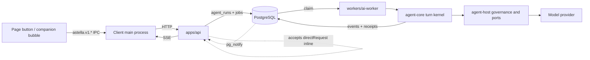
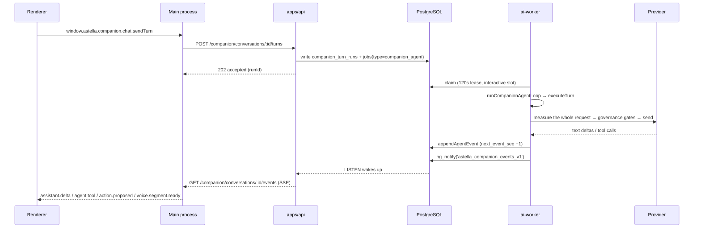
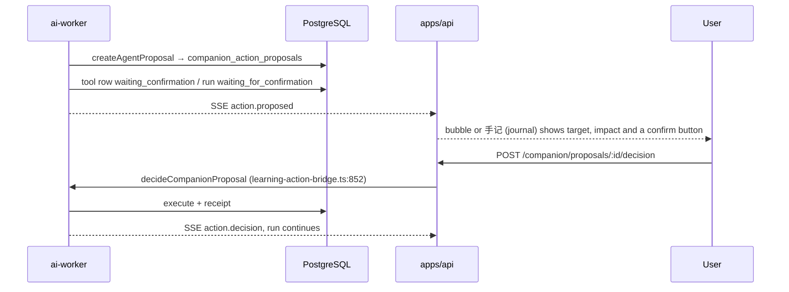

# The unified Agent runtime (technical)

[中文](../zh/agent-runtime.md) · English

What this page covers: the **one Agent execution mechanism** this project has — how a turn is driven, where capabilities and tools come from, how context is measured and compacted, how work commits and recovers across processes, which state words are legal, and which parts actually run today versus which are still backend only. The companion's user-facing side (the four places she appears, the growth loop, what memory and the diary mean as product) lives in [The companion experience (product design)](./companion-experience.md); this page describes only her execution body. Providers and the job queue themselves are in [AI and the companion](./ai-and-companion.md).

Unless noted otherwise, paths are relative to the repository root.

- [The model in one line](#the-model-in-one-line)
- [One turn, end to end](#one-turn-end-to-end)
- [The turn kernel](#the-turn-kernel)
- [Capability catalog and tool surfaces](#capability-catalog-and-tool-surfaces)
- [Permission tiers and the proposal round trip](#permission-tiers-and-the-proposal-round-trip)
- [Context governance](#context-governance)
- [Persistence and host ports](#persistence-and-host-ports)
- [State vocabulary](#state-vocabulary)
- [Governance gates](#governance-gates)
- [Numbers worth remembering](#numbers-worth-remembering)
- [Wired up today vs backend only](#wired-up-today-vs-backend-only)
- [Where to start debugging](#where-to-start-debugging)

## The model in one line

**One kernel, two entry points, one governance layer.**

- The kernel is `packages/agent-core`: turn boundaries, step driving, context assembly and budget criteria, nothing else. It imports no provider, no database, no UI.
- Two entry points: **declarative requests** (a page button has already picked the capability, so no planning model is needed) and **goal advancement** (the companion or a long goal composes capabilities step by step). Both land in the same `agent_runs` table and the same receipt machinery.
- Governance is `packages/agent-host`: consent, egress scope, PII, audit, leases and idempotency are all settled before a request actually leaves. A failed gate is a non-retryable error — no downgrade, no silence.



## One turn, end to end

One turn of the companion talking, from keypress to ink on paper, walks this chain:



The parts that matter:

- **Acceptance and execution are separate.** The API only creates the run, queues it and returns a `runId`; a model call never happens on the request thread (`workers/ai-worker/src/handlers/companion-agent-runtime.ts:186`).
- **One owner of the event sequence number.** `appendAgentEvent` (`workers/ai-worker/src/handlers/companion-agent-events.ts:211-255`) bumps `companion_conversations.next_event_seq` first and only then inserts into `companion_stream_events`, so the client can fill gaps by sequence number and duplicate events are idempotent by construction.
- **Polling backs up push.** After an SSE disconnect, `run-nodes` is polled with 2500ms→30000ms backoff (`apps/api/src/modules/companion-conversation/routes.ts:435`).
- **Write-back is lease-fenced.** Every step commits inside `ports.transaction` with a `SELECT … FOR UPDATE` on the run row, checked against the `astella_agent_run_authorized` fence; an expired fence raises `advance_obsolete` (409), so an old worker can never overwrite a new one (`packages/agent-host/src/advance-store.ts:27-39`).

## The turn kernel

`packages/agent-core/src/runtime/`:

| Function | Where | What it owns | What it stays out of |
| --- | --- | --- | --- |
| `executeTurn` | `execute-turn.ts:4-18` | The bounded loop: `step 1..maxSteps`, `signal.throwIfAborted()`, `now() >= deadlineAt → budgetError()`, until `advance()` returns `{kind:"settled"}` | Never touches the model, never touches the database |
| `executeAgentStep` | `execute-step.ts:16-29` | One checkpointable step: `context.prepare()` → `state.prepare()` → `model.execute` → **`state.saveResponse` before any capability runs** → `capabilities.invoke` one at a time → `state.apply` | Does not decide when the turn ends |
| `runAgentModelStep` | `model-step.ts:19-47` | A single model boundary on the `runAiTask` kernel, budget `{maxModelCalls:1, maxAutoRetries:0}`, completion criterion `structured_parsed`; maps `lease_lost` or `cancelled` to inactive, `timeout` or `budget_exhausted` to timeout | No retrying — retries belong to the outer job |
| `resolveAgentTurnInterpretation` | `attention.ts:6-37` | Binds the utterance to host objects; records one ambiguity each for an unknown sequence number, an unresolvable referent and an unavailable capability (capped at 6); pure small talk is forced to `toolUse:"none"` | Does not guess — if it cannot resolve, it marks `uncertain` |
| `validateAgentGoalDelivery` | `goal-delivery.ts:36` | Decides `completed`: every operation `succeeded` with a result, every requirement satisfied, and any non-text requirement must cite a `callId` that really succeeded | Does not accept "the model says it is done" |
| `classifyAgentRunFailure` | `failure-learning.ts:71` | Classifies failure as `transient_provider / outcome_unknown / cancelled / incomplete / not_applicable / unclassified` and says whether that failure **may** count as experiential evidence (`contributesRule`) | Cancellation never counts as experience |

`state.prepare()` can hand back a cached `response` — **replaying the same checkpoint does not spend a second call**; `saveResponse` is persisted before any capability commits, so if the process dies mid-step the model portion is reused on replay (`execute-step.ts:20`).

Termination comes from the host: `workers/ai-worker/src/agent/advance.ts:60-112` uses `maxSteps:3` and `maxCalls:4` per step; `packages/agent-host/src/advance-store.ts:105-114` writes `completed|paused|failed` from the delivery outcome, stays `waiting` while receipts are still outstanding, and judges `failed` when two assistant turns in a row call no tool at all.

## Capability catalog and tool surfaces

**The single index**: `packages/shared/src/agent-capability-catalog.ts:15-30` maps the 8 manifest groups — 56 declarations in total — onto `{executor, surfaces, requires}` and throws outright on a duplicate name. A capability's model-visible parameters are derived back into JSON Schema from zod (`agent-capability-definition.ts:13`), so "the shape the model sees" and "the shape the runtime validates" cannot drift apart.

| Surface | Count | Defined in | Used for |
| --- | --- | --- | --- |
| Conversation (companion) | 41 companion tools, 48 after projection | `packages/shared/src/companion-capability-manifest.ts:26-243` | Reading the page, reading material, navigation, status queries, learning tasks, memory read/write, editing her own persona, reminders, diary, diagrams and calculation |
| Goal (long tasks) | 15 further declarations, 10 on the goal surface | `packages/shared/src/agent-capability-manifests.ts:19-87` | The four note artifacts, card generation, reading methods, calculation, reading public documents, `agent_deliver_goal` |

The conversation surface grouped by purpose (these are the exact names the model sees):

- **Reading context**: `companion_read_context`, `companion_read_current_page`, `companion_read_history` (takes `fromSeq` — this is how original text comes back after compaction).
- **Reading material**: `companion_search_notes`, `companion_read_note`, `companion_read_source`, `companion_read_image`, `companion_show_image`. Reads are paged, and when a read does not reach the end it returns an honest `truncated`.
- **Navigation**: `companion_open_note`, `companion_open_page`, `companion_open_card`, `companion_focus_graph` — jump targets are constrained by `HUD_PAGE_DESTINATIONS` in `components/hud/hud-pages.ts` (see the product design page).
- **System reads**: `companion_get_learning_stats`, `companion_list_task_queue`, `companion_list_due_reviews`, `companion_list_recent_activity`, `companion_list_reminders`.
- **Learning actions**: `companion_start_learning`, `companion_resume_learning`, `companion_pause_learning`, `companion_request_hint`, `companion_switch_task_variant`, `companion_defer_review`.
- **Memory actions**: `companion_save_memory`, `companion_read_memory`, `companion_recall_memory`, `companion_recall_past_conversation`, `companion_move_memory`, `companion_forget_memory`, `companion_revise_memory`, `companion_remember_judgment`.
- **Herself**: `companion_revise_own_style`, `companion_revise_own_tags`, `companion_set_boundary`, `companion_set_activeness`, `companion_pause_learning_suggestions`.
- **The rest**: `companion_schedule_reminder`, `companion_cancel_reminder`, `companion_read_playbook`, `companion_read_diary`, `companion_render_diagram`, `agent_calculate`, `agent_read_public_document`.

Execution lands in `workers/ai-worker/src/agent/companion-tool-execution.ts` (for example `agent_calculate:117`, `agent_read_public_document:111`, `companion_read_image:540`, with the vision routing at `:614`).

## Permission tiers and the proposal round trip

One place decides, ever: `canUseCompanionAgentTool` (`packages/shared/src/contracts/companion-agent-contracts.ts:236-264`).

| Tier (visible in Settings) | Reads | Reversible low-impact writes | Other writes | The 6 tools that must propose |
| --- | --- | --- | --- | --- |
| Read only `read_only` | allowed | blocked | blocked | proposal, waits for confirmation |
| Guided `guided` (default) | allowed | done directly | confirmed first | proposal, waits for confirmation |
| Full `full` | allowed | done directly | done directly | **still** proposes, waits for confirmation |

- The `irreversible` risk class always confirms — except that no manifest declares it today, so the enum exists ahead of any use (`companion-agent-contracts.ts:57-62`).
- The forced-proposal list is `COMPANION_PROPOSAL_EXECUTED_TOOLS` (`:227`, six names). The code comment states outright that the full tier's server-side auto-confirmation **is still owed**.
- Surface filtering lives in `packages/shared/src/companion-agent-registry.ts:15-21`: `read_only` strips every non-read tool, and vision-related tools are stripped while image reading is off.

The proposal round trip:



Routes are in `apps/api/src/modules/companion-conversation/routes.ts`: `/companion/menu-proposals` (`:89`), `/companion/tool-proposals` (`:124`), `GET /companion/proposals/:id` (`:158`), `POST /companion/proposals/:id/decision` (`:181`).

## Context governance

**Assembly** (`packages/agent-core/src/context/assemble-context.ts`): sources resolve in plan order → `composeAgentContext` (`:58`) first checks scope and authority (throws outright when they do not hold, `:68-72`), then decides **admission** by `required → priority → index` (`:77-79`), while the **display** order still follows the plan (`:101`). The decisive trade-off: **body text is never cut** — an optional source over budget is marked `budget_omitted`, a required source over budget throws `required_context_overflow` (`:86,92`). The assembly result becomes a receipt (`summarizeContextAssemblyReceipt`, `:202`).

Plan order for goal advancement (`workers/ai-worker/src/agent/goal-context.ts:67-76`): `identity`(required) → `persona` → `preferences` → `execution`(required) → `long_goal`(required, 12000) → `methods` → `materials`(required) → `receipts`(required, 27000) → `evidence`(required), with a 64000-character overall cap.

**Measurement** (`context/measure-request.ts:25-31`): what is measured is the **whole outgoing request**, not message bodies — tool definitions, system sections, images and reasoning handles all count. `CONTEXT_MEASUREMENT_VERSION:"v1"`, image floor `IMAGE_TOKEN_FLOOR:1500`, reasoning-handle floor `REASONING_HANDLE_TOKEN_FLOOR:64`; real usage returned by the provider is preferred as the anchor (`:68-90`), and kinds that cannot be measured go into `unmeasured` instead of pretending to be 0.

**Budget authority** (`context/context-budget.ts:24-46,161-173`):

```
B_hard = max(0, min(C − O, I) − M)      C=window O=output reserve I=input cap M=2048 overhead
T(trigger) = floor(B_hard × 0.80)
G(target)  = floor(B_hard × 0.60)
With no profile, C falls back to 128000 and O is taken conservatively as 16384
```

The decision order inside `evaluateContextPressure` (`:198-251`) **is** the policy: required content overflows → fits the budget so send → over the hard ceiling so refuse → compaction unavailable so send with a reason (`compaction_budget_spent` / `over_trigger_line`) → compact. The verdict is persisted into `companion_turn_runs.context_pressure` and `context_assembly_receipt`.

**Compaction**: cooldown `MAX_COMPACTION_ATTEMPTS 3` / `COMPACTION_COOLDOWN_MS 60000` / `MAX_NO_PROGRESS_ATTEMPTS 2` (`context/compaction-cooldown.ts:27-33`), with state persisted per `(conversation, sourceHash, provider, model)` in `agent_context_compaction_state` and `attempts` incremented by SQL (`packages/agent-host/src/compaction-state.ts:105`).

Companion compaction and generic compaction are **not the same thing**:

- Generic: `withBoundedContextCompaction` (`workers/ai-worker/src/handlers/companion-compaction.ts:223`) plus `boundedStepSender` (`:279`), at most one compaction per request.
- Companion: **lossless coverage folding** `foldReplayUnderSummaryCoverage` (`:95-155`) — it folds only whole messages fully covered by a summary (`seq ≤ coverage.throughSeq`, and the summary must carry `sourceSha256`); the current request is always kept, and the receipt records `remainingFromSeq` / `uncoveredBeforeSeq`. The model can still pull the folded original back with `companion_read_history{fromSeq}`, so compaction costs no memory.
- The handoff snapshot is its own chain: `companion_context_handoff_snapshots` (`packages/shared/src/db-schema/companion-conversations.ts:206`), produced by `handlers/companion-context-handoff.ts:157`, with replay window `REPLAY_WINDOW_MESSAGES 20`.

## Persistence and host ports

| Port | File | Tables |
| --- | --- | --- |
| Run create/update/delete, idempotency, quota | `packages/agent-host/src/store.ts:156-321` | `agent_runs`, `agent_operations`, `jobs` |
| Advance lease and step replay | `advance-store.ts:22-140` | `agent_run_steps`, `agent_run_events` |
| Receipt reduction | `packages/agent-core/src/runtime/run-state.ts:65` | `agent_operations` |
| History and revisions | `history.ts`, `store.ts:94-126` | `agent_run_revisions` |
| Long-term goals | `long-goals.ts:15-65` | `assistant_memory_items` (`kind='goal' AND user_confirmed`) |
| Methods and playbooks | `methods.ts:107-459` | `companion_procedural_playbooks`, `companion_method_revisions`, `companion_method_uses` |
| Operation and artifact receipts | `operation-receipt.ts:166`, `artifact-receipt.ts:60` | `note_overviews`, `note_learning_artifacts`, `note_expansions`, `card_generation_runs_v2` |
| Whether a context source went stale | `context-sources.ts:7-24` (`FOR SHARE`, revision compared) | `assistant_memory_items` |
| Compaction cooldown | `compaction-state.ts:50-133` | `agent_context_compaction_state` |

Idempotency keys are a hard convention: job side `agent-start:` / `agent-revise:` / `agent-resume:` / `agent-handoff:` (`store.ts:127-131`), step side `agent-step:{runId}:{revision}:{stepId}` (`workers/ai-worker/src/agent/advance.ts:88`), and the `applied` flag guarantees `applyStep` takes effect exactly once (`advance-store.ts:86-88`).

## State vocabulary

Docs and UI may only use these words; do not invent new ones:

- **run**: `queued → running → waiting | paused → completed | failed | cancelled` (`packages/shared/src/contracts/agent-contracts.ts:3`). `waiting` = a receipt is still outstanding, or a declarative request accepted it; `paused` = a delivery asked for more input, a pause control, or a long-goal change (`advance.ts:115-118`).
- **operation**: `accepted → running → succeeded | failed | cancelled | outcome_unknown` (`agent-contracts.ts:6`). A terminal state cannot be overwritten; **`outcome_unknown` may only be rewritten by an `authoritative` event** (`run-state.ts:98-108`). Rejection reasons: `scope_mismatch / identity_mismatch / revision_mismatch / stale_event / terminal / unverified`.
- **companion turn run**: `accepted / running / waiting_for_confirmation / succeeded / cancel_requested / cancelled / failed / superseded`, phases `accepted / thinking / streaming / acting / awaiting_confirmation` (`companion-conversation-contracts.ts:247,268`).
- **step**: kind `model / tool / confirmation / final / error`, status `running / succeeded / waiting / failed / cancelled`.
- **tool**: `requested / executing / waiting_confirmation / succeeded / outcome_unknown / failed / blocked / expired / not_executed / unavailable`.
- **methods and experience**: state `candidate / active / disabled / disputed`, epistemic state `tentative / supported / disputed`, availability `available / pending / disabled / source_changed / capability_changed / previous_version`, use stage `offered / read / adopted`, feedback `helpful / unhelpful`, actions `confirm / disable / restore`.
- **control**: `cancel / pause / resume`.

## Governance gates

Everything is decided once, before a request goes out, at `prepareGovernedAIPayload` (`packages/agent-host/src/ai-governance-policy.ts:254-265`):

1. Consent: `!consentOk && provider !== "mock"` → `AIConsentRequiredError` (403, `AI_CONSENT_REQUIRED_CODE`). Consent that cannot be read is treated as unsigned — it must be read inside the workspace transaction, or RLS silently returns 0 rows.
2. Egress scope: refused when `sendToExternal=false`; refused for images when `sendImageContent=false` (defaults `sendToExternal:false`, `sendImageContent:true`, `:21-30`).
3. Rule-based PII scrubbing (`:127`, patterns at `:103-115`).
4. Data categories are **declared by the call site**: goal advancement passes `["note_content","user_answer"]` (`advance.ts:56`), and image parts add `image_content` automatically; this vocabulary is exactly `ai_audit_log.data_categories`.
5. Audit is written only by `logAICall` (`workers/ai-worker/src/lib/governance.ts:530,831`), recording provider/model/operation/tokens/duration/status/userId/jobId and **never the body text**.

Non-retryability is decided at two layers: the task kernel retries only `transport / timeout / output_shape` (`packages/shared/src/ai-task-kernel.ts:68`); at the job layer `isNonRetryableError` (`workers/ai-worker/src/lib/non-retryable-errors.ts:194`, pattern table `:29-68`) kills billing exhaustion, `invalid api key`, `access denied`, `not configured`, `consent not signed` and context-dependent 401/403 outright. Read-only permission is enforced before queuing: `requireAgentAuthority` (`store.ts:140-146`).

## Numbers worth remembering

| Group | Value | Source |
| --- | --- | --- |
| Companion loop | steps `AGENT_LOOP_MAX_STEPS=4` (grace 2), clamped to `COMPANION_AGENT_MAX_STEPS=8`; 4 tools per step, 12 tools and 12 model calls overall; run deadline 120000ms; single tool 10000ms | `companion-agent-contracts.ts:15-20`, `companion-agent-runtime.ts:286-296` |
| Goal advancement | `maxSteps:3`, `maxCalls:4`, model timeout `min(60000, deadline−now)`, `max_model_calls` default 16 (range 1–32) | `advance.ts:61,84,96`, migration `0368` |
| Queue | lease 120000ms, `MAX_ATTEMPTS=3`, concurrency `QUEUE_CONCURRENCY` (one interactive slot held back), polling 500→5000ms | `workers/ai-worker/src/queue.ts:12,20,21,120` |
| Timeout ladder | handler ceiling = lease − 10000; loop deadline = abort − 15000; single provider call 75000 | `lib/handler-timeout-config.ts:18-19,70,155-172` |
| Quota | at most 5 concurrently active runs (advisory xact lock); at most 50 pending jobs per workspace | `store.ts:147-155`, `job-queue-limits.ts:17` |
| Context | 0.80 / 0.60 / 2048 / 128000 / 16384; images 1500; compaction 3 attempts / 60000ms / 2 no-progress attempts | previous section |
| SSE and rate limits | 500 events per batch, 3 streams per conversation, 10 per user, polling 2500→30000ms; `createTurn` 12/min and 120/hour, decisions 20/min, reads 120/min | `companion-events.ts:27-35`, `companion-rate-limit.ts:94-116` |

## Wired up today vs backend only

**Actually running today**: the 14 `astella.v1.agent.*` IPC channels (`desktop-ipc-contracts.ts:484-497` → `preload/index.ts:197-212` → `src/main/desktop-ipc-agent.ts:31-49`), used by the long-goal page, the methods page and `use-agent-goals.ts:31-113`; declarative requests are issued by 4 domain services (`note-overviews/service.ts:115`, `note-learning-artifacts/service.ts:117`, `note-expansions/service.ts:162`, `card-generation-v2/generation-run-service.ts:51`); the goal executors `note / card / method / basic / external / delivery` are bound at `advance.ts:35-38`; the diagnostic routes `GET /companion/runs`, `/doctor`, `/turn` and `/issue-bundle` are all registered and reachable over IPC.

**Backend only, or half built**: no manifest declares the `irreversible` risk class; server-side auto-confirmation for the full tier is unimplemented, so those 6 tools still need a human click; `not_executed` / `unavailable` are mapped back to the model on the worker side and are not first-class ledger states; `capability-bundle.ts:22-45` is down to a name table and gates nothing; `agent_deliver_goal` has no UI entry outside the goal run itself.

## Where to start debugging

| Symptom | Look here first |
| --- | --- |
| The bubble spins and no text appears | Find the run via `GET /companion/runs` → `/companion/runs/:id/doctor` → `/turn` to see which phase is stuck |
| A tool was called but produced no result | Is the `agent_operations` row `outcome_unknown`? Recovery relies on `astella_enqueue_agent_recovery()` (30s throttle, `advance.ts:127-131`) |
| Context keeps getting compacted | `attempts` and cooldown in `agent_context_compaction_state`; the persisted verdict in `context_pressure` |
| 403 consent | Whether `user_ai_settings` is signed, and whether a real provider was called while consent was off |
| Events do not push | The LISTEN connection on `pg_notify` channel `astella_companion_events_v1`, and whether SSE slots are blocked by the 10-per-user limit |
| One-shot evidence capture | `GET /companion/runs/:id/issue-bundle` (`run-diagnostics-routes.ts:145`); the read-only health script `scripts/companion-provider-health.mjs` (must run inside the worker container) |

Related pages: [The companion experience (product design)](./companion-experience.md) · [AI and the companion](./ai-and-companion.md) · [Astella system architecture](./architecture.md) · [API and data](./api-and-data.md) · [Desktop client](./desktop-client.md) · [FAQ and troubleshooting](./faq-and-troubleshooting.md)
