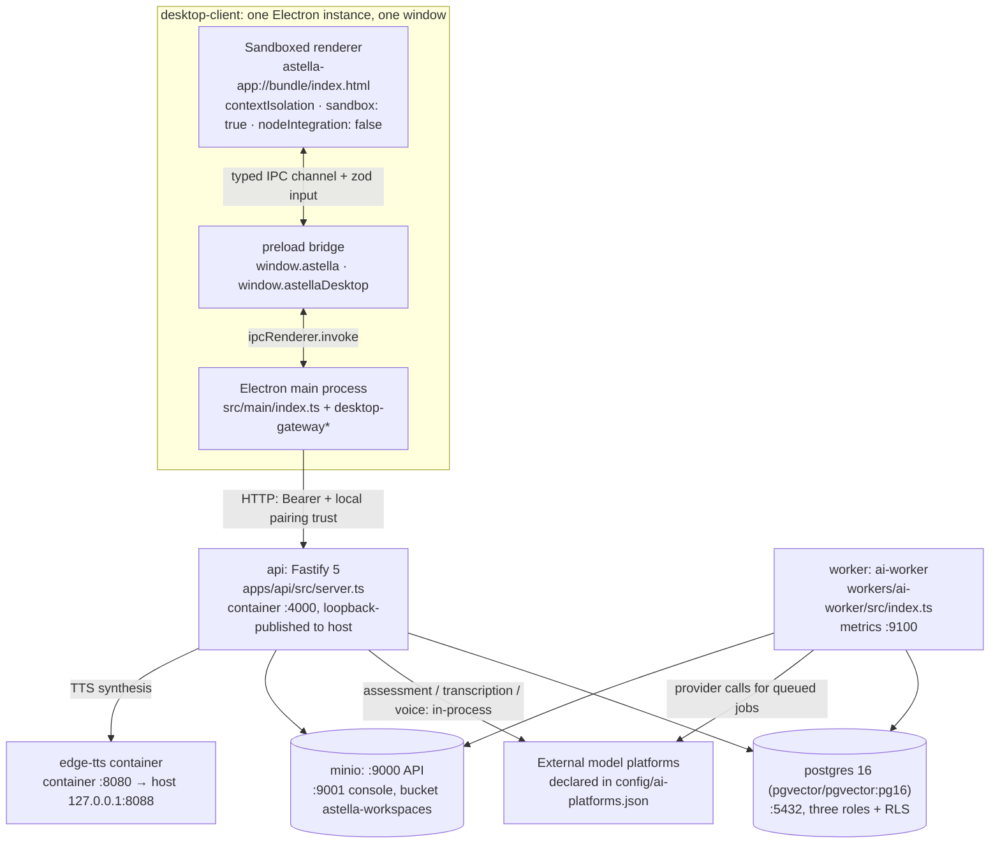

# Astella System Architecture

[中文](../zh/architecture.md) · English

This page maps processes, request/response paths, package dependencies, table responsibilities and permission boundaries. File and symbol pointers locate implementations. See [Development](development.md) for commands/startup and [Deployment](deployment.md) for production.

- [Runtime topology](#runtime-topology)
- [One AI turn, end to end](#one-ai-turn-end-to-end)
- [Process inventory](#process-inventory)
- [Packages and dependency direction](#packages-and-dependency-direction)
- [Table groups](#table-groups)
- [Data-flow contracts](#data-flow-contracts)
- [Where the AI work actually runs](#where-the-ai-work-actually-runs)
- [The desktop client boundary](#the-desktop-client-boundary)
- [Authentication and authorization topology](#authentication-and-authorization-topology)
- [Unified version](#unified-version)
- [Decisions and what they cost](#decisions-and-what-they-cost)
- [Changing X, look at Y](#changing-x-look-at-y)

## Runtime topology

The development stack is `docker-compose.dev.yml` (Compose project `astella-dev`), production combines `docker-compose.yml` with `docker-compose.deploy.yml`, and the Alpha environment uses `docker-compose.alpha.yml`. The diagram below is the dev stack plus the desktop client. `prometheus` / `alertmanager` **exist only in the alpha file** — there is none in the dev stack.



Three edges people tend to drop, each of which changes the conclusion:

- The renderer **issues no business HTTP**. Everything it wants from the API goes `window.astella` → IPC → main-process gateway → HTTP. There are `fetch` calls in the renderer, but they only load same-origin bundled assets (Live2D manifests, fonts, audio) — see `components/companion/WindowLive2DDriver.ts` and `media/learning-room-manifest.ts`.
- API and Worker exchange jobs, edit dispatch and receipts through PostgreSQL; queue functions and notifications carry processing between them.
- Auto-update metadata and addresses are **server-delivered** (decided 2026-10-10): the client asks `apps/api`'s `/updates/desktop/latest[-mac].yml` first, the server fetches the GitHub manifest live and rewrites the download addresses, and an unreachable manifest falls back to the GitHub source baked into the package (`publish` in `apps/desktop-client/electron-builder.yml`, also what the release job uses to upload assets). Installer bytes still travel from GitHub — your API sells addresses, not bandwidth — so a dead API does not block updates.

## One AI turn, end to end

The diagram traces a companion dialogue turn (`companion_agent`), because that is the only path with SSE. The other two return paths are described in words right after it.

```mermaid
sequenceDiagram
    autonumber
    participant R as Renderer (note page / companion)
    participant M as Electron main
    participant A as api route
    participant J as jobs table
    participant W as ai-worker
    participant P as model platform

    R->>M: window.astella.<domain>.<action> (channel name + zod input)
    M->>A: POST /companion/conversations/... (Bearer token stays in main)
    A->>A: withWorkspaceTransaction: set_config, then read it back
    A->>J: createJob: pg_advisory_xact_lock(job-quota:workspaceId) → idempotency lookup → payload dedupe → pending count below 50 → INSERT
    A-->>M: 202 accepted (runId / operationId)
    M-->>R: receipt; page parks the task
    J-->>W: AFTER INSERT trigger pg_notify('astella_job_events')
    W->>J: public.astella_claim_jobs(interactive, background, 3): SKIP LOCKED, writes lease_token
    W->>W: read material in a short transaction (inside RLS) → call model outside it
    W->>P: runAiTask (budget / timeout / AbortSignal / consent + data-policy gate)
    P-->>W: candidate output
    W->>J: verify lease_token → write domain tables + pg_notify('astella_companion_events_v1') → astella_finish_job
    A-->>M: SSE frames from GET /companion/conversations/:id/events (NOTIFY wakes it, cursor is the fallback)
    M-->>R: projected minimal event shape over the subscription channel
```

The three paths differ; don't collapse them into one in your head:

| Trigger | Enqueue implementation | How the result reaches the screen |
| --- | --- | --- |
| Companion dialogue, note annotation explanation, source parsing, memory and thought jobs | `createJob()` in `apps/api/src/modules/job/service.ts` | Dialogue uses SSE; annotations and sources poll task/operation status |
| Note-page 速看 (overview), 往外学 (learn outward), dynamic artifact, plus card generation | direct `INSERT INTO jobs` in `packages/agent-host/src/note-operation.ts` and `store.ts:enqueueAdvance` | Renderer polls operation/job status, e.g. `renderer/src/components/surfaces/notebook/use-notebook-overview.ts` |
| LearningRun answer assessment and Commit | not in `jobs` at all: the api process polls `learning_run_processing_outbox` | events written, then pushed on `/learning-runs/:runId/events` |

Both enqueue paths take **the same lock with the same limit**: `note-operation.ts` and `job/service.ts` both run `pg_advisory_xact_lock(hashtextextended('job-quota:<workspaceId>', 0))` and then count pending rows. The only difference is that agent-host hard-codes `50` while `createJob` reads `MAX_PENDING_JOBS_PER_WORKSPACE` (`packages/shared/src/job-queue-limits.ts`).

This diagram stops at "how the processes talk". How a turn is actually driven inside — the kernel steps, the capability and tool surface, the permission tiers, context measurement and compaction, the state vocabulary — is a separate mechanism, written up in [Unified agent runtime (technical)](./agent-runtime.md); what the companion looks like to the person using it is in [Companion experience (product design)](./companion-experience.md).

## Process inventory

| Process | Who starts it | Entry point | Port | Health endpoint |
| --- | --- | --- | --- | --- |
| api | `make up` → compose service `api`, `target: dev` | `apps/api/src/server.ts` (`npm run dev` = `tsx watch src/server.ts`) | 4000 in-container; host `${API_PORT:-4000}` bound to `${API_BIND_ADDRESS:-127.0.0.1}` | `/health`, `/ready`, `/metrics` |
| worker | `make up` → compose service `worker` | `workers/ai-worker/src/index.ts` (`tsx watch src/index.ts`) | metrics `${WORKER_METRICS_PORT:-9100}`, published on 127.0.0.1 | `/metrics` (what the compose healthcheck hits), `/ready` (exists in code, `lib/metrics.ts`) |
| postgres | compose service `postgres`, image `pgvector/pgvector:pg16` | stock image + `infra/postgres/init.sql` | `${POSTGRES_PORT:-5432}` on 127.0.0.1 | `pg_isready -U astella -d astella` |
| minio | compose service `minio`, profile `storage`; dev `make up` includes that profile by default | `minio/minio:RELEASE.2024-12-18T13-15-44Z` | `${MINIO_PORT:-9000}`, `${MINIO_CONSOLE_PORT:-9001}` | `/minio/health/live` |
| edge-tts | compose service `edge-tts` | `docker/edge-tts/server.py` (`python:3.12-slim`, `user: nobody`) | container 8080 → host `127.0.0.1:${EDGE_TTS_PORT:-8088}` | `/health` |
| Electron main | `make desktop-client-dev` → `npm run dev` = `electron-vite dev --remoteDebuggingPort 9222` | `apps/desktop-client/src/main/index.ts` | listens on nothing; acts only as an HTTP client | no HTTP surface; the window shows connection state via the `runtime.getHealth` IPC channel |
| Electron renderer | the single `BrowserWindow` created by main | dev: Vite dev server; packaged: `astella-app://bundle/index.html` | served by the dev server, whose origin arrives as `ELECTRON_RENDERER_URL` | as above |
| preload bridge | same lifetime as the renderer | `apps/desktop-client/src/preload/index.ts` | — | — |
| prometheus / alertmanager | `make alpha-up` (`scripts/alpha-env-setup.sh` + `docker-compose.alpha.yml`) | `prom/prometheus:v3.0.1`, `prom/alertmanager:v0.28.1` | 9090 / 9093 | `/-/healthy` on both |

The one-shot containers (`role-bootstrap`, `migrate`, `role-grants`, `minio-init`, `seed-demo`) are not in this table: they run to completion and stop. Their convention is documented in [development.md](development.md#the-one-shot-container-convention).

## Packages and dependency direction

`packages/` contains `shared`, `agent-core`, `agent-host`, `ai-quality` and `card-generation`. Database access lives in `apps/api/src/db/` and `workers/ai-worker/src/db.ts`; shared tables live in `packages/shared/src/db-schema/`, with some objects declared only in migration SQL.

| Package | Responsibility | Imported by | What it must not pull in |
| --- | --- | --- | --- |
| `@astella/shared` (`packages/shared`) | zod contracts, enums, Drizzle schema, cross-process safety utilities (`safe-error`, `job-queue-limits`) | api, worker, desktop-client, and the other four packages | `src/index.ts` must stay free of `node:` imports — the renderer loads it. Server-only modules (`workspace-transaction.ts`, `content-hash`, `task-router`, `card-generation-v2-hashing`) are reachable only by subpath; `verify-shared-exports.mjs` plus the per-line comments in `index.ts` hold that line |
| `@astella/agent-core` (`packages/agent-core`) | context measurement and budgets, compaction cooldown, run state, capability descriptions | api, worker, agent-host | src contains **no** `node:` or `drizzle-orm` import; it stays pure TypeScript, so don't add persistence to it |
| `@astella/agent-host` (`packages/agent-host`) | reads/writes for `agent_runs` / `agent_operations`, governance policy, method and receipt registration | api, worker | issues no HTTP and never touches model transport; because it depends on drizzle it can neither be re-exported from `packages/shared/src/index.ts` nor imported by the renderer |
| `@astella/ai-quality` (`packages/ai-quality`) | offline scoring, datasets, `pr-gate` (fixed fixtures, never paid network) | worker (and its own scripts); it is the only package `make verify` runs `pr-gate` on | does not reach the renderer, and api does not import it |
| `@astella/card-generation` (`packages/card-generation`) | card creation, evidence sealing, transaction and event shapes | api, worker, agent-host | it has a `typecheck` script and no independent test script; host chains cover its behavior; `make verify` does not include it either (verify covers shared / agent-core / agent-host / ai-quality / api / desktop-client / ai-worker) |

`shared` declares explicit `exports` entries without wildcards. That is not a style choice: host `tsc --noEmit` resolves through the workspace symlink and finds the file on disk, while the Node runtime reads `exports`. A deep import for a file that exists but was never registered type-checks green and fails at runtime with `ERR_PACKAGE_PATH_NOT_EXPORTED`.

## Table groups

Database schema lives in `packages/shared/src/db-schema/`; migration order comes from `apps/api/src/db/migrations/meta/_journal.json`. Some tables, functions and constraints are declared only in SQL. Module counts do not describe the whole database; the table below is a navigation aid.

| Group | Schema modules | What lives here |
| --- | --- | --- |
| Identity, session, AI consent | `identity.ts`, `session.ts`, `ai.ts` | users, workspaces, membership and invites, `sessions`, sign-in rate-limit counters, `user_ai_settings`, `ai_artifacts` |
| Sources and notes | `note.ts`, `evidence.ts`, `note-annotations.ts`, `note-expansions.ts`, `note-learning-artifacts.ts`, `note-learning-reflections.ts`, `note-learning-rounds.ts`, `note-overviews.ts`, `note-recalls.ts` | sources and parsed output, notes with immutable versions and evidence alignment, then one task-plus-artifact table set per on-demand capability: overview, annotation, expansion, dynamic artifact, rounds, reflection |
| Background queue | `job.ts` | the single `jobs` table: `type` / `status` / `attempts` / `payload` / `lease_token` / `lease_renewed_at` / `priority` / `resource_class` / `idempotency_key` |
| Learning runs and review | `learning-runs.ts`, `learning-metrics.ts`, `assessment-disputes.ts`, `validation-v2.ts`, `personal-objective-bindings.ts`, `personal-relation-decisions.ts` | LearningRun with its private contracts, tasks and variants, events and outboxes, review scheduling, assessment disputes and corrections, objective binding |
| Card generation | `card-generation-v2.ts` | the largest set: generation runs, candidates, review and exposure ledger, quality and evidence sealing, activation receipts |
| Companion | `companion.ts`, `companion-conversations.ts`, `companion-memory.ts`, `assistant-memory.ts`, `assistant-deliveries.ts`, `companion-bridge.ts`, `companion-journey.ts`, `companion-home.ts`, `companion-sandbox.ts` | the companion and its account state, conversations and turn events, memory items and revisions, deliveries and reminders, the page-context bridge, journey, room projection, isolated artifacts |
| Search and understanding projection | `search.ts`, `understanding-projection.ts` | the full-text search write projection and the read-side projection behind the understanding graph |

Three things about this table that lead to wrong conclusions if you read it too quickly:

- Table count is not the permission surface. **Who may read a table is decided by `infra/postgres/roles.sql`, not by the drizzle declaration** — the per-table `GRANT` inside a migration is undone by the later `REVOKE ALL`, and a grant not repeated in `roles.sql` fails silently rather than loudly.
- Most of those 33 card table names end in `_v2` (a few do not, e.g. `card_content_capability_state`), yet **V3 uses exactly this set** (`card_generation_runs_v2`, `card_generation_plans_v2`, `card_generation_candidates_v2`). The V3 implementation is in `workers/ai-worker/src/card-generation-v3/` and declares no schema — searching for "V3 tables" by name finds nothing.
- **Tables do not only exist in the drizzle declarations.** `companion_memory_organization_state` is created by migration `0350_companion_memory_organization_lease.sql` and is absent from `packages/shared/src/db-schema/`; the `companion_memory_organize` job that consumes it also has **a worker handler but no `JobType` enum member**. Its other input, `assistant_memory_items`, sits in `assistant-memory.ts` — same "Companion" group above, different table-name prefix. When looking for a table, check both the schema directory and the migrations.

## Data-flow contracts

**Request id and cross-process trace.** `server.ts` generates `genReqId` with `crypto.randomUUID()`; `server.ts` puts it into `AsyncLocalStorage` in the `onRequest` hook (`apps/api/src/lib/request-context.ts`). `createJob` writes it as `payload.traceId` via `withTraceId()`, and worker reads it back at `index.ts` into its own logs. ALS was chosen over an extra parameter because `createJob` has seven-plus call sites and request context avoids requiring every caller to forward an extra parameter.

**Error envelope.** `apps/api/src/lib/error-envelope.ts` unifies the **decision** (status code, whether to mask 5xx, whether to spread `recoveryData`), not the wire shape. Its header documents the three shapes that still exist; the companion one carries `version: 1` / `recoverable` / `requestId`, which is part of the desktop contract and must not be "unified" away.

**Cursor pagination.** `apps/api/src/lib/pagination-utils.ts`: `encodeCursor` is `base64(ISO timestamp + ":" + id)` (lines 88-91); `decodeCursor` returns `null` on a malformed cursor instead of throwing; `clampLimit` / `clampOffset` / `clampPagination` do the clamping. `pagination.ts` adds only the Fastify-dependent `parseQuery`, which raises 400 on validation failure — the dependency-free half is reusable by worker.

**Workspace transaction.** `packages/shared/src/workspace-transaction.ts` is the single implementation after the API and worker halves were merged: UUID normalisation, `pg_catalog.set_config` for `app.workspace_id` and `app.user_id` with `is_local = true`, **then a read-back comparison** against what Postgres actually accepted (lines 147-172), throwing `database rejected … transaction context` on any mismatch. Two traps are baked in: a `null` userId must be passed as NULL, not an empty string (empty hits `user_id = ''::uuid` as a plan-time constant cast and throws), and nested work may reuse the transaction but may never change tenant or actor.

**Outside-transaction gate.** `assertOutsideWorkspaceTransaction` / `assertOutsideRegisteredTransactions` in the same file  test "is there an active transaction in the current async scope", not "does the text of this code mention `transaction`" — so implicit nesting is rejected too. The registry exists because `public-json-http` is shared by both processes and `shared` cannot import either side's ALS module.

**RLS.** 112 tables carry `FORCE ROW LEVEL SECURITY` across the migrations. `astella_api` and `astella_worker` are both `NOBYPASSRLS`; only `astella_migrator` has `BYPASSRLS` (`infra/postgres/roles.sql`). The dev stack's `DATABASE_URL_API` is already the restricted role (`docker-compose.dev.yml`) and that was deliberate: with a superuser, a read point missing `app.workspace_id` does not error, it silently returns zero rows.

**Outbox tables.** Four tables are named as outboxes: `learning_run_processing_outbox` (consumed in the api process), `canonical_learning_event_outbox` and `practice_trail_event_outbox` (all three in `learning-runs.ts`), plus `card_generation_run_outbox_v2` (in `card-generation-v2.ts`).

**SSE limiter.** `apps/api/src/lib/sse-connection-limiter.ts`: default 5 streams per user and 200 per process , overridable with `SSE_MAX_STREAMS_PER_USER` / `SSE_MAX_STREAMS_TOTAL`, bucketed by namespace — live namespaces include `run-events`, `card-gen-events`, `inbox`. Counters are **in-process memory**: with N replicas the real ceiling is N × this limit. All writes go through `safeSseWrite` in `safe-sse-write.ts`, which returns `false` on failure instead of letting a broken pipe surface as HTTP 500.

**LISTEN / NOTIFY wake-up.** Channels in use: `astella_job_events` (wakes the worker loop, `workers/ai-worker/src/lib/job-notify.ts`), `astella_companion_events_v1` (dialogue events, drives SSE), `astella_companion_inbox_v1` (delivery inbox), `astella_companion_account_v1`. Senders include SQL triggers (`0115_job_insert_notify.sql`, `0271_job_ready_notify_on_retry.sql`, `0226_card_generation_outbox_notify.sql`, …) and explicit application event publishing. Worker's idle poll backs off 500ms → 5000ms (`index.ts`); an arriving NOTIFY interrupts the current sleep and returns to the fast interval, and if establishing LISTEN fails it logs a warning and falls back to plain polling.

## Where the AI work actually runs

Not "all of it in worker". The split follows one question: does this chain need to be retried, queued and recoverable across processes.

In worker: the handlers behind `jobs` (`HANDLERS` in `workers/ai-worker/src/index.ts`) — source parsing, companion agent turns and tool execution, memory extraction / summarisation / daily summary / embedding rebuild / semantic organisation, proactive thoughts, note overview / annotation explanation / expansion / dynamic artifact, and card generation V3 (`workers/ai-worker/src/card-generation-v3/handler.ts`).

In the api process: consumption of `learning_run_processing_outbox` together with the Assessment Critic call (`apps/api/src/modules/learning-runs/processing/run-processing-tick.ts`, wired at `server.ts`, one tick per 10s, 50 commands per tick, exponential backoff to 60s on failure); `learning-runs/planning/run-critic.ts` and `disputes/dispute-recheck.ts`; `note-learning-rounds/teaching/teaching-explain.ts`; speech transcription `learning-sessions/voice-providers/siliconflow-asr.ts`; the TTS engine and edge-tts client (`tts-engine.ts`, `edge-tts.ts` in the same folder); proactive delivery generation `companion-conversation/delivery/proactive-generator.ts`.

> **Execution fencing belongs to each queue.** Worker jobs use renewable 120-second leases and `lease_token`; the API learning-run outbox also has claim leases, command state and idempotency checks. Queue location alone does not establish guarantee strength: inspect each queue's claims, retries and commit fencing.

Check `JobType` alongside the Worker's `HANDLERS`: `companion_memory_organize` currently has a handler but no enum member. New jobs must update types, handlers and priorities in `jobScheduling()` together.

## The desktop client boundary

- `webPreferences`: `contextIsolation: true`, `sandbox: true`, `nodeIntegration: false`, `webSecurity: true`, `devTools: !app.isPackaged` (`src/main/index.ts`). Session tokens and the encrypted credential file are main-process only (`session-credential-store.ts`); the renderer receives a snapshot.
- Custom protocol: `astella-app` is registered with `protocol.registerSchemesAsPrivileged` (line 69) and served by `protocol.handle` (line 171). Two hosts: `bundle` (the app itself) and the artifact host (AI-generated HTML/SVG in an isolated origin, `artifact-surface.ts`). Packaged serving supports streaming GET, HEAD and one Range per request — that is why local video and audio playback works.
- Navigation gates: `setWindowOpenHandler` always `deny`; `will-navigate`, `will-redirect` and sub-frame navigation all pass `isAllowedNavigation` (lines 430-449) — in development the dev server origin is allowed, otherwise only `astella-app://bundle` with no username, no password and no port. Blocks increment `isolationGateCounters`.
- CSP: `onHeadersReceived` routes three ways (lines 399-424) — renderer policy, artifact policy (`default-src 'none'`), and everything else gets `rejectAllContentSecurityPolicy`. The dev origin's `connect-src` and `'unsafe-inline'` are added only in development.
- IPC contract: channel names live in `DESKTOP_IPC_CHANNELS` (`packages/shared/src/contracts/desktop-ipc-contracts.ts`); main registers them with `installHandler(channel, inputSchema, options, handler)` (`desktop-ipc.ts`) split by domain across `desktop-ipc-{rest,source,learning,auth,workspace,companion,agent,voice-asr}.ts`; the renderer calls nested methods on `window.astella`; both sides share `DESKTOP_IPC_CONTRACT_VERSION` and `ASTELLA_DOMAIN_SCHEMA_REVISION`.
- One instance, one window: `requestSingleInstanceLock` (line 645) — a second launch just focuses the existing window, and `new BrowserWindow` appears exactly once in the repo. The old "transparent always-on-top pet window" no longer exists in code.

> **Note:** Capability-state sources. `transportNativeCapabilities()` (`desktop-gateway-transport.ts`) maps `filePicker`, `notifications` and `live2d` to `null`, and `null` always resolves to `unavailable`; the settings page renders that as 未接入 ("not wired up") via `capabilityChipLabel` (`settings-companion-status.tsx`). The other half of the problem is that its `registered` set is built from `Object.values(DESKTOP_IPC_CHANNELS)` — a **static channel-name list**, not "which handlers actually got installed this run". So the projection cannot express "name in the list but nobody registered it", and cannot express the reverse either: `desktop-ipc-workspace.ts` really do call `showSaveDialog` / `showOpenDialog`, yet `filePicker` never reports available, and Live2D is visibly on screen while the settings Live2D chip reads a separate runtime `Live2dStatus`, not this field. Check which source a capability chip actually reads before changing it.

## Authentication and authorization topology

Three identities that never mix.

**User session (HTTP).** `apps/api/src/modules/identity/session-auth.ts`: cookie `astella_session` (HttpOnly) plus a readable cookie `astella_csrf` paired with the `x-csrf-token` header (double submit); `SameSite=Lax`, and `Secure` from `AUTH_COOKIE_SECURE`, defaulting to on when `NODE_ENV === "production"`. `extractAuthCredential` (lines 36-44) **prefers Bearer** and only then reads the session cookie — the desktop gateway uses Bearer, a direct browser session uses the cookie. Desktop pairing is a fourth gate: `POST /_astella/desktop/trust/v1/challenge` (`modules/desktop-trust/routes.ts`) HMAC-SHA256-signs the nonce, `serviceId`, IPC contract version and `ASTELLA_DOMAIN_SCHEMA_REVISION` with `ASTELLA_DESKTOP_PAIRING_SECRET` (base64url, at least 32 decoded bytes). A mismatched key id is 401; unconfigured trust is 503 `desktop_trust_unavailable`. The client is symmetric: `local_loopback` requires both key id and secret, and if either is missing the constructed connection state is `configuration_error: pairing_secret_missing` (`desktop-gateway.ts, 669-681`).

**Operations panel (separate identity).** `modules/admin/auth.ts` uses a deployment-level token, `ADMIN_PANEL_TOKEN`, and deliberately **does not reuse the `sessions` table**: authentication in this repo is per-tenant, and owner is a role **inside a workspace**, so wiring `requireOwner` into the panel would yield a global back office that can see exactly one workspace. The strength floor is `MIN_ADMIN_TOKEN_LENGTH = 16` plus a placeholder blacklist; below that the token counts as unconfigured and `adminRoutes()` **registers no routes at all** rather than registering and rejecting. `ADMIN_PANEL_PATH` is a mount prefix that obscures scan noise — the boundary is the token.

**AI external-send consent (account level).** `modules/identity/ai-consent-gate.ts`: the test is `consentAt && consentVersion` on `user_ai_settings`. `requireAiConsent` runs as a preHandler before synthesis or transcription, returning 403 + `ai_consent_required`; text outbound is governed by `lib/governance.ts` in worker. Consent belongs to the account, not the workspace — signed once means signed everywhere, unsigned blocks everywhere. On job failure `classifyJobFailureReason` (`modules/job/service.ts`) maps the persisted privacy-safe code to `ai_consent_required` so the UI can say "go sign the consent" instead of "it failed".

## Unified version

Server and desktop share `release/version.json`. `npm run release:prepare` synchronizes API, Worker, shared and desktop package versions/lockfiles and the Chinese README marker; maintain the English README version alongside it. Internal packages retain their internal versions.

A `v<version>` tag passes `main-ci.yml` tests before `server-deploy.yml` builds GHCR images and deploys. Desktop quality/installer publication runs separately. See [Deployment](deployment.md) and [Operations](operations.md).

## Decisions and what they cost

| Decision | Why | Recorded in | What it costs |
| --- | --- | --- | --- |
| Separate data, synchronization and deployment modes | Local development uses MinIO, production uses remote S3; clients support loopback HTTP and HTTPS | [Deployment](deployment.md) | PostgreSQL owns domain state, S3 owns durable objects; permissions/backups cover both and single-host deployment has no automatic scaling |
| A queue plus a separate worker, instead of api calling models directly | Model calls are slow, time out, need retrying, and must not write once the user cancels or the lease expires. The run boundary in the code is: short transaction to prepare → execute outside the transaction → short transaction to verify and save ([plan 41a §3](../../plans/learning-companion/41a-unified-agent-foundation-2026-09-28.md) first wrote it down) | Implemented as `jobs` + `astella_claim_jobs` + `assertOutsideRegisteredTransactions`; plan 41a §3 | One turn spans two processes, so tracing needs `traceId`; you acquire leases, a reaper, backoff and idempotency to maintain; `Exited` containers and a `LISTEN` connection are things someone has to keep alive |
| AI consent as an account-level gate, with no per-user model configuration UI in the desktop client | The decision to let content leave the machine belongs to the person who wrote it, not to each workspace's admin. `PRODUCT.md` states "account-level AI consent and outbound-data policy (no model/provider configuration)" | Code: `ai-consent-gate.ts` + `lib/governance.ts`; first written up in 41a §2/§3 | The voice path once bypassed it (the file header records that doc 34 L13 closed it); the two tests must stay the same shape or one side loosens while the other tightens; an unconsented user gets a 403 with guidance rather than a field to paste an API key into |

## Changing X, look at Y

| Changing | Start here |
| --- | --- |
| Adding a background job type | `packages/shared/src/enums.ts` (`JobType`), `packages/shared/src/contracts/job-payload-contracts.ts`, `apps/api/src/modules/job/service.ts` (`jobScheduling`), `workers/ai-worker/src/index.ts` (`HANDLERS` and `DEAD_FINALIZERS`), `workers/ai-worker/src/lib/handler-timeout-config.ts` |
| Claim / retry semantics | `apps/api/src/db/migrations/0228_claim_jobs_interactive_reserve.sql`, `0018_sec01_jobs_expand.sql`, `0022_sec01_job_functions_expand.sql`, `workers/ai-worker/src/queue.ts`, `workers/ai-worker/src/lib/worker-concurrency.ts` |
| Adding a table | the matching module in `packages/shared/src/db-schema/`, a new migration in `apps/api/src/db/migrations/` (plus journal), and `infra/postgres/roles.sql` — **grants must be repeated there**, because the per-table GRANT in a migration is undone by the later `REVOKE ALL` |
| A new desktop action | `packages/shared/src/contracts/desktop-ipc-contracts.ts` (channel name + input/output schemas), the matching `apps/desktop-client/src/main/desktop-ipc-*.ts`, `apps/desktop-client/src/preload/index.ts`, the call site in `renderer/src/app/` |
| What a capability chip reports | `apps/desktop-client/src/main/desktop-gateway-transport.ts` (`NATIVE_CAPABILITY_CHANNELS`, `transportNativeCapabilities`), `renderer/src/components/surfaces/settings/settings-companion-status.tsx` |
| Companion turn events and presentation | `apps/api/src/modules/companion-conversation/turn/`, `workers/ai-worker/src/handlers/companion-dialogue*.ts` and `companion-agent-events.ts`, `renderer/src/app/companion-chat-session.tsx` |
| Answer assessment and review scheduling | `apps/api/src/modules/learning-runs/processing/run-processing-tick.ts` and `run-processing-assessment.ts`, `apps/api/src/server.ts` (wiring and cadence) |
| Switching a model platform or capability mapping | `config/ai-platforms.json`, and the same key list must be passed through **both** api and worker in `docker-compose.dev.yml` (2026-09-17: `OPENCODE_GO_API_KEY` was missing there and card generation failed closed), `workers/ai-worker/src/lib/providers/` |
| Health-check semantics | `apps/api/src/server.ts` (`/health`) and (`/ready`), `workers/ai-worker/src/lib/metrics.ts`, the two `healthcheck` blocks in `docker-compose.dev.yml` |
| Bumping a version | `release/version.json`, then `node .github/scripts/version-contract.mjs --write` / `node .github/scripts/desktop-version.mjs --set <ver>` |

## Related chapters

- [Manual index](../README.md)
- [Product overview](overview.md)
- [Development environment](development.md)
- [Desktop client](desktop-client.md)
- [API and data](api-and-data.md)
- [Models and the worker pipeline](ai-and-companion.md)
- [Unified agent runtime (technical)](agent-runtime.md)
- [Companion experience (product design)](companion-experience.md)
- [Testing and quality](testing-and-quality.md)
- [Operations](operations.md)
- [FAQ and troubleshooting](faq-and-troubleshooting.md)
- Repository root: [README.md](../../../README.md), [PRODUCT.md](../../../PRODUCT.md), [DESIGN.md](../../../DESIGN.md), [AGENTS.md](../../../AGENTS.md)
- Current plan index: [docs/plans/learning-companion/README.md](../../plans/learning-companion/README.md)
