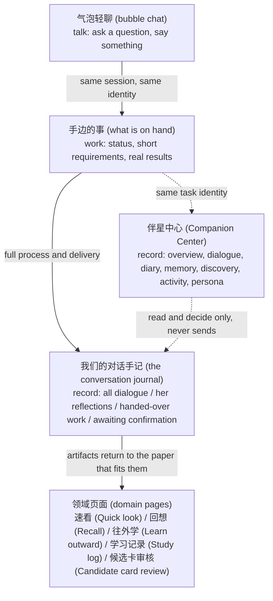

# The companion experience (product design)

[中文](../zh/companion-experience.md) · English

What this page covers: **what the companion is, what she can do, how she behaves, what the user controls, and where she still cannot follow through**. She is not a chat window and not a skin draped over the features: she is the user-facing shape of this project's single Agent mechanism, so this page is about product judgement while her execution body is described in [The unified Agent runtime (technical)](./agent-runtime.md). Facts come from the current renderer source and its UI copy (`apps/desktop-client/src/renderer/src/**`), `PRODUCT.md`, `DESIGN.md`, and real-window check records (`docs/testing/**`).

- [Why she sits at this desk](#why-she-sits-at-this-desk)
- [Three places where she speaks, one place for the record](#three-places-where-she-speaks-one-place-for-the-record)
- [What she can do for you](#what-she-can-do-for-you)
- [Presence: seat, framing and activeness](#presence-seat-framing-and-activeness)
- [Voice: speaking and listening](#voice-speaking-and-listening)
- [Continuous identity: what travels with you, what stays behind](#continuous-identity-what-travels-with-you-what-stays-behind)
- [Memory: admission, tiers and the star map](#memory-admission-tiers-and-the-star-map)
- [The diary](#the-diary)
- [The growth loop](#the-growth-loop)
- [Honesty: failure, silence and no pretending](#honesty-failure-silence-and-no-pretending)
- [Boundaries and what is not done yet](#boundaries-and-what-is-not-done-yet)

## Why she sits at this desk

The problem this product takes on is "**learning something without knowing whether you really understood it**". That class of problem has a shape: it is lonely, and **when you are stuck there is nobody to ask**. Her reason for existing is to turn "stuck" into a moment you can talk in — a moment where you can point at one sentence and say "I did not get this one" (`PRODUCT.md:37,45`).

Three product rules are what keep her from being a chatbot:

1. **Task ownership stays where it is.** Page and domain services own learning-task state, results and saving, and the user is never required to enter a dialogue first (`PRODUCT.md` principle 3). She may start something and pick it back up, but she **does not take over** task state.
2. **She is not a presentation layer.** Once the user deliberately calls her up, she must be inside the same real business session — able to read the current page, able to actually do the work (`PRODUCT.md:73`). Anything shown for demonstration is labelled as a demonstration and produces no business fact.
3. **The figure is part of the function.** Live2D is not decoration. Mouth shape tracks real audio amplitude and moment animations play only on real events (below), so the fact that "she is here" itself carries state.

There is one design of her only: `whale`, called 大肥鱼 (Big Fat Fish) in the interface — a deep-blue night sky, holding a pen to write, riding a whale, sharing its origin with the product icon. The older second form and the transparent always-on-top "desktop pet" window have both been deleted; there is no third `BrowserWindow` in the code.

## Three places where she speaks, one place for the record

She shows up in four places and their duties do not overlap. Confusing these four is the easiest way to misunderstand this product.

| Place | Used for | Not used for | Entry |
| --- | --- | --- | --- |
| **气泡轻聊** (bubble chat) — `CompanionHud.tsx` | Talking, and voice conversation (a finished turn goes straight to her — no "edit the text, then press send") | Carrying task state; nothing is saved from here | The four buttons beside her: 轻聊 / 语音 / 手记 / 设置 (chat / voice / journal / settings) |
| **手边的事** (what is on hand) — `CompanionGoalBubble.tsx:43-46` | What the task is doing and what is still missing; edit the requirement, put it aside, keep working on it, stop it; keep this piece of collaboration as a method | The complete record (the bubble itself says 去手记看完整记录, "open the journal for the full record") | The same sidebar |
| **我们的对话手记** (our conversation journal) — `CompanionHistoryDrawer.tsx:337-340` | Four entries: **全部对话 / 伴星念想 / 交给我的事 / 待确认** (all dialogue / her reflections / what you handed her / awaiting confirmation); quotations and process sit in annexes, while actions needing a decision are laid out directly | Typing or sending here | The 手记 button |
| **伴星中心** (Companion Center) — `companion-center-model.ts:8-16` | Seven tabs: **近况 / 对话 / 日记 / 记忆 / 发现簿 / 动态 / 人格** (overview / dialogue / diary / memory / discovery / activity / persona); viewing, searching, deciding, correcting, withdrawing | Live replies, sending, voice, proposal decisions — those stay in chat and in the bubble | Left directory → 伴星 (Companion) |

One more place: **伴星带路** (the companion shows you around) — the button inside the room-control island at the top right (`HudRoomControl.tsx:365-370`). It opens a small topic catalogue (`guidance/CompanionGuideBook.tsx:13`), 7 themes explained against what the current space actually contains, with skip, pause and replay; every step labels itself a 教学示例 (teaching example) and states outright that no real note, task or study record was created (`guidance/CompanionGuidanceStage.tsx:138`).

## What she can do for you

The **single index** for the capability list is `packages/shared/src/agent-capability-catalog.ts`: 41 tools on the conversation surface, 15 on the goal surface. Grouped by the user's point of view, here is what the interface can really do today:

| Category | What she does | What you see |
| --- | --- | --- |
| Reading what you are looking at | Read the current page, the learning context and history; material is read in pages and honestly marked when it stops short | Answers stay close to the source text; a quotation clicks back to where it came from |
| Finding things | Search notes, read a source, open a given note / card / page, focus the star graph on one point | The page really switches (jumpable screens are bounded by `HUD_PAGE_DESTINATIONS`) |
| Reporting status | Learning stats, the task queue, due reviews, recent activity, the reminder list | The numbers she quotes match the page, because both read the same set of read-only endpoints |
| Doing the learning | Start learning, continue where you left off, put it aside, ask for a hint, switch to another variant, defer a review | Learning-task state still shows on its original paper |
| Making cards | Kick off one set of study cards | Candidates only; which ones to keep is yours to decide one by one in 候选卡审核 (candidate card review) |
| Memory | Save, read, recall, revise, move between tiers, forget, record her own judgment | The memory page and the memory star map show the basis and the state |
| Herself | Edit her speaking style, edit her tags, set a boundary, tune how active she is, pause learning suggestions | The 待生效版本 (pending version) and the version history on the persona page |
| Time and initiative | Schedule a reminder, cancel one, deliver on the dot when due | The activity page and the bubble that arrives on time |
| Deliverables | Draw a diagram / look at an image, evaluate an expression, read one public HTTPS document | Artifacts land on the paper that fits them; no long text stacked inside the bubble |
| Voice | Speak to you (TTS), listen to you (on-device recognition — a finished turn is sent as is) | Lip sync follows the audio; the caption is read-only, correcting yourself means simply saying another sentence |

**In the backend but not wired to the UI**: `POST /voice/transcribe` (cloud transcription — the desktop client no longer calls it); listing and cancelling reminders has only dialogue and notification entries, no management page; `agent_deliver_goal` has an exit only inside a goal run.

**Contract without implementation**: the Sprite Level A stand-in portrait (`PRODUCT.md:73` says plainly: shared contract only, no assets and no rendering implementation).

## Presence: seat, framing and activeness

She is present on every page, but **the posture is declarative data**, collected in `components/hud/hud-pages.ts`:

| Page | Mode | Seat | Framing | Proactive |
| --- | --- | --- | --- | --- |
| Home | `home` | right | full body | allowed (the only draggable seat) |
| Assessment / assessment result | `assessment` | right | bust | silent, and `interaction:"none"` (wide page) |
| Source detail, the four note bookmarks, review queue, understanding graph | `ambient` | **left** | bust | silent |
| Every other working page | `ambient` | right | bust | silent |

Three mute layers that never overwrite one another: **总静音** (master mute) on the room-control island, device level (`HudRoomControl.tsx:323`); **在此页保持安静 / 专注到任务结束 / 暂时隐藏伴星** (stay quiet on this page / focus until the task ends / hide the companion for now) (`CompanionHud.tsx:1568-1572`); and **静默时段** (quiet hours) in Settings, which spells out "你约过的提醒到点照样会来" — reminders you set still arrive on time (`settings-companion-panel.tsx:91`).

Proactive intervention is governed by **one deterministic policy** shared by the API and the worker (`packages/shared/src/companion-proactive-policy.ts:22-27`): `routine` (her own sense of rhythm) is bound by frequency and cooldown, while `triggered` (a reminder you asked for, a completion you are waiting on) **falls under no frequency limit at all**. Suppression reason codes are visible: `space_muted / quiet_hours / dismissal_feedback / formal_answer_in_progress / cooldown`. A "at most N per day" control was deleted — it turned companionship into a quota.

Moment animations play only for events that really happened: `task_started / working / tool_succeeded / tool_failed / awaiting_confirmation / reply_completed / space_arrived / reminder / celebration / run_failed` (`window-live2d-contract.ts:143-153`), pushed to the driver from genuine session-phase transitions, with the celebration check still fail-closed (`app/companion-celebration-policy.ts:14-21`). **No moment is invented just to have more animation.**

## Voice: speaking and listening

- **Out**: two engines only — Qwen / Edge-TTS (`settings-data-tables.ts:75-78`), voices drawn from the same catalogue (`packages/shared/src/tts-voice-catalog.ts`), and previews use samples shipped with the app rather than a paid call per click. When Qwen fails or the network misbehaves it falls back to Edge automatically; **a governance refusal never triggers fallback** — that is a permission problem, not a line problem.
- **Delivery tags**: 23 control tags plus 7 rich-language tags, on Qwen only; they are stripped from both stored and displayed text, the Edge branch sanitizes before synthesis, yet the emotion still drives the Live2D expression (`voice-expression-tags.ts`). The user-side switch is the persona-page boundary 允许回复携带表演语气 (allow replies to carry performative tone).
- **Lip sync**: driven by the RMS of the decoded audio — noise gate 0.012, ceiling 0.18, attack 45ms / release 120ms — written as a separate `lipsync` layer that moves only `ParamMouthOpenY`; expression belongs to emotion, mouth belongs to audio, and the two layers never take over each other's job (`app/companion-mouth-meter.ts`).
- **In**: the local SenseVoice model (about 228MB), **not in the installer** — the user downloads or removes it in Settings; sources fall back in the order ModelScope → hf-mirror → official, SHA-256 is verified byte by byte, and decoding stays on the machine. With no model installed, clicking voice goes straight to 声音与显示 → 语音输入 (voice and display → voice input). The engine runs in a main-process `utilityProcess` (the sandboxed renderer of a packaged build cannot load its wasm runtime).
- **In is a standing conversation** (2026-10-07): one press keeps the microphone open, a short pause (450ms) cuts a segment for recognition and the caption grows in speech order, a longer pause (850ms) sends the whole turn **to her directly** — there is no text field and no send button in that path; to correct yourself you just keep talking. Segments rather than word-by-word streaming, because the bundled sherpa-onnx 1.13.8 exposes SenseVoice only through its offline entry (`OfflineSenseVoiceModelConfig`, no `Online*` SenseVoice config at all). Measured on this machine with the same engine: RTF ≈ 0.17 — a 4-second sentence decodes in about 735ms, so cutting on the pause is fast enough. While she is reading a reply the microphone deliberately accumulates **no audio** (echo cancellation never fully removes her own voice); only a level held above a higher bar counts as you interrupting, and that silences her.
- **Two things still open on the way in**: the recognition engine hands its process back after 90 idle seconds, so after a very long pause the first sentence waits for the model to reload (the conversation mode did not add a keep-alive); and **this path has never been walked against a real microphone in a real window** — the cut/end thresholds and the interruption bar still need on-device tuning.
- **How she takes your answer**: 跟随安排 / 语音 / 静默结构 / 文字 (follow the plan / voice / silent structure / text), account level; 跟随安排 is resolved before rendering, so nothing is shown as already chosen the moment you arrive.

## Continuous identity: what travels with you, what stays behind

| Travels with the account (continuous across spaces) | Stays in the space (isolated by source) |
| --- | --- |
| Persona profile and versions, speaking style, name, account-level switches | Familiarity and interaction counts, conversation history, diary, reflections, journey |
| General working habits she is allowed to keep (methods) | Specific material, specific relationships, specific experiences |

Only the `preference` kind crosses spaces, and only ever as "how you consistently study / how you like to work together"; `goal / learning_context / episodic / interaction_note` stay local without exception. Rules may overrule the model — **when in doubt, treat it as local** (`PRODUCT.md:73`).

Where that reaches the interface: the persona page has version history and restore, and switching presets lists exactly which fields will be overwritten (`companion-persona-page.tsx:58-79`); every memory row can be confirmed, pinned, archived, restored, ignored or removed, and deletion goes to a 30-day recovery area with a one-step undo (`companion-memory-page.tsx:90-100,137`).

## Memory: admission, tiers and the star map

**Admission is picky** (`workers/ai-worker/src/handlers/companion-memory-extractor.ts:604-676`): confidence ≥0.7; the user's own words are required as the source; a time-bound statement must actually appear inside that quotation; facts a system lookup could fetch anyway are dropped; same-kind entries within one message are deduplicated; only one independent fact at a time; anything missing `sourceBasis` is refused, and refused text never enters the store. Sources the user has overruled go into `assistant_memory_source_suppressions` and are not reused afterwards.

**Tiers have budgets**: resident / active / archived, with resident capped at 6 entries, 320 tokens and 1000 bytes, and archived at 500 entries / 400KB (`apps/api/src/modules/companion-conversation/memory/memory-service.ts:119-137`). When the resident tier is full, `companion_move_memory` returns a **downgrade candidate** instead of quietly moving something out — her tidying is a suggestion, never a done deal.

**The memory star map is not decoration**: one star = one confirmed memory (the label is the memory text itself), plus entity stars for sources / notes / key points and `derived_from` edges; edges that lost their counterpart are marked `orphaned`; **candidates and archived entries never enter the map** — only nodes that survived the server-side `star-map` filter are drawn (`companion-memory-universe.ts:53-112`). The state tabs filter the **list**, not the sky: 全部状态 / 正在使用 / 待确认 / 已固定 / 已归档 / 已过期 (all states / in use / awaiting confirmation / pinned / archived / expired) — and in the 合作方式 (working methods) view, 已归档 is called 暂时不用 (not for now) instead.

Every maintenance action is user-initiated: tidying and recovery, conflict checks (which resolve per group through 保留此条, keep this one), and rebuilding the memory search index, which states explicitly that it will not touch memory text.

## The diary

One entry per local day, and material is collected only while the switch is on: 暂停期间不收集日记素材；重新开启后从开启时起积累 (nothing is collected for the diary while it is paused; after you turn it back on, material accumulates from that point) (`settings-companion-panel.tsx:96`).

- The date bar is a month calendar plus previous day / next day / today, and a day carries only the two genuine marks `generated` / `failed`.
- **Failure reasons split into four different sentences**, one of them 还是在报数，不像日记，没有收下来 (still reciting numbers, does not read like a diary, so it was not kept) (`companion-diary-panel.tsx:16-21`) — never flattened into "generation failed".
- Hide / unhide / delete are three different things: hiding keeps the text, deleting also clears the derived preview (`companion-diary-actions.ts:19-26`).
- 「聊聊这篇」 (talk about this entry) only carries the date and version into the input — **it does not send for you**.
- The privacy boundary is designed, not incidental: `companion_read_diary` deliberately has **no** `workspaceId` parameter, because adding one would open a cross-space read channel (`companion-capability-manifest.ts:203-205`). Her writing is marked as subjective work and never used as fact, and every judgment she records carries an epistemic state.

## The growth loop

**Evidence → a conditional practice → used in a fitting situation → reviewed afterwards → kept / corrected / withdrawn** — all five steps have a place in the interface.

A method (a short handbook the two of you worked out together) contains: a title, `appliesWhen` (when it applies), steps, `exceptions`, a reason, versions and evidence. The user can confirm and adopt / set it aside / adopt it again / revise the practice / view its source and older versions / look back at later collaborations and feedback, and after real use answer 这次有帮助 / 这次不合适 (this time it helped / this time it did not) (`companion-methods-page.tsx:9-12,87-119`). Method state is `candidate / active / disabled / disputed`, epistemic state `tentative / supported / disputed`, and availability can fall back to `previous_version` when the source or the capability changes.

What is explicitly **not** used: experience points, relationship levels, streaks, usage counts dressed up as progress. A page even states 不计经验值 (no experience points are counted) (`learning-run-discovery.tsx:48`), and a method's "times read" is shown only as reading and never feeds scoring. Growth has to show up as **explaining one time less and picking one step smoother** — not as larger numbers.

## Honesty: failure, silence and no pretending

The hardest and most worthwhile rule in this product: **she must not disguise failure as blank space or as completion**.

- Live2D fails to load: the figure is hidden and one dismissible explanation is left in its place — there is **no** orb and no stand-in portrait.
- TTS fails: the text stays exactly as usual; no words are swallowed.
- A task fails: the bubble says 这次还没做成 (this one is not done yet); a failed demo says 这个演示没做成，原文没有受影响，可以再来一次 (this demo did not work out, your original text is untouched, you can try again) (`../../testing/full-qa-2026-10-05-final.md:81-82`).
- Context folded or omitted: the model side must be able to tell that it was folded, and must be able to pull the original back with `companion_read_history`; today this is **only half done** (next section).
- No manufactured "I don't know you" amnesia, and no pretending to remember something that has no basis.
- During a formal answer only one-shot short context is given, with proactive hints and voice forbidden, so practice never turns into reading the answer for them.

## Boundaries and what is not done yet

The gaps a document should not hide, listed against current evidence:

- **Folded content is only half visible to the model** — confirmed not closed (`../../plans/learning-companion/40c-three-legacy-items-review-2026-10-05.md:73,163-167`).
- **Memory consolidation** is wired up, but a single complete run has never been verified (same document `:41-70`).
- Needs like "judge this together with the source" (40 §4.5.3) are not implemented (same document `:151-161`).
- **Long-term effect unproven**: no same-load p95 comparison, the adaptation sample is only 4×8 turns, and one semantic negative sample remains (an old goal still surfacing during small talk); the zero-value artifact check rests on a standalone program rather than a real window.
- **No server-side auto-confirmation for the full permission tier**: those 6 forced-proposal tools still need a human click even at 完全 (full).
- **The guided tour has never been walked end to end**: the full path on a fresh account, and voice after consent is signed, remain unverified in a real window.
- Still open in a real window: one leftover test card with no delete or archive entry, an installer signed with a developer certificate, human listening tests, cross-day memory and concurrency.

Product boundaries (decisions, not gaps): no personal model / provider configuration UI (BYOK has been removed), no transparent always-on-top desktop-pet window, no free camera or parallax roaming, no self-service password reset (there is no mail channel), and no "static portrait" reachable only through a summon entry.

Related pages: [The unified Agent runtime (technical)](./agent-runtime.md) · [AI and the companion](./ai-and-companion.md) · [Desktop client](./desktop-client.md) · [What Astella is](./overview.md) · [FAQ and troubleshooting](./faq-and-troubleshooting.md)
