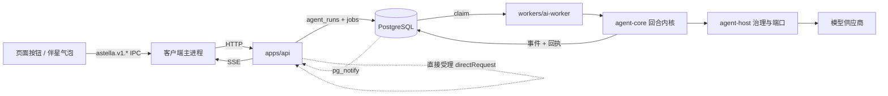
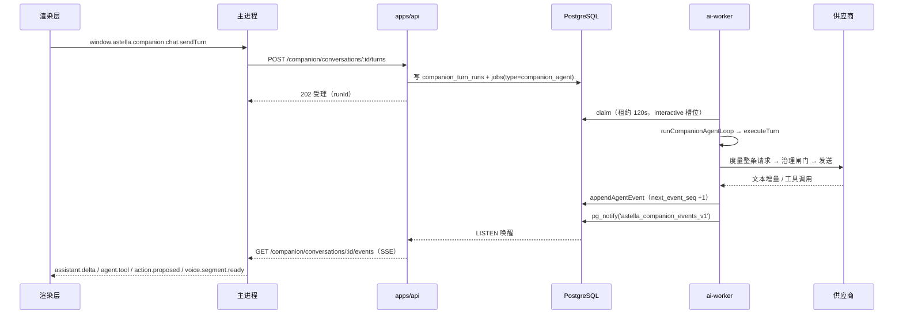
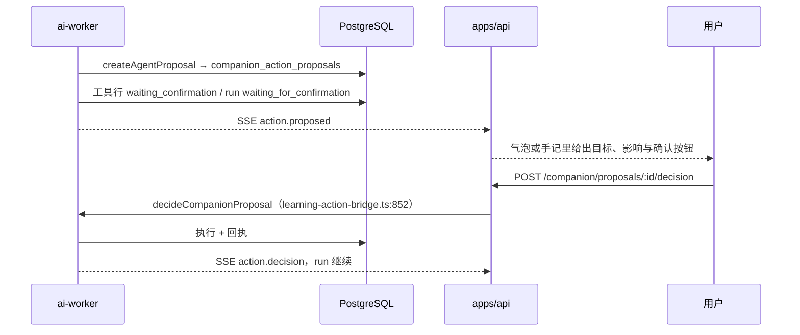

# 统一 Agent 运行时（技术）

中文 · [English](../en/agent-runtime.md)

这篇讲什么：这个项目里**唯一的一套 Agent 执行机制**——回合怎么被驱动、能力与工具从哪里来、上下文怎么被度量与压缩、跨进程怎么提交与恢复、状态词表有哪些、以及哪些是今天真跑着的、哪些还只是后端。伴星面向用户的那一面（四个相处处、成长闭环、记忆与日记的产品含义）在 [伴星体验（产品设计）](./companion-experience.md)，本篇只写它的执行体。模型供应商与作业队列本身在 [模型与 Worker 链路](./ai-and-companion.md)。

除另有说明，路径相对仓库根。

- [一句话模型](#一句话模型)
- [一次回合的完整路径](#一次回合的完整路径)
- [回合内核](#回合内核)
- [能力目录与工具面](#能力目录与工具面)
- [权限档位与提案往返](#权限档位与提案往返)
- [上下文治理](#上下文治理)
- [持久化与主机端口](#持久化与主机端口)
- [状态词表](#状态词表)
- [治理闸门](#治理闸门)
- [值得进图的数字](#值得进图的数字)
- [已接通 vs 只有后端](#已接通-vs-只有后端)
- [排障入口](#排障入口)

## 一句话模型

**一个内核，两个入口，一套治理。**

- 内核在 `packages/agent-core`：只有回合边界、步骤驱动、上下文装配与预算判据，不 import provider、不 import 数据库、不 import UI。
- 两个入口：**声明式请求**（页面上的按钮已经选好能力，不需要规划模型）与**目标推进**（伴星或长目标自己按步骤组合能力）。两者都落进同一张 `agent_runs` 与同一套回执。
- 治理在 `packages/agent-host`：同意、外发范围、PII、审计、租约与幂等，全在真正发请求之前判完；判不过就是不可重试错误，不降级、不静默。



## 一次回合的完整路径

伴星说话的一轮，从按键到落纸，走的是这条链：



要点：

- **受理与执行分离**。API 只负责建 run、排队、返回 `runId`；模型调用绝不发生在请求线程里（`workers/ai-worker/src/handlers/companion-agent-runtime.ts:186`）。
- **事件有单一序号所有者**。`appendAgentEvent`（`workers/ai-worker/src/handlers/companion-agent-events.ts:211-255`）先抬 `companion_conversations.next_event_seq`，再插 `companion_stream_events`，因此客户端可以按序号补缺口，重复事件天然幂等。
- **推送有轮询兜底**。SSE 断线后按 2500ms→30000ms 退避轮询 `run-nodes`（`apps/api/src/modules/companion-conversation/routes.ts:435`）。
- **写回有租约围栏**。每一步的提交都在 `ports.transaction` 里对 run 行 `SELECT … FOR UPDATE`，并核对 `astella_agent_run_authorized` 围栏；围栏过期直接 `advance_obsolete`（409），旧 worker 不可能覆盖新 worker（`packages/agent-host/src/advance-store.ts:27-39`）。

## 回合内核

`packages/agent-core/src/runtime/`：

| 函数 | 位置 | 负责什么 | 不负责什么 |
| --- | --- | --- | --- |
| `executeTurn` | `execute-turn.ts:4-18` | 有界循环：`step 1..maxSteps`、`signal.throwIfAborted()`、`now() >= deadlineAt → budgetError()`，直到 `advance()` 返回 `{kind:"settled"}` | 不碰模型、不碰数据库 |
| `executeAgentStep` | `execute-step.ts:16-29` | 一个可检查点步骤：`context.prepare()` → `state.prepare()` → `model.execute` → **先 `state.saveResponse` 再执行任何能力** → 逐个 `capabilities.invoke` → `state.apply` | 不决定终止条件 |
| `runAgentModelStep` | `model-step.ts:19-47` | 单次模型边界，套在 `runAiTask` 内核上，预算 `{maxModelCalls:1, maxAutoRetries:0}`，完成判据 `structured_parsed`；把 `lease_lost` 或 `cancelled` 映射成 inactive，`timeout` 或 `budget_exhausted` 映射成 timeout | 不重试（重试归外层作业） |
| `resolveAgentTurnInterpretation` | `attention.ts:6-37` | 把话绑定到主机对象上；未知序号、引用不到的目标、不可用能力各记一条歧义（上限 6）；纯闲聊强制 `toolUse:"none"` | 不猜——猜不出就标 `uncertain` |
| `validateAgentGoalDelivery` | `goal-delivery.ts:36` | 判 `completed`：每个操作 `succeeded` 且有结果、每条要求被满足、非纯文本要求必须引用真实成功的 `callId` | 不接受"模型说做完了" |
| `classifyAgentRunFailure` | `failure-learning.ts:71` | 失败归类：`transient_provider / outcome_unknown / cancelled / incomplete / not_applicable / unclassified`，并给出这条失败**能不能**作为经验证据（`contributesRule`） | 不把取消当经验 |

`state.prepare()` 会返回缓存的 `response`——**同一 checkpoint 重放不再花一次钱**；`saveResponse` 在任何能力提交之前落库，所以进程中途死掉，重放时模型那段直接复用（`execute-step.ts:20`）。

终止由宿主给：`workers/ai-worker/src/agent/advance.ts:60-112` 用 `maxSteps:3`、每步 `maxCalls:4`；`packages/agent-host/src/advance-store.ts:105-114` 按交付结果写 `completed|paused|failed`，还有回执未回就 `waiting`，连续两轮助手都不调工具判 `failed`。

## 能力目录与工具面

**唯一索引**：`packages/shared/src/agent-capability-catalog.ts:15-30`，把 8 个 manifest 组（共 56 条声明）映射成 `{executor, surfaces, requires}`，重名直接抛错。能力的模型可见参数由 zod 反推 JSON Schema（`agent-capability-definition.ts:13`），所以"给模型看的形状"和"运行时校验的形状"不可能漂移。

| 面 | 数量 | 定义位置 | 用途 |
| --- | --- | --- | --- |
| 对话（伴星） | 41 条伴星工具，投影后共 48 个 | `packages/shared/src/companion-capability-manifest.ts:26-243` | 读页面、读材料、导航、查状态、学习任务、记忆读写、人格自改、提醒、日记、图与计算 |
| 目标（长任务） | 另 15 条声明，投影后目标面 10 个 | `packages/shared/src/agent-capability-manifests.ts:19-87` | 笔记四件套、制卡、读方法、计算、读公开文档、`agent_deliver_goal` |

对话面按用途分组（名字就是模型看到的名字）：

- **读上下文**：`companion_read_context`、`companion_read_current_page`、`companion_read_history`（带 `fromSeq`，压缩后取回原文靠它）。
- **读材料**：`companion_search_notes`、`companion_read_note`、`companion_read_source`、`companion_read_image`、`companion_show_image`。分页读，读不完时诚实返回 `truncated`。
- **导航**：`companion_open_note`、`companion_open_page`、`companion_open_card`、`companion_focus_graph`——可跳目标受 `components/hud/hud-pages.ts` 的 `HUD_PAGE_DESTINATIONS` 约束（见产品设计篇）。
- **系统读**：`companion_get_learning_stats`、`companion_list_task_queue`、`companion_list_due_reviews`、`companion_list_recent_activity`、`companion_list_reminders`。
- **学习动作**：`companion_start_learning`、`companion_resume_learning`、`companion_pause_learning`、`companion_request_hint`、`companion_switch_task_variant`、`companion_defer_review`。
- **记忆动作**：`companion_save_memory`、`companion_read_memory`、`companion_recall_memory`、`companion_recall_past_conversation`、`companion_move_memory`、`companion_forget_memory`、`companion_revise_memory`、`companion_remember_judgment`。
- **她自己**：`companion_revise_own_style`、`companion_revise_own_tags`、`companion_set_boundary`、`companion_set_activeness`、`companion_pause_learning_suggestions`。
- **其他**：`companion_schedule_reminder`、`companion_cancel_reminder`、`companion_read_playbook`、`companion_read_diary`、`companion_render_diagram`、`agent_calculate`、`agent_read_public_document`。

执行落在 `workers/ai-worker/src/agent/companion-tool-execution.ts`（例如 `agent_calculate:117`、`agent_read_public_document:111`、`companion_read_image:540`，识图路由在 `:614`）。

## 权限档位与提案往返

判据只有一处：`canUseCompanionAgentTool`（`packages/shared/src/contracts/companion-agent-contracts.ts:236-264`）。

| 档位（设置里可见） | 读 | 可逆低影响写 | 其他写 | 强制提案的 6 个工具 |
| --- | --- | --- | --- | --- |
| 只读 `read_only` | 允许 | 拦 | 拦 | 提案，等确认 |
| 引导 `guided`（默认） | 允许 | 直接做 | 先确认 | 提案，等确认 |
| 完全 `full` | 允许 | 直接做 | 直接做 | **仍然**提案，等确认 |

- `irreversible` 风险级永远确认——但今天没有任何 manifest 声明它，枚举先于用法存在（`companion-agent-contracts.ts:57-62`）。
- 强制提案名单：`COMPANION_PROPOSAL_EXECUTED_TOOLS`（`:227`，6 个名字）。代码注释明确写着完全档的"服务端自动确认"这条**还欠着**。
- 表面过滤在 `packages/shared/src/companion-agent-registry.ts:15-21`：`read_only` 剥掉非读工具；未开识图时剥掉视觉相关工具。

提案往返：



路由在 `apps/api/src/modules/companion-conversation/routes.ts`：`/companion/menu-proposals`（`:89`）、`/companion/tool-proposals`（`:124`）、`GET /companion/proposals/:id`（`:158`）、`POST /companion/proposals/:id/decision`（`:181`）。

## 上下文治理

**装配**（`packages/agent-core/src/context/assemble-context.ts`）：按 plan 顺序解析来源 → `composeAgentContext`（`:58`）先做作用域与权威校验（不合法直接抛，`:68-72`），再按 `required → priority → index` 决定**准入**（`:77-79`），而**展示**顺序仍按 plan（`:101`）。关键取舍：**从不切正文**——超预算的可选来源标 `budget_omitted`，必需来源超预算抛 `required_context_overflow`（`:86,92`）。装配结果落成回执（`summarizeContextAssemblyReceipt`，`:202`）。

目标推进的 plan 顺序（`workers/ai-worker/src/agent/goal-context.ts:67-76`）：`identity`(必需) → `persona` → `preferences` → `execution`(必需) → `long_goal`(必需, 12000) → `methods` → `materials`(必需) → `receipts`(必需, 27000) → `evidence`(必需)，总帽 64000 字符。

**度量**（`context/measure-request.ts:25-31`）：量的是**整条将要发出去(request)**，不是消息正文——工具定义、系统段、图片、推理句柄都算。`CONTEXT_MEASUREMENT_VERSION:"v1"`，图片下限 `IMAGE_TOKEN_FLOOR:1500`，推理句柄下限 `REASONING_HANDLE_TOKEN_FLOOR:64`；优先用 provider 返回的真实 usage 做锚（`:68-90`），量不动的种类记进 `unmeasured` 而不是假装为 0。

**预算权威**（`context/context-budget.ts:24-46,161-173`）：

```
B_hard = max(0, min(C − O, I) − M)      C=窗口 O=输出预留 I=输入上限 M=2048 开销
T(触发) = floor(B_hard × 0.80)
G(目标) = floor(B_hard × 0.60)
无档案时 C 兜底 128000，O 保守取 16384
```

`evaluateContextPressure`（`:198-251`）的判定顺序本身就是策略：**必需内容溢出 → 预算内直接发 → 超硬上限拒绝 → 压缩不可用则带着原因发（`compaction_budget_spent` / `over_trigger_line`） → 压缩**。判据落库到 `companion_turn_runs.context_pressure` 与 `context_assembly_receipt`。

**压缩**：冷却 `MAX_COMPACTION_ATTEMPTS 3` / `COMPACTION_COOLDOWN_MS 60000` / `MAX_NO_PROGRESS_ATTEMPTS 2`（`context/compaction-cooldown.ts:27-33`），状态按 `(conversation, sourceHash, provider, model)` 持久化在 `agent_context_compaction_state`，`attempts` 由 SQL 自增（`packages/agent-host/src/compaction-state.ts:105`）。

伴星的压缩与通用压缩**不是同一件事**：

- 通用：`withBoundedContextCompaction`（`workers/ai-worker/src/handlers/companion-compaction.ts:223`）+ `boundedStepSender`（`:279`），一次请求最多压一次。
- 伴星：**无损覆盖折叠** `foldReplayUnderSummaryCoverage`（`:95-155`）——只折"被摘要完整覆盖到的整条消息"（`seq ≤ coverage.throughSeq` 且摘要带 `sourceSha256`），当前请求永远保留，回执记 `remainingFromSeq` / `uncoveredBeforeSeq`。被折掉的原文模型仍能通过 `companion_read_history{fromSeq}` 取回，所以压缩不造成失忆。
- 交接快照是另一条链：`companion_context_handoff_snapshots`（`packages/shared/src/db-schema/companion-conversations.ts:206`），由 `handlers/companion-context-handoff.ts:157` 生成，回放窗口 `REPLAY_WINDOW_MESSAGES 20`。

## 持久化与主机端口

| 端口 | 文件 | 表 |
| --- | --- | --- |
| run 增删改 / 幂等 / 配额 | `packages/agent-host/src/store.ts:156-321` | `agent_runs`、`agent_operations`、`jobs` |
| 推进租约与步骤重放 | `advance-store.ts:22-140` | `agent_run_steps`、`agent_run_events` |
| 回执归约 | `packages/agent-core/src/runtime/run-state.ts:65` | `agent_operations` |
| 历史与修订 | `history.ts`、`store.ts:94-126` | `agent_run_revisions` |
| 长期目标 | `long-goals.ts:15-65` | `assistant_memory_items`（`kind='goal' AND user_confirmed`） |
| 方法与 playbook | `methods.ts:107-459` | `companion_procedural_playbooks`、`companion_method_revisions`、`companion_method_uses` |
| 操作与产物回执 | `operation-receipt.ts:166`、`artifact-receipt.ts:60` | `note_overviews`、`note_learning_artifacts`、`note_expansions`、`card_generation_runs_v2` |
| 上下文来源是否过期 | `context-sources.ts:7-24`（`FOR SHARE` 比对修订） | `assistant_memory_items` |
| 压缩冷却 | `compaction-state.ts:50-133` | `agent_context_compaction_state` |

幂等键是硬约定：作业侧 `agent-start:` / `agent-revise:` / `agent-resume:` / `agent-handoff:`（`store.ts:127-131`），步骤侧 `agent-step:{runId}:{revision}:{stepId}`（`workers/ai-worker/src/agent/advance.ts:88`），`applied` 标志保证 `applyStep` 只生效一次（`advance-store.ts:86-88`）。

## 状态词表

文档与 UI 只能用这些词，不要另造：

- **run**：`queued → running → waiting | paused → completed | failed | cancelled`（`packages/shared/src/contracts/agent-contracts.ts:3`）。`waiting` = 回执未回或被声明式请求受理；`paused` = 交付要求补输入、pause 控制或长目标变更（`advance.ts:115-118`）。
- **operation**：`accepted → running → succeeded | failed | cancelled | outcome_unknown`（`agent-contracts.ts:6`）。终态不可覆盖；**`outcome_unknown` 只能被 `authoritative` 事件改写**（`run-state.ts:98-108`）。拒绝原因：`scope_mismatch / identity_mismatch / revision_mismatch / stale_event / terminal / unverified`。
- **伴星回合 run**：`accepted / running / waiting_for_confirmation / succeeded / cancel_requested / cancelled / failed / superseded`，阶段 `accepted / thinking / streaming / acting / awaiting_confirmation`（`companion-conversation-contracts.ts:247,268`）。
- **步骤**：kind `model / tool / confirmation / final / error`，status `running / succeeded / waiting / failed / cancelled`。
- **工具**：`requested / executing / waiting_confirmation / succeeded / outcome_unknown / failed / blocked / expired / not_executed / unavailable`。
- **方法与经验**：state `candidate / active / disabled / disputed`，认识状态 `tentative / supported / disputed`，可用性 `available / pending / disabled / source_changed / capability_changed / previous_version`，使用阶段 `offered / read / adopted`，反馈 `helpful / unhelpful`，动作 `confirm / disable / restore`。
- **控制**：`cancel / pause / resume`。

## 治理闸门

发请求前一次性判完，入口 `prepareGovernedAIPayload`（`packages/agent-host/src/ai-governance-policy.ts:254-265`）：

1. 同意：`!consentOk && provider !== "mock"` → `AIConsentRequiredError`（403，`AI_CONSENT_REQUIRED_CODE`）。同意读不到就当没签——必须在工作区事务里读，否则 RLS 静默返回 0 行。
2. 外发范围：`sendToExternal=false` 拒；带图且 `sendImageContent=false` 拒（默认 `sendToExternal:false`、`sendImageContent:true`，`:21-30`）。
3. PII 规则化清洗（`:127`，模式 `:103-115`）。
4. 数据类别由**调用点声明**：目标推进传 `["note_content","user_answer"]`（`advance.ts:56`），图片部分自动补 `image_content`；词表就是 `ai_audit_log.data_categories`。
5. 审计只由 `logAICall` 写（`workers/ai-worker/src/lib/governance.ts:530,831`），只记 provider/model/operation/tokens/duration/status/userId/jobId，**永不记正文**。

不可重试的判定分两层：任务内核只重试 `transport / timeout / output_shape`（`packages/shared/src/ai-task-kernel.ts:68`）；作业层 `isNonRetryableError`（`workers/ai-worker/src/lib/non-retryable-errors.ts:194`，模式表 `:29-68`）把计费耗尽、`invalid api key`、`access denied`、`not configured`、`consent not signed` 与上下文相关的 401/403 直接判死。只读权限在排队前就拦：`requireAgentAuthority`（`store.ts:140-146`）。

## 值得进图的数字

| 组 | 值 | 出处 |
| --- | --- | --- |
| 伴星循环 | 步 `AGENT_LOOP_MAX_STEPS=4`（宽限 2），钳到 `COMPANION_AGENT_MAX_STEPS=8`；每步 4 次工具、全程 12 次工具、12 次模型；run 截止 120000ms；单工具 10000ms | `companion-step-plan.ts:165,174`（4 步 + 宽限 2）、`companion-agent-contracts.ts:15-20`（钳位与 12/12/120000）、`companion-agent-runtime.ts:286-296`（单工具 10000） |
| 目标推进 | `maxSteps:3`、`maxCalls:4`、模型超时 `min(60000, deadline−now)`、`max_model_calls` 默认 16（1–32） | `advance.ts:61,84,96`、迁移 `0368` |
| 队列 | 租约 120000ms、`MAX_ATTEMPTS=3`、并发 `QUEUE_CONCURRENCY`（留 1 个 interactive 槽位）、轮询 500→5000ms | `workers/ai-worker/src/queue.ts:12,20,21,120` |
| 超时阶梯 | handler 上限 = 租约−10000；循环截止 = abort−15000；单次供应商 75000 | `lib/handler-timeout-config.ts:18-19,70,155-172` |
| 配额 | 同时活跃 run ≤5（advisory xact 锁）；每工作区待处理作业 ≤50 | `store.ts:147-155`、`job-queue-limits.ts:17` |
| 上下文 | 0.80 / 0.60 / 2048 / 128000 / 16384；图片 1500；压缩 3 次 / 60000ms / 2 次无进展 | 上一节 |
| SSE 与限流 | 单批 500 事件、每会话 3 路、每用户 10 路、轮询 2500→30000ms；`createTurn` 12/分与 120/时、决定 20/分、读 120/分 | `companion-events.ts:27-35`、`companion-rate-limit.ts:94-116` |

## 已接通 vs 只有后端

**今天真跑着的**：14 条 `astella.v1.agent.*` IPC 通道（`packages/shared/src/contracts/desktop-ipc-contracts.ts:484-497` → `apps/desktop-client/src/preload/index.ts:197-212` → `apps/desktop-client/src/main/desktop-ipc-agent.ts`），被长期目标页、方法页与 `use-agent-goals.ts:31-113` 使用；声明式请求由 4 个领域服务发起（`note-overviews/service.ts:115`、`note-learning-artifacts/service.ts:117`、`note-expansions/service.ts:162`、`card-generation-v2/generation-run-service.ts:51`）；目标执行器 `note / card / method / basic / external / delivery` 绑在 `advance.ts:35-38`；诊断路由 `GET /companion/runs`、`/doctor`、`/turn`、`/issue-bundle` 与取消都已注册且 IPC 可达。

**只有后端或半截**：`irreversible` 风险级无人声明；完全档的服务端自动确认未实现（6 个工具仍要人点）；`not_executed` / `unavailable` 回给模型后在 worker 侧映射，不是一等台账状态；`capability-bundle.ts:22-45` 只剩名字表，不参与门控；`agent_deliver_goal` 除目标 run 外没有别的 UI 入口。

## 排障入口

| 症状 | 先看 |
| --- | --- |
| 气泡转圈不出字 | `GET /companion/runs` 找 run → `/companion/runs/:id/doctor` → `/turn` 看阶段卡在哪 |
| 工具调了但没结果 | `agent_operations` 是否 `outcome_unknown`；恢复靠 `astella_enqueue_agent_recovery()`（30s 节流，`advance.ts:127-131`） |
| 上下文反复压缩 | `agent_context_compaction_state` 的 attempts 与冷却；`context_pressure` 落库的判据 |
| 403 同意 | `user_ai_settings` 是否签署、是否在同意状态下调用了真 provider |
| 事件不推 | `pg_notify` 通道 `astella_companion_events_v1` 的 LISTEN 连接、SSE 槽位是否被 10/用户 限制挡住 |
| 一键取证 | `GET /companion/runs/:id/issue-bundle`（`run-diagnostics-routes.ts:145`）；只读体检脚本 `scripts/companion-provider-health.mjs`（必须在 worker 容器里跑） |

相关分册：[伴星体验（产品设计）](./companion-experience.md) · [模型与 Worker 链路](./ai-and-companion.md) · [系统架构](./architecture.md) · [API 与数据](./api-and-data.md) · [桌面客户端](./desktop-client.md) · [常见问题与排障](./faq-and-troubleshooting.md)
