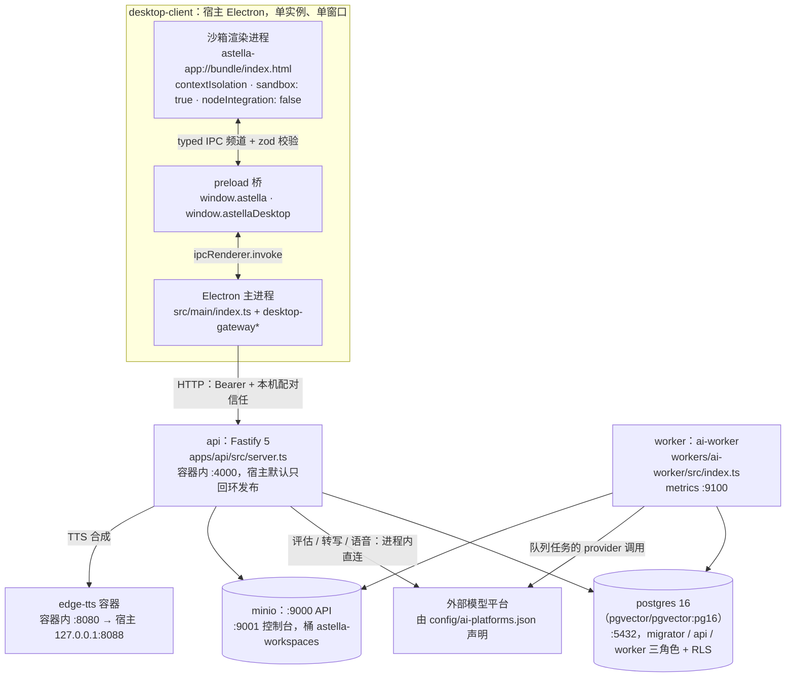
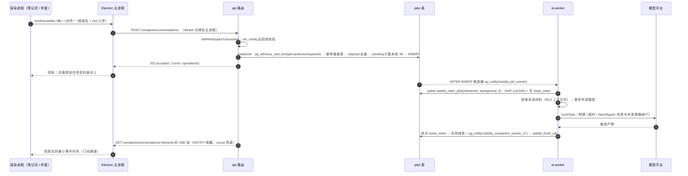

# 拾星笔记系统架构

中文 · [English](../en/architecture.md)

这篇讲什么：这套代码今天由哪几个进程组成、一次请求从桌面窗口走到数据库再回到屏幕要过哪几跳、数据表按什么职责分组，以及每条"边界"的强制力实际来自哪个文件。读完你应该能说出进程名、跳数和表组名，而不是只剩"前后端分离"这个印象。所有名称、端口与默认值都按当前代码核对过；命令与安装步骤在 [development.md](development.md)，本页只在需要说明结构时点到。

- [运行时拓扑](#运行时拓扑)
- [一次 AI 回合的完整链路](#一次-ai-回合的完整链路)
- [进程清单](#进程清单)
- [包与依赖方向](#包与依赖方向)
- [表分组](#表分组)
- [数据流契约](#数据流契约)
- [AI 的工作到底跑在哪一侧](#ai-的工作到底跑在哪一侧)
- [桌面客户端的边界](#桌面客户端的边界)
- [认证与授权拓扑](#认证与授权拓扑)
- [统一版本](#统一版本)
- [架构决策与代价](#架构决策与代价)
- [想改 X，先看哪里](#想改-x先看哪里)

## 运行时拓扑

开发栈是 `docker-compose.dev.yml`（Compose 项目名 `astella-dev`），正式部署使用 `docker-compose.yml` 加 `docker-compose.deploy.yml`，Alpha 环境是 `docker-compose.alpha.yml`。下图是开发栈加桌面客户端的形状；`prometheus` / `alertmanager` **只存在于 alpha 文件**，开发栈里没有。

三条容易被省略、但会改变结论的边：

- 渲染进程**不发业务 HTTP**。它对 API 的一切访问都要经过 `window.astella` → IPC → 主进程网关 → HTTP。渲染层里确实有 `fetch`，但只取同源的打包资源（Live2D 清单、字体、音频），见 `components/companion/WindowLive2DDriver.ts`、`media/learning-room-manifest.ts`。
- API 与 Worker 的作业、编辑派发和回执通过 PostgreSQL 交换：api 写 `jobs`，worker 用 `SECURITY DEFINER` 函数领取与收尾，事件通过 `pg_notify` 频道传播。
- 自动更新**不经过 apps/api**。客户端直连 GitHub Releases（`apps/desktop-client/electron-builder.yml` 的 `publish`，以及 `src/main/desktop-update.ts`），所以自家 API 挂了不影响更新。

## 一次 AI 回合的完整链路

下图以伴星对话回合（`companion_agent`）为例；学习运行、制卡与通知也有自己的 SSE。另外两条回传路径在图后用文字说清。

三条路径的差别，别在脑子里合成一条：

| 触发方 | 入队实现 | 结果怎么回到屏幕 |
| --- | --- | --- |
| 伴星对话、笔记批注、来源解析、记忆与念头任务 | `apps/api/src/modules/job/service.ts` 的 `createJob()` | 伴星走 SSE；批注与来源走任务/操作状态轮询 |
| 笔记页发起的速看、往外学、动态页面，以及制卡 | `packages/agent-host/src/note-operation.ts` 与 `store.ts:enqueueAdvance` 的直接 `INSERT INTO jobs` | 渲染层轮询 operation / job 状态，例如 `renderer/src/components/surfaces/notebook/use-notebook-overview.ts:142` |
| LearningRun 的作答判定与 Commit | 不入 `jobs`：api 进程自己轮 `learning_run_processing_outbox` | 事件写入后由 `/learning-runs/:runId/events` 推给客户端 |

入队两条路都**取同一把锁、同一个上限**：`note-operation.ts:37-39` 与 `job/service.ts:151-155` 都是 `pg_advisory_xact_lock(hashtextextended('job-quota:<workspaceId>', 0))` 再数 pending。差别只是 agent-host 把 50 写成了字面量，而 `createJob` 读 `MAX_PENDING_JOBS_PER_WORKSPACE`（`packages/shared/src/job-queue-limits.ts:17`）。

这张图只到"进程之间怎么走"为止。回合内部怎么被驱动——内核步骤、能力与工具面、权限档位、上下文度量与压缩、状态词表——是另一套机制，单独写在 [统一 Agent 运行时（技术）](./agent-runtime.md)；伴星面向用户的那一面在 [伴星体验（产品设计）](./companion-experience.md)。

## 进程清单

| 进程 | 谁启动它 | 入口文件 | 端口 | 健康端点 |
| --- | --- | --- | --- | --- |
| api | `make up` → compose `api` 服务，`target: dev` | `apps/api/src/server.ts`（`npm run dev` = `tsx watch src/server.ts`） | 容器内 4000；宿主 `${API_PORT:-4000}`，绑定 `${API_BIND_ADDRESS:-127.0.0.1}` | `/health`、`/ready`、`/metrics` |
| worker | `make up` → compose `worker` 服务 | `workers/ai-worker/src/index.ts`（`tsx watch src/index.ts`） | metrics `${WORKER_METRICS_PORT:-9100}`，绑定 127.0.0.1 | `/metrics`（compose 健康检查打这个）、`/ready`（代码里有，`lib/metrics.ts:364`） |
| postgres | compose `postgres`，镜像 `pgvector/pgvector:pg16` | 官方镜像 + `infra/postgres/init.sql` | `${POSTGRES_PORT:-5432}`，绑定 127.0.0.1 | `pg_isready -U astella -d astella` |
| minio | compose `minio`，profile `storage`；开发 `make up` 默认带上该 profile | `minio/minio:RELEASE.2024-12-18T13-15-44Z` | `${MINIO_PORT:-9000}`、`${MINIO_CONSOLE_PORT:-9001}` | `/minio/health/live` |
| edge-tts | compose `edge-tts` | `docker/edge-tts/server.py`（`python:3.12-slim`，`user: nobody`） | 容器 8080 → 宿主 `127.0.0.1:${EDGE_TTS_PORT:-8088}` | `/health` |
| Electron 主进程 | `make desktop-client-dev` → `npm run dev` = `electron-vite dev --remoteDebuggingPort 9222` | `apps/desktop-client/src/main/index.ts` | 无监听端口；对外只作为 HTTP 客户端 | 无 HTTP；窗口内以 `runtime.getHealth` IPC 呈现连接状态 |
| Electron 渲染进程 | 主进程创建的**唯一** `BrowserWindow` | 开发：Vite dev server；打包：`astella-app://bundle/index.html` | 由 dev server 提供，端口由 electron-vite 注入 `ELECTRON_RENDERER_URL` | 同上 |
| preload 桥 | 与渲染进程同生命周期 | `apps/desktop-client/src/preload/index.ts` | — | — |
| prometheus / alertmanager | `make alpha-up`（`scripts/alpha-env-setup.sh` + `docker-compose.alpha.yml`） | `prom/prometheus:v3.0.1`、`prom/alertmanager:v0.28.1` | 9090 / 9093 | 两者的 `/-/healthy` |

一次性容器（`role-bootstrap`、`migrate`、`role-grants`、`minio-init`、`seed-demo`）不在此表：它们跑完就退出，语义见 [development.md](development.md#一次性容器的约定)。

## 包与依赖方向

`packages/` 下**只有五个包**：`shared`、`agent-core`、`agent-host`、`ai-quality`、`card-generation`。**没有 `packages/db`**——旧 README 写过它，那份树已经改掉了，别再把它当存在。数据库访问的真实位置是 `apps/api/src/db/` 与 `workers/ai-worker/src/db.ts`，表的唯一定义在 `packages/shared/src/db-schema/`（`make verify` 里的 `.github/scripts/verify-schema-mirror.mjs` 就是钉住这一条：不许有应用侧镜像）。

| 包 | 职责 | 谁 import 它 | 它不该 import 什么 |
| --- | --- | --- | --- |
| `@astella/shared`（`packages/shared`） | zod 契约、枚举、138 张表的 drizzle schema、跨进程共用的安全工具（`safe-error`、`job-queue-limits`） | api、worker、desktop-client、其余四个包 | `src/index.ts` 里不许出现 `node:` 依赖——渲染进程加载它。服务端专用模块（`workspace-transaction.ts`、`content-hash`、`task-router`、`card-generation-v2-hashing`）只能走子路径 import，这个约束由 `verify-shared-exports.mjs` 与 `index.ts` 的逐条注释守着 |
| `@astella/agent-core`（`packages/agent-core`） | 上下文计量与预算、压缩冷却、运行状态、能力描述 | api、worker、agent-host | 实测 src 下**没有** `node:` 与 `drizzle-orm` import，保持纯 TS；不要往里加持久化 |
| `@astella/agent-host`（`packages/agent-host`） | `agent_runs` / `agent_operations` 的读写、治理策略、方法与回执登记 | api、worker | 不发 HTTP、不碰模型传输；它带 drizzle，所以不能进 `packages/shared/src/index.ts`，也不能被渲染进程 import |
| `@astella/ai-quality`（`packages/ai-quality`） | 离线打分、数据集与 `pr-gate`（固定桩，不走付费网络） | worker（`make verify` 里唯一跑 `npm run pr-gate` 的包） | 不进渲染层，也不被 api import |
| `@astella/card-generation`（`packages/card-generation`） | 制卡的创建、证据封存、事务与事件形状 | api、worker、agent-host | 只有 `typecheck` 脚本，**没有测试**；`make verify` 目前也没把它接进去（verify 覆盖 shared / agent-core / agent-host / ai-quality / api / desktop-client / ai-worker 七个） |

`shared` 的 `exports` 显式登记模块。这条不是风格：宿主 `tsc --noEmit` 能顺着 workspace 软链找到磁盘上的文件，而 Node 运行时读的是 `exports`——写了"文件存在但没登记"的深路径 import，类型检查是绿的，运行时才 `ERR_PACKAGE_PATH_NOT_EXPORTED`。

## 表分组

数据库 schema 在 `packages/shared/src/db-schema/`；完整迁移顺序以 `apps/api/src/db/migrations/meta/_journal.json` 为准。部分表、函数与约束只在 SQL 中声明，不能仅由 Drizzle 文件数推断数据库全貌。下表按职责定位模块，数量不作为契约。

| 组 | schema 模块 | 这一组装的是什么 |
| --- | --- | --- |
| 身份、会话与 AI 同意 | `identity.ts`、`session.ts`、`ai.ts` | 用户、工作区、成员与邀请、`sessions`、登录限流计数、`user_ai_settings`、`ai_artifacts` |
| 来源与笔记 | `note.ts`、`evidence.ts`、`note-annotations.ts`、`note-expansions.ts`、`note-learning-artifacts.ts`、`note-learning-reflections.ts`、`note-learning-rounds.ts`、`note-overviews.ts`、`note-recalls.ts` | 来源与解析产物、笔记与不可变版本、出处对齐，以及速看 / 批注 / 拓展 / 动态产物 / 轮次 / 回顾这些按需能力各自的任务与产物表 |
| 后台队列 | `job.ts` | 单张 `jobs`：`type` / `status` / `attempts` / `payload` / `lease_token` / `lease_renewed_at` / `priority` / `resource_class` / `idempotency_key` |
| 学习运行与复习 | `learning-runs.ts`、`learning-metrics.ts`、`assessment-disputes.ts`、`validation-v2.ts`、`personal-objective-bindings.ts`、`personal-relation-decisions.ts` | LearningRun 与其私有契约、任务与变体、事件与 outbox、复习排期、判定争议与更正、目标绑定 |
| 制卡 | `card-generation-v2.ts` | 最大的一组：制卡运行、候选、审核与曝光账本、质量与证据封存、激活回执 |
| 伴星 | `companion.ts`、`companion-conversations.ts`、`companion-memory.ts`、`assistant-memory.ts`、`assistant-deliveries.ts`、`companion-bridge.ts`、`companion-journey.ts`、`companion-home.ts`、`companion-sandbox.ts` | 伴星本体与账号状态、会话与回合事件、记忆条目与修订、投递与提醒、页面上下文桥、旅程、房间投影、隔离产物 |
| 检索与理解投影 | `search.ts`、`understanding-projection.ts` | 全文搜索写入表，与理解关系图的读侧投影 |

三件读这张表时容易得出错误结论的事：

- 表数不等于权限面。**谁能读某张表由 `infra/postgres/roles.sql` 决定，不由 drizzle 声明决定**——迁移里逐表的 `GRANT` 会被后面那次 `REVOKE ALL` 抹掉，漏在 `roles.sql` 里重写的授权是静默失效，不是报错。
- 制卡那 33 张表绝大多数以 `_v2` 结尾（少数不带后缀，如 `card_content_capability_state`），但**V3 用的就是这批表**（`card_generation_runs_v2` / `card_generation_plans_v2` / `card_generation_candidates_v2`）。V3 的实现在 `workers/ai-worker/src/card-generation-v3/`，那里没有 schema 声明——按文件名找"V3 的表"会一无所获。
- **表不止存在于 drizzle 声明里。** `companion_memory_organization_state` 由迁移 `0350_companion_memory_organization_lease.sql` 建表，`packages/shared/src/db-schema/` 里没有它；而消费它的 `companion_memory_organize` 本身也**只有 worker handler、没有 `JobType` 枚举成员**。它另一个读数来源 `assistant_memory_items` 在 `assistant-memory.ts`——同属"伴星"组，却换了个表名前缀。找一张表时，schema 目录和迁移目录都要看。

## 数据流契约

**请求 id 与跨进程 trace。** `server.ts:116` 用 `crypto.randomUUID()` 生成 `genReqId`，`server.ts:143` 在 `onRequest` 钩子里把它放进 `AsyncLocalStorage`（`apps/api/src/lib/request-context.ts`）。`createJob` 经 `withTraceId()` 把它写成 `payload.traceId`，worker 在 `index.ts:167` 读回来打进自己的日志。选 ALS 而不是加参数，是因为 `createJob` 有七处以上调用点，逐个加参数必然漏。

**错误信封。** `apps/api/src/lib/error-envelope.ts` 统一的是**决策**（状态码、要不要脱敏 5xx、要不要平铺 `recoveryData`），不是线格式。文件头列着现存三种形状，其中 companion 那一种带 `version: 1` / `recoverable` / `requestId`，属于桌面契约，不能"统一"掉。

**游标分页。** `apps/api/src/lib/pagination-utils.ts`：`encodeCursor` 是 `base64(ISO 时间戳 + ":" + id)`（88-91 行），`decodeCursor` 形状不对就返回 `null` 而不是抛；`clampLimit` / `clampOffset` / `clampPagination` 负责夹取。`pagination.ts` 只多加一个带 Fastify 依赖的 `parseQuery`，校验失败抛 400——无依赖的那半被 worker 复用。

**工作区事务。** `packages/shared/src/workspace-transaction.ts` 是 API 与 worker 两侧合一的实现：UUID 规范化、对 `app.workspace_id` 与 `app.user_id` 执行 `pg_catalog.set_config(..., true)`、**然后回读比对** PostgreSQL 实际接受的值（147-172 行），不一致就抛 `database rejected … transaction context`。两个坑写死在这里：`userId === null` 必须传 NULL 而不是空串（空串命中 `user_id = ''::uuid` 的计划期常量转换直接抛错）；嵌套事务可以复用，但不许换租户或换 actor。

**外部调用闸门。** 同文件的 `assertOutsideWorkspaceTransaction` / `assertOutsideRegisteredTransactions`（199、249 行）判的是"当前异步作用域有没有活动事务"，不是"代码文本里有没有 `transaction`"——所以隐式嵌套一样被拒。注册制是因为 `public-json-http` 被两个进程共用，shared 不能反过来 import 任何一侧的 ALS 模块。

**RLS。** 迁移里 112 张表带 `FORCE ROW LEVEL SECURITY`。`astella_api` 与 `astella_worker` 都是 `NOBYPASSRLS`，只有 `astella_migrator` 带 `BYPASSRLS`（`infra/postgres/roles.sql:52/60/68`）。开发栈的 `DATABASE_URL_API` 也已经是受限角色（`docker-compose.dev.yml:17`），这条是刻意改的：以前 dev 用 superuser，漏设 `app.workspace_id` 的读点不报错，只静默返回 0 行。

**outbox 表。** 名字里带 outbox 的表共四张：`learning_run_processing_outbox`（api 进程消费）、`canonical_learning_event_outbox`、`practice_trail_event_outbox`（三张都在 `learning-runs.ts`）与 `card_generation_run_outbox_v2`（`card-generation-v2.ts`）。

**SSE 限流。** `apps/api/src/lib/sse-connection-limiter.ts`：默认每用户 5 条、进程总量 200（28、37 行），可用 `SSE_MAX_STREAMS_PER_USER` / `SSE_MAX_STREAMS_TOTAL` 覆盖；按 namespace 分桶，现役有 `run-events`、`card-gen-events`、`inbox` 等。计数是**单进程内存态**，多副本部署时真实上限是副本数 × 本上限。写入统一走 `safe-sse-write.ts` 的 `safeSseWrite`，写失败只返回 false，绝不上冒成 HTTP 500。

**LISTEN / NOTIFY 唤醒。** 频道一共这几条：`astella_job_events`（worker 主循环被叫醒，`workers/ai-worker/src/lib/job-notify.ts:9`）、`astella_companion_events_v1`（对话事件，驱动 SSE）、`astella_companion_inbox_v1`（投递箱）、`astella_companion_account_v1`。发送方包括 SQL 触发器与业务事务中的通知（`0115_job_insert_notify.sql`、`0271_job_ready_notify_on_retry.sql`、`0226_card_generation_outbox_notify.sql` 等），API／Worker 分别发布与消费相关通知。worker 的空闲轮询是 500ms 指数退避到 5000ms（`index.ts:103-104`），NOTIFY 到达会直接打断当前 sleep 并回到快档；LISTEN 建立失败只警告并退回纯轮询。

## AI 的工作到底跑在哪一侧

不是"全在 worker"。分工是按**这条链要不要被重试、排队和跨进程恢复**决定的：

在 worker 的：`jobs` 表全部 13 个 handler（`workers/ai-worker/src/index.ts:70-89` 的 `HANDLERS` 映射）——来源解析、伴星 Agent 回合与工具执行、记忆抽取/摘要/每日总结/嵌入重建/语义整理、主动念头、笔记速看/批注解释/拓展/动态页面，以及制卡 V3（`workers/ai-worker/src/card-generation-v3/handler.ts`）。

在 api 进程内的：`learning_run_processing_outbox` 的消费与 Assessment Critic 调用（`apps/api/src/modules/learning-runs/processing/run-processing-tick.ts`，在 `server.ts:523-551` 接线，10 秒一轮、每轮取 50 条、失败指数退避到 60 秒）；`learning-runs/planning/run-critic.ts` 与 `disputes/dispute-recheck.ts`；`note-learning-rounds/teaching/teaching-explain.ts`；语音转写 `learning-sessions/voice-providers/siliconflow-asr.ts`；TTS 引擎与 edge-tts 客户端（同目录的 `tts-engine.ts`、`edge-tts.ts`）；主动投递生成 `companion-conversation/delivery/proactive-generator.ts`。

> **说明：** 判据是"副作用要不要租约"。走 `jobs` 的调用方有 120 秒租约、`lease_token` 围栏与 reaper 兜底；api 进程内那一批靠 outbox 行的唯一 scope key 与命令状态检查做到幂等（见 `run-processing-tick.ts` 头部说明），没有租约这套东西。把后者一并搬进 worker 不会得到更强的保证，只会多一次跨进程往返。

`JobType` 枚举有 12 个成员（`packages/shared/src/enums.ts:60-80`），而 worker 的 `HANDLERS` 注册了 13 个键——`companion_memory_organize` 有 handler、没枚举。加作业类型时要同时改这两处和 `jobScheduling()` 的优先级表。

## 桌面客户端的边界

- `webPreferences`：`contextIsolation: true`、`sandbox: true`、`nodeIntegration: false`、`webSecurity: true`、`devTools: !app.isPackaged`（`src/main/index.ts:588-595`）。会话令牌与加密凭据只在主进程（`session-credential-store.ts`），渲染层拿到的是快照。
- 自定义协议：`astella-app` 经 `protocol.registerSchemesAsPrivileged`（69 行）注册，`protocol.handle`（171 行）实现，两个 host：`bundle`（应用本身）与产物 host（AI 生成的 HTML/SVG 走隔离 origin，`artifact-surface.ts`）。打包后支持流式 GET、HEAD 和单段 Range，这是本地视频与音频能放的原因。
- 导航闸：`setWindowOpenHandler` 一律 `deny`，`will-navigate` / `will-redirect` 与子 frame 导航都过 `isAllowedNavigation`（430-449 行）——开发模式放行 dev server origin，其余只允许 `astella-app://bundle` 且无用户名、无密码、无端口。被拦的次数计进 `isolationGateCounters`。
- CSP：`onHeadersReceived` 三路分流（399-424 行）——renderer 策略、artifact 策略（`default-src 'none'`）、其余一律 `rejectAllContentSecurityPolicy`。开发模式才附加 dev origin 的 `connect-src` 与 `'unsafe-inline'`。
- IPC 契约：频道名集中在 `DESKTOP_IPC_CHANNELS`（`packages/shared/src/contracts/desktop-ipc-contracts.ts`），主进程用 `installHandler(频道, 入参 schema, options, handler)`（`desktop-ipc.ts:627`）注册，按域拆到 `desktop-ipc-{rest,source,learning,auth,workspace,companion,agent,voice-asr}.ts`；渲染层用 `window.astella` 的嵌套方法名调用，两侧共享 `DESKTOP_IPC_CONTRACT_VERSION` 与 `ASTELLA_DOMAIN_SCHEMA_REVISION`。
- 单实例单窗口：`requestSingleInstanceLock`（645 行），第二个实例只聚焦已有窗口；`new BrowserWindow` 全仓只出现一次。旧的"透明置顶桌宠窗口"在代码里已不存在。

> **说明：`nativeCapabilities` 是个会骗人的投影。** `transportNativeCapabilities()`（`desktop-gateway-transport.ts:216`）把 `filePicker`、`notifications`、`live2d` 三项映射成 `null`，`null` 恒判 `unavailable`；设置页据此显示"未接入"（`capabilityChipLabel`，`settings-companion-status.tsx:45-56`）。另一半问题是它的 `registered` 集合来自 `Object.values(DESKTOP_IPC_CHANNELS)`——那是**静态频道名清单**，不是"本轮实际装了哪些 handler"。所以这条投影既说不出"通道名在清单里但没人注册"，也说不出相反的情形：`desktop-ipc-workspace.ts:611/651` 真的有 `showSaveDialog` / `showOpenDialog`，`filePicker` 却永远是未接入；Live2D 在屏幕上真实存在，但设置页的 Live2D 状态来自另一条运行时 `Live2dStatus`，而不是这个字段。改能力芯片之前先确认它读的是哪一个来源。

## 认证与授权拓扑

三条互不混用的身份。

**用户会话（HTTP）。** `apps/api/src/modules/identity/session-auth.ts`：Cookie `astella_session`（HttpOnly）+ Cookie `astella_csrf`（可读）配请求头 `x-csrf-token` 双提交；`SameSite=Lax`，`Secure` 由 `AUTH_COOKIE_SECURE` 决定，未设置时跟随 `NODE_ENV === "production"`。`extractAuthCredential`（36-44 行）**优先 Bearer**，其次才读会话 Cookie——桌面网关用 Bearer，浏览器直连用 Cookie。桌面端的配对是第四道闸：`POST /_astella/desktop/trust/v1/challenge`（`modules/desktop-trust/routes.ts:106`）用 `ASTELLA_DESKTOP_PAIRING_SECRET`（base64url，解码后 ≥32 字节）对 nonce、`serviceId`、IPC 契约版本与 `ASTELLA_DOMAIN_SCHEMA_REVISION` 做 HMAC-SHA256；key id 不匹配 401，未配置直接 503 `desktop_trust_unavailable`。客户端侧对称：`local_loopback` 模式必须同时有 key id 与 secret，缺任何一个构造出的连接状态就是 `configuration_error: pairing_secret_missing`（`desktop-gateway.ts:444-476, 669-681`）。

**运维面板（独立身份）。** `modules/admin/auth.ts` 用的是部署级令牌 `ADMIN_PANEL_TOKEN`，**不复用 `sessions` 表**：本仓库的鉴权是逐租户的，owner 是**空间内**角色，把它接到面板上只会得到一个"只能看自己空间"的全局后台。强度下限 `MIN_ADMIN_TOKEN_LENGTH = 16`，且带占位值黑名单；不达标记为未配置，此时 `adminRoutes()` **根本不注册任何路由**（不是注册了再拒绝）。挂载前缀由 `ADMIN_PANEL_PATH` 提供，它只混淆扫描噪声，边界始终是那个令牌。

**AI 外发同意（账号级）。** `modules/identity/ai-consent-gate.ts`：判据是 `user_ai_settings` 里 `consentAt && consentVersion` 同时存在。`requireAiConsent` 作为 preHandler 挡在合成/转写之前，403 + `ai_consent_required`；worker 侧的 `lib/governance.ts` 管文本外发。同意是账号级、不是空间级——签了在所有空间都算，没签在所有空间都发不出去。作业失败时 `classifyJobFailureReason`（`modules/job/service.ts:88`）把持久化的隐私安全错误码翻成 `ai_consent_required`，让界面能说"去签署同意"而不是"失败了"。

## 统一版本

服务端与桌面客户端共用 `release/version.json`。`npm run release:prepare` 同步 API、Worker、shared、desktop 的包版本与 lockfile，以及中文 README 版本标记；英文 README 的显示版本手动同步。内部包保留内部版本。

`v<版本>` 标签通过 `main-ci.yml` 的测试后调用 `server-deploy.yml` 构建 GHCR 镜像并部署；桌面独立完成质量与安装包发布。详见 [服务器部署](deployment.md) 与 [运行与发布](operations.md)。

## 架构决策与代价

| 决策 | 为什么 | 记录在哪 | 代价 |
| --- | --- | --- | --- |
| 数据、同步与部署模式分开 | 本机开发用 MinIO，正式服务器用远程 S3；客户端同时支持回环 HTTP 与 HTTPS | [部署说明](deployment.md) | PostgreSQL 管业务状态，S3 管长期对象；备份与权限需覆盖两侧，单机部署无自动扩缩容 |
| 队列 + 独立 worker，而不是 api 直接调模型 | 模型调用慢、会超时、要重试，还要能在用户取消或租约失效后**不再写入**。代码里的运行边界是：短事务准备 → 事务外执行 → 短事务核对并保存（最早由[方案 41a §3](../../plans/learning-companion/41a-unified-agent-foundation-2026-09-28.md) 写下） | 实现即 `jobs` + `astella_claim_jobs` + `assertOutsideRegisteredTransactions`；方案 41a §3 | 一次回合跨两个进程，排障要靠 `traceId` 串；引入租约、reaper、退避与幂等这一整套；`Exited` 容器与 `LISTEN` 连接都得有人管 |
| AI 同意作为账号级闸门，桌面端不给个人模型配置界面 | 数据出本机的决定权在写内容的人手里，而不是在每个空间的管理员手里。`PRODUCT.md`「Capabilities and Constraints」写明"账号级 AI 使用同意与数据外发政策设置（无模型/供应商配置）" | 代码 `ai-consent-gate.ts` + `lib/governance.ts`；最早写在 41a §2/§3 | 语音路径曾能从旁边绕过去（该文件头写明是 doc 34 L13 补的）；两处判据必须同形状，否则迟早一处松一处紧；没签同意的用户看到的是 403 引导，不是一个能自己填 key 的输入框 |

## 想改 X，先看哪里

| 想改的东西 | 先看这几个文件 |
| --- | --- |
| 加一种后台作业 | `packages/shared/src/enums.ts`（`JobType`）、`packages/shared/src/contracts/job-payload-contracts.ts`、`apps/api/src/modules/job/service.ts`（`jobScheduling`）、`workers/ai-worker/src/index.ts`（`HANDLERS` 与 `DEAD_FINALIZERS`）、`workers/ai-worker/src/lib/handler-timeout-config.ts` |
| 改队列的领取/重试语义 | `apps/api/src/db/migrations/0228_claim_jobs_interactive_reserve.sql`、`0018_sec01_jobs_expand.sql`、`0022_sec01_job_functions_expand.sql`、`workers/ai-worker/src/queue.ts`、`workers/ai-worker/src/lib/worker-concurrency.ts` |
| 加一张表 | `packages/shared/src/db-schema/` 对应域的模块、`apps/api/src/db/migrations/`（新迁移 + journal）、`infra/postgres/roles.sql`（**授权必须在这里再写一遍**，迁移里的逐表 GRANT 会被后面的 `REVOKE ALL` 抹掉） |
| 给桌面端加一个动作 | `packages/shared/src/contracts/desktop-ipc-contracts.ts`（频道名 + 入出参 schema）、对应的 `apps/desktop-client/src/main/desktop-ipc-*.ts`、`apps/desktop-client/src/preload/index.ts`、`renderer/src/app/` 的调用点 |
| 改能力芯片显示的可/不可用 | `apps/desktop-client/src/main/desktop-gateway-transport.ts`（`NATIVE_CAPABILITY_CHANNELS` 与 `transportNativeCapabilities`）、`renderer/src/components/surfaces/settings/settings-companion-status.tsx` |
| 改伴星回合的事件与呈现 | `apps/api/src/modules/companion-conversation/turn/`、`workers/ai-worker/src/handlers/companion-dialogue*.ts` 与 `companion-agent-events.ts`、`renderer/src/app/companion-chat-session.tsx` |
| 改作答判定与复习排期 | `apps/api/src/modules/learning-runs/processing/run-processing-tick.ts` 与 `run-processing-assessment.ts`、`apps/api/src/server.ts:523-551`（接线与节奏） |
| 换模型平台或改能力映射 | `config/ai-platforms.json`、`docker-compose.dev.yml` 里 api 与 worker **两边都要透传**同一批 key（2026-09-17 漏传 `OPENCODE_GO_API_KEY` 就是这条）、`workers/ai-worker/src/lib/providers/` |
| 改健康检查语义 | `apps/api/src/server.ts:125`（`/health`）与 `:244`（`/ready`）、`workers/ai-worker/src/lib/metrics.ts:348`、`docker-compose.dev.yml` 的两段 `healthcheck` |
| 改版本号 | `release/version.json`，然后跑 `node .github/scripts/version-contract.mjs --write` / `node .github/scripts/desktop-version.mjs --set <ver>` |

## 相关分册

- [手册索引](../README.md)
- [产品总览](overview.md)
- [开发环境与日常命令](development.md)
- [桌面客户端](desktop-client.md)
- [API 与数据](api-and-data.md)
- [模型与 Worker 链路](ai-and-companion.md)
- [统一 Agent 运行时（技术）](agent-runtime.md)
- [伴星体验（产品设计）](companion-experience.md)
- [测试与质量](testing-and-quality.md)
- [运维](operations.md)
- [常见问题与排障](faq-and-troubleshooting.md)
- 仓库根：[README.md](../../../README.md)、[PRODUCT.md](../../../PRODUCT.md)、[DESIGN.md](../../../DESIGN.md)、[AGENTS.md](../../../AGENTS.md)
- 现行方案索引：[docs/plans/learning-companion/README.md](../../plans/learning-companion/README.md)
