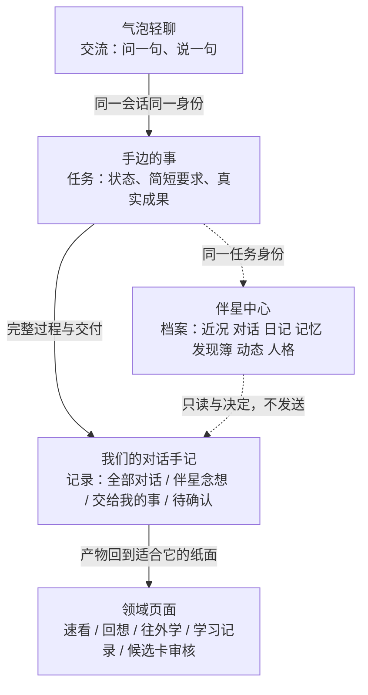

# 伴星体验（产品设计）

中文 · [English](../en/companion-experience.md)

这篇讲什么：伴星**是什么、能做什么、怎么表现、用户能控制什么、以及哪里还做不到**。她不是一个聊天窗口，也不是套在功能外面的皮肤：她是这个项目那套统一 Agent 机制面向用户的样子，所以本页讲产品判断，执行体在 [统一 Agent 运行时（技术）](./agent-runtime.md)。事实来自当前渲染层源码与界面文案（`apps/desktop-client/src/renderer/src/**`）、`PRODUCT.md`、`DESIGN.md`，以及真窗口核对记录（`docs/testing/**`）。

- [她为什么在这张书桌旁](#她为什么在这张书桌旁)
- [三个地方说话，一处看档案](#三个地方说话一处看档案)
- [她能替你做什么](#她能替你做什么)
- [在场：座位、取景与主动档位](#在场座位取景与主动档位)
- [声音：出与入](#声音出与入)
- [持续身份：什么跟着你走，什么留在原地](#持续身份什么跟着你走什么留在原地)
- [记忆：准入、分层与星图](#记忆准入分层与星图)
- [日记](#日记)
- [成长闭环](#成长闭环)
- [诚实：失败、静默与不假装](#诚实失败静默与不假装)
- [边界与还没做到的事](#边界与还没做到的事)

## 她为什么在这张书桌旁

产品要解决的问题是"**学了但不知道是否真的懂了**"。这类问题有个特征：它让人孤独，而且**卡住的时候没人问**。伴星的存在理由就是把"卡住"变成一个可以说话、可以指着某一句话说"这句没懂"的时刻（`PRODUCT.md:37,45`）。

三条设计底线决定了她不是聊天机器人：

1. **任务归属清楚**：学习任务的状态、结果与保存由页面和领域服务负责，不要求用户先进入对话（`PRODUCT.md` 原则 3）。她可以发起、可以接续，但**不接管**任务状态。
2. **她不是呈现层**：用户主动唤起后必须进入同一条真实业务会话，能读到当前页面、能真的动手（`PRODUCT.md:73`）。演示用的东西一律标明是演示，不产生业务事实。
3. **形象是功能的一部分**：Live2D 不是装饰。口型跟着真实音频振幅走，时刻动画只在真实事件上演（见下），所以"她在"这件事本身携带状态信息。

她的形象只有一个：`whale`（界面里叫"大肥鱼"）——宝蓝夜空、握笔写字、骑在鲸鱼上，与产品图标同源。旧的第二种形象与透明置顶"桌宠"窗口都已删除，代码里不存在第三个 `BrowserWindow`。

## 三个地方说话，一处看档案

她出现在四个地方，各自职责不重叠。搞混这四处，是理解这套产品最容易走错的一步。

| 地方 | 用来 | 不用来 | 入口 |
| --- | --- | --- | --- |
| **气泡轻聊**（`CompanionHud.tsx`） | 说话、语音对话（说完一轮直接发给她，不经过"改成文字再点发送"） | 承载任务状态；不在这里保存任何东西 | 她身边的四个按钮：轻聊 / 语音 / 手记 / 设置 |
| **手边的事**（`CompanionGoalBubble.tsx:43-46`） | 任务在做什么、还差什么；改要求、先放一放、继续处理、停止这件事；把这次合作留成方法 | 完整记录（气泡上写着"去手记看完整记录"） | 同一条侧栏 |
| **我们的对话手记**（`CompanionHistoryDrawer.tsx:337-340`） | 四个入口：**全部对话 / 伴星念想 / 交给我的事 / 待确认**；引用与过程收在附页，需要决定的动作直接摊开 | 在这里输入或发送 | 手记按钮 |
| **伴星中心**（`companion-center-model.ts:8-16`） | 七个页签：**近况 / 对话 / 日记 / 记忆 / 发现簿 / 动态 / 人格**；查看、检索、决定、纠正、撤回 | 实时回复、发送、语音、提案决策（这些留在轻聊与气泡） | 左侧目录 → 伴星 |

还有一处：**伴星带路**（右上角房间控制岛里的按钮，`HudRoomControl.tsx:365-370`）。它打开一本目录册（`guidance/CompanionGuideBook.tsx:13`），7 个主题按当前空间真实内容讲，可以跳过、暂停、重看；每一步都自标"教学示例"，明说"未创建真实笔记、任务或学习记录"（`guidance/CompanionGuidanceStage.tsx:138`）。

## 她能替你做什么

能力清单的**唯一索引**是 `packages/shared/src/agent-capability-catalog.ts`：56 条能力声明，其中 41 条是伴星自己的工具，对话面投影出 48 个、目标面投影出 10 个。按用户视角归类，今天从界面真的能做到的：

| 类别 | 她做的事 | 你看到的 |
| --- | --- | --- |
| 读懂你正在看的 | 读当前页面、读学习上下文、读历史；读材料时分页并诚实标注"没读完" | 回答贴着原文；引用能点回出处 |
| 找东西 | 搜笔记、读来源、打开某篇笔记 / 某张卡 / 某页、把星图聚焦到某个点 | 页面真的切换过去（能跳的屏受 `HUD_PAGE_DESTINATIONS` 约束） |
| 报状态 | 学习统计、任务队列、到期复习、最近动态、提醒列表 | 她说的数字与页面一致，因为取数走同一批只读接口 |
| 动手学习 | 开始学习、接着上次、先放一放、要提示、换一种做法、把复习推后 | 学习任务状态仍显示在原纸面上 |
| 制卡 | 发起一套学习卡的生成 | 只出候选，收哪张由你在候选卡审核里逐张定 |
| 记忆 | 存、读、召回、修订、移动分层、遗忘、记下她的判断 | 记忆页与记忆星图能看到依据与状态 |
| 她自己 | 改说话风格、改标签、设边界、调主动程度、暂停学习建议 | 人格页的"待生效版本"与版本历史 |
| 时间与主动 | 约提醒、取消提醒、到期主动送达 | 动态页与到点的那条气泡 |
| 交付物 | 画流程图 / 看图、算表达式、读一个公开 HTTPS 文档 | 产物落在合适的纸面，不在气泡里堆长文 |
| 语音 | 说给你听（TTS）、听你说（本机识别，说完一轮直接发出去） | 口型跟音频走；字幕只读，要改口就接着说一句 |

**后端有但界面还没接**：`POST /voice/transcribe`（云端转写，桌面端已不调用）；提醒的列表与取消只有对话与通知入口，没有管理页；`agent_deliver_goal` 只在目标 run 里有出口。

**只有合同没有实现**：Sprite Level A 的立绘降级形态（`PRODUCT.md:73` 明确"只有共享合同、没有资产与渲染实现"）。

## 在场：座位、取景与主动档位

她每一页都在，但**姿态是声明式数据**，集中在 `components/hud/hud-pages.ts`：

| 页 | 模式 | 座位 | 取景 | 主动 |
| --- | --- | --- | --- | --- |
| 首页 | `home` | 右 | 全身 | 允许（唯一可拖动的座位） |
| 理解练习 / 练习结果 | `assessment` | 右 | 半身 | 静默，且 `interaction:"none"`（宽页） |
| 来源详情、四张笔记书签、复习队列、理解星图 | `ambient` | **左** | 半身 | 静默 |
| 其余工作页 | `ambient` | 右 | 半身 | 静默 |

三层静音互不覆盖：**总静音**（房间控制岛，设备级，`HudRoomControl.tsx:323`）、**在此页保持安静 / 专注到任务结束 / 暂时隐藏伴星**（`CompanionHud.tsx:1568-1572`）、**静默时段**（设置里，且写明"你约过的提醒到点照样会来"，`settings-companion-panel.tsx:91`）。

主动介入由**一份确定性策略**同时管 API 与 worker（`packages/shared/src/companion-proactive-policy.ts:22-27`）：`routine`（节奏类）受频率与冷却约束，`triggered`（你约的提醒、你等的完成）**不进任何频率限制**。抑制原因码是可见的：`space_muted / quiet_hours / dismissal_feedback / formal_answer_in_progress / cooldown`。"一天最多 N 条"这种控件已经被删掉——它把陪伴变成了配额。

时刻动画只在真实事件上演：`task_started / working / tool_succeeded / tool_failed / awaiting_confirmation / reply_completed / space_arrived / reminder / celebration / run_failed`（`window-live2d-contract.ts:143-153`），由真实的会话阶段迁移推给驱动，庆祝判定还是 fail-closed 的（`app/companion-celebration-policy.ts:14-21`）。**不为了多点动画凭空演一遍。**

## 声音：出与入

- **出**：只有两个引擎——千问 / Edge-TTS（`settings-data-tables.ts:75-78`），音色来自同一份目录（`packages/shared/src/tts-voice-catalog.ts`），试听用随包样本，不是一次点击一次付费调用。千问失败或网络异常自动降级 Edge；**治理拒绝不触发降级**（那是权限问题，不是线路问题）。
- **语气标签**：23 个控制标签 + 7 个富语言标签，只在千问生效；存文与显示都会剥掉，Edge 分支在合成前消毒，但情绪仍会驱动 Live2D 表情（`voice-expression-tags.ts`）。用户侧的开关是人格页里的边界"允许回复携带表演语气"。
- **口型**：由解码后音频的 RMS 驱动，噪声门 0.012、上限 0.18、attack 45ms / release 120ms，写成独立的 `lipsync` 层只动 `ParamMouthOpenY`；表情归情绪，嘴归音频，两层不互相抢（`app/companion-mouth-meter.ts`）。
- **入**：本机 SenseVoice 模型（约 228MB），**不进安装包**，用户在设置里自行下载或移除；下载源按 ModelScope → hf-mirror → 官方顺序回退，逐字节校验 SHA-256，解码全在本机。没装模型时点语音会直接跳到"声音与显示 → 语音输入"。引擎跑在主进程的 `utilityProcess` 里（打包环境的沙箱渲染进程加载不了它的 wasm 运行时）。
- **入的形状是常驻对话**（2026-10-07）：按一次麦克风就一直开着，短停顿（450ms）切一段送识别、字幕按说话的顺序长出来，长停顿（850ms）把整轮文本**直接发给她**——界面上没有编辑框，也没有发送按钮；要说错改口，就接着再说一句。切段而不是逐字流式，是因为随包这份 sherpa-onnx 1.13.8 只给 SenseVoice 提供离线入口（`OfflineSenseVoiceModelConfig`，没有任何 `Online*` 的 SenseVoice 配置）；本机实测同一份引擎的 RTF 约 0.17，一句 4 秒的话约 735ms 解完，切段落在停顿里就够快。她在念回复时麦克风**不攒音频**（回声消除压不干净她自己的声音），电平连续越过一个更高的门槛才算你真的插话，插话即让她闭嘴。
- **入还没解决的两处**：识别引擎空闲 90 秒会把进程交还内存，所以一次很长的思考停顿之后，第一句要先等模型重新加载（会话模式没有为它加保持）；整条对话路径**没有在真实窗口里对着麦克风走过**，切段阈值与插话门槛都要靠实测调。
- **作答方式**：跟随安排 / 语音 / 静默结构 / 文字，账号级；"跟随安排"读在渲染之前，不会一进来就被显示成已选。

## 持续身份：什么跟着你走，什么留在原地

| 跟账号走（跨空间连续） | 留在空间（按来源隔离） |
| --- | --- |
| 人格档案与版本、说话风格、名字、账号级开关 | 熟悉度与互动计数、对话历史、日记、念想、旅程 |
| 允许的一般合作习惯（方法） | 具体材料、具体关系、具体经历 |

只有 `preference` 这一类记忆跨空间，而且只允许是"一贯怎么学 / 怎么相处"；`goal / learning_context / episodic / interaction_note` 一律本地。规则可以否决模型——**拿不准就按本地处理**（`PRODUCT.md:73`）。

界面上的出口：人格页有版本历史与恢复，切预设时会明确列出哪些字段将被覆盖（`companion-persona-page.tsx:58-79`）；记忆页每条都能确认、固定、归档、恢复、忽略、移除，删除有 30 天回收区且支持一步撤回（`companion-memory-page.tsx:90-100,137`）。

## 记忆：准入、分层与星图

**准入很挑**（`workers/ai-worker/src/handlers/companion-memory-extractor.ts:604-676`）：置信度 ≥0.7；必须有用户原话作为出处；时间性表述必须真的出现在那句引文里；"系统查得到"的易变事实直接丢；同一条消息同类去重；一次只提一条独立事实；缺 `sourceBasis` 一律拒，被拒正文不入库。被用户否决过的来源进 `assistant_memory_source_suppressions`，之后不再复用。

**分层有预算**：常驻 / 活跃 / 归档三档，常驻 6 条、320 token、1000 字节，归档 500 条 / 400KB（`apps/api/src/modules/companion-conversation/memory/memory-service.ts:119-137`）。常驻满了时，`companion_move_memory` 返回**降级候选**而不是自动搬走——她的整理是建议，不是既成事实。

**记忆星图不是装饰**：一颗星 = 一条已确认记忆（标签就是记忆正文），另有来源 / 笔记 / 关键点的实体星与 `derived_from` 边；失联的边标 `orphaned`；**候选与归档从不进星图**，进图的只有服务端 `star-map` 过滤后的节点（`companion-memory-universe.ts:53-112`）。状态页签筛的是**列表**，不是天空：全部状态 / 正在使用 / 待确认 / 已固定 / 已归档 / 已过期（在"合作方式"视图里"已归档"改叫"暂时不用"）。

维护动作都是用户主动的：整理与回收、检查冲突（"保留此条"按组解决）、重建记忆检索索引（明确写"不会改动记忆正文"）。

## 日记

她按本地一天写一篇，素材只在开关打开时收集——"暂停期间不收集日记素材；重新开启后从开启时起积累"（`settings-companion-panel.tsx:96`）。

- 日期条是月历 + 前一天 / 后一天 / 当天，日子上的标记只有两种真实状态：`generated` / `failed`。
- **失败原因分成四条不同的话**，其中一条是"还是在报数，不像日记，没有收下来"（`companion-diary-panel.tsx:16-21`）——不写成"生成失败"了事。
- 隐藏 / 取消隐藏 / 删除是三件事：隐藏保留正文，删除连派生预览一起清（`companion-diary-actions.ts:19-26`）。
- 「聊聊这篇」只把日期与版本带进输入，**不替你发送**。
- 隐私边界是设计出来的：`companion_read_diary` 故意**没有** `workspaceId` 参数，加了就变成跨空间读取通道（`companion-capability-manifest.ts:203-205`）。她的文字被标为主观作品，不当事实用；她记下的判断一律带认识状态。

## 成长闭环

**证据 → 有条件的做法 → 在合适场景使用 → 事后回看效果 → 保留 / 纠正 / 撤回**，五步都在界面上有位置。

一个"方法"（共同磨合出来的短手册）包含：标题、`appliesWhen`（什么时候适用）、步骤、`exceptions`（例外）、理由、版本与证据。用户能做：确认采用 / 暂时不用 / 恢复采用 / 修订做法 / 查看来源与旧版本 / 回看后续合作与反馈，并在真实使用后回答"这次有帮助 / 这次不合适"（`companion-methods-page.tsx:9-12,87-119`）。方法状态 `candidate / active / disabled / disputed`，认识状态 `tentative / supported / disputed`，可用性还会因来源变更、能力变更而回退到 `previous_version`。

明确**不用**的东西：经验值、关系等级、连续签到、使用次数当进度。页面上甚至直接写着"不计经验值"（`learning-run-discovery.tsx:48`），方法的"查阅次数"只显示为查阅，不参与评分。成长要体现在**少解释一次、接得更顺**，不是数字变大。

## 诚实：失败、静默与不假装

这套产品最难也最值得写清楚的一条：**她不能把失败伪装成留白或完成**。

- Live2D 加载失败：形象隐藏，留一条可关闭的说明，**没有**圆球或立绘替身。
- TTS 失败：文本照常留下，不吞字。
- 任务失败：气泡上写"这次还没做成"；演示失败写"这个演示没做成，原文没有受影响，可以再来一次"（`docs/testing/full-qa-2026-10-05-final.md:81-82`）。
- 上下文被折叠或省略：模型侧要能看出自己被折叠了，且能用 `companion_read_history` 取回原文；这条目前**只做到一半**（见下节）。
- 不制造"我不认识你"的假失忆，也不假装记得没有依据的事。
- 正式作答期间只给一次性短上下文，禁止主动提示与语音，避免把练习变成代读。

## 边界与还没做到的事

写文档时不该掩盖的缺口，按当前证据列：

- **折叠内容对模型只做到半可见**——已确认未闭合（`docs/plans/learning-companion/40c-three-legacy-items-review-2026-10-05.md:73,163-167`）。
- **记忆重整**有接线，但没有验证过一次完整执行（同文 `:41-70`）。
- **"结合来源判断"这类需要**（40 §4.5.3）未实现（同文 `:151-161`）。
- **长期效果未证实**：没有同负载 p95 对比，适应样本只有 4×8 轮，且留有一条语义负样本（闲聊时仍抬出旧目标）；零价值产物检查的证据来自独立程序而不是真实窗口。
- **完全权限档的服务端自动确认没实现**：那 6 个强制提案工具即使在"完全"档也要人点一下。
- **带路的完整走查没跑过**：新账号全程与签署同意后的语音，在真实窗口里仍未验过。
- 真窗口仍开着的问题：一张遗留测试卡没有删除或归档入口、开发者证书签名的安装包、人工听感测试、跨天记忆与并发。

产品边界（不是缺口，是决定）：不做个人模型 / 供应商配置界面（BYOK 已移除），不做透明置顶桌宠窗口，不做自由相机与视差漫游，不做自助密码重置（没有邮件通道），不做只靠召唤入口的"静态立绘"。

相关分册：[统一 Agent 运行时（技术）](./agent-runtime.md) · [模型与 Worker 链路](./ai-and-companion.md) · [桌面客户端](./desktop-client.md) · [产品总览](./overview.md) · [常见问题与排障](./faq-and-troubleshooting.md)
