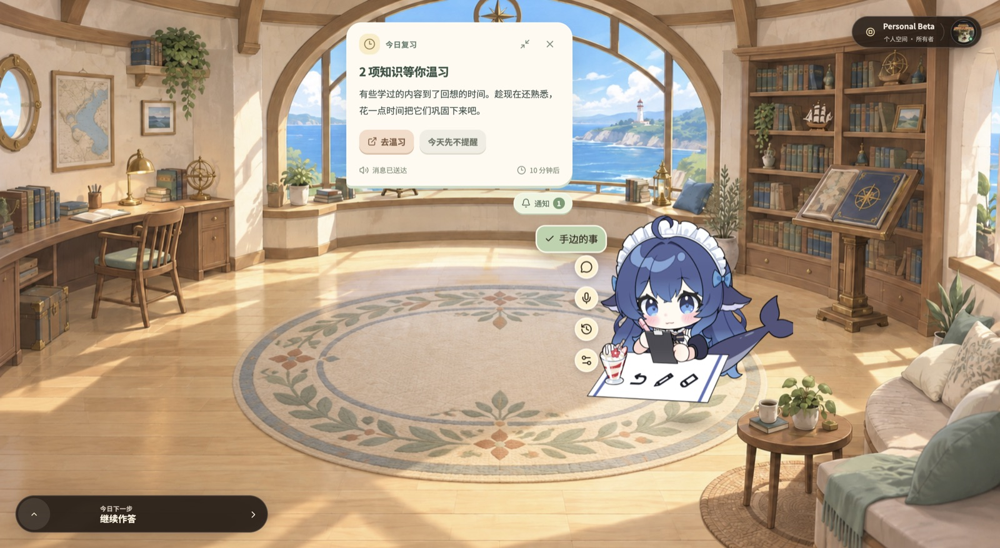
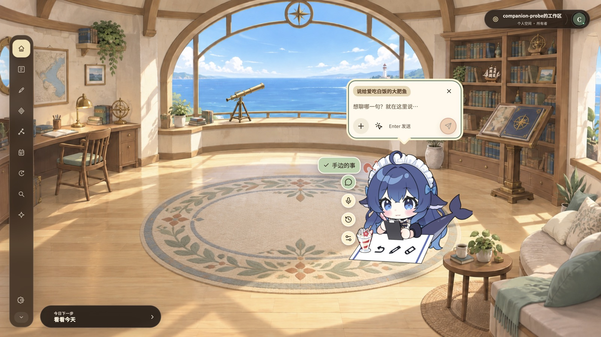

# 桌面客户端

中文 · [English](../en/desktop-client.md)

## 这篇讲什么

`apps/desktop-client` 是拾星笔记唯一的用户界面：一个 Electron 44 单窗口书房。主进程握着窗口、自定义协议、笔记协同通道、产物落盘与更新器；渲染进程握着全部版面，但**没有路由库**——页面意图由 store 解析到已登记页面，纸面旁边始终坐着同一个 Live2D 伴星。本页沿这条真实调用链写：进程边界在哪、页面怎么被选中、伴星怎么被驱动、笔记怎么保存、安装包怎么产出，以及哪几处最容易写出与代码相反的话。事实来自 `apps/desktop-client/**` 源码与仓库根 [PRODUCT.md](../../../PRODUCT.md)、[DESIGN.md](../../../DESIGN.md)；除另有说明，本页路径都相对 `apps/desktop-client/`。

- [构建与三个入口](#构建与三个入口)
- [窗口、协议与 preload](#窗口协议与-preload)
- [没有路由器的导航](#没有路由器的导航)
- [页面清单](#页面清单)
- [目录栏、右上岛与全局按键](#目录栏右上岛与全局按键)
- [伴星：窗内的 Live2D](#伴星窗内的-live2d)
- [笔记：编辑、协同与四张书签](#笔记编辑协同与四张书签)
- [设置中心](#设置中心)
- [动效与可访问性](#动效与可访问性)
- [打包与自动更新](#打包与自动更新)
- [测试与源码守卫](#测试与源码守卫)
- [真实窗口取证](#真实窗口取证)
- [容易踩的坑](#容易踩的坑)
- [现状与边界](#现状与边界)

## 构建与三个入口

| 项 | 值 |
| --- | --- |
| 包名 / 版本 | `astella-desktop-client` / `release/version.json` |
| 运行时 | Electron `44.7.0`、electron-vite `^5.0.0`、Vite `^7.3.6` |
| macOS 最低版本 | macOS 13 Ventura；`electron-builder.yml` 同步声明安装要求 |
| 界面 | React `^19.2.0`、TypeScript `^5.9.3`、Zustand `^5`、GSAP `^3.15` |
| 编辑栈 | `@milkdown/kit` `^7.22.1` + CodeMirror 6 + `yjs` `^13.6` + `@hocuspocus/provider` `^4.7` |
| 测试 | Vitest `^4.1.11` + `jsdom` + Testing Library |
| `npm run dev` | `electron-vite dev --remoteDebuggingPort 9222` |
| `npm run build` | `validate:room-layers` → `electron-vite build` → `validate:room-layers:output` |
| `npm run typecheck` | `tsc --noEmit -p tsconfig.node.json --composite false` 再 `-p tsconfig.web.json` |
| `npm run dist` | typecheck → test → build → `electron-builder` |

开发命令开放 9222 调试端口，[真实窗口取证](#真实窗口取证) 的 CDP 工具通过它附着；正式安装包不开放该端口。`build` 前后各跑一次 `scripts/validate-room-layers.mjs`，前者校验 `src/renderer/public/assets/learning-room/v1/manifest.json` 里的图层声明，后者用同一份判据检查 `out/` 里的产物，缺层就出不了包。

主进程有**两个入口**（`electron.vite.config.ts`）：`index` 与 `voice-asr-host`。本机语音识别引擎是 emscripten 的 Node 构建、工厂里无条件 `require("path")`，而渲染窗口是 `sandbox: true`、worker 里连 `require` 都没有，于是它只能由 `utilityProcess.fork` 单独拉起；`fork` 接的是文件路径而不是函数，所以必须给它第二个入口。`index` 那一行不能省——给了 `input` 就是接管默认入口。同一处还把 `bufferutil` / `utf-8-validate` 标成 external 且故意不装：Vite 的依赖打包会给解析不到的可选 peer 生成一句**模块顶层**的 throw，那会在 Electron 启动时炸掉整个主进程，`ws` 自己的 try/catch 根本轮不到。

渲染进程零 Node 能力。协同文档、图片上传、动态产物、剪贴板、Markdown 导出、识别模型字节，全部经 preload 桥由主进程代跑，这条边界是下面所有安全讨论的前提。

## 窗口、协议与 preload

| 项 | 值 | 出处 |
| --- | --- | --- |
| 窗口标题 | 拾星笔记 | `src/main/index.ts` |
| 初始内容尺寸 | 1440×810 | `src/shared/window-geometry.ts` |
| 最小尺寸 | 1280×720 | 同上 |
| 背景色 | 不透明窗口 `#211914`；Windows 无边框窗口 `#00000000`（否则首帧前闪桌面，反过来会堵死圆角） | `src/main/window-chrome.ts` |
| 窗口装饰 | macOS `titleBarStyle: hiddenInset`；Windows `frame: false` + `transparent: true`，标题按钮由渲染层自绘；Linux 仍用 `titleBarOverlay`，随主题重算 | `src/main/window-chrome.ts`、`src/renderer/src/components/hud/window-caption.tsx` |
| 窗口形状 | 悬浮时文档根裁 14px 圆角；最大化与全屏收直角 | `src/shared/window-frame.ts`、`src/renderer/src/styles.css` |
| 菜单栏 | `autoHideMenuBar: true` | `src/main/index.ts` |
| 单实例 | `app.requestSingleInstanceLock()` | `src/main/index.ts` |
| 缩放 | ⌘ / Ctrl 与 `+` `-` `=` `0`，走离散档位表 | `src/main/window-zoom.ts` |

`window-geometry.ts` 顶上那段注释值得读完：这里曾经有整套比例锁（`setAspectRatio` + `maximizable: false` + 16:9 容差断言），锁拆掉之后"不露边、底图不变形"改由渲染层的 cover 摆位承担（`.scene-reference-frame[data-scene-fit="cover"]`、`.room-backplate { object-fit: cover }`），**只剩尺寸下限**这一条还有原生窗口能保证——小于它，纸面正文与伴星座位会挤到一起。验收视口是 1440×810、原生最小 1280×720 与 125% / 150% / 200% 缩放。

内容只从自定义协议 `astella-app` 进窗口，两个 host：`astella-app://bundle`（应用自身文档）与 `astella-app://artifact/<uuid>`（AI 生成的互动整页）。协议注册为 privileged / standard / secure / stream，只接 `GET` / `HEAD`，其余方法回 405 带 `Allow: GET, HEAD`，并读取 `Range` 头。产物落点是 `<userData>/artifacts/<artifactId>.html`，路径安全靠 `artifactId` 的形状（`src/shared/artifact-frame.ts` 只认 uuid）：没有 `..`、没有可写的分隔符，`resolve` 之后一定落在 `artifacts/` 里。响应头的 CSP 按主文档 / 产物 origin / 其余一律 `rejectAll` 三路分流，并且先删掉上游同名头（`src/main/index.ts`）；入口还有 `onBeforeRequest`（同文件）与 `will-navigate`（同文件）两道闸。

`webPreferences`：`sandbox: true`、`contextIsolation: true`、`nodeIntegration: false`、`webviewTag: false`、`devTools: !app.isPackaged`。preload 暴露两条冻结的桥 `window.astellaDesktop` 与 `window.astella`，包在 `if (process.isMainFrame)` 里（`src/preload/index.ts`）——Electron 的 preload 会注入**每一个** iframe，互动产物已通过 iframe 呈现，这道守卫禁止把 IPC 桥交给产物内容。CI 容器一类受限环境会额外 `appendSwitch('no-sandbox')`（`src/main/index.ts`），否则 Chromium 起不了自己的沙箱、每个子进程都以"sandbox initialization failed"死掉；本地正常跑不动沙箱开关。

## 没有路由器的导航

房间状态是一个纯函数加一份 store。`src/renderer/src/app/room-machine.ts` 定义 `RoomIntent`、`RoomDestination` / `ViewPresetId`与 `resolveRoomIntent(intent) → { destination, viewPreset, surface }`；`room-store.ts`持有 surface、theme、motionMode、returnTarget、`invoke(intent)` 与一个可注入的 `navigationGuard`。没有 URL、没有 history、没有路由表：切页就是改 store，`TaskSurface.tsx` 按 `surface` 挑组件，用 `key={renderedSurface}` 强制重挂载，进出场是 GSAP 时间线并带一个墙钟 deadline——快速往返或连续切换时，超时的动画直接收尾而不会把焦点压在正在退场的那层上（`aria-hidden` + `inert` 在 leaving 期间同时生效，同文件:316）。退场后焦点按 `data-focus-return` 落回原入口。

"HUD"不是第二个窗口。整个客户端只有一个 `BrowserWindow`；`.hud-surface` 与 `page-NN` 这套类名是与 `.impeccable` 视觉稿对齐的设计基底，由 `components/hud/use-hud-page.ts` 按当前 surface 把页面身份写成 `.desktop-app` 上的 `data-hud-page`，`src/main/__tests__/hud-substrate-guard.test.ts` 反过来校验修正层确实存在 `.hud-surface .c` 形状的选择器（少于 20 条就判守卫空转）。

错误边界是两层：`App.tsx` 的 `<RenderErrorBoundary label="理解书房" shell>` 塌了给出重载，`TaskSurface.tsx` 的 `<RenderErrorBoundary label="这个页面">` 塌了只丢那张纸，书房、目录与伴星还在。

### 一条完整的调用链

页面上按下一次「学这篇笔记」，真实走的是这条路：按键或点击 → `room-store.invoke("open-notebook")` → `resolveRoomIntent` 得出 `{ destination, viewPreset, surface }` → `TaskSurface` 换 `key` 重挂 `NotebookSurface` → 组件调 `window.astella` 上的类型化业务方法 → 主进程 handler 代发请求给 `apps/api` → 结果与错误码原路返回，页面根据回执更新状态。这条链上没有 router，渲染层不直接发业务 HTTP，也没有第二个窗口——想加一个动作，就沿它逐层改，对照表见 [架构](./architecture.md) 的"改哪儿"一节。

## 页面清单

| 意图 | 屏幕 | 组件（相对 `src/renderer/src/`） |
| --- | --- | --- |
| `home` | 房间首页：书桌 / 书架 / 星窗 / 休息角 | `components/home-v2/HomeV2Experience.tsx`，功能入口在 `home-feature-registry.ts` |
| `continue` | 今日学习（今日下一步） | `components/surfaces/study/StudySurface.tsx`、`components/surfaces/library/TodayBatchSurface.tsx` |
| `open-resumable` | 未完成的学习 | `components/surfaces/library/ResumableSurface.tsx` |
| `open-notebook` | 一篇笔记的册页 | `components/surfaces/notebook/notebook-surface.tsx` |
| `review` | 复习队列 | `components/surfaces/review/ReviewSurface.tsx` |
| `search` | 全局搜索 | `components/surfaces/study/search-surface.tsx` |
| `graph` | 理解星图：漫游 / 列表双模、恒星与星座图层、关系逐条确认 | `components/surfaces/space/graph-surface.tsx`、`space/understanding-universe.tsx` |
| `validate` | 理解练习 → 练习结果（页面 16 / 17；练的时候屏内说"这一轮 / 旅程"，闸门叫正式作答） | `components/surfaces/run/validation-surface.tsx`、`learning-run-copy.tsx` |
| `open-card-generation` | 学习卡生成中 / 候选卡审核 | `components/CardGenerationSurface.tsx`、`components/surfaces/review/candidate-review-desk.tsx` |
| `open-sources` | 来源库，标签 全部 / 处理中 / 失败 / 就绪 / 归档（`source/source-index.ts`） | `components/surfaces/source/source-library-surface.tsx` |
| `open-source` | 来源详情 | `components/surfaces/source/source-detail-surface.tsx` |
| `open-notes` | 笔记库 | `components/surfaces/notebook/note-library-surface.tsx` |
| `open-objectives` | 学习卡库 | `components/surfaces/library/WorkspaceLibrarySurface.tsx`（`ObjectiveLibrarySurface`） |
| `open-objective` | 学习卡详情 | 同上（`ObjectiveDetailSurface`） |
| `open-companion-center` | 伴星中心：近况 / 对话 / 日记 / 记忆 / 发现簿 / 动态 / 人格 | `components/surfaces/companion/companion-center-surface.tsx`、`companion-center-model.ts` |
| `open-settings` | 设置中心 | `components/surfaces/settings/settings-surface.tsx` |

## 目录栏、右上岛与全局按键

左侧 `components/DirectoryRail.tsx` 的 `DIRECTORY_ITEMS` 就是十项，`aria-label="学习空间目录"`：首页、来源、笔记、学习卡、星图、今日学习、复习、查找、伴星、设置；折叠态按钮文案是 展开目录 / 收起目录，行为模式 `auto | expanded | collapsed` 持久化在 `astella.directory-rail.mode.v1`。星图与来源 / 笔记 / 学习卡同组，因为它就是同一条链的拓扑视图；今日学习与复习是两张不同的页面，目录栏、首页与快捷键都可到达。

右上角岛 `components/hud/HudRoomControl.tsx`：空间胶囊（`aria-label="学习空间控制"`）、返回学习空间总览、日夜切换、总静音、动效模式循环（完整 / 轻量 / 关闭，带指示灯）、设置（有新版本时标题带版本号）、伴星带路、账户槽位（展开后是一张脸或首字母印章），再配一个收起 / 展开。左下角的返回书签在 `components/hud/HudPage.tsx`，`aria-label` 直接沿用传进来的 label——那本身就带「返回」，再加前缀读屏会念成"返回返回书房"（同文件:53 的记录）。

全局按键在 `App.tsx`：`Esc` 回首页（伴星 HUD 未关闭时让位，不抢）、⌘ / Ctrl+`Enter` 今日下一步、⌘ / Ctrl+`K` 全局搜索、`R` 今日复习、`G` 理解星图。后四条走 `homeV2ShortcutFeature(event)` 翻成首页功能 id，再派发 `astella:home-v2-run-feature`——快捷键与首页上的入口是同一条路，不是两份实现。输入框、IME 组字、打开的 dialog 与新手引导期间全部由 `shouldIgnoreGlobalShortcut` 挡掉。

## 伴星：窗内的 Live2D

伴星画在主窗口自己的一块 canvas 里，不是透明置顶窗，也不是第二个进程：`components/companion/WindowLive2D.tsx` 挂层，`WindowLive2DDriver.ts` 驱动，用的是随包的 PIXI / Live2DCubismCore / cubism4（`src/renderer/public/assets/companion/vendor/`，旁边有 README 记录来源）。本节只讲窗内这一层怎么挂、怎么装、怎么降级；她面向用户的样子（四处入口、能替你做什么、哪里还做不到）在 [伴星体验（产品设计）](./companion-experience.md)，驱动她的执行体在 [统一 Agent 运行时（技术）](./agent-runtime.md)。

| 项 | 值 |
| --- | --- |
| 已注册形态 | 只有 `whale`（大肥鱼），`DEFAULT_WINDOW_LIVE2D_MODEL_ID`（`window-live2d-contract.ts`） |
| 模型 | `assets/companion/live2d-v3/whale/c_0120.model3.json`，30 个 `.exp3.json` 表情 |
| 动作组 | `Idle` / `Bubble` / `Spray` / `Selfie` / `SelfieQuick` |
| 呈现状态 | 11 个，来自 `packages/shared` 的 `characterPresentationStateV1Schema`：hidden、idle、invite、listen、think、analyze、speak、navigate、encourage、celebrate、uncertain |
| 语义时刻 | 10 个：`task_started`、`working`、`tool_succeeded`、`tool_failed`、`awaiting_confirmation`、`reply_completed`、`space_arrived`、`reminder`、`celebration`、`run_failed`，每个落成一条动作 + 可选 overlay / costume（`WHALE_MOMENT_CUE`） |
| 自发轮播 | 洗牌袋：首条延迟 4s，之后 7–15s 一条；表情停留 5s、动作 3.5s、overlay 默认 2.6s |
| 状态 | `loading \| ready \| unavailable`；15s 装载超时判 `unavailable`（`WindowLive2D.tsx`），不可用时不占位、不报错刷屏 |
| 口型 | TTS 逐帧振幅写 `ParamMouthOpenY`（该模型没有 `ParamA`） |

时刻表只演**真实发生过**的事件：每条都由一帧 SSE 或一个气泡动作触发，不为了多点动画凭空演一遍。眼镜是 costume——`working` 戴上、`tool_succeeded` / `reply_completed` 摘掉，不然一副圆脸眼镜挂到下一轮对话；贴纸类（问号、吐魂、爱心）是 overlay，只写装饰可见性参数，因此能逐帧叠加也能脱下来，而发型类会永久改形象、桌道具类需要一张她没有的桌子，两类都没登记。伴星每一页都在，座位、取景与主动介入的配置集中在 `components/hud/hud-pages.ts`；同文件的 `HUD_PAGE_DESTINATIONS` 记着哪几屏她跳不过去（值为 `null`：`space`、四张笔记书签、学习卡详情、生成中、候选卡等），这份表就是"别承诺她做不到的跳转"的依据。

## 笔记：编辑、协同与四张书签

编辑器是 Milkdown + CodeMirror 的所见即所得（`surfaces/notebook/note-markdown-editor.tsx`），正文三种模式 阅读 / 编辑 / 源码 由 `note-document-mode.ts` 的 `NoteBodyMode` 决定。一张册页四张书签互斥：`notebook-surface.tsx` 的 `leaf` 取 `reading` / `learning` / `history` / `expansion`，切过去之后原来读到哪儿还在屏上，不是重装一遍；对外发布的页面身份则是 `hud/hud-pages.ts` 里的四张——这篇笔记、笔记编辑（副标题写着"Markdown 所见即所得；可回去的版本按「保存」留下"）、学这篇笔记、学习记录。

CRDT 与 WebSocket 都在主进程：`src/main/note-doc-transport.ts` 用 `HocuspocusProvider`，一条连接只服务一篇笔记（v4 的文档名在协议首条消息里、服务端按文档逐条路由），本地缓存落在 `note-doc-cache-store.ts`，渲染进程通过 preload 桥读写。自动保存防抖，状态要等服务器回执才落定；版本是不可变的，回看与还原走 `version-history.tsx`，还原不销毁历史。批注锚在原稿区间上（`note-annotation-mark.tsx`、`note-annotation-placement.ts`），讲解纸贴在精确锚点旁；回想由 `notebook-recall-contract.ts` 控制提示、揭示与自评三档；速看有原文依据与覆盖范围；往外学的草稿逐篇确认后才成为新笔记与关系。AI 生成的整页 HTML/SVG 在隔离 frame 里跑（`surfaces/source/artifact-frame-host.tsx` 经 `astella-app://artifact/<uuid>`），使用独立 artifact origin 且不共享 preload 能力。图片上传在 `note-image-uploads.tsx`，Markdown 导出在主进程 `src/main/note-markdown-export.ts`，星图取数来自 `understanding.getTopology` 加关系判定。

### 全屏与连续阅读

正文可进入全屏阅读／编辑，使用同一份工作稿和编辑器。纸面铺满应用视口，右上折签打开工具页，工具浮在纸面上而不挤动正文；伴星保留右下临时座位。全屏是这一页的显示模式：速看（含脑图）、回想、往外学、互动演示、学习记录和这一轮学习都留在同一张整窗纸面里，点这些页签不再退回普通册页，从任意视图都能进入；退出全屏后仍停在刚才的子页面。切换笔记与加载时保留全屏，返回箭头沿本次笔记跳转路径恢复原模式与位置；离开笔记页、切空间或主动退出时结束。

Esc 先关闭当前浮层，再收工具，最后退出全屏，不直接跳首页。册页与全屏接续选区、撤销和阅读位置；临时伴星座位不修改用户摆位设置。实现入口是 `notebook-fullscreen-state.ts`、`use-notebook-fullscreen-controls.ts` 和 `notebook-fullscreen-ribbon.tsx`。

### 批注、改正文与链接

选文操作浮签在拖选结束后出现，键盘扩选也按最终选区更新。原句旁的编号角标分别打开批注；短预览固定在句尾角标，句尾不可见时锚定首个可见片段。展开旁页后，点击其他正文或留白收起，点击另一批注直接切换；拖选不当作关闭。

「让伴星改这段」将原句与位置带入轻聊，用户补充要求后发送。原句解释、处理进度与正式批注分别保留；忙碌范围在阅读、富文本和源码中一致锁定，停止或失败解除。生成新笔记与库内关联见 [伴星体验](companion-experience.md)。链接有真实笔记身份，可跳转并接续返回路径。

互动演示独立运行在受限 iframe。轻量动效保留演示的教学过程；Off 和系统减少动态停止自动运动，手动探索与说明仍可用。生成失败保留已有产物和原文。

## 设置中心

`surfaces/settings/settings-book.tsx` 的 `SETTINGS_SECTIONS` 是六章，左侧目录可键盘环绕（方向键 / Home / End），右页每张纸独立滚动并记住位置：

| 章 | 内容 | 主要文件 |
| --- | --- | --- |
| 账户与空间 | 昵称、头像裁剪、空间改名 / 解散 / 移交 | `settings-account-panel.tsx`、`avatar-crop-dialog.tsx`、`settings-workspace-group.tsx` |
| 成员与邀请 | 加入一间书房、邀请与待处理邀请 | `settings-invite-join-field.tsx` |
| 主题与动效 | 光线（随时间 / 日 / 夜）、动效（完整 / 轻量 / 关闭，系统减少动效始终优先）、目录行为、弹性手感预览 | `settings-theme-picker.tsx`、`settings-motion-preview.tsx` |
| 伴星设置 | 陪伴规则、静默时段、助理权限三档（`read_only` / `guided` / `full`，默认 guided）、联网搜索（账号级、默认关闭）、自动日记、书桌上的形象与大小、总静音、TTS 引擎与音色试听、默认作答方式、本机识别模型下载 | `settings-companion-time.tsx`、`settings-companion-panel.tsx`、`settings-companion-voice.tsx`、`settings-answer-mode-row.tsx`、`settings-voice-model.tsx` |
| AI 数据同意 | 同意开关、数据策略、外发记录 | `settings-data-boundary-group.tsx` |
| 数据与维护 | 空间导出、导出清单、能力芯片、更新面板 | `settings-export-group.tsx`、`settings-companion-status.tsx`、`settings-update-panel.tsx` |

伴星那章的读写全在 `use-companion-account-settings.ts`，`patch()` 一次一条设置；助理权限的文案解释了三档差别（只读禁止写入／引导允许可逆低影响动作、其他动作先确认／完全减少确认但六个学习提案工具仍确认），页面上就按这段写。这同一份说明取自 `companion-account-presence.ts` 的 `COMPANION_AGENT_PERMISSION_DETAIL`：轻聊工具行提供就地档位按钮（`companion-agent-permission.tsx`），当场改完当场生效，并广播给设置页，不出现两处各说一套。目录下方还有一个「重新认识书房」按钮（`settings-book.tsx` 的 `onReplayIntro`），每章的说明文字与配色 tone 也都在 `SETTINGS_SECTIONS` 一处定义，图标取自 `lucide-react`。

## 动效与可访问性

转场用可打断的 GSAP 时间线，切换跟随最新意图：正在退场的那层既不接焦点也不接读屏，新页面提前进场时 deadline 到点直接落位。`nextMotionMode()` 是 full → lite → off 的循环（`room-machine.ts`），`prefers-reduced-motion` 命中时 store 的 `reducedMotion` 一票否决，连设置页的弹性手感预览也跟着退化成静态。`motionMode === "off"` 时 `TaskSurface` 走一条独立分支直接落位（同文件），`lite` 也是单独分支（:156）。键盘同理：焦点与功能不等动画——正在退场的那层被 `inert` 挡在 tab 序列之外，而新页面的入口在进场完成前就可以按。

首页背景是海报 + 视差图层，不是 3D 场景：`data-scene-renderer="poster-live2d"`（`App.tsx`、`components/RoomStage.tsx`），图层与海报由 `scripts/validate-room-layers.mjs` 对着 `public/assets/learning-room/v1/manifest.json` 校验，源与产物各查一次。没有自由相机、没有视差漫游，生活感全部由 Live2D 原地动作和短暂反馈承担——这是写进 [PRODUCT.md](../../../PRODUCT.md) 首页合同的约束。

## 打包与自动更新

`electron-builder.yml`：`appId: com.asklins.astella`，`productName: Astella`（中文显示名 拾星笔记 另由 `CFBundleDisplayName` / `WindowsRegistration` 提供），输出 `release/`，`asar: true` + maximum 压缩。`files` 显式排除 `out/renderer/assets/3d/**` 与 `out/renderer/models/**`——识别模型是用户自己在设置里下的附加功能，一条误拷回 `public/` 就让安装包平白多 239MB。

| 平台 | 目标 | 备注 |
| --- | --- | --- |
| macOS | `dmg` + `zip` | `NSMicrophoneUsageDescription`（少了它 TCC 直接判拒 `getUserMedia`）、`hardenedRuntime: true` |
| Windows | 独立 WPF 安装器 x64 | 自绘向导、勾选须知与非商用许可后继续、自定义位置、更新与卸载；仅当前用户 |
| Linux | `AppImage` | — |

Windows 不再复用 NSIS 的外壳或安装脚本。`apps/windows-installer/` 使用 .NET 10 / WPF，自绘奶油纸面与薄荷侧栏；运行时随单文件安装器携带。`scripts/package-windows.mjs` 先由 electron-builder 生成程序目录，再打包经过校验的 ZIP、文件清单与独立安装器，生成 `latest.yml`；旧客户端迁移保留 `.exe.blockmap`。

向导先展示使用须知与 PolyForm Noncommercial 非商用许可全文，须主动勾选同意才可继续。新安装可选择本机位置，已有安装与更新沿用原位置；更新先校验并暂存文件，再替换整目录，提交失败时恢复旧程序。本机资料保存在 `%APPDATA%\astella-desktop-client`，安装确认不替代账号内的 AI 授权。Windows「已安装的应用」与程序目录中的卸载器均可进入卸载界面，清除资料的勾选默认关闭。

Windows 更新使用 `WindowsInstallerUpdater` 完整下载与 SHA-512 校验，并在退出应用前启动独立安装器。安装器等待旧进程退出，保留安装目录与本机资料；应用重启后沿用统一更新回执。构建与实际验证范围见 [安装器说明](../../../apps/windows-installer/README.md)。产物继续使用 ASCII 名称 `astella-${version}-win-x64.exe`，版本来自统一发布配置。

更新源是 GitHub Releases 直连（`publish: provider github, owner asklins223, repo Astella`，实现 `src/main/desktop-update.ts`），检查走 `api.github.com`、下载走 GitHub CDN，**不经过 `apps/api`**：自家 API 挂了不影响更新，更新带宽也不落在自家服务器上。

> macOS 无 Apple 证书时使用完整 ad-hoc 签名与稳定的 designated requirement，供跨版本更新校验；首次打开仍可能需要用户在隐私与安全中允许。配置 Developer ID 后改用开发者签名与公证。

## 测试与源码守卫

`vitest.config.ts` 配置测试超时与 setup；DOM 测试在文件顶部声明 jsdom。部分素材包含测试读取 `out/`，干净检出先构建再测试。

| 守卫 | 判据 |
| --- | --- |
| `component-size-guard.test.ts` | 硬线 文件 7000 行 / 单函数 4500 行 / 70 个 hook；越过软线（2000 / 1200 / 25）必须在 `SIZE_DEBT` 台账登记并写清下一步拆哪块，拆完从台账删掉 |
| `desktop-ipc-channel-coverage.test.ts` | 契约里的频道集合 ⇄ 主进程注册的 handler 集合相等，缺一边就红 |
| `ipc-channel-single-source-guard.test.ts` | 频道名只允许出现在契约文件里，不许字符串复制 |
| `hud-substrate-guard.test.ts` | 修正层必须真有足量 `.hud-surface .c` 选择器，且没有更宽的裸选择器把作用域拆掉 |
| `renderer-style-closure` / `-dead` / `-order-guard.test.ts`、`css-var-resolution-guard.test.ts` | 样式不悬空、不死、顺序可预期、变量有读者 |
| `*.page-readable.test.tsx`（renderer 各域的 `__tests__/`） | 每屏登记伴星可读视图，屏幕内容与她的说法对得上 |
| `graph-surface-shape-guard` / `notebook-round-lost-shape-guard` / `home-feature-wiring-guard` | 星图与学习记录的形状、首页功能 id 与 `runFeature` 分支两边齐全 |
| `*-copy-guard.test.ts` | 面向用户的文案改动要有记录 |
| `docs-vite-vars-have-readers.test.ts` | 文档点名的构建期变量在 `src` 里必须真有人读；点名"不存在"的要在那一行明说不存在 |

`docs-vite-vars-have-readers.test.ts` 守的正是本页最容易写错的一句：`VITE_HOME_SCENE_VARIANT` 全仓唯一命中是 `package.json` 里一条截图脚本给它赋值，`src` 里没有读取点，`HomeV2Provider` 在 `App.tsx` 无条件挂载。任何"首页由旗标切换、可回退 V1"的写法都是假话，而它会让人把"改门禁"当成安全决定。

渲染侧的测试就近放在各域自己的 `__tests__/`（例如 `components/surfaces/__tests__/` 覆盖 `notebook-surface.*` 的草稿恢复、迟到的草稿、打字回归、版本标签，以及每个会进目录的屏幕的 `*.page-readable.test.tsx`）；旁边还留着几份手写走查记录 `card-study-desk-qa.md`、`companion-center-experience-qa.md`、`search-experience-qa.md`、`star-map-experience-qa.md`、`today-study-experience-qa.md`——它们记的是当时在窗口里看到了什么，不能当作现在的验收结论。

## 真实窗口取证

截图、测试与源码检查各给一份证据，但只有挂到跑着的窗口上才能证明"屏幕上现在是这样"。`scripts/capture-pages-v3.mjs` 读 `ASTELLA_CAPTURE_CDP`（由 `npm run dev` 开的 9222 提供）：设了它才用 `connectOverCDP` 挂到**用户正在看的那个窗口**，先 `window.reload()` 再驱动，避免拍到旧的热更图，结果写进 `.impeccable/review/desktop-pages-v3/live/`；不设就退回自己起一份新副本——那份的 profile、workspace 与 reload 状态都跟被审的窗口不同，证明力也就没了。同族工具按用途分开：`capture-note-pages.mjs`（笔记各书签）、`capture-island.mjs`（右上岛）、`capture-evidence.mjs` 与 `evidence-manifest.ts`（证据清单）、`smoke-packaged.mjs`（`package:smoke`，装完跑一遍）、`package-evidence.mjs`、`verify-universe-live.mjs`。一批 `probe-note-round-*.mts` 打的是具体交互事故（冲突、内容移动、两窗口、断点续做、保存失败），`note-collab-two-windows.py` 与 `note-collab-clobber-check.mts` 专门验并发。

## 容易踩的坑

- **能力芯片说"未接入"不代表屏上没有。** `NATIVE_CAPABILITY_CHANNELS 与 `transportNativeCapabilities()`（`src/main/desktop-gateway-transport.ts`）只看频道名在不在 `DESKTOP_IPC_CHANNELS` 里，于是映射为 `null` 的 `filePicker`、`notifications`、`live2d` 一律报"未接入"——尽管通知与伴星都在屏幕上真实工作。要改显示就改这张表，别改界面文案。
- **被删掉的东西不会回来。**Home V1（9 个 tile 那版）、魔法目录页、除 `whale` 之外的 Live2D 形态都是直接删除而非弃用；跟着旧方案或旧截图找它们的代码，找不到是正常的。
- **three.js 只有一个用户。**`surfaces/review/candidate-card-scene.ts` 与 `candidate-card-geometry.ts`，只负责候选卡审核台的卡厚、受光与翻面。首页不是 3D，星图也不是（星图是自绘 canvas）。
- **行数与 hook 数不是拆分红线。**`NotebookSurface` 早就过 2000 行，靠 `SIZE_DEBT` 台账合法存在；拆不拆看依赖与职责，不看指标。
- **`sandbox` 与 `--no-sandbox` 是环境相关的。**受限容器里不加那条 switch 整个客户端起不来，本地加了反而丢掉沙箱；判断前先读 `src/main/index.ts` 的注释。
- **子 iframe 拿不到桥。**产物 iframe 由 `process.isMainFrame` 守住 preload；修改 frame 接线前确认这条边界。
- **目录上的「学习卡」与代码里的 objective 是同一处。**`DIRECTORY_ITEMS` 的 `goals` 项指向 `open-objectives`，组件叫 `WorkspaceLibrarySurface` 里的 `ObjectiveLibrarySurface`；改这张屏的文案要三处一起对，别只改一处留下名字分裂。

## 现状与边界

笔记全屏、批注与伴星编辑均已有实现及相关测试／窗口记录；各自覆盖范围见 notebook 的 `__tests__/` 体验记录和 [笔记编辑验证](../../testing/companion-note-editing-2026-10-08.md)。带路的新账号全程、真实麦克风和跨设备听感仍需单独验收。

上下文治理已有实库、真实模型对照与部分窗口样本，不再是「从未验证」。压缩接续与长期效果按 [方案 44](../../plans/learning-companion/44-unified-context-window-and-compaction-2026-10-05.md) 核对。截图或代码测试不代替连续操作体验。

## 相关分册

- [产品总览](./overview.md)
- [架构](./architecture.md)
- [开发环境与日常命令](./development.md)
- [API 与数据](./api-and-data.md)
- [模型与 Worker 链路](./ai-and-companion.md)
- [统一 Agent 运行时（技术）](./agent-runtime.md)
- [伴星体验（产品设计）](./companion-experience.md)
- [测试与质量](./testing-and-quality.md)
- [运维](./operations.md)
- [常见问题与排障](./faq-and-troubleshooting.md)
- 仓库根：[README.md](../../../README.md)、[PRODUCT.md](../../../PRODUCT.md)、[DESIGN.md](../../../DESIGN.md)、[AGENTS.md](../../../AGENTS.md)
- 现行方案索引：[docs/plans/learning-companion/README.md](../../plans/learning-companion/README.md) · [41 笔记学习体验](../../plans/learning-companion/41-note-companion-learning-experience-2026-09-28.md) · [43 伴星带路与空间到达](../../plans/learning-companion/43-companion-guidance-and-space-arrival-2026-10-04.md) · [44 上下文治理](../../plans/learning-companion/44-unified-context-window-and-compaction-2026-10-05.md)
