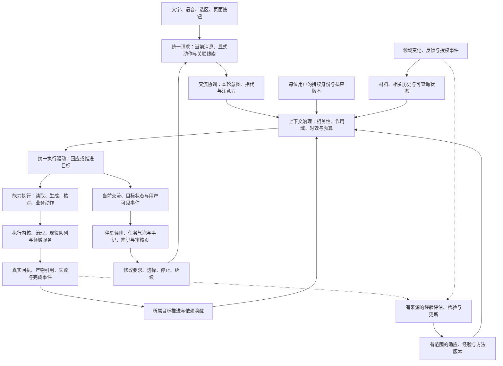

# 42｜统一 Agent 系统与伴星成长：全项目能力、持续身份与任务体验

> 日期：2026-10-04。本文依据本次用户决定重写，替换原 42；定义产品目标、前后端合同与实施顺序，不表示这些目标已经实现或通过窗口验收。
>
> 用户决定：项目要有真正的统一 Agent，支撑能力广泛、能够理解和做事的伴星，以及一致的 AI 体验。后端能力与伴星展示给用户的 UI 一起推进。
>
> 本次补充决定：分层同时落实到代码依赖、状态归属与唯一实现，便于扩展和维护，删除重复编排。上下文按当前交流治理：用户从任务转向家常时自然回应新话题，任务仍可独立运行；再谈任务时按真实状态接续。伴星的交流、人格、注意力与工作能力一起设计。
>
> 持续身份与成长决定：整个项目共用同一套 Agent 系统，AI 贯穿全项目。每位用户拥有持续存在的伴星身份，伴星汇聚全部已接入能力，具有稳定人格，并通过真实经历、用户反馈和经过检验的经验逐步形成适合用户的做事方式。成长同时覆盖理解用户、执行能力、合作默契与人格表达，用户可查看、纠正和撤回变化。
>
> UI 补充决定：伴星以轻气泡完成日常交流与任务操作，完整内容融入现有“我们的对话手记”。默认突出状态、成果与下一步，长要求、交付与过程逐级展开；轻气泡保留完整操作，Markdown 正确渲染。
>
> 架构复核更新：2026-10-05。本轮确认的公共机制、领域按钮、注意力和状态投影缺口，以及方法目录3项/API分层1项回归已修复并重新验收；上一轮未经核对的“全部完成”声明撤回。交流与目标共用core组合器和记录预算，现役速看/演示/拓展/制卡按钮进入同一AgentRun协议。用户确认的3组设备验收与原生窗口心跳复验保持有效。当前事实和负面样本见[架构复核](../../../outputs/agent-42-implementation/architecture-review-repair.md)与§14.6，长期效果不能由闭环通过推导。
>
> 阅读分工：[41](./41-note-companion-learning-experience-2026-09-28.md)定义笔记与学习事实；[41a](./41a-unified-agent-foundation-2026-09-28.md)保留可靠执行基础；[40](./40-companion-long-term-experience-and-diary-prd-2026-09-25.md)定义人格、记忆与日记；[40b](./40b-companion-runtime-and-observability-2026-09-27.md)保留运行、失败与观测边界。本文负责全项目 Agent 系统、持续身份、目标编排、能力组织与成长闭环，以及伴星与纸面的共同体验。冲突取舍见 §15。

## 1. 目标：全项目共用系统，每位用户拥有持续成长的伴星

统一 Agent 承担**目标理解、上下文使用、能力选择、执行接续与结果反馈**。用户通过对话、语音、选区或页面按钮提出需求，进入同一套 Agent 请求与运行协议；Agent 根据任务选择直接回答、执行一个专业能力，或持续组合多个能力，直到达到约定的交付条件、需要用户判断或触及明确边界。

伴星是这个 Agent 的可见角色与自然交流入口。人格决定怎样交流，真实能力决定能做什么；角色在纸面旁持续存在，用户可以看见进展、检查产物、改变要求，并在回来时接续同一件事。

“万能”在本项目中指可扩展、可组合的能力覆盖：逐步获得阅读、查找、解释、创作、整理与已授权操作的能力。“智能”通过具体任务检验：能理解代词与当前材料，合理选择步骤，利用真实反馈调整，记得用户刚刚改变了什么，并知道何时完成。工具数、模型调用数、回复长度和 Live2D 动作数都不能单独证明智能。

### 1.1 用户能感知的成功

| 用户需求 | 应有行为 | 用户看到什么 |
| --- | --- | --- |
| “讲讲这句话” | 使用冻结选区和适当上下文，短路径完成 | 原句旁解释；可继续追问与回原文 |
| “用这篇笔记做一个演示，再挑值得复习的内容做卡片” | 读取材料、选择专业能力、处理依赖、核对产物并交付 | 同一件事的进展、演示与待审核卡片；每件产物有自己的真实回执 |
| “演示太复杂，先只讲第一个机制” | 绑定所指产物与新要求，调整后续步骤，生成新版本 | 修改目标清楚；旧演示可回看，新版就绪后可由用户打开 |
| “先别做卡了，我想再看一会儿” | 停止尚未开始的制卡，核对已经运行的部分 | 保留已有演示；说明卡片停在哪，不把取消说成失败 |
| 离开页面、关闭客户端后回来 | 从持久任务与产物状态恢复 | 能找到原目标、已完成部分、待处理事项和继续入口 |
| 刚询问任务，下一句说“今天晚饭真好吃” | 回应新的日常话题，保留后台任务而不继续播报计划 | 自然聊天；无须切换“任务/闲聊模式” |
| 聊过家常后说“刚才那个演示怎么样了” | 找回所指 run，查询最新回执，继续讨论 | 准确接回任务；不重复生成、不重问已有明确背景 |
| 闲聊或今天不想学习 | 按当前话题交流或安静陪伴 | 无强制学习流程，无任务欠账 |

“帮我弄懂”不能自动被解释成“生成所有东西并安排复习”。Agent 可以先给合适的讲解；需要扩大行动范围时说明具体下一步。交付内容也不能冒充用户已经掌握。

### 1.2 统一后的三条直接原则

1. **单次调用可以是完整执行。** 明确的小任务允许直接完成；复杂目标的步骤由 Agent 结合结果选择。专业能力内部可保留分块、结构化输出和确定性核对。
2. **入口不同，能力与回执一致。** 页面按钮可限定能力与输入，直接启动短路径；自然语言可开放组合。两者使用同一身份、上下文、预算、产物引用与生命周期，不要求先产生聊天回复。
3. **统一的是逻辑与协议。** 每个用户、空间和目标有独立运行；一个长任务不会锁住全部聊天或其他任务。内部模型与执行队列按职责选择。

### 1.3 共用系统、持续身份与场景状态

| 范围 | 共用或持续的内容 | 隔离与变化 |
| --- | --- | --- |
| 全项目 Agent 系统 | 请求、上下文、能力、执行、事件、治理与经验使用机制 | 各领域保留专业方法和权威业务事实；不同宿主按端口接入 |
| 每位用户的持续身份 | 稳定角色设定、已允许的账号偏好、一般合作习惯与适应版本 | 用户之间独立；身份不由当前页面、某个 run 或模型供应商决定 |
| 空间与具体经历 | 材料、目标、共同事件、关系记录、对话、任务经验和产物 | 按来源及 PRODUCT 的空间规则读取；切空间重新核对可见范围 |
| 当前交流与目标执行 | 本轮注意力、冻结材料、任务 revision、实际依赖 | 各自更新；结束一次回复或交付一个产物不重置持续身份 |

笔记、来源、搜索、星图、学习卡、练习、复习、设置与伴星入口逐步接入同一系统。用户发起的开放目标由同一 Agent 理解和组织；生成、评分、嵌入、记忆维护与语音基础服务复用同一执行治理，按实际需要采用短路径或专业流程。角色表达贯穿用户体验，内部结构化协议与正式评分仍按各自合同执行。

本次修订把“每个空间各有一位”调整为**同一用户的伴星进入不同工作环境**。换入口或空间时，“她是谁、我们一般怎样合作”保持连续；具体经历与关系内容仍按空间读取。现役熟悉度和互动计数可继续作为本地统计，不承担身份判定，也不自动合并为账号画像。

跨空间携带继续限于已允许的非本地偏好与一般合作习惯，沿用模型绑定提示与服务端规则两道检查。由本地材料、任务或关系推导出的经验及手册不能仅靠改写成抽象措辞就升到账号层；账号适应配置不得成为空间隔离的旁路。

## 2. 当前基础与需要补齐的部分

以下保留 2026-10-04 实施前的源码基线。后续实际落实范围与验收见本文开头的实施记录。路径相对仓库根。

| 现役资产 | 可沿用的基础 | 本方案要补齐 |
| --- | --- | --- |
| `packages/shared/src/ai-task-kernel.ts` | 单步任务身份、预算、检查点、取消、事务外执行与提交回执 | 持续目标、跨能力依赖和父子预算归属 |
| `workers/ai-worker/src/handlers/companion-agent-runtime.ts` | 已有模型—工具循环、流式、工具账本、确认续跑与步骤恢复 | 从对话轮次扩展为目标执行；后台结果驱动接续 |
| `packages/shared/src/db-schema/companion-conversations.ts` | `companion_turn_runs`、步骤、工具与提案的持久身份 | 独立于聊天消息的目标运行；一段对话与多个目标的关联 |
| 笔记任务 handler、制卡 V3、API 讲解与评估 | 专业生成、校验、候选与领域状态 | 可由 Agent 组合的能力合同和运行回执 |
| `CompanionHud.tsx`、`CompanionHistoryDrawer.tsx`、`companion-agent-rail.tsx` | 轻聊、历史、动作提案与工具节点呈现 | 目标与产物成为主信息；修改、等待、局部失败和跨轮接续 |
| `CompanionNotificationCenter.tsx`、笔记任务通知 | 任务、提醒等独立消息通道 | 按同一运行与产物归并送达；跨入口去重与恢复 |
| `CompanionPresence.tsx` 与稳定座位几何 | 窗口内 Live2D、纸面与角色共处 | 任务气泡、手记与缩放下的共同布局、焦点与打断体验 |

当前伴星已经具备局部 Agent 形态。`companion-tool-intent.ts` 已区分当前用户文本与少量历史，但输出只有 `needsTool` 布尔值；`companion-dialogue.ts` 还装配页面、记忆、摘要、账本与交接。前者不能单独表达话题切换、任务关联和混合意图，后者的上下文也需要相关性与作用域治理。这里指出合同缺口，不由源码直接断言某一条闲聊已经失败。

40 §4.6/§4.8 已定义表达经验、行动手册与有版本的人格修订；本文复用这些机制，补齐做事经验、后续使用效果、全项目状态感知与持续身份。上述既有设计不等于当前代码已经形成完整成长闭环。

新工作重点是把现有基础与各领域能力、长任务状态及产品 UI 连成完整闭环。把 handler 改名、抽出循环或登记更多工具，不能单独完成这个目标。

## 3. 目标架构与职责



| 层 | 负责 | 输出与边界 |
| --- | --- | --- |
| 请求与上下文 | 明确当前请求、目标对象、来源版本与发起者 | 可验证引用；客户端入口信息不构成授权 |
| Agent 编排 | 选择能力、组织依赖、利用结果调整、处理等待与完成条件 | 持久运行及下一步；不能自行授予权限 |
| 专业能力 | 生成/检索/检查的具体方法与输入输出合同 | 候选、检查回执或业务回执；内部可单步或多步 |
| 可靠执行 | 模型适配、租约、预算、检查点、取消和故障分类 | 实际用量、运行结果；模型等待在事务外 |
| 领域服务 | 权限复查、版本核对、正式保存与排期 | 领域事实的唯一提交回执 |
| 表达与展示 | 人格、可读进展、产物呈现、用户操作和 Live2D cue | 同一事实的不同视图；不从文案推断执行成功 |

Agent 自己的任务协调状态可以持久化；笔记、学习卡、速看、批注和演示仍保存在各自领域。统一的是引用、执行和展示协议，不另造一份正式知识库。

### 3.1 分层必须对应独立职责与依赖

| 职责层 | 唯一负责的内容 | 不应承载的内容 |
| --- | --- | --- |
| 入口适配 | 认证、typed 请求、用户显式操作与来源引用 | 模型规划、提示拼装、业务 SQL 和产物状态机 |
| 当前交流协调 | 理解最新消息、解析讨论对象、当前注意力、回复与任务动作的关系 | 长任务预算/租约、记忆存储、正式业务提交 |
| 上下文治理 | 来源校验、相关性选择、作用域、时效、裁剪和执行快照 | 自行推进目标、授权业务动作、生成角色表演 |
| Agent 运行 | 一份执行循环、目标推进、依赖等待、检查点和取消恢复 | 具体人格文案、笔记教学方法、领域 SQL、UI 布局 |
| 能力与领域 | 专业方法、依据核对、正式业务规则及提交 | 另一套通用模型循环、聊天话题控制或全局通知策略 |
| 身份与经验领域 | 稳定身份、适应配置、经验来源、合作方法版本与用户控制 | 另一套执行循环、权限自改、正式学习事实或评分口径 |
| 基础设施 | 实现模型、治理、存储、队列、事件和时钟端口 | 根据旧任务决定用户当前想聊什么 |
| 表达与呈现 | 注入有版本的人格；投影可读事实；布局、语音与 Live2D | 独立推断权限/完成事实，接管目标或会话主状态 |

依赖从入口指向应用协调与运行核心，再指向纯合同和显式端口；数据库、provider、队列等适配器实现这些端口，在宿主组装处注入。核心不反向导入 API 路由、worker handler、React、具体数据库或伴星 preset。§13 给出代码组织与验收方式。

### 3.2 当前交流与持续工作各有状态

当前交流维护**这条消息在谈什么、指向谁/什么、需要怎样回应**；目标运行维护**那件事做到哪里、还依赖什么、授权和预算是否有效**。话题切换只改变当前交流，停止/修改任务需要对应的真实请求；任务完成事件只推进目标和产物，不能把前台话题切回任务。

普通闲聊产生会话 turn 与有限执行记录，不默认创建一件待完成的业务目标。任务讨论可以只查询或解释，不自动修改 run。伴星的角色身份和记忆范围连续，话题、回答结构与工具使用按当前消息变化。

两种状态使用同一执行核心、能力合同和消息协议，各自持有自己的状态。不能通过“学习 Agent/闲聊 Agent”两套人格、两份循环或强制用户选模式来解决切换。

### 3.3 状态所有者与生命周期

| 状态 | 所有者 | 何时变化 |
| --- | --- | --- |
| 当前交流对象、待回答请求、回复 generation | 会话协调层 | 用户新消息、明确选择或当前交互结束 |
| 目标 revision、子依赖、目标完成范围 | Agent 目标运行 | 用户真实修改/停止、操作回执及依赖事件 |
| 正式产物、审核结果和保存回执 | 对应领域服务 | 通过该领域的提交条件 |
| 被装配的上下文快照 | 一次实际模型请求/执行步骤 | 请求前冻结；补取材料后产生新快照，新消息/新 revision 重新装配 |
| 持续身份、人格与账号适应版本 | 账号/伴星身份领域 | 按用户设定及 40 的准入、版本与生效规则 |
| 空间关系、做事经验与合作方法 | 现役记忆/经验领域 | 有来源的反馈、使用效果、纠正、遗忘与停用；适用范围独立核对 |
| 领域状态引用与失效水位 | 对应领域及来源解析端口 | 实际领域提交、版本变化与授权事件；缓存不产生第二份业务事实 |
| 选中纸页、草稿、滚动和显示焦点 | renderer 对应交互模块 | 用户界面操作；不构成服务端执行事实 |

模块通过有身份的请求/事件交接；不共享一块任意改写的全局上下文对象。切换空间、并发目标和迟到事件均按上述所有者核对，不借“统一”抹掉隔离。

## 4. 请求、目标、回合与产物的共同身份

下述对象名是目标合同，物理表与接口名在阶段 0 依据真实调用链落定。

| 对象 | 必要内容 | 生命周期 |
| --- | --- | --- |
| `AgentIdentity` | 用户身份、角色设定引用、允许的账号适应引用、各空间经历入口 | 用户的持续身份；与模型、会话、页面及某次 run 独立 |
| `AdaptationRef` | 偏好/合作规则/方法身份与版本、来源、适用范围和有效状态 | 执行按需读取；纠正、反证、停用和遗忘可使旧版本失效 |
| `AgentRequest` | 幂等请求身份、最新请求内容、入口、显式动作、弱关联线索、可选目标/产物身份、预期 revision | 一次交流、发起或用户修改；身份与权限从认证上下文取得 |
| `AgentSession` | 用户与空间、当前交流状态、相关对话及目标引用 | 交流与任务的关联，不承担全空间唯一执行锁 |
| `AgentRun` | 原目标、当前目标 revision、完成条件、输入引用、范围、预算、当前状态、待处理依赖与产物引用 | 从接收到具体目标交付；可以跨多段回复与多个执行尝试 |
| `AgentTurn` | 一次交互/执行片段、消息/后台事件身份、可选关联 run、attempt、实际模型/提示版本 | 回应当前交流或推进工作；普通闲聊无需绑定业务 run |
| `AttentionFrame` | 当前用户消息、讨论对象/话题引用、所需回应与前台交互 revision | 每次新消息重新判断；未完成任务不自动成为当前话题 |
| `ContextSnapshot` | 本次注入的条目/来源/版本、裁剪与事件水位、当前请求及上下文计划 | 执行快照用于可复现恢复；不是下一轮沿用的完整聊天提示 |
| `Operation` | 稳定操作身份、能力/版本、输入哈希、因果关系、领域任务引用、回执与预算归属 | 一个可核对的动作；重启和 provider 新 call id 不改变业务身份 |
| `ArtifactRef` | 类型、领域 ID、版本、来源版本、候选/正式状态、检查回执引用、可用操作 | 引用领域产物；不同 UI 读取同一对象 |

### 4.1 必须解决现有表的限制

`companion_turn_runs` 当前要求关联对话与用户消息，并对同一 conversation 的活跃 turn 设唯一约束。它适合当前对话轮次，不能直接承担无聊天入口、跨长任务的全部目标。

阶段 0 建立独立目标运行及与现有 turn 的关联；复用原步骤检查点、工具账本和提案语义。后台等待不长期占住活跃聊天轮次。新聊天不会默认取消其他已接受目标；用户针对某件事的修改和停止必须带明确 run 身份。迁移需要同步 API、worker、共享合同和桌面呈现，不能只扩状态枚举。

### 4.2 版本与事实来源

- 目标 revision 与笔记版本各自独立。用户改变要求提高目标 revision；读取/生成仍引用明确的不可变材料版本。
- 未保存的正文按 41 选择“使用已存版本”或“保存后开始”，不在后台悄悄冻结未知草稿。
- 计划是可变的意图摘要；操作与回执记录真实发生的事。计划中出现“制卡”不代表已开始，更不代表已保存卡片。
- 新产物保留来源与版本；用户改稿时旧版可回看，新版通过核对后才成为本次要求的交付结果。
- 目标协调层记录依赖与完成归属；领域状态仍由领域服务负责。Agent、纸面和通知读取同一回执，不能各自产生第二套业务终态。

## 5. 运行闭环：从理解到完成，等待后继续

### 5.1 一次执行片段

1. 校验请求与权限，取得当前回合身份；需要创建/推进目标时再关联 run。接受请求后立即给出对应的真实身份与界面回执。
2. 用户输入先理解当前交流与任务关系，再按上下文计划装配必要材料。明确能力请求可直接执行；开放目标由模型理解并选择下一步。后台事件按所属目标推进，不替代前台意图。只有真实歧义或缺少必要决定时才向用户询问。
3. 需要工具/能力时为下一步登记稳定 operation，核对作用范围、预算、授权与依赖，再执行；可直接回应当前交流时采用短路径。
4. 读取真实结果：成功、候选、待确认、后台运行、未执行、不可用、失败或结果待核对。结果作为数据进入后续判断。
5. 同步用户可见进展与可读产物；有依赖时进入等待并释放执行资源。
6. 新结果或用户反馈到达后，涉及目标的工作依据其当前 revision 判断继续、修改、换可用路径、请求选择或结束；纯交流以当前回合意图为准。
7. 当前回复完成时结束该 turn；涉及目标且达到约定完成条件时另记交付范围与产物。未完成的部分明确保留原因和处理入口。

简单问答不要求先生成完整计划，也不默认追加模型自检。复合任务允许短计划帮助理解，但不把所有可能步骤写成必须经过的固定流水线。

### 5.2 后台任务是可等待的依赖

启动长能力必须返回 `operationId + domainTaskRef + acceptedReceipt`。工具调用在拿到接收回执后返回；root run 进入对应等待状态，保留下一步所需的依赖和完成条件。

领域任务完成、失败或取消时，在提交事务中记录可恢复的事件/outbox；消费事件唤醒所属 run。唤醒按 operation 与事件身份去重，同一 run 一次只由一个带租约的执行片段推进。重启后根据账本、领域回执与待处理事件恢复，不能依赖内存 Promise、某个仍打开的 SSE 或客户端轮询来完成编排。

恢复先核对当前 revision、取消、权限、输入版本和依赖结果；已经保存但不再适用的结果保留为相应历史，不推动新目标。在途旧结果没有有效提交授权时不能借“归档”继续业务写入。重复完成事件不再次生成产物，不再次执行业务动作。

完成送达与 Agent 接续是两个动作：静默时段可压低对外打扰，已接受任务仍按合同执行和保存。用户回来时能直接看见结果，不需要重新发一句话才能推动后台依赖。

### 5.3 修改、停止与恢复

- “只讲第一个机制”绑定当前演示/任务，记录新请求及目标 revision。尚未开始的旧步骤失效；在途旧步骤提交前重新核对，不覆盖新版交付位置。
- 独立的新任务另建 run；闲聊与普通知识问答按当前会话回应，不自动建目标或绑定旧 run。多个任务/对象确有歧义时，给出少量具体对象供选择。
- 停止目标要处理尚未开始与正在运行的子操作。UI 先显示“正在停止”，收到确定回执后显示“已停止”；已经完成的产物留在记录。
- 暂停在阶段 0 不作为无依据的万能按钮。只有能力能够保存安全断点、释放租约并恢复时才提供；其他能力提供停止与明确的新请求。
- 失败恢复从可用检查点或未完成 operation 开始。`outcome_unknown` 先核对业务结果，不提供盲目重做按钮。
- 用户拒绝一个待确认动作后，记录拒绝范围，合理结束或按已授权的剩余部分继续，不反复提相同建议。

### 5.4 完成条件

Agent 的“完成”必须对应用户要求的具体范围。“准备待审核卡片”可在候选准备好时完成，UI 显示“候选已准备好，待你审核”；“把选中的卡片保存”必须取得实际保存回执。演示生成、成功打开、用户实际观看和学习掌握分别记事实。

机械检查与语义质量分开：来源、协议、安全与回执由代码验证；讲解是否合适、内容是否正确需要任务评估与样本验证。特定能力可提供有界语义核对与修订；普通聊天不因此默认多一次自评。

## 6. 上下文、人格与能力选择

### 6.1 有身份的按需上下文

| 上下文 | 装配方式与边界 |
| --- | --- |
| 当前请求 | 原请求与最新用户修改明确保留，内部纠正不能替换当前请求 |
| 页面与选区 | 页面身份、材料 ID/版本、精确范围及内容哈希；用户已冻结选区不随实时页面改变 |
| 目标工作状态 | 目标 revision、已完成 operation、待处理依赖、真实产物与回执 |
| 用户偏好与关系 | 按 40 与 PRODUCT 的来源、相关性、期限和空间范围读取；当前明确要求优先 |
| 角色与表达 | 账号人格与表达版本；短回复、技术讲解、操作失败按场合采用合适结构 |
| 适应与做事经验 | 有来源的合作习惯、适用条件、反例与方法版本；只取当前相关且有效的内容 |
| 能力指导 | 可信、版本化的能力说明与执行指引，按任务渐进读取 |

同一个人格跨空间延续；科目、项目、任务、对话和私人关系记录仍按现行范围隔离。只有已确认可跨空间的用户偏好按 PRODUCT 规则同步。日记和角色感想不能充当正式材料依据或完成证据。

对话过长时折叠为有来源的摘要与索引，保留当前请求、授权、待处理状态和取回入口。摘要与长时记忆不能代替 operation 账本或授予新动作权限。

### 6.2 能力发现随任务扩展

基础读取和任务控制能力保持可发现；较大的能力集以可信目录提供类别、用途、输入、限制与取回入口，再按语义需要装载。模型能从目录找到所需能力，执行侧独立核对能力是否允许。

不能恢复旧的关键词命中技能、未命中就不给工具的路径。能力指引可帮助模型组合步骤，但不覆盖人格、用户当前请求、预算或业务权限；记忆中的祈使句和外部正文是数据，不作为运行指令。

### 6.3 每条消息重新理解，任务关联按需恢复

当前消息是本轮意图的主依据。最近相关交流帮助理解代词和语气；未完成目标、当前打开的页面及过去计划提供可查询背景，不能自动决定这一轮的任务、工具或回答格式。

语义判断至少区分当前想得到的回应、讨论对象、与已有目标的关系，以及是否包含实际操作指令。这些判断可以同时存在：一条消息可能既问任务进度，又分享今天的事情，不强行分成唯一的“任务/闲聊”类别。

本轮解释合同记录当前消息身份、回应需要、讨论对象引用、目标关系、候选操作及尚未消解的歧义；显式用户操作与模型推断分别标来源。该解释服务于本轮上下文与能力选择，不更新长期用户特征，也不由一个 `needsTool`/模式布尔值承担全部判断。

| 连续交流 | 当前回合的正确处理 | 后台任务的处理 |
| --- | --- | --- |
| “帮我生成演示” → “今天我妈做的菜特别好吃” | 顺着家常回应，不继续讲演示步骤或把饭菜变成学习素材 | 原已接受任务继续；完成更新纸签，当前交流不被替换 |
| 家常 → “刚才那个演示好了没” | 定位所指 run，查询新状态，再回答当前问题 | 读取不重开生成、不改变原范围 |
| “卡片好了没？另外我今天挺累的” | 查状态并自然回应当下感受，说明结果与可选下一步 | 不自动停任务、改排期或记成长期人格标签 |
| “先别讲学习了，陪我聊会儿” | 进入当前想聊的话题，不强行追问任务 | 收起学习播报；没有明确停止指令时不取消已接受任务 |
| 待确认动作 → 聊家常 → “嗯，好” | 按当前家常理解短回应；若具体业务授权仍有歧义则不提交 | 原提案留待明确决定或按合同过期 |
| 家常 → “回到刚才那张卡，把解释改短一点” | 解析具体产物和修改意图，读取该对象后执行新要求 | 只修改被指向的范围 |

普通阅读、纸页展开和光标位置是弱关联线索；用户点击“修改这个演示”等动作提供明确对象。对象被选中也不等于允许任何写入，最新消息的明确转话题优先于 UI 的关联提示。只有确有歧义时询问对象，不让用户为正常闲聊手动切模式。

必要语义判断可与主模型首步合并：给最新消息、少量相关尾部和可查询的任务索引，再按需读任务详情。额外分类调用需要收益与成本证据，不把每轮串联“分类—召回—规划—自检”作为默认形态。分类失败不能推定延续、取消或批准旧目标，也不能强制把无关闲聊导回任务。

迁移时复核旧 `needsTool` 与强制工具/补救分支的真实行为。工具是否必须执行以当前请求和所需事实为依据；未知分类不能沿用上一轮结果或强制找任意工具完成闲聊。必要查询与已授权动作仍需真实执行回执，不能为了切话题把“说了没做”降为可接受行为。

### 6.4 上下文计划：什么应该进入这一轮

完整模型请求计量、80% 压力触发、摘要连续覆盖、跨会话检索与来源失效的实施细则见 [44 §3–§5](./44-unified-context-window-and-compaction-2026-10-05.md)。全系统共用治理，每次调用仍按当前交流或对应目标装配工作上下文；沿用本节与 §6.5 的隔离合同。

每次执行先建立可检查的 `ContextPlan`，由当前请求、已验证关联与任务/表达合同决定需要什么材料。上下文条目保留来源身份、用户/空间/目标作用域、版本或事件水位、读取时间/有效期、用途、信任边界及实际 token/字节成本；通过解析器取得后再装配为执行快照。

装配可以渐进完成：首步使用当前请求、必要协议/人格、相关尾部与允许读取的目录，理解需要后通过同一执行驱动补取材料并更新计划。不能以“先完全分类”为前置而另建一套循环，也不必为普通闲聊预先读取所有任务、笔记与记忆。每次实际模型请求记录它最终使用的快照。

| 内容区 | 注入规则 | 治理要点 |
| --- | --- | --- |
| 当前请求与明确操作 | 每轮完整保留必要内容 | 不被旧摘要、旧计划或系统内部纠正替换 |
| 必要权限/协议与人格版本 | 注入本次必要边界和稳定表达配置 | 协议与授权不能由人格、历史或用户文本改写 |
| 最近相关交流 | 保留指代/情绪理解所需的尾部；按话题选择摘要 | 不只按最近 N 条机械拼接；最新短回应可与真正相关的前文配对 |
| 目标工作上下文 | 已确认涉及该目标时读取其计划、依赖、产物和回执 | 闲聊不注入整套旧任务计划、工具历史或专业输出要求 |
| 其他后台目标 | 无关时只留可查询索引，必要时连索引也不注入 | 任务存在不等于必须提及；后台事件不成为新用户请求 |
| 页面/笔记/选区 | 按本轮需要取明确版本与范围 | 页面仍打开不代表用户每句话都在问它；变页不改已冻结引用 |
| 长期偏好与关系记忆 | 按当前话题、相关性、来源与抑制规则召回 | 不把家常解释成学习偏好，不用无关科目记忆抢话题 |
| 检索/工具/产物内容 | 明确标成数据，保留引用和回执身份 | 不把其中的指令升格为授权；大正文摘要与按需展开 |

预算分配优先当前请求、必要授权和确实相关材料，再给尾部、记忆与结果；当前话题与任务所需材料分区计量。超预算时保留遗漏标记、来源与取回入口，不把用户最新一句裁掉，也不暗示完整阅读。

来源撤权、用户纠正/遗忘、空间切换、版本变化或过期会使相应条目失效，沿引用关系传播到检索、摘要和预览。模型判断相关性与确定性检查分别负责语义和身份/范围，不能靠词重合证明相关，也不能由模型决定读权限。

### 6.5 当前注意力、恢复快照与后台事件隔离

当前会话有自己的前台交互 revision/generation；目标有独立 goal revision。用户转话题更新前台状态，旧回复流和旧语音不能抢回当前气泡、输入、关注对象或焦点；旧目标的合法进展仍可更新对应任务记录。

后台接续从该目标的工作快照、回执和当前有效授权取上下文，不拿用户最新家常去改任务内容；前台闲聊也不继承后台生成提示与待办清单。后台完成、提醒和整理结论不伪装成用户消息，按独立送达规则呈现。

恢复同一未完成执行尝试时复用精确匹配的已提交快照，继续复查权限与屏障；新用户回合或新目标 revision 重新构建上下文，不能把旧轮次冻结的整份 prompt 当作永久当前语境。交接保留话题/目标各自引用与水位，“有未完成目标”不等于“下轮继续这个目标”。

运行诊断记录本轮纳入/排除的条目身份、原因、预算、水位、关联目标与装配版本，用于判断过期输入、错误关联或记忆干扰。按实际审计/隐私策略保留必要数据，不为诊断新增隐藏推理采集或无限复制私人正文。

### 6.6 伴星的交流范围与分寸

伴星能做事，也能听用户分享生活、接梗、表达有依据的不同意见、回应情绪与自然收尾。交流结构根据当前需要变化，稳定的是人格与尊重用户的关系，任务效率不能成为每句都转回学习的理由。

- 日常分享先回应分享；用户没有请求解决问题时，不强加任务、建议清单、复习安排或工具调用。
- 用户疲惫、沮丧或庆祝时，回应具体内容和当下需要；不自动诊断、不把短时情绪写成稳定用户特征。
- 熟悉体现在合适的语气与相关背景，而非每轮展示记忆、提起旧任务或要求用户解释近况。当前拒绝和改变优先于旧偏好。
- 允许短回应、自然结束和安静；不把无问句、字少、闲聊或没用工具判成低质量再强制重跑。
- 生活话题涉及实际知识问题时仍能回答或查证；不能因为它被归为闲聊就永久关闭能力。
- 同一轮包含关心、任务和资料讨论时，按用户表达安排主次；不切换成多个互相不认识的助手。

人格、长期记忆、日记和主动表达继续受 40 的产品边界约束；本文增加的注意力与上下文治理让它们在不同场合正确使用，不新建另一套关系记忆系统。

### 6.7 稳定人格与可成长的适应

伴星具有连续的角色特点、表达习惯、幽默分寸、兴趣与判断方式。成长逐步改变她如何与用户合作，并允许有依据的不同意见；用户表达偏好影响交付方式，材料事实、实际结果和正式评分保持各自依据。

| 成长方面 | 形成的有效变化 | 用户可感知的证据 |
| --- | --- | --- |
| 更懂用户 | 有条件的交流、讲解与节奏偏好，理解当前例外 | 少重复询问；相关场景采用偏好，当前新要求仍优先 |
| 更会做事 | 从真实结果中形成方法、适用条件、失败经验与替代路径 | 合理选择能力和交付次序，减少同类失误与无效步骤 |
| 更有默契 | 形成共同认可的合作方式和可定位的过去方法 | “像上次那样”可接回，例外、歧义及范围变化得到处理 |
| 人格发展 | 在用户允许范围内积累表达习惯、角色偏好与共同经历 | 跨日、跨入口像同一角色，变化有来源且能调整 |

稳定设定与适应经验分开保存、各有版本。用户指定的名字、核心设定和明确表达要求按 40 管理；模型只在已允许范围内提出表达修订。人格发展不更改输出协议、权限、来源规则或工具行为，不以取悦用户改变事实判断。

初期成长通过记忆、适应配置与方法使用实现，不以在线训练个人模型或自行修改项目代码为前提。新工具能力由真实接入扩大；Agent 能从既有能力的使用中学习更合适的组合。使用次数、等待天数、记忆条数和角色动作不作为成长等级。

### 6.8 成长闭环：从真实反馈到下一次行动

成长使用同一记忆、版本与执行系统，按需更新经验；不在每句话后强制分类、反思与人格重写。

2026-10-05 用户进一步确认整个系统按 Hermes 式长期 Agent 发展，后台任务也参与经验应用与产出。来源触发、实际采用、后续效果、同源派生去重及并发提交细则见 [44 §6–§9](./44-unified-context-window-and-compaction-2026-10-05.md)，复用本节准入与版本机制；新增细则的设计登记不代表长期效果已经验收。

1. **取得真实依据。** 区分用户明确纠正、明确长期要求、真实领域回执、具体评价、一次行为及模型解释，保留来源和当时版本。保存成功证明发生了提交，不能单独证明质量、用户满意或掌握。
2. **形成有条件的经验。** 记录适用对象/场景、时间范围、认识状态、相反证据及账号/空间归属。明确长期要求可按现役准入规则立即采用；不确定模式保持暂定，单次收起、删除、短回应或沉默不升为稳定偏好。
3. **在相关场景使用。** 上下文计划按需读取当前有效经验与方法，记录实际使用版本和作用范围；当前请求、场景例外与现行能力合同优先。
4. **检查后续效果。** 利用可核对结果与具体用户反馈判断是否减少错误、重复解释或返工。语义质量由样本评阅验证，点击、停留、无回应与模型自评不自动视为正反馈。
5. **保留、修正或撤回。** 有效经验追加适用证据；相反反馈缩小范围、修正、停用或替代。保留使用与修订关系，使用户能纠正，并使后续执行取得新版本。

经验至少保留稳定 ID、作者、来源事件/回执、适用条件、范围、认识与有效状态、版本、实际使用关联和修订理由。暂定、有效、停用及被替代分别表达；确定性的身份/版本检查与语义效果判断各自负责，不把一段自我总结直接提升为权威知识。

“以后讲机制先举例”可成为持续规则；“这次数学先推导”形成当前例外。后续明确说“以后数学都先推导”才按适用范围修订长期规则。用户直接纠正按 40 从下一轮未开始调用生效；一次已开始调用保留固定版本，后台整理不能覆盖新纠正。

### 6.9 做事经验与可复用合作方法

复用 40 的 Procedural 手册，覆盖有来源的做事方法。成功合作过的过程可形成稳定 ID、标题、条件、步骤与能力引用、例外、成功/失败证据、版本及状态。默认只给相关目录，需要时读取正文；正文中保留可核对依据，不保存隐藏推理。

用户说“按上次整理论文的方法来”时，解析所指方法与当前目标，读取当前材料，重新选择可用能力并核对参数、预算与授权。方法提供经验，实际步骤仍根据新输入和结果调整；旧产物、旧材料快照及旧确认不能被当成新任务的输入或权限。

经验方法与开发者提供的专业能力指引区分作者和来源。普通方法不创建新执行语言、工具权限或独立模型循环；能力发生版本变化、不可用或出现反证时核对适用性，必要时停用。长期规则也不能让 Agent 在用户未提出需求时重复启动旧任务。

来源纠正、遗忘、删除与撤权沿派生关系传到方法、适应配置、摘要、索引与缓存。空间方法不通过“通用经验”标签自动跨空间；确属账号范围的合作规则继续经过 §1.3 的准入检查。

## 7. 能力合同：专业执行与通用扩展

任务注册表与工具模块化服务于统一 Agent。每个能力登记一份权威 manifest；纯合同可放 shared，SQL、领域服务与 provider 接线留在宿主，通过执行端口注入。shared 不引入 worker/API 的数据库实现。

| 能力合同 | 内容 |
| --- | --- |
| 身份与用途 | 稳定 ID、版本、模型可理解的说明、适用对象与限制 |
| 输入输出 | 输入 schema、准备后的材料引用、输出/回执 schema、产物类型 |
| 执行形态 | 快速返回或后台任务、所需宿主、资源档、超时、可取消/恢复条件 |
| 授权与副作用 | 读写范围、实际风险、确认条件、领域幂等与提交方法 |
| 质量与依据 | 必须的来源、安全和内容核对；明确候选与正式状态 |
| 展示合同 | 人可读名称、真实进展单位、产物 renderer key、可用操作与失败恢复描述 |
| 预算与观测 | 模型调用/重试上限、任务父子归属、用量和因果事件 |

模型说明、用户文案与图标各有职责，但从同一能力身份派生。不再分别维护 registry、执行 switch、超时表、前端工具名文案与产物入口的平行清单。

新增能力的主要改动收敛到能力模块、必要的领域合同/持久化和相关测试。需要新数据、权限或 renderer 的能力仍应补齐这些真实依赖，不以“一个文件即可全链路”掩盖它们。

### 7.1 第一批真实能力

| 能力 | 对 Agent 的用途 | 保留的领域边界 |
| --- | --- | --- |
| 查找/读取笔记、来源、页面、相关记忆 | 理解目标与补齐材料 | 权限、实际读取范围、来源身份与当前版本 |
| 原句解释、整篇速看 | 交付讲解与范围摘要，作为后续选择依据 | 冻结选区/笔记版本、分块覆盖、依据核对 |
| 动态 HTML/SVG 讲解 | 针对材料与用户目标创作、按反馈生成新版本 | 整页自由创作、来源核对、安全检查、隔离 frame 与文字等价 |
| 学习卡生成与检查 | 为明确需求生成待审核候选 | 现役制卡 outbox、候选审核、正式保存与版本替代规则 |
| 拓展与比较候选 | 给用户可阅读、可修改的延伸材料 | 外部来源可核对；用户逐篇收下才成为正式笔记/关系 |
| 任务查询、结果读取、停止、核对 | 管理当前目标的实际依赖 | 不凭模型自述更改任务状态 |

### 7.2 怎样逐步获得更广泛的能力

除预制学习功能，还需要能组合的基础操作：检索材料、读取明确范围、读取已有产物、按反馈修订、渲染可解释内容、查询执行状态。Agent 可以用这些能力完成新的组合目标，不为每个用户句式写一条专属链路。

联网查证、文档文件处理、计算与代码执行等能力按实际产品需求接入，各自提供真实执行环境、资源范围与可验证回执。当前未实现的工具不出现在可执行菜单，也不被伴星承诺可用。生成 HTML 的隔离展示环境不能冒充具备文件、网络或业务写入权限的计算环境。

记忆抽取、摘要、嵌入、ASR/TTS 与评分可继续作为专业/基础服务，使用统一执行治理与观测。ASR/TTS 不为了体现 Agent 而额外经过目标规划；正式评分的依据和提交仍由独立业务合同负责。面向用户的目标由同一 Agent 负责组织这些真实能力。独立系统维护任务有自己的有限执行记录与预算，不虚构用户目标或因此发起新对话。

### 7.3 全项目状态感知与领域事件

每个功能域逐步提供可验证的对象读取、状态/版本查询、已支持操作、前置条件和产物入口。能力目录覆盖真实业务功能及导航/设置等窄入口，使自然语言和页面操作使用同一领域规则。接入时维护领域覆盖与缺口，不把全部功能名列进 prompt 就视为已经可执行。

Agent 按对象引用取得当前状态，长期存储保留真实领域事实与事件；上下文仅装配本次相关部分。领域事件至少标身份、用户/空间范围、对象与版本、因果关系和可恢复水位，提交、消费和重读复用 §5/§11 的事件机制。

| 实际变化 | Agent 应能理解/接续的内容 | 执行与交流边界 |
| --- | --- | --- |
| 笔记保存新版本 | 当前正文与旧演示/卡片依据的差异 | 保留旧记录，不擅自改既有冻结输入或重新生成 |
| 审核、编辑与正式保存 | 用户实际保留了什么、作了什么修改及真实回执 | 一次选择不自动证明长期偏好或理解掌握 |
| 任务失败、取消或能力变化 | 哪一部分不可用、哪些结果有效、方法是否仍适用 | 不虚构完成；不把基础设施失败推断为用户偏好 |
| 用户纠正、遗忘或来源撤权 | 相关经验、方法和缓存的失效范围 | 迟到整理和旧快照不能恢复被抑制内容 |
| 明确长期目标的依赖变化 | 新的里程碑依据、待处理事项与已授权的下一步 | 只唤醒所属工作；前台仍按当前注意力回应 |

持续数周的学习或研究目标按真实领域目标/项目引用组织多个 run。里程碑与完成范围来自任务和学习事实，不把一次产物交付当作整个长期目标完成。自动接续沿用户已明确的目标、范围和授权执行；新的行动范围按实际后果处理，普通念头或经验到期不自动发起工作。

事件可用于更新状态、有限后台整理或唤醒已接受目标；送达继续受静默、正式作答与当前交流约束。不靠固定心跳调用模型来表现持续存在，成长与状态感知也不要求全量持续读取所有材料。

## 8. 伴星 UI：轻气泡完成交互，手记容纳完整内容

### 8.1 设计概念与信息重心

**伴星在身旁，事情轻轻放在手边，完整记录留在我们的手记里。** 身边轻聊与任务气泡保持同一种轻量尺度；现有“我们的对话手记”承载详细要求、交付与接续；具体产物回到适合阅读和操作的领域纸面。三者按同一 run 与产物身份关联。

沿用 DESIGN 的清新、圆润、轻快：薄荷承托、奶油纸面、桃色行动和短物件阴影；标题与操作沿用对应入口的字体层级。原文、演示和卡片得到主要阅读空间，角色与即时交流保持可见。任务入口不另开接近小窗口大小的浮层；长要求、Markdown 交付和日志不挤进默认气泡。

气泡复用现有轻聊的纸面、圆角、色彩、字阶和停靠几何，按有效 CSS 视口留出可操作空间；手记复用已有阅读容器与输入。缩小展示必须通过信息层级实现，不能删掉真实交互，也不能复制一套窗口、会话或任务状态。

### 8.2 身边常驻与轻聊

- Live2D 沿用窗口内唯一形态和用户座位；阅读时低幅待机，动作只提供补充反馈，不移动正文或改变气泡停靠点。
- 输入区显示本轮可能使用的引用小纸签，如“这篇笔记 · 已存版本”或选中的原句。用户可检查、移除或换引用；页面和任务选中只是关联线索，不能强制每句都按任务解释。明确修改入口提供对象，最新消息的实际意图仍须核对。
- 提交即有接收状态；服务端接受后返回真实回合/任务身份。网络未接受时保留输入与重试，不能先宣称“已经开始”。
- 短问答直接在轻聊完成；复杂目标给出简短、与实际下一步相符的回应，并出现“查看这件事”入口。
- 后台等待时输入仍可用。用户可补充任务要求，也能直接聊家常，无需模式开关。转话题不取消任务，也不给家常套上任务标题、计划或停止按钮。
- 多个任务逐件选择，当前打开的任务不因另一个任务完成而自动换走。

### 8.3 功能完整的轻任务气泡

从“手边的事”或任务通知打开轻气泡，默认呈现这一件事的主要信息：

1. **先看重点。** 一句当前状态与主要进展，短目标帮助识别事项。完整目标留在手记，不能挤占气泡。
2. **已有成果。** 可直接打开的结果纸签，同一材料同类结果优先最新兼容版本；全部旧成果保留在手记。
3. **下一步。** 与真实状态匹配的短提示。部分失败区分已经做好的内容；结果不明先核对；额度用完仍保留成果并说明新的选择。
4. **完整操作。** “调整”按需展开修改要求、暂停、继续、停止及相关选择。可在气泡里完整编辑目标；失败保留草稿，提交带当前 revision，等待回执时阻止重复操作。不能只剩一个“去详情”按钮。
5. **接续与多任务。** 气泡可逐件切换；去手记定位所选目标并查看完整列表；回到轻聊共用草稿与真实会话。所选事项不被其他完成事件自动替换。

未来计划与已经发生的步骤分开表达。完成标签必须来自回执；无实际总量时不编造整体百分比或倒计时。调整区只在需要时出现，长草稿局部滚动，主操作始终可达；气泡不能随着长要求和交付说明无限长高。气泡尾部跟随稳定座位，通知、回复与任务不同时堆叠。

```text
轻气泡                       我们的对话手记
┌──────────────────────┐     ┌──────────────────────────┐
│ 正在生成             │     │ 全部对话 · 交给我的事    │
│ 速看已经整理好了     │ ──→ │ 任务列表 → 这一件的记录 │
│ 速看 ↗               │     │ 完整要求、成果、下一步  │
│ 调整 ▾ · 去手记      │     │ 已渲染的交付说明        │
│ [修改/暂停/继续/停止]│     │ 查看处理过程 ▸          │
└──────────────────────┘     │ 接着聊……                │
                             └──────────────────────────┘
```

示意表达信息关系，不限定全项目固定卡片数量或版面模板。操作按真实状态和能力可恢复条件提供。

### 8.4 产物按用途展开

| 产物 | 伴星侧呈现 | 深入操作 |
| --- | --- | --- |
| 原句解释 | 引用原句、可读解释、所用版本 | 回到批注锚点、换种说法；不覆盖用户正在写的批注 |
| 速看 | 简短成果纸签，完整说明在手记 | 打开该任务保存的速看，展开来源并追问 |
| 动态演示 | 简短成果纸签，完整说明与来源在手记 | 直接打开该任务保存的隔离演示，保留其自身版面；修改生成新快照 |
| 学习卡候选 | 真实数量、待审核状态与打开入口 | 打开现役审核页；沿用卡片实体与保存规则 |
| 拓展草稿 | 方向与打开入口，比较内容在手记/领域纸面 | 阅读和编辑各篇，逐篇确认收下 |
| 业务动作 | 对象、实际影响与执行回执 | 按真实合同确认/撤销；不以一句伴星回复代替提交 |

气泡、手记和领域页面共享产物引用与 renderer 合同；引用包含产物、生成任务、笔记与版本身份，不能只打开列表或误展示最近一次其他生成。长内容使用领域的完整阅读组件。领域按钮可走明确的能力短路径，不强制打开聊天或打断阅读。

### 8.5 手记、送达与接续

现有“我们的对话手记”增加“交给我的事”，与全部对话、待确认并列。先提供任务列表，再打开具体记录：完整要求与成果优先，下一步操作紧随其后，交付说明正确渲染 Markdown，详细过程默认折叠。进入任务记录从标题开始；聊天仍跟随最新消息，不能共用贴底行为把任务拉到末尾。

轻气泡与手记复用同一份服务端投影、修改控制器和产物打开路径。关闭任一视图只是收起展示，真正停止用明确的任务操作。在任务页发送新消息时回到对话，让回答可见，草稿与任务状态连续。人格、记忆、日记入口保留各自职责。

完成更新所属任务与持久记录，提醒按 `run + revision + 状态/产物送达事件` 去重。是否提示或说话遵循当前对话、静默、测评和通知合同；完成不抢焦点、不强制导航，也不自动打开气泡或手记。闲聊时不以任务完成替换当前回复或抢声道；自然指代和主动点击均读取同一最新状态。

关闭客户端不取消服务端已接受任务。依赖本机的能力明确记录“等待设备”，不假称客户端关闭后仍在本机运行。重开按服务端快照恢复；失权内容不因旧预览或旧消息继续展示。

### 8.6 动效、焦点与语音

气泡沿用轻聊的出现与收起，手记沿用已有开合，不增加大纸页过渡。操作即时生效；快速打开—关闭—打开、键盘切换和新要求立即响应，旧动画回调不能恢复过期目标或焦点。Esc 先收起调整区，再关闭气泡；焦点返回仍存在的入口。

Full 保留适合纸件与角色的低幅弹性；Lite 简化运动；Off 与系统减少动态直接呈现有效状态。状态不只靠颜色、动画或表情传达。阅读和主操作各有明确滚动所有者，焦点可辨认。

ASR 沿用本机模型和用户可选下载，不新增云端兜底。TTS 与文本交付分开，声音失败保留文本和成果；停止朗读、停止当前回答、停止整件任务分别标明范围。正式作答时伴星可见且静默，后台进展留在记录，不弹气泡、不播报完成、不自动注入答案；主动求助沿现有单次授权边界。

### 8.7 看得见、改得动的成长

成长通过日常行为体现，并在现有人格、记忆、对话与任务入口中按内容展示。用户能读到“我们逐渐形成的做事方式”，查看依据、适用条件及例外，调整或撤回；不按每轮弹出“我成长了”，也不把使用次数变成经验值、关系等级或连续签到。

| 入口 | 用户看到与控制的内容 | 表达方式 |
| --- | --- | --- |
| 人格页 | 稳定设定、已生效/待生效的表达变化及恢复入口 | 连续角色描述与具体例子；生效状态来自真实版本回执 |
| 记忆页 | 有依据的合作规则、暂定经验、适用范围、反例与停用状态 | 短手册与来源摘录；能纠正、缩小范围、停止使用或按规则遗忘 |
| 任务气泡与手记/历史 | 本次采用的方法、可复用的合作过程及对应结果 | 方法摘要按需展开；“这次换个方法”“以后这样”沿当前对象处理 |
| 轻聊 | 当场接受用户纠正，在后续合适场景采用 | 有必要时确认具体变化；不要求用户填一串成长设置 |

示例规则包括“讲机制先举例，数学推导除外”“复杂任务先交付可用版本，再逐步完善”“分享生活时先回应分享，少追加学习安排”。示例只说明可读形态，真正显示的内容须来自该用户有效记录。

“这次例外”“以后这样”“仅这个空间”“暂时不用”“撤回这次变化”各有明确作用范围。账号范围只提供给符合准入的内容；恢复旧版本仍重查当前来源、遗忘抑制与权限。普通调整不等于永久清除，彻底清除沿用 40 的范围说明与确认合同。

用户可以说“按上次的方法”，也能从手册主动选择；两种路径读取同一方法身份和新材料。收起手册或忽略提示仅改变展示，不被解读为满意、拒绝或新的长期规则。变化不抢焦点、声道或导航，普通阅读与任务操作保持连续。

## 9. 状态与操作：用户知道下一步是什么

运行、操作、交付和播放各有状态。以下是统一呈现语义，具体字段在 shared 中用 schema 定义；示例文案按真实对象与能力替换。

| 作用对象与状态 | 用户可读表达 | 当前可用操作 | 必须成立的事实 |
| --- | --- | --- | --- |
| 请求发送中 | 正在提交这件事 | 保留输入、必要时取消本次发送 | 尚不能宣称服务端已接受 |
| Run 已接受/排队 | 已接到，等待开始 | 查看来源、停止任务 | 存在真实 run 与接收回执 |
| Run 执行中 | 正在读这篇笔记/准备演示 | 查看当前工作、补充要求、停止 | 对应 operation 已实际开始 |
| Run 等后台依赖 | 演示正在生成，你可以继续阅读 | 合回、查看任务、修改要求、停止 | 关联真实领域任务，不占住聊天执行槽 |
| Run 等必要输入 | 需要确定你指的是哪一篇 | 选择具体对象、补充、放弃 | 只询问当前确实缺少的决定 |
| Operation 等确认 | 将保存这 4 张卡片/调整这些安排 | 查看影响、确认、拒绝 | 提案绑定对象、版本与实际后果 |
| 某能力不可用 | 这次无法读取图片；可继续解释文字 | 使用真实替代、处理所需设置 | 不伪造图像理解或无限重试 |
| 某部分确定失败 | 演示没做好；速看已保留 | 查看已完成部分、重试失败部分、结束 | 失败范围与有效产物可分别读取 |
| Operation 结果待核对 | 这一步的结果还需要核对 | 查询结果、查看已知状态 | 可能有副作用，不提供盲目重复动作 |
| Run 正在停止 | 正在停止剩余工作 | 查看当前范围 | 停止请求已接受，终态尚未确定 |
| Run 已停止 | 停在这里，已完成的内容保留 | 打开已有产物、按能力条件继续或另建请求 | 未执行部分不会继续提交；未知结果另行说明 |
| Run 已交付 | 演示已准备好；卡片候选待审核 | 打开、针对产物修改、审核 | 达到本次约定的范围，不等于卡片已保存或用户已掌握 |
| 旧目标 revision 被替换 | 已按你的新要求调整 | 查看旧版与当前版 | 旧结果保留为历史，不能推动当前 revision |
| SSE/网络中断 | 连接暂时中断，正在重新读取任务状态 | 保留当前内容、重新连接 | 不把连接故障推断为服务端任务失败或停止 |

主视图优先显示目标、真实范围、产物和下一步。工具名称、模型步数、预算与详细账本留在“查看过程/运行详情”，按需读取。展示给用户的是短计划和行动摘要，不采集或展示模型隐藏推理。

进行中、等待用户与失败事项不随回复气泡退场而丢失。完成可收成紧凑摘要，但仍有持久入口；具体展开与合回由用户意图和当前注意力决定，不按一个固定延时把所有结果藏起来。

## 10. 一个复合目标的完整体验

场景：“用这篇笔记做一个简单的互动演示，再整理几张值得复习的卡片。”下表为目标演练，不是已有用户数据。

| 时刻 | Agent/服务端行为 | 界面与用户操作 |
| --- | --- | --- |
| 提交 | 接受目标，冻结明确笔记版本，登记 run | 输入立即反馈；显示材料纸签与“查看这件事” |
| 理解材料 | 读取真实正文与必要来源，按用户要求和偏好选择步骤 | 当前工作是“正在读这篇笔记”；短计划可展开 |
| 生成演示 | 建立后台依赖；输入包含材料与创作目标 | 显示演示正在生成；输入区继续可用，用户可以合回阅读 |
| 演示完成 | 接收完成事件，核对来源、安全及可用回执；依据结果推进 | 产物出现真实打开入口；不自动替用户打开 frame |
| 准备卡片 | 基于冻结材料、明确范围与已有核对结果生成候选 | 真实题面/数量更新；演示仍可阅读，候选标明待审核 |
| 用户说“演示先只讲第一段，卡片暂时不要” | 新 revision 绑定当前演示；停止旧制卡剩余部分，记录新演示依赖 | “正在按第一段调整”；旧演示可看，卡片停止中/已停止按回执变化 |
| 新演示完成 | 有界核对，保存不可变新版，交付当前范围 | 新版可打开；旧版留在记录；不再启动被取消的制卡 |
| 用户稍后说“继续准备卡片” | 按当前明确范围建立后续执行，复用可用结果与核对已完成操作 | 接着同一材料工作；如需重新生成，明确这是新一批候选 |
| 审核保存 | 用户在审核页选择；领域服务原子提交 | 任务气泡、手记与审核页显示同一保存回执；剩余候选保持自己的状态 |

对照场景同样重要：用户只点“生成速看”，应直接进入该能力短路径并在笔记页看到结果；不先被带去聊天，不附送演示与卡片。两种场景共用能力与运行协议，交互深度按需求变化。

## 11. 前后端共同协议与展示事实

### 11.1 请求与动作面

提供 typed 的发起、补充/修改、读取目标、列出相关目标、读取事件、停止和决定提案等操作。桌面端通过现行 main/preload 网关接入；领域按钮可以保留窄业务路由作为适配入口，但最终创建同一 AgentRequest/Run，不能再独立编排一套模型流程。

客户端提交 `requestId`、当前消息、显式动作、可选 run/产物、预期 revision 与上下文关联线索。显式操作与“页面仍打开/纸页被选中”等弱提示分字段表达；普通发送不能因 store 中残留一个 runId 而自动成为旧目标修改。服务端从会话取得用户、空间与同意，校验引用、当前意图、允许的能力与真实对象权限，再决定回应、查询、发起或修改。通用能力 ID 和客户端自述的风险、角色、授权不能变成万能执行凭据。

提案继续使用现役确认与领域服务；确认时复查目标 revision、对象版本、作用范围及实际权限。过期提案明确失效，不在点击后悄悄换成新动作。

### 11.2 事件和快照

目标事件至少包含合同版本、事件身份、`runId`、目标 revision、单调序号、服务端时间与事件类别；操作、产物和 turn 事件携带对应引用。类别覆盖目标接受/调整、可读计划变化、操作状态、产物就绪、待用户处理、目标结束与送达状态。

文字流可沿用现役 delta 协议，必须关联 turn 与前台 generation；涉及目标时再携带 run 与目标 revision。回复完成事件只结束该回复，目标完成用独立事件表达。旧回复与迟到回调不得覆盖当前输入或回复；任务事件按所属 run、revision 与水位归并，保留仍有效的后台进展，过期结果不能改写新版产物或目标状态。

客户端首次打开/重连先读取快照及其事件水位，再续读增量；按事件身份与序号去重。快照与事件读取存在竞态时，用水位补读避免遗漏；过期事件无法续读则重新取得当前快照与持久操作摘要。旧快照不能覆盖已消费的新状态。

多个完成依赖到达时，由服务端一次推进并记录后续状态，客户端只做投影。涉及实际已读、送达或观看的事件按其真实能力命名，不能把“已渲染”自动视为用户已阅读。

### 11.3 一份投影，多处呈现

共享状态投影把 run、operation、产物引用和必要动作转为可读模型；伴星轻聊、历史详情、通知与领域任务提示复用。操作均带对象身份与作用范围，禁用和错误与实际请求绑定。

领域产物 renderer 负责阅读与业务操作；共享投影不复制其完整正文或另养编辑状态。渲染 store 管选中任务、纸页开合和阅读位置，服务端快照管执行事实。加载失败不能清空用户已有内容，重新请求不能抹掉草稿或抢焦点。

导航工具只准备好路由时显示“打开/前往”入口；用户点击并真正抵达才称“已打开”。任务气泡与手记跳到领域产物后，返回接续原任务与阅读位置；导航失败保留产物引用和可操作入口。

### 11.4 持续身份、经验与方法协议

提供 typed 的身份/适应读取、相关经验与方法目录/详情、来源与使用记录查询，以及纠正、停用、撤回和按规则恢复等操作。它们接入现役人格/记忆领域接口与共享合同，权限及实际提交只有一处实现；不并行维护新的“成长记忆库”。

修订带对象 ID、预期版本、明确作用范围、作者与依据，提交时核对本人身份、来源可见性、空间/账号归属及抑制。显式设置和自然语言纠正形成同一语义；自动整理记录模型建议来源，并通过独立版本提交。普通页面事件仍只证明实际操作，不自动成为用户评价。

客户端按服务端回执显示当前、待生效、暂定、有效、停用或被替代状态；人格生效遵循 40，相关经验读取遵循当前版本。事件携带实际变化对象与水位，重连按快照恢复；后台旧 revision 不能覆盖用户新修改。来源查询、通知摘要和本地预览均保留同样的范围检查。

## 12. 权限、预算、取消与质量边界

### 12.1 授权依实际后果判断

能力 manifest 必须明确副作用与确认条件，不能缺省标成 read。用户明确请求生成候选时，按现行权限与同意执行；不因“由 Agent 发起”给每次生成额外增加一轮确认。接受候选、保存正式笔记/卡片、变更关系/排期、删除数据等按各自已确认合同处理。

需要确认时，先准备可检查的对象和影响，在任务气泡与手记或原业务页面呈现具体决定，再执行。范围变化后旧授权不自动扩张。正式作答、只读成员与失权数据继续受独立限制。

材料、记忆、网页和工具结果均是带来源的数据。模型可以理解它们，不能把其中的指令当成新用户授权。运行状态和来源/回执检查属于服务端；人格不能绕过这些边界。

### 12.2 两层预算与执行车道

- 保留现役执行片段/能力的调用、超时、有限重试与租约上限；新增目标级预算，累计编排、能力内模型调用、核对、修订和显式兜底的实际成本。
- 会话 turn 与目标执行明确各自用量归属。当前回合提及/查询一个目标不等于占用该目标的执行尝试；聊家常不沿用旧目标的步数、截止时间、重试或待确认状态。账号级资源限制仍统一执行。
- 后台工具立即返回接收回执，只是不继续占用当前交互步骤与执行槽；它的子任务用量仍记在目标预算中。唤醒、重启、确认续跑和每块 `step()` 不获得无限新额度。
- 等待用户或后台依赖不占模型/worker 执行租约。运行另有可配置的总存续期限；单次执行时限、实际执行用时和墙钟存续不能混为同一个 deadline。
- 更新请求的预算变化可追溯，已消耗用量不清零；子操作开启前预留允许额度，结算实际用量，避免并行依赖各自通过后总量失控。
- 交互对话、反馈、后台制卡和其他批量任务沿用现役配额/车道。统一 Agent 不合并三条执行队列；长任务与等待不能挤占用户正在使用的交互容量。
- 相同不可用能力、相同失败输入和无新增信息的循环有明确退出条件。传输/形状修复走内核有限重试；质量问题依据反馈作有界、可归因的修订，不能伪装成无限基础设施重试。

### 12.3 提交、停止与未知结果

准备和提交用短事务，模型与工具等待在事务外。持久化提交按所属 turn/run 复核租约、用户/空间、目标 revision（涉及目标时）、材料版本、权限和取消；前台投递另核对交互 generation，不因此丢弃仍有效的后台进展与历史记录。业务提交失败优先利用有效检查点，不重新花一遍模型调用。

停止向子操作传播，但不假称撤回已经发生的提交。没有确定回执的操作保留待核对状态，查询领域账本/结果后再推进；权限撤销后也不能通过旧检查点回放受限内容。审计记录保留安全摘要与必要归因，不把凭据、供应商原文错误或隐藏推理送入 UI。

动态演示继续沿用整页自由创作与安全宿主：应用外壳负责嵌入、来源、滚动和文字等价，不把 HUD 的版面/配色模板塞给模型，也不因统一 Agent 扩大 frame 的网络、存储或业务写入权限。

### 12.4 成长工作的成本、隔离与变更边界

经验整理与效果分析有明确来源触发、独立的有限执行记录和后台额度，使用同一内核与账号资源治理；归属于具体目标的工作计入相应预算。没有新有效依据时不重复分析，不因“持续人格”要求定时重写 prompt。前台交流不等待后台成长作业完成。

可选经验读取、整理或效果分析失败时，仍使用已验证的角色配置与当前请求完成可执行工作。用户明确要求记住/修改却未提交时给出真实结果；授权或来源检查失败仍按现役边界处理，不能用旧配置绕过。成长作业不得占满交互容量或让全项目功能随其故障失效。

人格、偏好、经验与方法分别受版本和来源约束。模型提出适应变化不获得自改权限、注册工具、重写代码或改正式评分的能力。更换模型/provider 时保留持续身份与用户数据；实际表达和方法使用按新配置复验，版本失配或质量退化有停用/恢复入口。

## 13. 工程落点与迁移纪律

| 位置 | 承担内容 | 迁移要求 |
| --- | --- | --- |
| `packages/shared` | Agent 请求/事件/回执 schema、能力 manifest、预算与状态语义；可复用的纯运行协议/端口 | 类型与版本成对；不依赖宿主 SQL 或角色常量 |
| `apps/api` | 认证后的请求、目标控制/快照/事件接口、领域入口适配、业务提交与提案决定 | 发起与修改幂等；领域权限重新核对 |
| `workers/ai-worker` | 目标执行片段、能力宿主、依赖事件消费、唤醒与恢复 | 复用当前循环和执行内核；租约、检查点、预算和领域回执不丢失 |
| 伴星身份/记忆/经验领域 | 角色与适应版本、经验准入/使用/修订、方法及用户控制 | 复用 40 的来源、整理和版本服务；不另造模型循环或业务事实库 |
| 桌面 main/preload | 窄 typed Agent 网关、真实本机能力与语音输入 | 凭据留在主进程；新能力有来源与权限校验 |
| renderer `app` | 事件接入、快照恢复、共享任务投影与上下文引用 | 多入口、旧流隔离、空间切换与本地草稿有清楚作用域 |
| renderer `companion` | 轻聊、任务气泡与手记、历史接续、状态/操作、角色与语音协调 | 可读目标与产物优先；组件按职责拆分 |
| renderer `notebook/run/review/...` | 具体产物、编辑/审核、来源回跳和领域操作 | 同一产物与回执；不搬成通用组件里的巨大 switch |

阶段 0 在现役循环上按稳定职责抽取运行时与能力模块，同时完成最小目标闭环。抽取运行时要同时提供状态存储、工具执行、检查点、事件、取消和时钟端口；一个仅含 `while + stepModel` 的函数不能承担本方案。

提示、提交、审核与教学方法留在领域能力；共用能力 ID、输入输出与执行协议。每迁一条入口删除被替代的独立发起/编排、冗余映射和无调用兼容层；内部仍有用途的专业生成与核对保留为能力执行体。一个请求不能新旧两条链同时创建任务。

大块代码迁移按现有工程要求先保留备份、按语法和状态作用域移动，再检查差异；守卫扫描范围同步真实承载文件。工作区已有的无关用户改动保留。

### 13.1 代码组织与宿主组装

目标组织如下；目录名是实施方向，文件按实际职责建立，不先创建无用途的空壳。分层采用包/模块与执行端口，不为这些职责新增微服务、队列或进程。

```text
packages/shared/src/contracts/agent/      请求、上下文引用、事件、能力与产物合同
packages/agent-core/src/
  conversation/                          最新回合理解、指代与当前注意力
  context/                               上下文计划、选择、装配与裁剪
  runtime/                               同一执行驱动、目标推进与恢复
  capabilities/                          能力聚合、验证与分发
  ports/                                 模型、能力、状态、事件、时钟等窄接口
apps/api/.../agent/                       typed 入口、读取/控制适配与认证
workers/ai-worker/.../agent/              队列、租约、执行宿主与依赖事件适配
各领域服务与能力模块                      真实读取、专业执行、质量与提交
伴星身份/记忆/经验模块                    持续身份、适应、经验评估与合作方法
renderer/app/                            接入、共享状态投影与上下文引用
renderer/components/companion/            轻聊、纸页、历史与表达
renderer/components/surfaces/<domain>/    具体阅读、编辑、审核和来源回跳
```

`agent-core` 复用 shared 的权威合同与内核接口，shared 不反向导入 core。核心接口描述实际需要的数据与行为，保留真实类型，不以通用 `any`/巨大上下文容器隐藏领域关系。能力适配器把领域服务接入核心端口；同一领域提交由一处权威实现承载，不在 API、worker 和伴星分发处各抄一次 SQL。

core 不携带名字、语气、情感反应或学习流程常量；伴星领域按当前回合目的提供有版本的表达配置，能力提供自己的方法与输出约束，上下文层组合这些带身份的输入。人格、专业能力和内部纠正不能互相覆盖当前用户请求。

core 通过窄端口取得当前允许的身份、适应与方法引用。身份/经验领域负责来源、准入、使用证据、范围、修订、遗忘和停用，成长分析作为同一系统中的有限后台任务执行。复用现有记忆与 Procedural 手册数据和生命周期，不建立独立成长 Agent、第二套对话状态机或各功能自己的用户画像拼装。

API 与 worker 在各自组装处注入存储、模型与执行适配器；可复用的适配实现有一个服务端归属。renderer 只依赖浏览器可用合同与呈现模块，不能通过导入能力注册表把 SQL/provider/key 代码打入客户端。core 内的交流协调、上下文和运行按显式数据/接口协作，避免相互导入形成循环。

目标推进与后台唤醒调用同一执行驱动，当前交流也通过该驱动获得模型/工具结果；不是在 `conversation/` 与 `runtime/` 各建一套循环。`advanceRun` 只准备该目标本次需要的状态与输入，`executeTurn` 负责公共执行。命名可以调整，职责和唯一实现保持。

### 13.2 每类公共机制只有一处权威实现

| 公共机制 | 唯一实现及其复用方式 | 必须删除的重复 |
| --- | --- | --- |
| 请求、事件、失败和产物合同 | shared schema/类型与版本；两端从同一合同解析 | 手写的相近接口、不同错误词表、猜字段的分支 |
| 当前交流与目标绑定 | 同一回合协调模块；显式动作/弱线索使用同一语义 | HUD、历史输入、语音和 API 各自绑定“最近任务” |
| 上下文计划与拼装 | core 的装配流程与有作用域的来源解析端口 | 每个 handler 拼一份历史、人格、记忆与任务 prompt |
| 执行、预算与故障恢复 | 一份执行驱动，使用 41a 内核与真实回执 | 能力内重写通用重试、预算、租约或隐式修复阶梯 |
| 能力登记与分发 | manifest 与 typed executor；模型、宿主与 UI 从稳定身份派生 | 中央 switch 与多个登记表、前端工具名平行清单 |
| 业务操作与防重复 | 同一 operation 账本和领域提交；流中/缓冲/后台调用复用 | 为不同调用时机复制执行函数和幂等规则 |
| 事件接入与状态投影 | 一份解析/归并/快照恢复模型，多视图订阅 | 气泡、历史、通知、纸面各算一套完成状态 |
| 身份、适应与表达版本 | 伴星领域提供当前有效配置和窄读取接口 | 核心/能力散落角色常量，各页面自行推断熟悉程度 |
| 经验、方法与派生失效 | 现役记忆/经验服务统一处理来源、版本、范围与使用关系 | 成长库和记忆库重复保存；各 handler 各做一遍纠正/遗忘规则 |

模型参数 schema 可从权威输入合同转换，转换不支持的部分由集中适配与测试说明；不能维护散落、相互漂移的两份参数真相。用户文案、图标和具体阅读布局按职责组合，不为复用创造囊括所有领域的巨大组件。

### 13.3 可扩展与可维护的判据

新增能力补自己的 manifest、领域执行/核对、必要权限/持久化与 renderer；普通扩展不修改通用循环，不复制上下文装配，也不在每个入口加另一套判断。新增交流场景通常扩上下文选择或表达合同，不通过给通用 runtime 加“晚饭/考试/情绪”分支实现。

状态通过持有它的对象/窄访问器传递；每个异步请求带所属 turn/run、revision 和取消边界。纯格式化、意图/引用解析、装配、加载和 UI 布局按真实依赖拆分，文件行数只作线索。迁完删除无调用旧入口、重复 hook、冗余转换与只为兼容旧链存在的测试；相关样式与守卫一起更新。

结构验收检查实际 import 依赖与运行入口，防止核心反向导入宿主、renderer 引入服务端模块、跨域服务循环及通用机制重复实现。不同宿主因真实事务/权限不同而需要的适配允许存在，但须只接线，不各自维护算法与状态机。不能用文件变少、统一命名或包装一个万能 facade 代替这些判据。

### 13.4 阶段 0 就建立边界

先给最小竖切明确状态所有者、持续身份、输入/回执合同、上下文和执行端口，再接两类专业能力及 UI，并验证一条明确反馈的后续采用。此时实现规模可以小，但权限、注意力、身份、目标状态和领域提交不能先混在同一新 handler 中，等待阶段 2 再拆。阶段 2 扩大真实覆盖并清理剩余旧链，保持阶段 0 已验证的边界。

## 14. 前后端一起实施与验收

### 14.1 阶段交付

每阶段同时交付服务端闭环与实际可用 UI。注册表全量迁移、运行时文件搬家或工具清单扩充都不作为伴星体验的前置总工程。

| 阶段 | 后端与能力 | 伴星/纸面 UI | 通过条件 |
| --- | --- | --- | --- |
| 0 · 最小复合目标与持续身份 | 独立 run、revision、能力回执、后台唤醒；分层/端口、当前上下文与持续身份；读取、速看、演示及明确反馈后续采用 | 可操作轻聊、任务气泡与手记、真实产物、修改/停止；人格连续与纠正反馈 | 开放目标、“任务→家常→任务”、按钮短路径与恢复通过；一条长期反馈在后续适用，临时例外不覆盖它；换入口/空间保持身份与范围 |
| 1 · 产物与成长控制 | 接制卡、拓展、候选/提案、修改/审核回执；适应来源、版本、纠正与撤回接口 | 产物按内容呈现；人格/记忆中查看合作规则、范围、生效与撤回，返回仍接同一件事 | “演示 + 卡片”完整场景；只收选中内容、旧版可回看；成长变化可解释、可纠正、可撤回，删除/遗忘不复活 |
| 2 · 运行、方法与能力收敛 | 扩大 manifest、共同运行、领域状态/事件与经验方法覆盖；核对使用效果；删重复登记、上下文和旧编排 | 统一投影与恢复；按上次方法、方法摘要和纠正；移除前端平行清单 | 新能力改动面可解释；新材料合理复用方法，遇到反证/失配可停用；依赖方向、唯一实现、恢复/预算/授权无新增回归 |
| 3 · 现役 AI 与事件覆盖 | 逐批迁生成、评估、记忆/成长维护和语音的公共执行；扩大真实领域状态/事件 | 领域入口、历史、通知、语音与角色协同；反映材料/任务最新状态 | 现役模型调用有治理与用量归属；旧重复通用编排零残留；事件不抢前台，成长故障不阻断交互；正式评估与本地 ASR 边界成立 |
| 4 · 开放组合与纵向质量 | 增加真实基础/外部/计算能力，校准模型；验证长期目标与后续成长效果 | 发现可用能力、处理限制；长期工作接续、方法和新产物按内容接入 | 未专门编码的组合与后续新材料有效；减少重复说明和同类错误；报告语义质量、等待、成本及退化，不以工具数/使用天数验收 |

阶段 0 的交互 Demo 可以用清楚标识的本机示例比较气泡与手记的信息层级和状态；随后必须在同阶段接真实后端、模型与产物验证。Demo、单测和静态截图各提供不同证据，不合并成“真实闭环已完成”。

阶段 0 不要求新增联网、文件系统或计算工具，也不要求先搬迁所有调用方。它必须证明目标编排、后台接续与界面可控性，不能只证明从聊天触发两个预写 job。

分层与当前上下文治理属于阶段 0 的通过条件。不能先以全部混在一起的竖切宣布完成，再把清理、话题切换和家常交流放到最后的质量阶段。

持续身份与一条明确反馈的后续采用同样属于阶段 0。完整后台归纳、方法覆盖与长期效果验证逐步交付；明确阶段 0 已证明的范围，不把记下一条偏好称为完整自成长已经实现。

### 14.2 行为与故障验收

| 验收类别 | 必须覆盖 |
| --- | --- |
| 真正的目标选择 | 直接问答、明确能力按钮、开放复合目标；不同材料/结果下步骤合理变化，不按句式硬编码完整路径 |
| 当前上下文与人格 | 代词、冻结选区、长文/图片、相关偏好、当前要求覆盖旧记忆；不同入口保持同一声音和事实 |
| 注意力与话题转换 | 任务→家常→任务、混合意图、短回应、多个讨论对象；后台/旧回复/当前页面不劫持最新消息 |
| 身份与成长 | 跨入口/空间连续、明确反馈后续采用、临时例外、反证修订、方法复用与用户撤回；不靠次数或模型自评宣布成长 |
| 全项目状态感知 | 材料/产物版本、真实审核/保存、领域事件、缓存失效及长期目标引用；读取新状态不自动重新生成或扩大行动 |
| 长任务闭环 | 接受—后台等待—完成事件—Agent 接续—交付；重复/乱序事件、多依赖、事件漏读、worker 重启与 lease reclaim |
| 用户改变要求 | 生成中修改范围、取消某一部分、独立新问题、旧流迟到、提案过期；已完成产物不被误删或新版本覆盖 |
| 业务边界 | 候选与正式保存、来源/引用/版本、只读成员、权限中途撤销、正式作答与提示授权、未知副作用核对 |
| 失败与恢复 | 未执行、不可用、确定失败、局部产物、结果待核对、网络断开；恢复不重复已完成业务动作或模型成本 |
| UI 可理解与可操作 | 目标、材料、当前工作、产物及下一步可发现；开合、长内容、输入法、键盘、焦点和停止范围明确 |
| 窗口与动效 | 1440×810、1280×720、125%/150%/200%；真实滚轮/触控板/键盘；快速反向、连续输入、Off/减少动态、日夜与角色座位 |
| 注意力与媒体 | 任务不抢导航/焦点，静默与正式作答不主动打断；ASR 未就位、TTS 失败、Live2D 不可用时正文、状态和操作仍完整 |
| 并发与预算 | 长任务期间继续聊天、多目标隔离、父子总额度、等待释放资源、不同空间不串数据、后台不挤占交互车道 |
| 代码分层与扩展 | 宿主/core/renderer 依赖方向、状态所有者、公共机制唯一实现；新增能力不改通用循环或复制拼装 |

自动化以合同、恢复、幂等、取消和提交边界为主；模型轨迹测试验证协议不能代替真实模型的能力判断。质量样本包含正常、失败与用户改意，分别评阅事实、相关性、能力选择、产物可用性和角色表达，避免把模型自评作为验收。

类型检查使用对应包的 `npm run typecheck`；共享/跨包改动检查 shared、api、desktop-client 和 ai-worker，建立 agent-core、agent-host 后同时检查这些包及其依赖/导出边界。按变更运行相关测试、集成测试和真实窗口操作；有全量既有失败时记录基线，区分新增问题。

### 14.3 等待、成本与完成的证据

改动前建立同输入、同模型/配置的基线。至少记录请求接受、首个有效反馈、首次可用产物、约定范围交付，以及排队/装配/模型/工具/提交/送达分段时间；给出样本量、p50/p95、失败与取消样本和实际用量。

另记录任务成功范围、部分交付、错误完成声明、无依据产物、重复提交、无效循环、修改响应与接续成功。上下文专项记录当前意图跟随、话题切换/接回、任务关联、无关记忆干扰、无必要工具调用及注入体积；同时报告失败样本，不由一个分类器准确率代表完整交流体验。点击后立即出现按压是操作反馈，不能替代服务端接受或有效内容的时延读数。

在同样后台负载下核对交互等待。Agent 的额外编排与核对必须有对应质量收益与成本归因；明确按钮短路径不平白增加规划轮次。阶段 0 用实际读数确定具体配置，不写未经测量的秒数承诺或“无限能力零额外成本”。

成长记录规则/方法的后续实际使用、用户重复说明与返工、同类错误、错误长期化、例外处理、纠正生效及撤回/停用后的行为。用同输入、同模型分别启用与不启用相关适应作对照，并验证后续新材料；不只复演形成经验的原例。连续试用按 40 §15 观察，保留负面与无收益样本，不以记忆增长、互动计数或留存替代适合程度。

### 14.4 上下文与伴星交流专项场景

| 场景 | 必须观察到的行为 |
| --- | --- |
| CT-01：任务接受后立即分享晚饭 | 回应家常；不输出旧计划、查进度或追加学习建议；已接受任务不被取消 |
| CT-02：家常后询问“刚才那个”任务 | 指代明确时读同一最新任务；确有多个候选时只询问对象；不重新生成 |
| CT-03：同句问进度并说疲惫 | 两部分都得到合适回应；不擅自取消/排期或把临时情绪写成长期特征 |
| CT-04：待确认提案后闲聊，再说“好” | 短回应不盲目批准旧提案；明确选择仍按对象、revision、权限复查 |
| CT-05：任务完成/提醒到达时正在闲聊或录音 | 更新所属任务与安静送达；不抢当前话题、气泡、输入、焦点或声道 |
| CT-06：长会话跨摘要/裁剪，已切换话题 | 最新请求与当前相关尾部保留；旧目标只作为可查询状态，不能被摘要恢复成当前命令 |
| CT-07：旧回复流/语音迟到，新话题已经开始 | 旧数据留在正确历史；不替换新回复，也不错误终止仍有效的后台目标 |
| CT-08：两个目标并行，修改其中一个后再闲聊 | 修改只影响所指范围；另一目标保持；家常不沿用其预算、专业格式或待确认状态 |
| CT-09：页面仍停在笔记/任务气泡与手记，连续谈生活 | 页面引用作为弱线索，不强行重定向；同一人格自然回应，无模式切换要求 |
| CT-10：切空间、撤权、纠正偏好或遗忘后继续聊 | 重新核对来源和有效范围；过期/抑制内容不经缓存、交接或旧快照重新注入 |
| CT-11：语义分类不可用、慢或解析失败 | 不默认续旧目标或执行动作；当前请求仍有正常回应/明确限制，成本和降级可归因 |
| CT-12：用户拒绝学习话题、自然收尾或只说短句 | 尊重当前意愿；不因短句/无工具强制重跑，不制造关系欠账或不停追问 |

以上覆盖自动化协议/竞态检查与真实模型的连续多轮样本，并在真实窗口验证。评阅关注回应是否自然、关联是否正确、既有任务是否安全接续；源码中出现“闲聊”说明或返回某个分类值不能算通过。

### 14.5 持续身份与成长专项场景

| 场景 | 必须观察到的行为 |
| --- | --- |
| GT-01：明确“以后先举例”，下一篇从页面按钮或轻聊开始 | 适用时采用同一有效偏好；不重复询问、不强制先聊天 |
| GT-02：长期偏好后提出一次数学推导例外 | 当前例外生效；下一次其他场景保留原规则，明确长期修订时才更新相应范围 |
| GT-03：换入口、空间、重开客户端 | 同一角色与允许的一般合作习惯连续；不携带本地材料、经历、判断或方法泄漏 |
| GT-04：候选准备好、审核保存、用户评价分别到达 | 分别记录真实完成范围、提交与质量反馈；回执不自动证明满意或掌握 |
| GT-05：收起演示、删一张卡或没有回复 | 记录实际动作；不直接形成长期“不喜欢演示/卡片”等结论 |
| GT-06：“按上次方法”处理新材料 | 正确定位有权限的方法，读取新输入，核对能力/版本并按结果调整；不复用旧授权或误交付旧产物 |
| GT-07：已采用方法收到反证或能力发生变化 | 缩小适用范围、修订/停用并保留可读原因；不反复引用自己的总结证明有效 |
| GT-08：纠正、遗忘、删除或撤权后有旧整理迟到 | 派生配置、手册、摘要与缓存同步失效；后台提交/旧版本恢复不能复活被抑制内容 |
| GT-09：用户即时修改与后台经验更新并发 | 新明确修改优先；一次调用用固定版本，界面真实显示当前/待生效状态 |
| GT-10：用户表达偏好与事实/评分依据冲突 | 表达可适应，事实与正式评分保留依据；同一角色能有理由地表达不同意见 |
| GT-11：更换模型/provider 或能力版本 | 持续身份、偏好与来源保留；表达/方法使用复验，失配有停用或恢复入口 |
| GT-12：经验分析失败、慢或无新依据 | 当前交流与领域操作继续；后台有限退出，不新增无意义心跳、成长播报或无限重试 |

阶段 0 至少证明 GT-01/02/03 的最小路径；其余随对应能力、成长控制与后台方法接入验证。完整成长验收同时覆盖合同/竞态、真实模型后续样本和窗口操作，不把单次写入成功当作效果通过。

### 14.6 2026-10-05 实施与验收状态

当前列出的架构缺口已修复并按真实调用链重新验收。shared拥有唯一能力索引，core拥有执行、上下文组合和完整记录预算，host拥有事务与note/card操作创建；交流、目标及笔记/制卡的执行上下文共用组合机制。现役速看、演示、拓展与制卡按钮创建同一AgentRun/operation，指定单一能力直接执行，无额外首次规划调用，交付仍核对真实领域回执。当前注意力记录对象引用、目标关系、候选能力与歧义，按本轮hash持久化；闲聊不继承旧目标，修改/控制但未找到真实目标先查询或澄清。方法认识状态原样投影，API lib改为必填端口并在宿主唯一装配。专业AI仍使用41a执行内核与公共外发治理，领域模板保留。

本轮六包对应typecheck通过，最终core61项、共享27项、worker相关92项与最后注意力子集57项、API专业/治理82项、边界36项通过；原生请求/制卡/历史/成长实库66 pass、0 fail、1原有门控skip；聊天注意力/预算/工具循环实库19 pass。API/worker构建通过，0380/0381迁移与角色装配已更新，最终ready均200。集合重叠，不相加宣传覆盖，也未宣称整个仓库全量零失败。本轮未重建其他会话正在操作的桌面产物，桌面typecheck与已有窗口证据分别保留。具体修复、原始输出与负面样本见[架构复核](../../../outputs/agent-42-implementation/architecture-review-repair.md)。

真实模型已完成公开资料+计算、任务→家常→任务，以及偏好→临时例外→后续采用→撤回→下一轮要求。旧组合的卡片使用离线 deterministic，已更正证据；强制 V3 llm 后修正 HTTP 400 反复重试、改写合同、全批输出无效的错误归类及重复新开批次。最新真实速看＋制卡产出 4 张待审候选，根评阅核对条件、单位、计算和题答完整性；真实审核台改写产生新 revision，旧版保留。补齐同一目标的真实演示＋制卡：77.218 秒、6 次调用，演示一次生成，3 张通过、1 张依据不足被拦，全部未发布。逐字引文拒绝的失败记录保留；生成提示从真实块号和原句给示例，未放宽来源核对。演示动效由展示宿主统一处理，删除保存成果里的重复转发；独立程序交互复核验证计算、零值和 Off/Full，未算作原生窗口通过。日常 worker 现役模式 llm，API/worker ready 均 200。新材料方法复用也取得真实调用证据，但旧内容不完整与条件被改错的负面样本保留。补验曾暴露读偏好后回答旧主题；增加当前对象/限制约束后，五轮复验通过。工具成功、规则写入或调用计数不能代替语义评阅。

补充的 7 轮真实上下文场景全部通过：任务进度与疲惫表达、待确认偏好后闲聊和短回应、拒绝学习话题及自然收尾均按当前请求处理。首次补验发现后台从已失效提案原话另写偏好，已修复为明确记忆提案独占同一来源的写入；pending/rejected/expired/failed/succeeded 均在真库核对，普通自动准入保留，失败样本未删除。

本轮原生速看按钮创建同一父目标，真实成果在轻气泡、手记和笔记页一致可读。新注意力实机首次曾因本轮误读不存在的轮次agent_run_id失败，已改为agent_runs.conversation_id提供同作用域多目标候选并加实库回归。下一轮虽0工具仍主动提旧任务，保留为语义负例；实际回答接当前闲聊约束后，茶与轻风话题只回应当下，goalReference=null、0工具。最后闲聊结论来自真实模型落库正文，未冒充连接中断后的新增窗口阅读证据。详见上述架构复核。

实际窗口通过 1440×810/1280×720、125%/150%/200%、长交付 Markdown、历史成果、轻聊返回焦点、能力发现与长期目标创建；菜单显示和输入样式已核对。本轮长期目标恢复、修订第2版、键盘选材料、绑定新版、归档、解除关联及实际计算任务第3次要求完成；方法从真实合作整理、确认、修订、停用、恢复后再次停用，第6版及历史可读。真实长回答正确渲染标题、公式、三列表格和8条编号；查找定位、草稿往返、连续任务切换、日间布局、应用 Off/Full、跨空间和重开后的身份与范围已核对。保存的双滑块演示在窗口中正确联动，Off 仍可手动计算；新成果零值检查的证据仍为独立程序交互。短任务切回双成果时曾截断成果按钮，已在同一定位器中修复布局测量，窗口复验和最终定位 33 项通过，桌面类型与构建通过。

上轮无范围的整体完成声明撤回，本轮架构缺口已修复并验收，长期效果仍按实际样本观察。已通过的窗口验收保持有效。用户已明确确认中文输入法、物理鼠标／触控板、系统“减弱动态效果”三组设备验收通过，记录为用户设备确认；三个聊天入口的防误发送回归与程序动效检查保留各自证据，不冒充设备实测。最后的心跳修复原生复验通过：最小化约62秒后演示保留非默认数值，恢复后仍可修改滑块并正确计算；宿主／播放合同22项、桌面类型检查与构建通过，见[心跳复验](../../../outputs/agent-42-implementation/heartbeat-window-recheck.md)。成本和等待以真实审计与小样本报告，未知 stream 用量不当零；已采集4组8轮同输入同模型适应对照，简短漏方向的负面样本和修复复验保留；没有严格同负载 p95 或长期试用效果证明。观察样本量、p50/p95 和缺失分段见[等待与质量](../../../outputs/agent-42-implementation/performance-and-quality.md)；详细结果、既有守卫失败与采样限制见[逐项验收矩阵](../../../outputs/agent-42-implementation/requirement-evidence-matrix.md)。

## 15. 与现行文档的取舍

| 依据 | 本次保留 | 本次修订 |
| --- | --- | --- |
| PRODUCT | 账号/空间数据范围、权限、学习事实、窗口内 Live2D、本机 ASR 与语音边界 | 全项目共用 Agent；同一用户持续身份与允许的一般合作习惯连续，修订“每空间各一位”的身份解释；具体经历仍空间隔离 |
| DESIGN / AGENTS | 暖纸书房、清新圆润、稳定座位、内容优先、可打断动效与真实窗口验证 | 任务气泡与手记、自然转话题、产物与成长控制同步交付；依赖方向、状态归属和唯一实现按代码验证 |
| 41 | 笔记四种按需需求、独立保存、回想/评分、候选审核、动态页隔离与自由创作 | 可选的是伴星对话入口；AI 执行接入统一 Agent。纸面和伴星共同负责呈现，不再等所有后端迁完才接伴星 |
| 41a | 事务外执行、检查点、有限重试、租约、权限复查、领域提交与队列隔离 | 可靠执行基础有唯一实现，按本文依赖/状态边界支撑完整目标与当前交流 |
| 40 | 稳定人格、关系范围、记忆/手册准入与修订、日记与事实分离、拒绝和离开无欠账 | 接入本文持续身份与成长闭环；复用记忆/手册承载做事经验，增加后续使用效果与可撤回 UI；长期经验不接管当前意图 |
| 40b | 分层、真实失败状态、补救收益验证、版本与观测 | 增加身份/经验职责与成长预算、故障隔离、使用归因及模型变更复验；持续目标、当前交流和事件按本文接续 |

原 42 的“仅统一接入面”目标、先全迁一次性任务再桥接伴星的顺序，以及以“调用 job + 完成通知”作为统一 Agent 的终点全部由本文件替换。任务注册表、模块化工具和可复用运行内核保留为实现手段。

封闭能力清单与可信指引足以支撑第一阶段。通用插件市场、任意工作流解释器和无限递归多 Agent 不属于本方案；后续确有需求再按实际边界设计。此范围不限制当前 Agent 根据结果动态组合已授权能力，也不限制未来扩展真实工具。

## 16. 文档交付与实施记录

产品目标与实施证据分别记录。当前实现和已观察到的质量范围见 §14.6；阶段证据与排障记录保留在实际任务/测试附近，目录索引保留当前入口。按真实代码和窗口更新状态，不沿用旧完成声明，也不把闭环实现写成长期效果已证明。

阶段 0 要落定的实现细节包括持续身份与适应引用、明确反馈的后续采用、目标与前台 turn 的关联、上下文计划/快照与状态端口、事件水位/唤醒事务、父子预算，以及轻气泡在真实窗口中的尺度、停靠与手记接续。它们通过竖切与交互验证决定；分层、当前话题治理、身份连续、权限、接续与 UI 均是第一阶段的必要范围。

架构参考：[Anthropic · Building effective agents](https://www.anthropic.com/engineering/building-effective-agents)区分预定工作流与根据环境反馈决定步骤的 Agent，并讨论二者组合。本项目使用这一概念区分；选型与实际质量仍依据自己的调用链和验证结果。

上下文参考：[Anthropic · Effective context engineering for AI agents](https://www.anthropic.com/engineering/effective-context-engineering-for-ai-agents)讨论有限上下文、按需读取与长任务持续状态。本文据此组织可查询状态和精选输入，不把所有领域历史常驻到同一 prompt。

成长机制参考：[Reflexion: Language Agents with Verbal Reinforcement Learning](https://arxiv.org/abs/2303.11366)研究不更新模型权重、通过任务反馈与经验记忆改善后续尝试。这里借鉴反馈—经验—后续使用机制；伴星长期适应与全项目质量仍须按自己的样本、真实结果和用户反馈验证。
