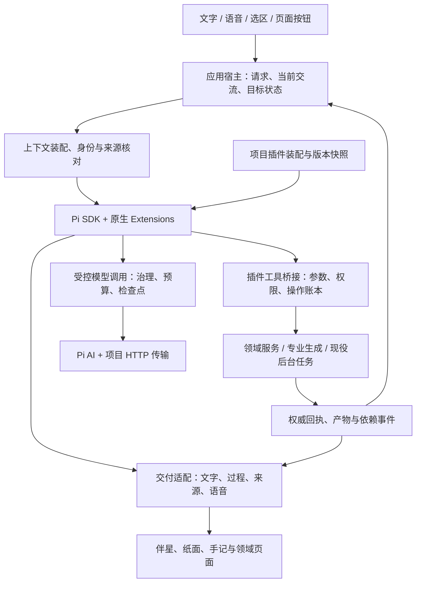

# 49｜Pi Agent 接入与功能插件化（候选评估，待决策）

> 日期：2026-10-10。
>
> **决策状态：用户尚未确定是否采用或实施 Pi Agent。** 本文保留候选技术研究与条件性迁移设计，不代表已确认选型，不作为当前伴星优化的前置任务或实施依据。后文的目标架构、接入阶段和包结构均以未来明确采用为条件。
>
> 用户要求：先形成替换现有 Agent 的方案；现有能力和后续新功能可以作为插件开发，使功能边界与代码分层更明确。
>
> 本文定义技术方向、实施阶段和采用条件。本轮只编写方案，未安装 Pi、修改运行链路或完成接入验证。源码核对基于 `b87930c8` 及当时工作区；工作区已有其他修改，实施前需重新确认相关调用链。
>
> 阅读分工：[42](./42-unified-agent-and-companion-experience-2026-10-04.md)定义统一 Agent、状态所有者和产品体验；[41a](./41a-unified-agent-foundation-2026-09-28.md)定义可靠执行；[44](./44-unified-context-window-and-compaction-2026-10-05.md)定义上下文与压缩；[40](./40-companion-long-term-experience-and-diary-prd-2026-09-25.md)、[40b](./40b-companion-runtime-and-observability-2026-09-27.md)、[45](./45-model-authored-voice-expression-2026-10-07.md)继续负责人格、记忆、失败表达与声音。本方案补充运行引擎和插件组织方式。

## 1. 候选方向与目标

伴星体验与成长的具体实施见[50](./50-companion-persona-presence-and-growth-refactor-2026-10-10.md)，沿现役执行链路独立推进。本文仅评估未来可能的引擎与插件接入；50 的交付与验收不依赖本文采用结果。

若后续明确采用 Pi，候选目标架构是：**一个统一 Agent 宿主，使用 Pi 原生 Extensions 组织功能，按领域注册能力；项目继续持有身份、权限、任务、材料和业务事实。**

优先评估 `@earendil-works/pi-coding-agent` 的无界面 TypeScript SDK 和原生 Extensions，配合 `@earendil-works/pi-ai` 接入模型。SDK 内部使用 `pi-agent-core`，项目不再在它外面包另一套模型—工具循环。`pi-durable` 的持久化和调度不纳入本次迁移；后台继续使用现有 PostgreSQL、Worker、租约和领域 outbox。

采用 SDK 的理由是用户提出的功能插件化：工具、功能指引和生命周期协作由原生扩展接口承载，后续新增能力不用持续改通用 runtime。SDK 是否适合现有检查点、上下文和事件边界，先由阶段 0 验证。若关键边界只能通过修改上游私有实现满足，则停止 SDK 迁移，记录结论；可独立采用已验证的 `pi-ai`，再修订引擎方案，不长期维护两套生产引擎。

成功应体现在两个方面：

- 用户仍能自然聊天、交给伴星做事、查看成果、改变要求、停止和回来接续；笔记、卡片、声音与 Live2D 的真实体验没有持续回退。
- 开发一个新功能主要修改所属插件、必要的领域服务/数据/UI 和测试；无需在通用循环、多个执行 switch、提示拼装处和前端工具名清单中平行加分支。

模型能力、人格自然度和长期成长效果另按真实样本评估。更换框架、增加插件数本身不证明这些效果提升。

## 2. 当前实现与可迁移基础

以下为本轮源码核对，不沿用旧文档中的整体完成声明。

| 真实入口/模块 | 当前职责 | 本方案处理 |
| --- | --- | --- |
| `apps/desktop-client/src/main/desktop-ipc-agent.ts` → API Agent 路由 → `apps/api/src/agent/runtime.ts` | 接收目标/控制请求、认证与请求合同、创建操作 | 保留请求和领域入口；从插件合同取得可用能力投影 |
| `workers/ai-worker/src/handlers/companion-agent-runtime.ts` | 即时对话多步执行、注意力、流式交付、步骤恢复、工具账本和确认 | 通用循环交给 Pi；交流策略和交付作为宿主协调职责保留 |
| `workers/ai-worker/src/agent/advance.ts` | 持续目标分片推进、调用专业能力、等待后台结果 | 目标状态和接续保留；需要模型规划时调用同一 Pi 执行适配器 |
| `packages/agent-core/src/runtime/execute-step.ts`、`model-step.ts` | 模型响应先保存再执行能力；通过 `runAiTask` 执行模型步骤 | 保留可靠执行端口和规则，适配 Pi；不把整包视为可直接删除的旧循环 |
| `packages/agent-host/src/advance-store.ts`、`operation-store.ts` | 租约/revision/授权核对、检查点、操作与权威回执 | 继续持有持久状态，是恢复和正式提交的依据 |
| `packages/shared/src/agent-capability-catalog.ts` 及各 manifest | 一份能力目录、输入 schema、说明、风险与展示身份 | 按插件归属组织；Pi 工具注册和 UI 从同一声明派生 |
| Worker `AIProvider`、`governance.ts`，API `ai-governance.ts` | 模型传输、同意/数据政策、敏感信息处理、完整预算、审计 | 接入共享 Pi 模型适配；每次实际外发仍经过现有治理 |
| `packages/shared/src/public-json-http.ts` | HTTP 地址校验、固定解析地址、超时、重试、熔断、事务外请求 | 为 Pi HTTP 适配提供受控传输；不能只接上普通 fetch 就宣告完成 |

API 的讲解、评分/争议复核、Worker 的专业生成和维护调用也使用公共执行治理，其中许多是单次结构化请求。插件可以登记这些能力及专用流程，不要求全部改为自由工具循环。Embedding、ASR、TTS 等非同类接口继续按能力合同接入。

## 3. Pi 各层的选型边界

本轮研究基于已发布的 Pi `v1.1.0`。实施时锁定经过验证的版本与 lockfile，不使用浮动 `latest` 或开发分支作为生产依赖；该版本要求 Node `>=22.19.0`，需核对实际服务运行环境。

| Pi 部分 | 能力与采用方式 |
| --- | --- |
| `pi-ai` | 多供应商模型协议与流式事件。项目模型档案、实际 endpoint 和生效参数决定路由，不由上游目录自动改写 |
| `pi-agent-core` | 通用循环、工具执行和事件，作为 SDK 内部机制使用；它本身不是完整插件加载器 |
| `pi-coding-agent` SDK / Extensions | 原生 TypeScript 扩展、工具及生命周期接口，作为本方案的功能扩展运行时；使用受控资源加载与无界面配置 |
| `pi-durable` | 已有持久任务/扩展机制，但现成存储和单进程所有权与项目队列机制不同；本次保留现有持久宿主 |

参考官方 [SDK](https://github.com/earendil-works/pi/blob/v1.1.0/packages/coding-agent/docs/sdk.md)、[Extensions](https://github.com/earendil-works/pi/blob/v1.1.0/packages/coding-agent/docs/extensions.md)、[模型层](https://github.com/earendil-works/pi/blob/v1.1.0/packages/ai/README.md)、[Durable](https://github.com/earendil-works/pi/blob/v1.1.0/packages/durable/README.md)与[依赖声明](https://github.com/earendil-works/pi/blob/v1.1.0/packages/coding-agent/package.json)。

## 4. 目标架构与依赖

拟新增代码位置，最终按阶段 0 的依赖核对落定：

| 位置 | 职责与依赖 |
| --- | --- |
| `packages/agent-pi` | 唯一 Pi 接线包：SDK 会话、模型/消息转换、资源加载、扩展工厂装配、事件桥接；仅后端使用 |
| `packages/shared/src/agent-plugins/` | 浏览器可用的插件/能力/产物声明；各领域分文件，保持真实 schema 和稳定身份，不导入 Pi、SQL、Node 或 React |
| `packages/agent-core` | 纯上下文、预算、失败和交付规则，以及可靠执行端口；不反向导入 Pi 宿主 |
| `packages/agent-host` | 数据库任务/操作/回执与领域提交端口；不承担插件自动发现 |
| `workers/ai-worker/src/agent/plugins/` | Worker 插件工厂及领域端口绑定，调用现有功能域实现 |
| `apps/api/src/agent/plugins/` | API 所需的插件/专业调用绑定；复用共同声明和适配，不复制插件规则 |
| renderer 各功能域 | 插件产物与交互的呈现；显式构建时登记 renderer，不执行后端扩展代码 |

注册是宿主的组合根职责。功能域实现不需要因插件化全部搬进一个目录：插件入口负责描述和接线，生成/保存/读取/UI 继续靠近自己的功能域；确认依赖清楚后再抽取。

## 5. 功能插件合同

插件是一个有稳定身份和版本的功能单元，可以同时提供工具、上下文来源、专业指引、后台能力及产物说明。一次会话装配若干插件，它们共用同一个 Agent；一个插件不会默认创建一个独立 Agent 或另一套模型循环。

| 合同 | 必须明确的内容 |
| --- | --- |
| 身份 | `pluginId`、版本、用途、支持的宿主和入口；现有工具名、能力 ID 和产物身份尽量保留 |
| 能力 | 当前能力声明及输入/输出 schema；执行形态、风险、副作用、确认条件、预算归属和取消/恢复方式 |
| 上下文 | 来源 ID、作用域、版本/哈希、读取端口、必要程度；材料作为数据进入上下文 |
| 功能指引 | 相关任务的专业说明及提示版本，按用途装配；不能重写全局人格、授予权限或自动开启功能 |
| 执行绑定 | 通过宿主注入的领域服务执行；长期任务返回稳定 operation/领域任务身份及接受回执 |
| 产物与展示 | 领域产物类型、来源与版本、候选/正式状态、renderer key、目标入口和可用操作 |
| 生命周期 | 注册、会话启用、版本固定、结束清理；资源清理幂等，不能在注册时启动无归属任务 |
| 依赖与缺失 | 必要依赖、适用版本；依赖不可用时返回可核对状态，不能靠加载顺序静默覆盖同名工具 |

桥接时由同一能力声明生成 Pi 工具参数与注册信息，业务执行前仍用领域 schema 校验。Pi 生命周期钩子可能改写参数，因此最终校验与授权放在工具执行桥接端，不能只依赖最早的钩子。

原生 Pi Extension 工厂闭包绑定本插件的宿主端口；项目补充的 manifest 只承载产品合同、版本和宿主差异，不再实现第二套插件加载器。`registerTool`、生命周期和资源装配交给 Pi；React 页面、数据库迁移和应用路由由应用构建体系登记，不能借运行期扩展任意注入。

### 5.1 第一批插件归属

| 插件 | 现有能力与责任 | 仍由领域保障的行为 |
| --- | --- | --- |
| 笔记与来源阅读 | 检索、读取、分页、来源与选区引用 | 可见性、冻结版本、实际读取覆盖与原文回跳 |
| 笔记创作与编辑 | 对话整理成笔记、光标补写、替换/删除段落、库内链接 | 协同文档提交、原文/版本冲突、编辑锁和保存回执 |
| 笔记学习 | 原句解释、速看、思维导图、互动演示、知识拓展草稿 | 原文依据、生成任务、动态页面隔离、候选逐项收下 |
| 学习卡 | 制卡、候选与成果查询 | 制卡专业流程、候选审核、正式保存和去重 |
| 练习与评估 | 练习解释、开放回答评估、争议复核 | 评分合同、正式作答状态和学习事实 |
| 外部资料 | 联网搜索、公开文档读取、引用交付 | 用户开关、外发政策、地址校验、配额/冷却与真实来源 |
| 记忆与合作方法 | 相关记忆/方法读取、允许的候选整理、反馈与修订 | 来源准入、作用域、遗忘/撤回、版本与实际使用证据 |
| 书房交互 | 页面定位、系统状态和已支持的窄操作 | 当前窗口/空间身份、客户端能力与实际到达回执 |

这是一份归属建议，不代表表中所有入口已完全接入 Agent。阶段 0 输出真实能力清单和缺口后确定首批范围；按职责合并或拆分，不强制“一项工具一个插件”。

当前交流协调、账号身份、授权治理、任务调度和事件提交由宿主持有。语音及 Live2D 可以提供表达模块，但不成为业务插件随意重写前台注意力的入口。复合任务由同一 Agent 调用多个插件，不互相导入另一个插件的内部文件。

### 5.2 新功能怎样加入

以“根据当前笔记出一组自测题”为例，插件应提供：冻结笔记输入、出题能力及专用指引、候选/保存合同、题目产物和纸面入口；需要后台执行时沿现役 jobs 返回接受回执，结果由领域事件唤醒所属目标。普通闲聊不因插件已安装就自动出题，完成也不记录用户已掌握。

新增功能允许同时修改自己的领域服务、数据库和页面。分层验收看是否无需修改通用 Agent 循环，以及自然语言与页面按钮是否使用同一正式提交规则，不以“只新增一个文件”为目标。

### 5.3 启用、更新与卸载

首期使用随应用发布的可信插件、显式工厂白名单和构建时依赖。不扫描 `~/.pi`、进程工作目录或用户笔记中的扩展文件。用户材料、长期方法和模型生成文字不能自动变成可执行插件。

安装/加载、模型可见、用户允许和本次可执行是不同条件。比如外部资料插件可以随包存在，联网搜索关闭时对应工具仍不可用；已注册能力也不能绕过空间和本轮输入范围。

一次运行记录插件版本快照；待恢复执行要求兼容的能力/提交语义。停用或移除后不接受新操作，在途状态先停止或核对，历史成果保持可读。缺失旧实现不能盲目用新版重做；需要兼容迁移时明确处理版本，不能无限保留旧代码。权限撤销始终即时参与提交核对。

第三方插件市场、动态下载执行及不可信代码隔离是独立议题。原生扩展与宿主同进程运行，项目端口限制是代码职责边界，不构成安全沙箱。

## 6. SDK 会话、模型与上下文适配

### 6.1 会话是一次工作的运行容器

按当前 turn 或目标执行片段创建/恢复 SDK 会话，不按账号永久保留一个全局 Pi 实例。宿主数据库是长期状态来源；SDK `SessionManager` 负责本次运行的模型上下文投影，采用内存形式，不能另落一份长期聊天 JSONL。

SDK 的会话管理器参与上下文重建，所以不能仅赋值 `agent.state.messages` 就认为外部历史已接入。需由宿主的经过核对的记录构造会话，并验证后续每次请求仍使用规范上下文。恢复投影包含完整工具调用/结果对及必要模型元数据；不能将 Pi 的整个历史无条件回放给新话题。

使用受控 `ResourceLoader`、内存设置和显式模型运行配置；关闭默认编码工具、项目/个人资源发现、模板展开及未经登记的额外资源。有效工具集由本次插件能力快照决定。关闭 SDK 自动压缩/整轮自动恢复，供应商层自动重试设为零，保留项目已登记的重试、压缩和备用路由策略。精确配置以锁定版本的导出类型和无界面实验核对，不能依赖默认值。

### 6.2 所有真实外发经过共同边界

模型请求链应保持：`插件/领域任务 → 本轮上下文 → 治理与完整计量 → runAiTask/模型步骤 → Pi AI → 受控 HTTP → 响应检查点`。各步骤处在对应 attempt 内；事务外模型等待、当前租约与取消信号贯穿请求。

Pi AI 的受控 fetch 适配应保留 HTTPS/地址检查、解析地址固定、响应限额、超时、熔断和已有有界 HTTP 重试；关闭供应商 SDK 和 Pi 上层的重复重试。只检查 URL 后让 SDK重新解析 DNS 不等同于现有出口。首次限定经过验证的 HTTP/SSE 路径，WebSocket、延迟响应或供应商的旁路请求单独验证后接入。

项目模型档案是上下文窗口、输出上限、思考、采样和图像支持的配置依据。记录实际模型、endpoint、能力快照和生效参数；Pi 模型目录可供补充，不自动扩大外发范围或更换主/备用模型。密钥由宿主提供，不新增个人 Pi 凭据文件或默认登录流程。

单次结构化生成仍用专业输入/输出合同；Embedding、ASR、TTS 按各自接口保留。多模态输入、工具结果和工具 schema 纳入完整请求计量。Pi 序列化/系统消息表达带来的额外开销、usage 和缓存字段要校准；旧 token 锚点不能直接用于新协议。

### 6.3 提示与钩子的作用范围

人格、当前请求、权限规则、专业指引和材料各自有装配来源及版本。插件只贡献自己负责的功能指引/来源，宿主决定最终上下文；全局要求不能由插件加载顺序覆盖。

Pi 前置钩子负责协作，不成为唯一安全屏障。每次实际发送前复查政策、预算和租约；每次正式提交前复查操作授权、目标 revision 与材料版本。钩子异常不能落入“继续用旧上下文”的路径，治理失败应关闭对应请求/操作并返回既有失败语义。

## 7. 执行、检查点与后台接续

### 7.1 每个模型步骤的提交次序

1. 从宿主取得当前 turn/run、revision、租约、插件快照和有效能力；装配来源并生成步骤身份。
2. 加载与任务/输入/模型/提示/插件及序列化版本匹配的检查点；命中时复用响应，仍重新核对权限与提交条件。
3. 无检查点时，通过受控模型边界执行；原始增量进入既有交付门，完整响应经校验后先保存。
4. 保存成功后才执行工具。Pi 生命周期事件的顺序须验证为可等待的持久化屏障；必要时模型流适配器先保存完整响应再向 Pi 释放结束事件。数据库失败时禁止继续工具调用。
5. 工具桥接取得稳定 operation 身份，最终校验参数与授权，调用领域服务或受理后台任务，保存真实回执。
6. 应用步骤结果，核对等待/确认/交付状态；只有需要继续且仍有效时才允许下一次模型请求。

Pi 的供应商 call ID 用于协议配对，不能替代领域操作幂等身份。同一响应恢复、调用 ID 变化、重复结果事件都需沿现有账本核对；`outcome_unknown` 先查询真实领域结果。

检查点复用现有步骤存储和键规则，并纳入适配/序列化版本。需要额外 Pi 元数据时使用有版本的后端检查点载荷，先验证能否无损投影；只有现有字段确实不足才增加内部存储字段，不把 Pi 类型泄漏到桌面合同，不另建权威 transcript。隐藏推理不因迁移新增采集或展示。

### 7.2 后台工具与停止条件

后台插件工具在任务受理后返回接受回执。目标记录依赖并释放当前执行片段，领域 outbox/结果事件唤醒后再恢复。不能长期保持内存 Promise，也不能由 Pi 为等待结果反复询问模型。

| 情况 | 宿主与 Pi 的共同处理 |
| --- | --- |
| 只读/同步操作取得有效结果 | 按当前要求回答或继续下一步 |
| 后台能力已受理 | 记录 waiting 与领域任务身份，结束执行片段；受理不等于完成 |
| 等待用户确认 | 保存提案和完整续跑位置，停止后续未授权操作；确认后重新取得租约恢复 |
| 结果未知 | 保留操作身份，先查权威回执；不能把普通错误重试用于重复写入 |
| 用户修改目标或取消 | 使旧执行授权失效，停止待发请求与待提交操作，保留已提交成果 |
| 无工具的模型终答 | 结束当前回复；持续目标另外核对交付合同，不能仅凭文字结束目标 |
| 已到预算或专业质量失败 | 按已有分类和有效成果表达，释放资源；不隐式追加无限恢复回合 |

Pi 停止/settled 事件表示引擎完成当前运行，不表示业务目标已完成。宿主的交付校验和领域回执保留权威性。

### 7.3 并发与新输入

先采用顺序工具执行，保持原有确认与写入顺序；后续只对有明确独立性证据的只读能力开放并行。Pi 的 steering/follow-up 是引擎调度机制，宿主仍判断消息是否补充当前话题、修改目标或另开交流。需要立即停止的请求通过取消与提交围栏生效，不能等下一次 steering 消费。

后台目标与当前交流继续独立。任务→家常→任务、连续补充、跨日输入和插话按真实时间与来源处理；旧任务和插件默认指引不能接管最新要求。

## 8. 伴星与领域页面的交付

前端继续消费项目稳定事件和产物合同。Pi 事件由一个适配器映射，不让组件各自解释引擎事件。

- 原始模型增量仍经过正文净化、释放闸、重复片段处理、持久化和引用处理；不能直接显示 Pi 文本后再纠正假完成。
- 本轮文字、做事经过、查阅材料与产物共用现有交付身份，完成/失败/待确认按真实回执呈现。
- 专业插件提供产物身份和 renderer key；页面按钮和自然语言调用复用领域规则，明确请求继续保持短路径。
- 图片、代码、题面和互动内容延续现有阅读/隔离合同；新增插件需要新 renderer 时在对应功能域实现。
- 声音表达标签、分段与播放 cue 延续 45；历史正文保持干净，停止和新 generation 后不交付旧文本、音频或 Live2D cue。
- 前台已接受的用户原话与时间继续留档。失败或旧回复中止不意味着用户消息消失，也不自动授权恢复旧业务操作。

## 9. 实施阶段与退出条件

| 阶段 | 具体工作 | 交付与进入下一阶段的条件 |
| --- | --- | --- |
| 0 · 基线与原生扩展接入实验 | 固定 Pi 版本；核对当前调用图、能力归属和状态；无界面 SDK 加载两个显式插件，验证内存会话投影、模型治理、检查点屏障、停止/等待和清理 | 实验代码/测试与采用结论；不得访问个人资源或绕过治理；关键边界不可实现就停止 SDK 迁移 |
| 1 · 模型适配 | `agent-pi` 提供共同模型适配；现有 Provider 与 API 结构化调用按真实入口接线；建立受控 HTTP/SSE、参数/usage 映射 | 保持旧循环验证协议，真实主/备用路由样本、上下文/重试/取消/HTTP 测试通过；这阶段只证明模型层可用 |
| 2 · 插件合同与只读运行 | 将现有声明按插件归属整理；由原生 Extension 注册阅读、查询等只读能力；接入同一个 SDK 执行适配器、来源装配与事件交付 | 只读端到端结果可核对；新只读功能不修改通用循环；保留阶段性回退但记录同一运行的引擎快照 |
| 3 · 写入、专业生成与持续目标 | 创作/编辑、制卡、学习生成、确认、后台依赖与恢复分批迁移；既有单次请求保留短路径 | 故障注入与实库验收通过；取消/撤权/修订和未知结果均不重复提交；复合任务能跨插件接续 |
| 4 · 前端体验与收敛 | 完成语音/插话、正文与过程交付、历史/长内容和真实窗口；验证 API 与 Worker 专业调用覆盖；删除无调用旧链路 | 必要窗口与模型样本通过；同一能力一份声明，一套模型—工具循环；撤除临时开关及不再需要的旧 provider/编排 |

各阶段保留自己的验证证据和限制，不把阶段 1 成功写成整个 Agent 已迁移。专业插件初期可以调用现役 handler/领域服务，随后按职责整理；包装后内部仍有重复通用循环的，不能作为分层完成证据。

## 10. 验收矩阵

### 10.1 插件和分层

| 场景 | 必须取得的证据 |
| --- | --- |
| 新增一个真实小功能 | 修改范围集中于所属插件/必要领域/UI；没有修改通用循环或新增平行能力清单 |
| 插件重复名称、缺依赖或版本不兼容 | 启动/装配明确失败；不按加载顺序悄悄覆盖 |
| 插件停用、旧运行恢复 | 不接受新操作，已有成果可读；旧步骤只在兼容实现和有效授权下接续 |
| 两用户、两空间、前台与后台并行 | 会话、插件状态和上下文不串用；后台工作不阻塞普通聊天 |
| 插件参数被钩子修改 | 最终 schema、输入范围与提交授权重新核对 |

### 10.2 执行和数据

| 故障/路径 | 必须保持的行为 |
| --- | --- |
| 模型返回但响应保存失败 | 工具不执行；再次尝试不伪称已经保存检查点 |
| 响应检查点保存后进程退出 | 恢复同一步、不重复花已缓存的模型调用；重新核对有效授权 |
| 领域写入成功、操作回执未落定 | 查领域事实并补回执，不重复创建笔记/卡片/任务 |
| 租约回收、双 Worker、重复完成事件 | 当前有效尝试推进；操作和唤醒去重，旧尝试不能写入 |
| 运行中取消、撤权、换账号世代或改 revision | 新请求与后续提交被挡；已经提交的成果准确保留 |
| 原文/材料版本变化 | 编辑或生成提交按对应领域合同拒绝，不能覆盖新正文 |
| 确认后重启、混合工具批次 | 恢复位置与授权范围一致；确认之前没有后续写入越过 |
| 治理拒绝、超限、429/5xx、流已交付后断开 | 重试和预算按既有合同；拒绝不外发，流式失败不重复交付旧前缀 |
| 长上下文、压缩、备用路由、插件切换 | 完整请求重新计量，当前要求与来源保留，失效锚点不复用 |

### 10.3 模型样本与真实窗口

使用相同模型/endpoint、人格、输入与材料准备旧/新链路的配对样本，重复运行并区分冷/热状态。覆盖日常聊天、连续补充、知识问答、阅读并引用、编辑、新笔记、复合生成、等待后回来、任务→家常→任务、语音插话。模型随机输出不要求逐字相同，但事实、授权、交付和停止行为必须一致。

记录首字/完整交付时间、实际模型与 HTTP 尝试次数、token/缓存用量、工具与正式产物结果、未知结果恢复、内存和会话释放。采用门槛在阶段 0 依据同负载基线确定；样本量与波动一起报告，不能用单次快慢宣称性能改善。关键执行/隔离错误不得以平均成功率掩盖。

真实窗口检查文字和工具同时更新、长内容阅读、产物入口、键盘与焦点、停止/快速连续发送、语音暂停/插话、换空间和迟到事件。后端测试通过不替代窗口体验。

类型检查使用相关包自己的 `npm run typecheck`，包括新适配包、agent-core、agent-host、shared、api、desktop-client 和 ai-worker；先记录相关回归基线，再运行有意义的单元/实库/模型/窗口验证。更新守卫实际扫描范围，不通过保留无用旧文件满足守卫。

## 11. 迁移与回退

首次不批量迁移历史数据。历史合同和稳定能力身份继续可读；新运行记录引擎、适配器、插件与序列化版本。临时切换只作用于新运行，不能把一个未完成步骤直接从旧引擎切到 Pi 后重放副作用。

需要切换在途运行时，先停止原尝试、核对已提交操作和未决依赖，再验证检查点可转换；不兼容时保留已有成果并明确恢复方式。回退同样不能根据一份旧 transcript 再执行一次业务写入。数据库变更保持对仍在运行的旧部署可读，旧版本排空后再清理。

对照运行只允许隔离样本或只读请求。生产写入不执行新旧两份模型计划。回退开关、旧实现和适配期限随阶段记录，完成迁移后清理，避免把双框架变成永久维护成本。

## 12. 收益、风险与实施前需确认的事实

| 判断项 | 收益或风险 | 处理方式 |
| --- | --- | --- |
| 功能扩展 | 原生插件承载完整功能接线，减少通用 runtime 分支 | 用一项真实新增功能验证改动面，不以工具数量证明模块化 |
| 模型扩展 | 更少自行维护供应商协议和事件解析 | 当前路由先验证，扩供应商时再扩大收益；不承诺迁移立即改善回答 |
| 维护范围 | 通用执行交给上游，领域实现更集中 | 只保留有职责的宿主适配；迁移后清理重复机制 |
| SDK 默认行为 | 会话、压缩、重试、资源发现可能形成第二套状态 | 显式配置和故障实验；只使用已验证的原生接口 |
| 依赖与运行环境 | SDK 比单独 core 引入更多依赖与加载开销 | 核对 Node、Worker 构建、冷启动/内存和生命周期；Pi 不进入 renderer |
| 插件治理 | 同进程扩展不能隔离不可信代码，钩子可改变请求 | 首期可信内置插件，最终执行/外发/提交门保持权威 |
| 上游升级 | API 和会话格式变化增加升级成本 | 锁版，适配器集中承接升级；版本变化重验关键恢复与交付路径 |

实施前必须通过阶段 0 回答：原生 SDK 能否无损投影现有消息/工具/模型元数据；能否在任何工具副作用前可靠保存响应；能否释放后台等待而不造成多余模型调用；资源和模型配置能否完全由宿主管理；现有投机首步/交付策略是否可在不复制循环的前提下接入。未得到证据前，不能把这些写成已解决。

41a 的“不建设通用插件市场”仍限制市场和不可信代码分发，不阻止本次功能插件化。42 的一份权威能力声明、真实领域回执和状态所有者继续有效，本方案将其落实到原生 Extension 与宿主分工；44 的作用域、计量和压缩不由 Pi 默认策略替代。

本轮交付限于方案和索引。实施证据在后续任务/测试记录中追加，不用方案状态词代替可核对结果。
