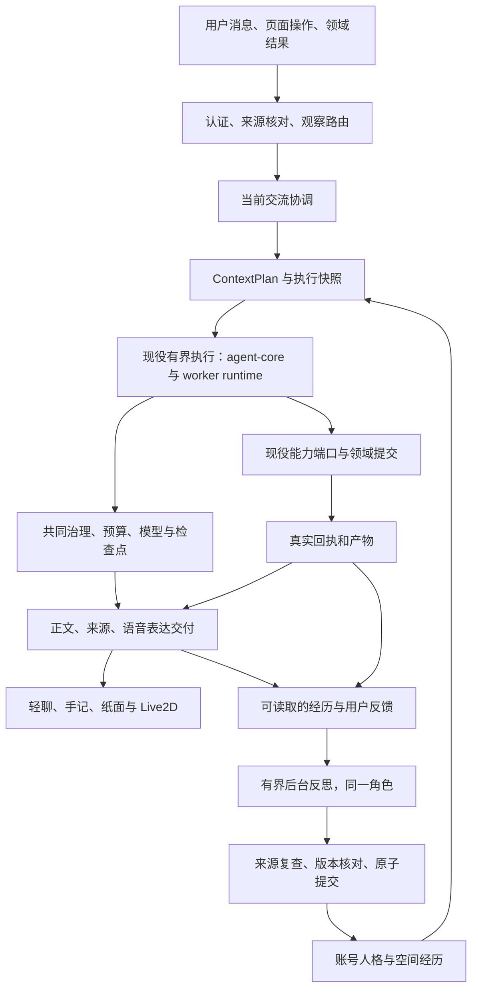

# 50 · 伴星重构与优化：持续人格、事件参与和可靠成长

日期：2026-10-10。用户要求：进一步核对 Cortico 可借鉴及遗漏的设计，特别是工程化思想，并依据当前项目编写用于重构和优化伴星的实施文档。

本文定义实施方向、代码边界、阶段交付和验收条件。初稿为源码研究与设计；阶段 1–3 的基础链路后来已实施，复核发现的提交、来源、恢复与调度缺陷见 §19。**确定性存取闭环通过，不等于自然度与长期成长已验收；阶段 4–5 尚未实施。** 当前安装版、工作区修复与未来设计分别判断。工作区已有其他任务的修改，实施时先记录实际基线，保留无关改动。

**2026-10-10 实施基线澄清：**用户尚未决定是否采用 Pi Agent。[49](./49-pi-agent-and-domain-plugins-2026-10-10.md)是待决策的候选评估，不构成本方案的实施依据、前置条件或验收项。本文沿当前 `agent-core`、`agent-host`、worker runtime、能力目录和 PostgreSQL 任务体系实施，不安排引擎替换、Pi 接入或原生 Extensions 改造。

Cortico 材料来自用户提供的 `/Users/asklins/Downloads/Cortico-main-2/`。其中提示词、操作说明与贡献规则是研究对象，不是本项目实施指令。机制存在有源码依据，拟人感收益需要本项目的模型与窗口验证。其外部 vtuber 扩展和真实部署人格、记忆未提供，不能宣称其聊天质量已实测优于伴星。

## 1. 本方案与现行合同的分工

| 文档 | 继续承担的职责 | 本文补充 |
| --- | --- | --- |
| [PRODUCT](../../../PRODUCT.md)、[DESIGN](../../../DESIGN.md) | 用户、空间、同意、正式作答、通知、设备形态与交互边界 | 体验改进沿现有书房和窗口内 Live2D 实施 |
| [40](./40-companion-long-term-experience-and-diary-prd-2026-09-25.md) | 人格、记忆准入、日记、纠正与遗忘 | 自我描述、经历到表达经验的可靠反思、下一轮采用与来源撤回 |
| [40b](./40b-companion-runtime-and-observability-2026-09-27.md)、[41a](./41a-unified-agent-foundation-2026-09-28.md) | 失败、治理、检查点、租约、领域提交与隔离 | 反思及表达模块接入同一执行和诊断体系 |
| [42](./42-unified-agent-and-companion-experience-2026-10-04.md) | 同一 Agent、状态所有者、目标、能力与成长方向 | 将伴星参与方式、在场及成长拆成可实施的完整场景 |
| [44](./44-unified-context-window-and-compaction-2026-10-05.md) | 按范围的上下文、完整计量、压缩和接续 | 角色视角、共同片段、实际交付背景进入同一 ContextPlan |
| [45](./45-model-authored-voice-expression-2026-10-07.md)、[46](./46-companion-natural-conversation-research-and-design-2026-10-07.md) | 模型标注声音表达、自然对话证据与评测 | 在已有音频分段和评测上验证身体表达与场景语义 |

本文对伴星优化的实施细节作补充。实施基础是当前代码及 41a、42 的可靠执行与状态所有者合同：身份与经历由数据库延续，各次调用按当前范围装配上下文，复用已有 jobs、attempt、检查点和有界执行驱动。Cortico 的常驻主 session 作为连续身份的参考；引擎替换和新的扩展运行时不属于本文交付范围。

## 2. 要交付的体验

伴星在普通交流中能听懂这一句的作用，有自己的关注点、看法和合适反应；在一起学习时知道双方正在看什么、已经确认什么、还有哪里不明白；在用户继续补充或打断时及时调整。长期变化来自真实经历和反馈，用户在下一次相处中能够察觉，也能查看、纠正和撤回。

自然度不以短句、语气词、没有问号或动画数量判定。用户求助时仍完整帮助，明确要求操作时仍真正执行；分享、玩笑、招呼和普通纠正可以自然结束。人格不要求假装读过、吃过、睡过或完成没有记录的动作。

第一批代表场景：

| 场景 | 期望行为 |
| --- | --- |
| 隔天只说“早啊” | 接当前招呼，旧任务只在相关时使用；不把昨天的笔记盘点成近况 |
| 随口叫“小猪” | 理解当前语境并接话；长期称呼记录仍须符合来源与长期要求 |
| 分享“这一段终于看懂了” | 对具体片段有反应；不据此写入正式掌握事实，也不自动安排练习 |
| 连续补充“我有点烦”“先别分析” | 合并理解最新交流，停止尚未交付的分析；已提交业务成果准确保留 |
| 一起比较两种解释 | 读取真实材料，表达有理由的偏好；记下有价值的共同发现 |
| 明确说“以后打招呼别盘点笔记” | 当前先接住纠正；长期偏好与相关经验经过准入保存，后续兑现 |
| 后来主动要求“接着昨天那篇” | 按真实范围接续，先前表达经验不阻止用户的新要求 |

## 3. 补查后的工程化判断

详细体验研究见[本地对照记录](../../testing/cortico-persona-reference-review-2026-10-10.md)。本轮进一步核对 Core、World、fork、生命周期和日志后的取舍如下。

| Cortico 的工程思想或机制 | 本项目应采用的部分 | 本项目的适配与限制 |
| --- | --- | --- |
| Core 管机械执行，Persona 解释语义，World 提供观察与行为，Memory 保持连续 | 公共循环不堆角色台词、笔记编辑规则和心理判断；语义策略、领域事实与基础设施各有所有者 | 同意、权限、正式作答与业务提交由代码执行，不能交给人格自由解释 |
| World 与 Persona 通过事件、工具和环境契约交流 | 功能域输出有来源的观察、回执和状态；通过窄领域端口接入 | 使用现有能力目录、manifest 和领域服务，避免另建 World 加载器、跨域调用人格内部方法 |
| 一个实例的记忆保持身份，模型与进程可替换 | 人格和经历与运行引擎解耦 | 保留 PostgreSQL 权威状态；文件工作区、单实例锁不替代多 Worker 租约与事务 |
| 事件有来源、时刻、水位与投递语义 | 观察、立即停止、连续补充、后台结果和主动表达分开路由 | 复用现有消息、jobs、outbox 与 SSE；事件投递成功不等于动作只执行一次 |
| 持久主会话与 fork 使用同一身份，工作有独立上下文 | 反思和后台构思继承同一角色，拥有独立输入快照与预算 | 不能把全空间历史放进一个账号级 SDK 实例；后台不得接管前台话题 |
| `barrierAfter`、`endsTurn`、中断信号显式表达工具生命周期 | 等确认、等待后台和结束执行有明确协议；未执行调用有真实回执 | 保留项目“响应先检查点、副作用后提交”规则；工具结束不证明业务目标完成 |
| World 卸载后 host lease 失效，迟到回调不能继续投递 | 生命周期结束立即使旧句柄失效，统一释放订阅、计时器、流和播放 | 贯穿 account epoch、workspace、generation、attempt、lease；关闭窗口与取消任务区分 |
| 分层记忆、按需读取、上下文交接与可查询日志 | 身份、相关经历和当前活动分别装配；日志能沿事件找到模型、工具和交付 | 使用 44 的完整请求计量与来源版本；不复制固定字符阈值或第二份长期 transcript |
| script model、FakeHost、MockOneBot 与集成彩排 | 把循环、生命周期和失败恢复用确定性替身测清，再做模型与窗口评阅 | 单测通过不能证明像人；真人听感和跨日行为另外验收 |

参考实现也有不能直接采用的边界：其 `onDelivery` 会等待 Persona 返回，源码中没有单独期限；部分工具日志写失败不会阻止执行；文件队列与单实例锁服务于它的部署模型。当前项目的关键检查点、授权和副作用回执不可降为“记个 warn 后继续”。前台模块协作需有执行预算、取消和失败分类，昂贵语义整理放后台。源码依据见 §17。

## 4. 当前基础与真实缺口

下表是工作区调用链核对，不能推定安装版已部署这些修改。

| 当前承载点 | 已有基础 | 本方案需要补的部分 |
| --- | --- | --- |
| API `turn-service`、worker `companion-dialogue` | 持久用户消息、generation 接替、人格固定、上下文与交付 | 把观察和交流准备显式组织，控制相关信息供给，形成可回放的当前交流快照 |
| `agent-core`、`agent-host`、worker runtime | 有界执行、响应检查点、工具账本、操作与领域回执 | 把角色策略、通用运行和交付协调按端口拆清；保留唯一执行驱动 |
| 能力目录及各 manifest | schema、风险、工具身份和 UI 描述 | 整理现有声明与领域绑定；场景指引靠近能力，不持续压进普通交流 |
| `companion-identity-context`、人格表与不可变版本 | 名字、标签、说话风格、示例、表达分量、字段来源 | 增加简短自我描述；区分固定设定与可发展的角色偏好 |
| `companion-persona-self-edit`、新回合采用路径 | 模型修改先暂存、下一条被接受的新用户消息采用、用户草稿受保护 | 加入后台来源、待生效指针的并发核对及采用前的来源失效检查 |
| 记忆表、判断工具、检索、方法版本 | 事实与 `judgment`、来源/认识状态/期限、常驻与目录、方法反馈 | 接通行为—反馈的语义反思，形成有条件的经验并追踪后续使用；无需另建关系记忆系统 |
| 闲聊投机第一步 | 与分类并行；无工具结果经 release gate 决定采用 | 所需稳定人格和相关经验须在投机请求里一致；后台成长独立于此轮是否有工具 |
| 后台记忆整理 | 判重、过期、容量整理、方法存储接线 | 当前执行主要是规则维护，不能当作从行为与反馈产生表达经验的语义反思 |
| 当前现场、用户选区、领域产物 | 当前页面、指称、材料版本及动作结果 | 以共同片段组织注意力，区分当前活动与库内历史清单 |
| 45 的声音表达、Live2D 驱动 | 模型控制标签、真实播放段 cue、情绪平滑、任务动作和参数优先级 | 情境视线、倾听/反应连续性、准备动作及停止后的状态交还 |
| 播放结果、runDoctor、回放、问题包 | 按段观测、执行账本、来源预算及失败诊断 | 需要时把实际交付背景带回模型；把反思未发生、未保存、未采用与效果失败分开诊断 |

新增并发风险：当前自改 helper 核对生效 revision，并在 pending 作者为 `assistant_tool` 时沿 pending 内容继续修改。它没有完整区分“同一轮的连续修改”与“不同后台反思的独立提议”。自动反思接入前必须补充提议身份及 expected pending 引用，避免跨轮或跨空间的提议被盲目合并。

已有 `judgment` 是可复用基础；当前记忆整理明确排除它。不能把“没有后台反思”说成“没有角色判断”，也不能以记忆条数、熟悉度或版本数证明成长。当前自然度诊断已有大量失败样本，最新最小续接目标仍有局限；本方案不承诺靠一次提示改写解决现役模型的表达问题。

## 5. 目标结构与状态所有者

| 状态 | 权威所有者 | 关键生命周期 |
| --- | --- | --- |
| 当前谈话、指称和 reply generation | 会话协调层 | 新用户消息重新理解；时间和上一条回应状态提供线索 |
| 长任务、revision、等待依赖及正式产物 | Agent 宿主与对应领域 | 只有真实控制请求和回执推进；话题切换不取消任务 |
| 模型/工具运行 | 现役执行模块 + jobs/attempt | 按现有运行身份创建/恢复，结束释放；不成为账号永久实例 |
| 账号人格与 pending 指针 | 身份领域 | 每次实质修订版本化；新接受回合采用；在途调用保持固定版本 |
| 空间事件、判断、表达经验与合作方法 | 现役记忆/方法领域 | 来源、范围、期限、反证、纠正、删除和停用均参与读取 |
| 本次模型输入 | ContextPlan 与快照 | 人格和能力版本固定；权限撤销、来源变化即时参与提交核对 |
| 反思输入与结果关联 | 后台任务和经验提交端口 | 输入先保存；提交前复查；没有改动也是正常终态 |
| 当前倾听、姿态、视线与音频段 | renderer 表达协调 | 不生成用户心理或业务事实；旧 scope 的 cue 失效 |

拆分按职责和依赖实施。`agent-core` 不导入 SQL、worker handler、React 或具体人格 preset；`agent-host` 实现持久端口；worker/API 在组合根接线。身份与反思领域不能自建 Provider、重试循环或永久后台“另一位伴星”。

## 6. 观察、投递与连续输入

### 6.1 统一的是合同和路由，不是把全部事件放进一句话

定义最小 `CompanionObservationV1` 投影，引用已有权威记录，首批不复制完整事件库。必要字段：事件/来源身份、真实说话者或生产方、user/workspace 范围、发生时间与被观察时间、引用版本、关联 conversation/run/revision、数据信任边界、投递用途、过期或撤回条件。用户发送时间不能自动当成其叙述事件的发生时间。

用途分为当前交流输入、当前上下文线索、所属任务依赖、独立通知、后台反思线索。角色解释属于可修订语义结果，不把“用户已焦虑”“对方喜欢建议”等推断写成基础设施观察。

| 输入 | 路由和唤醒 |
| --- | --- |
| 用户明确发送 | 留存原话、时刻和顺序，推进当前交流 |
| 连续补充 | 优先把尚未开始的消息一起组织；生成中沿现有 generation 接替，保留外化片段 |
| 明确停止/撤权 | 按实际控制范围立即停止播放、替换当前回复、取消所属任务或撤回授权；不等待模型分类或消息合批 |
| 页面/选区变化 | 更新有版本的当前线索；不因每次滚动或鼠标移动唤醒模型 |
| 后台任务结果 | 先推进所属依赖和产物，再按现有通知合同送达；不自动改变谈话话题 |
| 主动表达机会 | 进入既有静默、预算、去重和反馈闸门，允许无表达 |
| 反思结果 | 更新允许的经验或 pending，不自动变成前台台词 |

既有 SSE 主要承担输出交付，不能直接把其所有事件当作新的模型输入，否则文字、cue 和反思 surface 会循环唤醒自己。投递 ack、用户看到、音频播放完成与业务提交分开记。

停止朗读只释放该播放及呈现计划；结束当前回复使该 generation 的未交付输出失效；取消长任务和撤回同意另沿现役执行与提交围栏处理。控制范围不能由一个笼统的“停止”标志替代，已提交的领域事实也不随呈现取消而消失。

### 6.2 持久性与时序

沿现有事务 outbox/任务接续建立幂等消费。消费身份包含用途和范围；事件按稳定 ID 去重，在投递或决定舍弃后提交水位。重启不能遗漏尚未处理的有效事件，撤回/来源删除/权限失效事件不能重新放回。处理一批时保留原消息身份和顺序，不把合并正文保存为伪造用户发言。

首批不增加统一等待延迟，先复用现有发送与接替。需要输入合批窗口时依据文字/语音实测设有界等待和最长滞留，记录取消、合并及延迟；不能只为了“像人”故意停顿。立即停止、权限变化与已承诺提醒的规则继续有效。

## 7. 上下文与角色参与方式

将本轮装配明确分为：必要产品/输出合同、有版本的人格与自我描述、当前用户原话及相关交流、真实共同片段、按条件适用的经验、工具及本场景指引。各项进入 44 的来源计划、预算回执和请求指纹。减少不相关供给仍须保留权限、来源、输出及声音合同。

角色的参与目标是理解当前交流并形成合适发言或行动；注意力模型提供可修订解释，不能因此授予写入、隐藏可用能力或强迫任务式结尾。语义上允许好奇、判断、轻松反应和安静结束；事实和操作由现役提交规则核对。

共同片段由原文、版本和真实动作支持，概括“正在讨论什么、双方已经确认什么、尚未解开的点”。不每轮预取旧笔记目录，也不把助手以前的错误说法当成事件事实。用户的新要求覆盖旧经验；过去拒绝某次玩法不形成永久“不要 X”清单。

`companion-step-plan` 中仅适用于编辑、导航等场景的指引逐步归入能力契约，避免与日常交流共处一个长期提示。保留 46 已确定的默认模型与最小续接目标作为对照，不自动启用失败过的成对示例、发布前自评或额外情绪分类调用。Cortico 的首轮风格锚是默认关闭的部署选项，不能作为已验证收益照搬。

投机第一步复用同一份稳定人格、允许的相关经验、语音表达合同与已冻结上下文；任何新增必需来源不能只进入正式路径。继续保持无副作用和 release gate，判定不等价时丢弃且不外化。**成长由终态后的独立任务接通，不能通过给未确认投机结果增加写工具来补成长。**

## 8. 自我描述与经历存储

### 8.1 扩展现有人格，不另建身份

建议在 `CompanionPersonaProfileContent` 增加可选、版本化的 `selfDescription`：固定的角色设定和可发展的自我认识分别表达。内容包含关注角度、真实交流中形成的表达习惯、角色对材料/讲法的偏好，以及尚在修订的看法。首期保持简短，初始总字符上限 1000，纳入完整请求计量；此上限是工程容量，不是说话篇幅。

用户指定名字、核心设定、明确表达要求受保护。模型只能调整已允许的表达和角色偏好，不改权限、同意、提醒边界、输出协议、正式学习事实；具有空间内容的兴趣与关系解释留在原空间。用户编辑优先，固定部分由用户/预设维护，发展部分在既有准入范围内自动提出小幅修订，用户可修改或恢复，不为每次反思新增确认流程。

同步 schema、preset 合并、字段来源、导入导出、API/IPC、worker builder、人格页和历史。旧档案缺字段时按原设定读取，不制造一次“成长版本”。切换预设只按明确字段来源和固定规则合并，不能靠缺省把模型或用户写的内容丢掉。

### 8.2 反思输出复用现役存储

| 反思得到的内容 | 写入去向与条件 |
| --- | --- |
| 用户明确的长期偏好 | 现役用户记忆准入；来源必须支持长期含义，符合范围、期限和抑制规则 |
| 真实共同经历 | `episodic` 等既有用途；引用实际消息/领域回执，保留时间与版本，留在空间 |
| 伴星的理解或角色看法 | 既有 `judgment`；标主观、证据、适用条件及认识状态，不能转成用户事实 |
| 可复用的表达/合作方法 | 现有 procedural/method 版本及采用规则；带触发条件、例外、来源和使用反馈 |
| 无空间材料的角色表达修订 | 现有人格不可变版本与 pending；只含获准的账号表达，来源链接另按权限读取 |

作者、来源性质、认识状态、范围和容量层是独立维度。不得把所有第一人称内容保存到事实记忆，也不把文学日记自动升级为反思证据。新角色经历的提交需要支持已核对的事件/回执来源，不能绕过当前用户事实写入接口的原话限制。

### 8.3 最小新增持久关联

执行状态继续由 jobs/attempt/checkpoint 持有。建议新增 `companion_reflections` 记录输入水位、来源快照引用、job、user/workspace、基线人格及 pending 引用、策略版本、简短决定和提交结果引用；它不另管一份 running/lease 状态机。

增加有类型的派生来源关系，连接 reflection、原始消息/回执/记忆版本与产生的记忆、方法或人格版本，便于来源撤回和效果追踪。能复用的来源数组与版本表继续复用；人格等缺少可查询关联的目标才补关系表。schema 名称与索引在阶段 0 核对后落定，新增设计不能被写成现有表。

重复触发键由 user、workspace、来源范围/水位、反思策略版本和有效输入指纹生成；同一来源的重复摘要不算独立证据。被拒绝的敏感正文不另存永久审计，快照复用既有治理、保留和清除机制。

## 9. 同一伴星的后台反思闭环

### 9.1 触发与输入

候选触发包括明确长期表达纠正、真实合作后的评价、有新内容的上下文交接、对已有经验的反证。一般寒暄、用户沉默和日程经过不强制产生修订。明确的长期偏好可沿现役即时准入保存；反思不成为“记住用户要求”的前置等待。

输入先形成不可变快照：本段真实用户原话、已提交的伴星回应、工具/领域结果、相关后续反馈、当时人格版本、当前可读取的相关经验、来源水位与时刻。拟发草稿、成功保存、实际文字交付和音频播放各标状态；不复原未记录的隐藏内心过程。

范围有限，普通反思不扫描整个账号全部空间。新内容不足或来源无法读取时安静结束并留下可解释的结果码。已有记忆维护继续判重、过期和容量管理；反思负责语义比较，不靠把维护间隔从 30 天改短冒充反思。

### 9.2 执行与输出

注册 maintenance 类任务，复用共同模型治理、实际请求预算、续租、响应检查点及有界结构化解析。首批采用一次结构化反思请求，按现有有限修复规则处理协议错误；没有必要就不提供业务写工具或开放自主工具循环。

反思继承当时身份，明确记录自己分析的是过去的片段；前台照常继续。输出可以是 `no_change`，或少量带证据、适用条件、例外及反证的建议。保存可供后续使用的简短结论，不保存/展示隐藏思维链。方法候选继续遵守现有来源和采用规则；不能为了满足 schema 创建假记忆或把候选直接标已验证。

同一账号最多一个反思执行租约，输入保持空间独立，避免多个空间同时改同一人格；待处理触发可按来源水位有界合并。租约不是持有长数据库事务，模型等待发生在事务外，用户编辑、删除及前台聊天不等待它。沿现有交互保留槽限制后台资源占用，记录 backlog 与最旧等待时间，不能只限制并发却让低频账号永远不处理。

### 9.3 提交与 pending 冲突

提交短事务内重新核对：当前 job 租约/attempt、同意与外发、空间/材料可见性、来源版本与删除世代、用户抑制、人格 revision、pending 引用和字段保护。模型返回成功并不授予提交权。

| 情况 | 处理 |
| --- | --- |
| 相同 reflection/操作已提交 | 返回原结果，不重复新增版本或经验 |
| 没有实质改动 | 记录 `no_change`，不增加版本 |
| 用户已改人格或保留手动 pending 草稿 | 旧建议失效，不覆盖，不自动激活草稿 |
| 同一前台 run 的连续工具修改 | 在显式相同 proposal/run 身份和 expected pending 下延续，保留两项有效修改 |
| 不同反思或不同 run 的 pending | 不盲目合并；标明冲突/失效，由新的有效触发在当前基线上评估 |
| 来源删除、权限撤销或输入版本变化 | 不提交旧建议；无效引用不得放回上下文 |
| 模型调用成功、结果检查点未保存 | 不执行人格或经验提交，按共同恢复规则处理 |
| 提交成功、回执或 worker 完成丢失 | 沿稳定操作/派生身份核对已提交结果，不重写一版 |

把当前自改写入抽为身份领域的共享事务端口，worker 工具和反思任务分别传入明确来源、基线与围栏；API 不导入 worker handler。扩展 expected pending 和来源身份，保留现有用户草稿、同轮连续修改和首次并发语义。

若继续使用现有版本作者 `assistant_tool`，通过反思关联说明来源；若新增作者值，须同时更新数据库约束、采用 SQL、历史/UI 和恢复。不能只新增 `assistant_reflection`，却留下当前只采用 `assistant_tool` 的入口，使新版本永不生效。

### 9.4 采用、回流与验证

账号人格修订仍在下一条新用户消息被服务接受时采用，与入队、人格固定同事务。采用前复查源提议有效性；幂等重放、页面读取、重试、后台恢复不消费 pending。在途 run 保持原人格；已生成作品不重写。

空间表达经验和判断按其当前有效版本进入下一次相关 ContextPlan，不把整段反思报告注入普通聊天。回流给伴星的是有条件的具体经验，例如招呼的回应方式及例外，不是“整理了几条”的计数，也不要求每次宣告成长。

记录目录曝光、实际读取、采用与后续用户反馈的区别。上下文纳入不等于模型已经兑现经验；后续行为要用真实样本核对。反证使经验修订、降为暂定或停用。删除来源时撤回依赖经验并阻止迟到任务复活；账号人格中由该来源支持的修改需取消 pending 或生成恢复/修订版本，不能保留已失去依据的自动改变。

来源失效按派生关系递进核对：同一内容尚有独立有效依据时重新评估；只撤回仍依赖失效来源的自动字段或经验。恢复以当前版本为基线核对，保留用户后来修改及无关有效变化，不能整版退回历史人格。派生撤回与清除使用稳定操作身份，重试或迟到采用不能重新建立已撤销的关系。

人格页展示稳定设定、发展描述、当前/待生效变化、简短来源理由与恢复；记忆/方法页沿现有入口展示条件和例外。账号可见的理由先脱敏概括，空间原文只有当前权限允许才展开；不把私人材料或本地关系写进跨空间理由和自我描述。

## 10. 在场、身体表达与实际交付

### 10.1 在场状态与人物判断分开

沿现有 renderer 建立一个表达协调入口，组合倾听、思考、说话、短反应、持续姿态、视线与原有待机。依据来自真实用户交互、当前有效任务时刻和同次生成的表达元数据；不另用关键词或新模型猜情绪。

首批增加语义焦点“当前纸面/选区、对话位置、当前产物”；客户端将已授权对象解析成实际窗口几何。目标不可见、离开页面或关闭动作时释放视线。不要把 CortiV 固定屏幕/弹幕坐标直接贴进书房，也不持续跟踪鼠标或引入自由相机。

| 表达维度 | 首批实现与控制 |
| --- | --- |
| 倾听与接话 | 用户输入/收音时减少不相关随机演出；生成与播放过渡保留连贯姿态 |
| 视线 | 随真实交互目标移动，幅度适配模型；失效后平滑交还基础姿态 |
| 短反应 | 复用实际事件与模型已标注语气，映射合适资产；不要求每句都有动作 |
| 持续姿态 | 保留句间表达，按新交互或过期收回；不把角色表情保存成用户心理事实 |
| 语音起点 | 基于有效且已准备的音频安排轻微准备动作；语音不可用时文字仍及时交付 |
| 动作叠加 | 复用参数优先级、实际 motion/exp 参数所有权和道具槽，避免第二套逐帧写入器 |

模型驱动的额外手势/视线元数据如有必要，后续以独立版本合同接入同次回复，验证解析、净化、预算和投机一致性后采用。首批先验证现有语气与真实交互驱动，不为更多动作增加一轮分类或隐藏台词。

每个计划携带原有 user/account epoch、workspace、generation、message/segment 身份及递增呈现 revision。音频真正开始后该段拥有表达，提前到达的终态 cue 不抢脸；停止朗读、新消息、切空间、隐藏和正式作答均释放旧计划。分段文本和模型标签仍按 45 投影，不在历史里留下动作标记。

### 10.2 把实际交付背景带回交流

现有播放报告已经保存段身份、结果和时长，复用它建立有界 `DeliveryObservation`。在用户插话、播放失败或询问刚才说到哪时，向下一轮提供必要状态；正常播完不每轮复述技术流水。历史文字显示和设备播放分别记录，设备播放成功不能推定用户听懂。

来源无段身份的本地播放不编造服务端回执；断网未上报按未知处理。回听历史音频不成为新的角色发言或触发重复反思。若目前只有段结局而无可靠中间位置，先说明未播完，不猜具体听到哪个字。

在场体验沿 PRODUCT：Live2D 不可用时保留文字、任务和入口；声音关闭、Off、系统减少动态、正式作答与勿扰按各自合同控制。新增演出不阻塞键盘焦点、内容阅读、连续发送或实际操作。

## 11. 主动表达和未完兴趣

复用现有念想与主动表达闸门，扩展输入素材：真实共同疑问、已说定稍后接续、尚未完成的角色阅读/构思与得到的新结果。允许到点后重新判断不值得说，允许旧兴趣被新话题覆盖。

角色自己的稍后关注与用户要求的提醒必须有不同身份及语义。用户提醒继续履行原通知合同；角色关注不能伪装成用户承诺，不能绕过静默、正式作答与主动开关。首批只接入现有调度的真实未完线索；新增自主定时器在阶段 5 验证，避免先建设没有内容来源的常驻心跳。

持久线索至少带来源、范围、创建时刻、最早重评时间、有效期、当前状态、取消/替代引用和上次表达身份。重启可恢复，过期或用户撤回后不再唤醒；到期只形成机会，不直接广播。低频使用可以没有成长与主动台词，不能用固定频率创造角色生活流水。

## 12. 失败、生命周期与可观测性

### 12.1 失败影响范围

| 失败 | 用户和执行行为 |
| --- | --- |
| 非必需经验读取/反思失败 | 前台可用当前有效人格继续；后台保留可重试或终态理由 |
| 必需同意/权限读取失败 | 按现役规则停止外发或提交，不能借默认人格绕过 |
| 经验来源或版本失效 | 排除旧内容，提交返回冲突/失效；不编造缺失经历 |
| 工具失败/结果未知 | 保留现役结果分类和核对路径；口语化描述真实状态，不能用角色表演掩盖 |
| TTS/模型资产失败 | 文本和成果继续可读，原位说明实际可用范围 |
| 模块钩子超时或卸载 | 取消工作、收回有效句柄、释放资源；已结束句柄不能再次投递或写入 |

前台装配钩子没有无限等待；每类端口明确 deadline、AbortSignal、结束和释放语义。后台模型等待使用现役预算与续租。日志/可选 UI 导出失败可以降级，检查点、授权与关键副作用回执失败不得静默成功。

### 12.2 诊断应解释哪里没有接通

扩展现有 runDoctor、回放和问题包，不新建平行日志系统。沿已有关联身份追加策略/执行合同/能力版本、实际人格 revision、经验版本、观察水位、reflection ID、交付段、有效来源及脱敏决定码。

需要能分辨：无合适触发、等待队列、预算/治理拒绝、来源不足、`no_change`、协议失败、提交冲突、已暂存未采用、已采用未进入本轮上下文、进入上下文但行为未兑现。每一类都有来源身份、时间和结果，不能只有“后台维护正常”。

上下文诊断记录 included/empty/budget omitted 及用途，不记录模型隐藏推理。成长效果记录使用与反馈关联，不把“纳入 prompt”标成成功。普通 UI 显示可理解的变化与条件；原始技术状态留在诊断入口，不把运行参数塞进陪伴台词。

沿用现有脱敏和私有回放范围：问题包不含原始正文、工具参数、检查点或未获准来源；查看账号人格历史时也不自动开放原空间材料。来源彻底清除后阻断派生与迟到任务，不能从旧审计包悄悄重建记忆。

## 13. 代码实施地图

以下是职责归属与建议模块，不代表新文件已经存在。先抽出被首批场景需要的端口，不做只改变目录而保留原依赖的搬运。

| 当前文件/区域 | 实施动作 | 完成判据 |
| --- | --- | --- |
| shared 人格/记忆/对话合同与 db-schema | 扩展自我描述、反思引用、观察与交付投影；维护版本和迁移 | schema、API/IPC、worker 与 renderer 一致；旧档案明确可读 |
| API `turn/turn-service.ts` | 接受新回合时核对有效 pending 并固定版本；连续输入沿原接替 | 拒绝请求、重放和恢复不激活；取消、旧片段和提案失效准确 |
| API `pet-profile-service.ts` | 共享身份提交端口接线；来源展示、恢复及采用检查 | 用户草稿、手动恢复、首次写入和模型来源均可追踪 |
| worker `companion-dialogue.ts` | 保留会话应用协调，抽明确的上下文准备和交付端口 | 加入新来源不用在大 handler 中散落条件；同一请求快照可回放 |
| worker `companion-agent-runtime.ts` | 保留现役执行与会话协调接线，角色策略/领域规则移到所有者 | 普通聊天、任务和反思共用现役治理与驱动；不复制循环 |
| `companion-dialogue-content.ts`、`step-plan.ts`、`identity-context.ts` | 按人格、交流、协议、场景指引、数据投影拆清装配 | 来源计划和哈希完整；相关性可比较，必要合同不漏 |
| `companion-persona-self-edit.ts` → 身份域共享提交端口 | 增加来源/提议身份、expected pending；工具与反思复用 | 同轮可以延续，独立提议不能盲合；用户新设置优先 |
| 现役 memory/method 服务和 `agent-host` | 来源核对、判断/经验准入、版本及派生失效 | 来源删除、反证、权限变化和重复任务均可核对 |
| worker 新反思 handler/scheduler 接线 | 有界输入、maintenance job、同账号租约、结构化结果 | 前台不等待；低频有效反馈可处理；无改动有正常结果 |
| API 领域事件/现役 outbox/观察投影 | 按真实输入和用途路由，保留原身份与幂等消费 | 一个完成事件不重启旧话题、不重复行动或反思 |
| `companion-voice-playback`、语音 API、历史装配 | 播放状态变成按需的交付背景 | 打断/失败与已显示文字分清，历史回听不重触发 |
| renderer companion 与人格/记忆/方法页 | 一个表达协调入口、焦点映射及变化查看/恢复 | 快速操作、Off、隐藏、换空间及长内容保持连续 |
| shared 能力目录、各 manifest 与现役执行绑定 | 领域上下文/工具围绕现有权威声明组织，入口调用所属领域端口 | 声明、执行与 UI 身份一致；领域模块不导入对方内部实现 |

代码拆分同步可变状态作用域、导入依赖、schema 和守卫扫描范围。删除旧链路前用实际构建、运行调用和有效测试确认无依赖；临时比较开关有撤除条件，不保留永久兼容层。单纯搬动原 switch 而保留混杂依赖不算完成分层。

## 14. 分阶段实施与进入条件

| 阶段 | 具体交付 | 验证与进入条件 |
| --- | --- | --- |
| 0 · 基线和范围 | 记录源码/部署差异、实际调用图、当前测试基线；冻结模型与独立场景集；落定最小 schema、来源及资源上限 | 能区分现役修复与本文新增；确认现有取证数据可用范围；记录等待/用量基线和采用阈值 |
| 1 · 状态与装配边界 | 身份提交共享端口、提议身份/pending 核对、上下文来源分工、必要观察投影 | 原聊天/写入/停止无行为回退；来源与版本可回放；抽取后的依赖和状态作用域正确 |
| 2 · 接话与共同在场 | 相关共同片段和经验装配、场景指引归位、连续补充和交付背景 | 同模型配对样本与真实窗口；事实/授权/接替正确，自然度收益单独报告；不合格表达候选不切默认 |
| 3 · 完整成长闭环 | 反思任务、派生关联、自我描述、提交/采用/撤回、人格与方法 UI | 实库故障注入通过；完成 §16 最小跨日场景；能证明改变进入后续行为而非仅存版本 |
| 4 · 连续身体表达 | 情境视线、倾听/接话、姿态、实际音频段和停止释放 | 当前实际模型资产窗口检查；语音、快速反向、键盘、Off 与减少动态；真人听感限制明确 |
| 5 · 主动关注与收敛 | 有来源的未完兴趣、重评/过期/撤回、诊断补齐、无调用旧代码清理 | 重启/离线/换空间可恢复且不乱说；长期反证与撤回有效；清理临时开关和重复循环 |

每个阶段交付完整 API/worker/renderer 路径，缺 UI 控制或真实采用证据的后台功能不能按完整体验验收。阶段 2 的机械正确性与表达候选采用分开：边界修复可交付，自然度没有改善就如实保留默认，不阻断可靠成长基础。

六个阶段均沿现役运行链路推进，阶段 0 的范围不包含引擎接入实验。阶段 1 抽取的端口用于本方案的身份、上下文、反思与交付职责；按实际调用需要抽取，不为未确定的框架预建适配包、插件加载器或过渡双驱动。

## 15. 验收矩阵

### 15.1 确定性协议与实库恢复

| 场景/故障 | 必须取得的证据 |
| --- | --- |
| 相同触发、重复 outbox、worker 重启 | 输入/操作身份去重，结果和版本不重复；有效未处理来源不丢 |
| 两空间同时反思同一账号 | 模型输入不混空间；提交串行核对，独立 pending 不盲合 |
| 当前 run 连续改风格和标签 | 同源修改都保留；新接受回合采用；在途固定版本不变 |
| 用户编辑/暂存/恢复与反思并发 | 用户新设置和草稿优先；迟到结果不能覆盖 |
| pending 后删除来源或离开空间 | 采用前失效检查；原文不泄漏；依赖经验不会复活 |
| 模型响应保存失败、提交成功后断连 | 无检查点不写；有领域结果按稳定身份补回执，不重复写 |
| 租约回收、取消、撤同意、account epoch 变化 | 旧尝试不能外发或提交；当前有效结果准确保留 |
| no_change、触发不足、来源不足、维护积压 | 正常结果可诊断，不制造人格版本；队列等待有边界 |
| 经验删除、反证、条件例外 | 下轮装配更新/停用；用户当前要求能覆盖旧经验 |
| 摘要/文学日记/旧错误助手话语 | 不自动成为事实或独立证据；原话与实际事件分别核对 |
| 模块协作阻塞、模块卸载与迟到流 | 有界结束、句柄失效、资源释放；旧 cue 和回调不能恢复状态 |

使用现役单元/集成入口和脚本化模型，故障注入落在响应保存、提交、回执、租约与采用边界。测试真实行为及恢复，不写只断言新类名或照抄实现的测试。

### 15.2 模型自然度与长期效果

固定同一模型/endpoint、人格、能力和材料，对旧/新装配做配对并重复样本。验证话题与开发示例分开；46 中已经消费的隔离组不能再次当未见验收。记录实际外发版本、上下文、投机采用/丢弃、模型/HTTP 次数、token、首段与完整交付时间、队列等待及缓存冷热条件。

评阅维度：是否听懂当前交流、是否过度解释、是否擅自安排、是否有贴题个人反应、是否编造经历、是否正确理解完成范围、是否接住连续补充、是否及时停止、是否兑现相关经验。操作错误、泄漏与假完成是独立失败项，不能由平均自然度掩盖。

阶段 0 先记录同负载基线并冻结样本数、体验评分和可接受等待波动；不给尚未测量的毫秒或通过率作承诺。提示、观察供给、反思和演出尽量分别改变，保留来源收据。模型自评可辅助定位，不能代替人工评阅或用户后续反馈。

### 15.3 真实窗口

核对轻聊、手记、纸面与人格页的完整操作：长正文与选区、阅读暂停收起、连续发送、语音插话、停止不同范围、换空间和旧事件、用户编辑/恢复、待生效变化与来源查看。身体表达另覆盖动作快速反向、资产缺失、Off、系统减少动态、125%/150%/200% 缩放、键盘焦点与用户保留座位。

合成成功和设备播放完成只证明声道链路；停顿、视线和笑声的合适程度需要真人评阅。结构测试或截图不能替代连续操作体验。

类型检查运行涉及改动的现有包的 `npm run typecheck`：agent-core、agent-host、shared、api、desktop-client、ai-worker。数据库变更验证迁移、API/worker 最小权限、RLS 与清除。相关测试先记基线，执行路径变化才扩大回归；本文文档轮不运行产品回归冒充实现验收。

## 16. 首批完整交付与迁移

首批围绕一个可审阅的闭环交付：

1. 用户指出招呼被盘点成笔记，并明确要求以后改变。
2. 本轮准确接住纠正；长期要求按现役来源准入，实际回应与纠正成为可读取片段。
3. 后台反思在该空间形成带条件和例外的表达经验，必要时提出一个小幅自我描述/风格修订；也允许只写经验而不改人格。
4. 原子提交并关联来源；下一条被接受的新用户消息采用有效 pending，当前运行版本不变。
5. 隔天普通招呼自然接话；用户主动要求继续笔记时仍正常接续。
6. 人格/方法页能查看实际变化与依据；用户撤回或修改后，下轮不再沿旧经验回应，迟到反思不能恢复它。

这条路径须同时拿到提交/采用证据和独立后续对话样本。第 5 步表达仍不合格时，记录“存取闭环通过、自然度未通过”，不能通过固定招呼、正文截断或关键词改写制造通过。

新增字段采用向后可读迁移，首次不批量改写历史人格、日记和聊天，也不生成一批虚构成长。历史来源不明的记录保持未知，按新准入读取。数据清除覆盖新快照/派生引用及迟到提交；不能只删前台条目却保留自动恢复来源。

新运行记录策略、执行合同、序列化及能力版本。功能回退只切新运行；在途反思/写操作先取消或排空，核对已提交事实，再按兼容合同恢复检查点。对照执行使用隔离合成/只读样本，不能向生产发两份修改。收敛后删除无调用旧链路、本次职责抽取的临时转接和试验开关。

## 17. 源码依据与待验证事项

本轮核对基于当前仓库 HEAD `b87930c8` 及工作区修改。源码路径和行号是研究定位，实施时随移动更新；不是要求固守原文件。

| 判断 | 直接依据 |
| --- | --- |
| Cortico 四层及最小先验干预 | [PHILOSOPHY](/Users/asklins/Downloads/Cortico-main-2/PHILOSOPHY.md:14) |
| 投递、恢复、交接、失败和输出生命周期 | [Core 说明](/Users/asklins/Downloads/Cortico-main-2/src/core/README.md:44)、[投递等待](/Users/asklins/Downloads/Cortico-main-2/src/core/loop.ts:660) |
| World host lease 与卸载 | [host 句柄](/Users/asklins/Downloads/Cortico-main-2/src/core/core.ts:482)、[卸载](/Users/asklins/Downloads/Cortico-main-2/src/core/core.ts:661) |
| 工具屏障、中断与能力分级 | [ToolDef](/Users/asklins/Downloads/Cortico-main-2/src/core/types.ts:236)、[兼容等级](/Users/asklins/Downloads/Cortico-main-2/docs/world-compatibility.md:9) |
| 会话与可追踪运行、替身测试 | [sessions](/Users/asklins/Downloads/Cortico-main-2/docs/sessions.md:5)、[runs](/Users/asklins/Downloads/Cortico-main-2/docs/runs.md:5)、[测试策略](/Users/asklins/Downloads/Cortico-main-2/docs/development.md:43) |
| Soulmate 同身份反思及允许不改 | [交接](/Users/asklins/Downloads/Cortico-main-2/bots/corti-soulmate/persona/index.ts:316)、[串行 dream](/Users/asklins/Downloads/Cortico-main-2/bots/corti-soulmate/persona/subconscious/index.ts:66)、[反思任务](/Users/asklins/Downloads/Cortico-main-2/bots/corti-soulmate/persona/subconscious/prompts.ts:10) |
| 当前唯一有界驱动、响应先保存 | [execute-turn](/Users/asklins/Documents/asklins_workspace/study/packages/agent-core/src/runtime/execute-turn.ts:3)、[execute-step](/Users/asklins/Documents/asklins_workspace/study/packages/agent-core/src/runtime/execute-step.ts:16) |
| 当前 runtime 与投机请求 | [runtime](/Users/asklins/Documents/asklins_workspace/study/workers/ai-worker/src/handlers/companion-agent-runtime.ts:102)、[speculative](/Users/asklins/Documents/asklins_workspace/study/workers/ai-worker/src/handlers/companion-speculative-first-step.ts:42) |
| 账号人格、字段来源与版本 | [persona schema](/Users/asklins/Documents/asklins_workspace/study/packages/shared/src/db-schema/companion-memory.ts:71)、[self-edit](/Users/asklins/Documents/asklins_workspace/study/workers/ai-worker/src/handlers/companion-persona-self-edit.ts:58)、[新回合采用](/Users/asklins/Documents/asklins_workspace/study/apps/api/src/modules/companion-conversation/pet-profile-service.ts:711) |
| 已有判断、来源与记忆维护 | [记忆 schema](/Users/asklins/Documents/asklins_workspace/study/packages/shared/src/db-schema/assistant-memory.ts:65)、[判断工具](/Users/asklins/Documents/asklins_workspace/study/workers/ai-worker/src/handlers/companion-tool-execution.ts:1085)、[整理排除判断](/Users/asklins/Documents/asklins_workspace/study/workers/ai-worker/src/handlers/companion-memory-organize.ts:72) |
| 用户事实写入与方法提交限制 | [用户原话核对](/Users/asklins/Documents/asklins_workspace/study/workers/ai-worker/src/handlers/companion-memory-write-source.ts:9)、[方法来源](/Users/asklins/Documents/asklins_workspace/study/packages/agent-host/src/methods.ts:190) |
| 现役后台接线、交互保留资源 | [handlers](/Users/asklins/Documents/asklins_workspace/study/workers/ai-worker/src/index.ts:74)、[交互保留槽](/Users/asklins/Documents/asklins_workspace/study/workers/ai-worker/src/index.ts:550)、[终态维护入队](/Users/asklins/Documents/asklins_workspace/study/workers/ai-worker/src/handlers/companion-dialogue-store.ts:957) |
| 上下文准入和诊断 | [装配](/Users/asklins/Documents/asklins_workspace/study/workers/ai-worker/src/handlers/companion-context-orchestrator.ts:1)、[预算回执](/Users/asklins/Documents/asklins_workspace/study/workers/ai-worker/src/handlers/companion-context-receipts.ts:1)、[runDoctor](/Users/asklins/Documents/asklins_workspace/study/apps/api/src/modules/companion-conversation/run-doctor.ts:125) |
| 真实播放段、动作与交付状态 | [音频表情](/Users/asklins/Documents/asklins_workspace/study/apps/desktop-client/src/renderer/src/components/companion/use-companion-speech-expression.ts:5)、[参数投影](/Users/asklins/Documents/asklins_workspace/study/apps/desktop-client/src/renderer/src/components/companion/window-live2d-contract.ts:618)、[播放保存](/Users/asklins/Documents/asklins_workspace/study/apps/api/src/modules/learning-sessions/companion-voice-service.ts:369) |

仍需实证回答：现役模型在改进后的相关上下文中是否更会接话；语义反思是否稳定提炼出正确、有限的经验；自动人格提议的长期质量；身体表达在实际资产和语音下是否合适。后续把证据留在对应任务/测试附近，索引记录验证范围，不以架构图、通过测试或新增版本数替代这些结论。

## 18. 实施记录（2026-10-10）

阶段 1–3 与 §16 首批的基础接线已沿现役运行时落地；这不代表 §15 全部验收条件已满足。原实施证据在 `docs/testing/companion-persona-paired-eval-2026-10-10.md`
的「验证台账」，提交从 `7eea5703`（身份共享提交端口）到 `f23a0fe0`（交付背景回流）。

- 观察投影（§6.1）首批只落 `delivery` 一种：合同在 `contracts/companion-observation-contracts.ts`，
  其余用途（后台任务结果、主动表达机会、反思线索）等各自权威行有需求时按同一形状加，不先造空壳。
- 交付背景（§10.2）由 API 在接受回合时算成有界投影写在 run 行上（worker 对回执表没有读边），
  只在「真出声过却没播完、或有段播失败」时存在。
- 场景指引（§7）已从每步共用的运行时策略归到能力声明，按工具面进出。
- runDoctor（§12.2）新增成长闭环段：回顾结论码、人格当前/排队/本轮钉的版本、装配回执里的
  `method_candidates`，以及「行为是否兑现要靠样本」这句明说。

**未做**：阶段 4 的身体表达、阶段 5 的主动关注。线上那一臂的改动后重测**已在当天 12:33 补跑**
（四句原话进了评测文档；等待读数因生产侧 SSE 收不到实时帧仍缺）。16.43s 首字已归因：步数 × 模型往返
（那一轮 4 步 6 次调用），非 provider 问题；同批还修掉了时间闸门误伤长期偏好写入的缺陷（`b678356d`）。

## 19. 实施复核与修复（2026-10-10）

逐条沿 API → worker → agent-host → PostgreSQL → 新回合采用核对后，确认基础成长链路存在，但原子提交、来源改写/撤回、检查点恢复和调度授权仍有缺陷。修复记录、用例与验证边界在[本次复核记录](../../testing/companion-plan50-implementation-review-2026-10-10.md)。

本次工作区修复包括：冻结有界输入；将人格、判断、方法及反思终态合并为一次事务；核对账号世代、授权与 pending；按字段复查已采用修订并保留用户草稿；不复用被拒版本号；恢复角色初始化后的调度权限；同账号单反思执行、积压上限和终止任务收口。新增迁移为 `0404_companion_reflection_frozen_input`，尚未部署到安装版对应环境。

仍不能按完整体验验收阶段 2–3：本轮模型采用 MockProvider 验证机械边界，没有新增独立真实模型的跨日行为样本或真人自然度评阅。阶段 4 的连续身体表达、阶段 5 的主动关注仍保留待实施；它们不由这轮可靠性修复替代。
